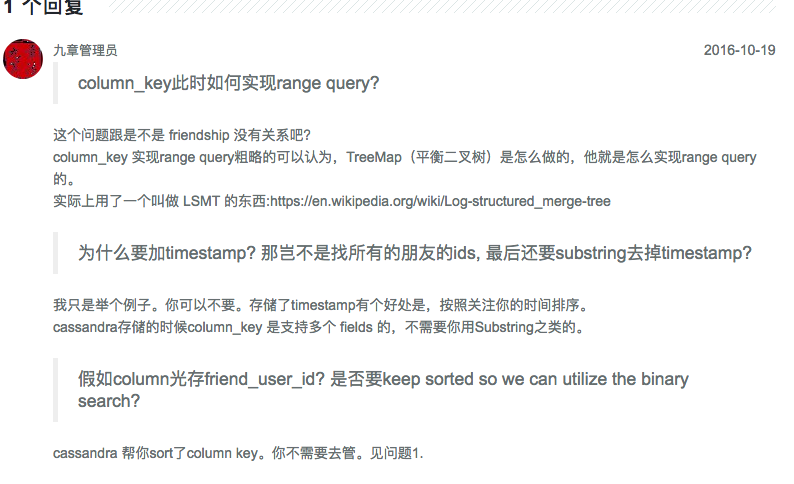

# Cassandra 存 friendship

Created: 2017-09-24 18:04:33 -0600

Modified: 2017-09-24 18:08:35 -0600

---

{width="5.0in" height="2.5347222222222223in"}{width="5.0in" height="2.6180555555555554in"}{width="5.0in" height="1.8125in"}{width="5.0in" height="3.0416666666666665in"}

