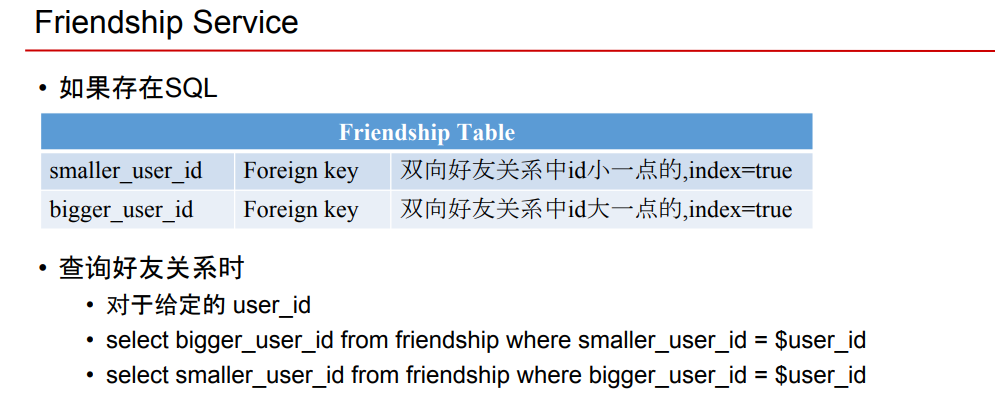

# User System

Created: 2017-04-29 17:19:33 -0600

Modified: 2017-10-14 10:44:24 -0600

---

we assume we have 1 billon user and every user has 50 friends

we can use 5 byte for the user id , because 5 bytes can present around 2 to power 40 number it is bigger enough

if we user sql database

if a and b are friend, we can store those information in two column

1 billion * 50 * 5 = 250G

it seems like we just need one machine. but we have 300k qps

we can

{width="10.083333333333334in" height="5.708333333333333in"}

{width="10.083333333333334in" height="5.53125in"}

{width="10.083333333333334in" height="4.145833333333333in"}

| 查2次 因为不知道 user id 是 | from user id 还是 to User id |
|-----------------------------|------------------------------|

{width="4.885416666666667in" height="1.7083333333333333in"}

方案1 比较好

读多写少

{width="0.53125in" height="0.5833333333333334in"}{width="0.23958333333333334in" height="0.6145833333333334in"}{width="0.78125in" height="0.4375in"}{width="0.5833333333333334in" height="0.6458333333333334in"}{width="0.4791666666666667in" height="0.6666666666666666in"}

{width="0.22916666666666666in" height="0.22916666666666666in"}

![题 目 要 求 FB 的 privacy setting 设 计 ， 怎 么 设 计 叩 i ， c e 大 概 怎 么 与 ， 使 用 些 数 据 ， 数 据 怎 么 存 ， 要 支 持 下 列 功 能 1 ． Fiend 可 见 ， Friend Of Friends 可 见 2 ． 每 个 u r 可 以 自 己设 些 group, 把 一 些 u 「 加 进 每 个 Group ， 其 他 用 户 不 知 道 他 设 的 group 是 什 么 ， 怎 么 讠 上 group 里 面 的 人 看 到 我 发 的 状 态 ？ 怎 么 存 group? 以 上 是 题 目 。 思 考 一 下 ， 我 觉 得 有 可 能 需 要 讨 论 的 有 几 个 方 面 1 ． friendship 怎 么 存 。 这 个 一 般 来 说 都 是 存 成 adjacencylist （ 这 里 暂 时 不 讨 论 囵 单 纟 屯 就 存 储 方 式 来 看 ） 那 么 SQL 和 NOSQL 各 自 的 SQL FromUser TOUser Propertiy A B B A Mute 要 知 道 A 的 朋 友 ect * from friend wherefrom_user = A 要 知 道 A 的 朋 友 的 朋 友 select*from friend wherefrom userin （ 《 t fromfriend wherefrom user NoSQL row_key(user_id), col key(friend user_id), 要 知 道 A 的 朋 友 listA = query(A) 0 （ 1 ） 比 如 要 知 道 A 的 朋 友 foreach keyin 《 i query(key) 那 么 各 圭 的 trade 。 什 是 什 么 ？ O(n) ](../../media/Example-User-System-User-System-image11.png){width="10.083333333333334in" height="7.708333333333333in"}![关 于 8 ． 14 东 邪 老 师 系 统 设 计 课 Twi 计 的 几 个 问 题 、 L by n 同 学 4 0 1 年 ， 1 月 前 东 邪 老 师 的 讲 解 非 堂 精 彩 。 以 下 几 点 还 不 太 清 楚 ， 希 望 能 得 到 东 邪 老 师 助 教 老 师 的 解 讞 问 题 有 点 多 ， 辛 苦 老 师 们 了 ） ： 在 数 据 如 何 存 储 与 访 问 章 节 中 ， 关 *Friendship Tab 《 e 中 字 段 的 定 义 ， m 一 user 一 id 是 否 是 指 被 关 注 者 ？ to_user_id 对 应 为 关 注 者 ？ 以 下 表 述 是 否 正 確 ？ 我 仃 bm ） 关 注 了 姚 晨 ， 该 表 增 加 一 条 记 录 ： d:id+l from user id: 姚 晨 的 id to user id:Tomfiid 、 在 教 材 P M e 《 章 节 中 ， 老 师 提 供 的 流 程 是 需 要 读 N 次 DB Read, 获 取 news_feed, 然 后 冉 Merge 取 出 时 间 最 新 的 100 条 。 此 时 我 觉 得 可 以 通 过 一 条 SQL 语 句 来 实 现 啊 ， 避 免 了 N 次 读 取 DB ， 老 师 看 看 是 否 可 行 ？ SELECT id FROM Tweet WHERE user_id in (SELECT from user 冠 FROM Friendship WHERE to user id = TomlD) ORDER BY created at 凵 M 仃 0 ， 1 佣 、 在 教 程 push Mode 《 章 节 中 ， 老 师 提 出 为 每 一 个 用 户 建 一 个 List 存 储 News Fe 丽 信 息 ， 这 个 List 也 是 对 应 于 MySQL 中 的 一 张 表 吗 ？ 是 每 个 用 户 建 一 个 新 表 ， 还 是 各 个 用 户 share 一 张 表 呢 ？ 记 得 课 上 令 狐 老 师 说 是 每 个 用 户 都 对 应 一 个 新 表 ， 那 样 数 据 库 表 是 否 太 了 啊 ？ 我 觉 得 建 一 张 表 就 可 以 了 啊 （ 发 现 这 个 问 题 有 同 学 问 过 了 h 即 ： / / w ' 、 铖 jiuzhang ． c 。 m / qa ／ 1736 月 表 结 构 为 ： user id_to FK （ 存 Tom 的 《 D ） user_id_from FK （ 存 姚 晨 的 《 D ） tweet id FK 这 样 一 条 SQL, 就 可 以 了 Selecttweet idfromNewsFeedwhereuser id='TomlD'LlMlTO,100 ](../../media/Example-User-System-User-System-image12.png){width="10.083333333333334in" height="8.59375in"}![东 邪 黄 药 用 1 ． 反 了 。 你 关 注 了 姚 晨 ， 那 么 这 条 关 注 信 息 是 from you to 姚 晨 。 2016 ． 08 ． 15 2 IN Q 的 效 率 并 不 比 N 次 读 que 来 得 快 太 多 湖 N Query 是 我 们 要 在 《 中 尽 量 避 免 的 操 作 。 我 之 所 以 没 讲 IN Q 是 因 为 大 家 不 都 太 懂 SQL- 3 ． 我 上 课 说 的 是 每 个 人 一 个 in 我 当 时 想 回 笞 一 个 同 学 的 问 题 ， 反 而 使 得 其 他 同 学 误 会 了 我 的 意 思 。 数 据 库 中 仍 然 是 一 张 表 ， 一 张 News Feed Table- 但 从 逻 辑 上 ， 你 可 以 理 解 为 ， 每 个 人 有 自 己 的 inbox. 这 个 inbo × 通 过 select 嚙 = om newsfeed table where user id---your user 美 彳 晷 。 东 邪 黄 药 用 我 冉 补 充 一 下 IN Query 的 问 题 。 2016 ． 08 ． 15 比 如 在 Twitter 这 样 级 别 的 数 据 中 ， 假 如 你 关 注 了 100 个 好 友 。 你 的 数 据 庫 一 般 是 几 千 台 ， 那 么 你 这 1 个 好 友 的 信 息 ， 很 可 能 分 布 在 100 台 不 同 的 机 器 上 。 这 个 时 候 ， 你 駡 IN Query 和 for 一 遍 所 有 的 好 友 ， 然 后 单 独 send query- 效 率 是 一 样 的 ， 都 可 以 认 为 是 N 条 并 发 的 据 库 Que 。 虽 然 你 这 个 时 候 看 起 来 ， 既 然 是 并 发 ， 时 间 应 该 很 怏 咯 。 这 个 是 没 错 ， 但 是 你 想 一 下 ， 一 次 用 户 请 求 ， 整 个 系 统 就 要 产 生 100 条 数 据 庫 请 求 ， 这 个 实 在 是 负 载 太 大 了 ， 需 要 优 化 。 ](../../media/Example-User-System-User-System-image13.png){width="10.083333333333334in" height="5.34375in"}

![系 统 设 计 第 二 节 课 关 于 双 向 友 好 关 系 问 题 精 华 byWE* 1 (D 1 年 ， 2 月 前 系 统 设 计 课 第 二 节 课 有 个 问 题 ， ppt 17 页 ， 说 到 双 向 好 友 关 系 ， 方 案 2 存 为 一 条 信 息 ， 查 询 需 要 两 次 ， 老 师 可 否 对 于 这 里 说 的 两 次 给 个 具 体 的 例 子 ， 谢 谢 1 个 回 复 东 邪 黄 药 用 2016 ． 07 ． 24 如 果 你 存 为 一 条 信 息 的 话 ， 比 如 user_id=100 和 user id=200 的 成 为 好 友 ， 你 的 数 据 库 表 里 有 两 个 co 《 umn 一 个 是 smaller-user---id, 一 个 Ebigger---user---id- 为 什 么 这 么 存 呢 ， 因 为 000 ， 2 佣 ） 和 〈 200 ， 100 ） 是 同 一 条 数 据 。 所 以 存 成 一 条 数 据 要 排 序 过 冉 存 。 假 nuser id=200 和 user id = 300 也 是 好 友 。 那 么 这 一 次 200 会 存 在 smaller_user_id 里 。 好 了 ， 下 面 要 检 索 200 的 所 有 好 友 ， 你 需 要 ： select bigger user from friendship where sm 彐 11 巳 = user 土 d ： 2D0 ， select sm 彐 Iler user id from friendship where bigger user 土 d ： 2 CO ； 这 样 才 能 得 到 完 整 的 100 和 300 是 200 的 好 友 。 ： > 得 到 3 開 ： > 得 到 1 開 ](../../media/Example-User-System-User-System-image14.png){width="10.083333333333334in" height="7.489583333333333in"}

