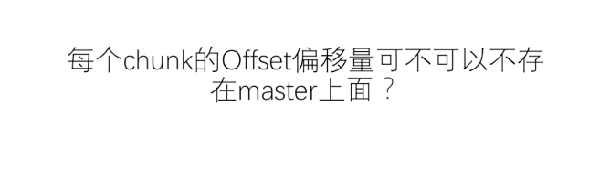
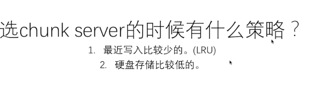

# file system 

---

什么时候检查 读的时候检查 A chunkis broken up into 64 KB blocks. Each has a corresponding 32 bit checksum. Like other metadata, checksums are kept in memory and stored persistently with logging, separate from user data.

太阁

checksum 存在chunkservice 的内存里

