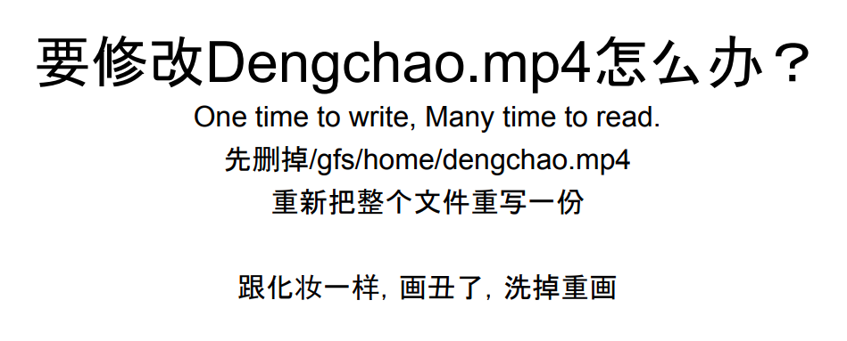

# summary  2

---

Question

How large the file will be

Three main components:

Desktop Client Application, Master Service and Chunk service.

we divided the large file to the chunk and each chunk has 64 M and each chunk has 1000 block and each block is 64kb

[Desktop client]{.mark}

we have a folder, work place store the files also stored in the dropbox

The Desktop Client Application monitors the folders change and move those changes to cloud service.

Client will splits the files into smaller pieces called chunks (64 M). Client can detect the which chunk of the files that have been modified and only transfer those parts to the Cloud Storage, saving on cloud storage space

The master service will store the how many chuck for this file, file to chunk service and chuck`s replicas mapping . All metadata is kept in the master's memory. Also keep those in log file on the master`s disk and replicated on remote machine.

from MIT:

[in the master, it's got two main tables , one table that map's file name to an array of chunk IDs or chunk handles.]{.mark}

[The master also happens to have a second table that map's each chunk handle to a bunch of data about that chunk, so one is the list of chunk servers that hold replicas of that data, each chunk is stored on more than one chunk server so]{.mark}

it's a list chunk servers, every chunk has a current version number so, [this master has a remembers the version number for each chunk,]{.mark}

each chunk will be stored at least 3 services, one is primary and 2 is secondary

master need remeber which one is primary and which is secondary

primary need a expired time or lease time

master also need remeber each chunk's version number

master will update the version number if file is updated or the old primary dead and the chunk need new primary.

master will write the chunk services and chunk version number to disk

Chuck service will store the chuck id, chuck size and offset.

When cline want to read or update certain chunk, it will first talk to master service, send the file name and offset to master,

master service will return the list of chunk service. then client will talk to the chunk service which close to him and get the chunk file.

client also will store those information to cache and next time it will conntect chunk service directly.

if client want to write a new chunk, master will figure out the chunk the client should write to and send client a primary and secondary list

master need figure out which the primary and secondary chunk or chunk service for that chunk

~~client will chose one which close to him~~

and write the new chunk to his cache memory first, this service will transfer this chunk to other two and store the chunk to cache also. then notice master and write the chuck to disk at same time. master will update the version number

if all of them write successfully, notice client and master. if not, also tell client, ask client weather want to rewrite or not.

when write a new chuck, we also need store a check sum.(64 kb )

什么时候检查 读的时候检查 A chunk is broken up into 64 KB blocks. Each has a corresponding 32 bit checksum. Like other metadata, checksums are kept in memory and stored persistently with logging, separate from user data.

client will check the check sum when read the chuck

chunk service will sent heartbeat to master periodically

on the service side:

every chuck will ask master about the check service

