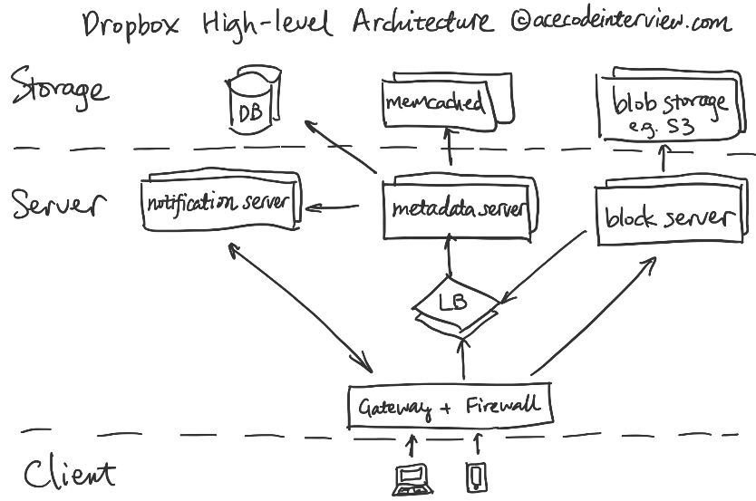

# Drop box

Created: 2021-01-21 17:38:00 -0600

Modified: 2021-01-21 17:39:09 -0600

---

1. 理解需求

1.1 商业目的

支持设备之间以及用户之间的文件同步。

1.2 功能性需求

- 设备之间以及用户之间同步文件夹。
- 用户可以通过客户端上传，下载，更新以及删除文件。
- 允许访问文件的历史版本。

1.3 非功能性需求

- 扩展性 (Scalability) - 支持数亿用户
- 安全性 (Security) - 保证文件安全，没有匹配的权限就不能访问
- 高效率存储 (Efficiency) - 文件存储和更新占用尽量少的带宽和存储空间
- 最终一致性 (Eventual Consistency) - 文件的内容完整并在完成同步后在不同设备间一致

1.4 不需要支持的功能

- 客户端之外的上传，下载，更新，删除。
- 文件搜索。
- 文件预览。

2. 资源估算

2.1 假设

- 100M DAU (Daily Active User)
- 每个 DAU 平均每天上传 1 个新文件，更新10个旧文件
- 文件平均 10 MB

2.2 估算

- 五年所需要的存储 - 100M * 1 * 10MB * 365 * 5 = 1825 PB
- 如果考虑冗余以及文件修改产生的历史版本占用的空间，可以考虑 3x 上面的计算值
- 如果考虑不同用户上传同一文件的情况，可以考虑适当下调 3x 之后的计算值
- 文件上传或更新 RPS - 100M * 11 * / (24 * 3600) ~= 13000
- 如果考虑大文件上传时需要进行多个 HTTP Call 的情况，可以适当调高 RPS 预期
- 如果考虑服务的请求的起伏变化，考虑 2x-3x RPS 预期
- 连接数 (Connection) - 普通情况下需要维护 100M DAU 的同时连接。考虑峰值的话，可以准备 2x-3x 的连接能力。(根据 [Dropbox Notification Server Tech Talk](https://www.youtube.com/watch?v=FBRIeoEr8GU) 11:40，每台 Dropbox 客户端都跟服务器保持连接)

3. High-level Architecture

{width="3.7916666666666665in" height="2.513888888888889in"}

4. 核心子服务设计

Dropbox 的核心服务是将电脑本地的文件夹在云上做一个实时备份。这个功能可以进一步细化为上传和下载两个功能：

- 上传 - 客户端实时监控本地文件夹中变化并将更新的文件上传
- 下载 - 服务器根据云上的文件夹有了变化将更新的文件推送给客户端

对于这样的服务，我们需要考虑到它的以下特点：

- 读写 QPS 在同一量级
- 服务的 ACID（原子性，一致性，隔离性和持续性）要求较高
- 服务对时效性不敏感（即使同步文件夹有一分钟延迟也不影响使用）

下面我们就开始根据观察到的以上特点来设计子系统。

4.1 云端文件存储服务 (Block Service)

文件存储服务加上文件元数据服务一起构成了云端文件系统的核心。这个云端文件系统旨在为不同操作系统计算机的本地文件夹在云端做一个镜像备份。

4.1.1 云端文件格式

{width="3.7916666666666665in" height="1.75in"}

Dropbox File Format. Nipunn Koorapati. (2014). Streaming File Synchronization

文件在传输以及存储的过程中被分成小于等于 4MB 的文件分段。这样做有三点好处：

- 提高文件传输成功率
- 文件出现改动后只需更改有变化的文件段
- 更有可能出现完全一样的文件段，更大可能性避免反复存储

4.1.2 文件存储服务

文件的每一分段会在加密之后以单独文件的形式存储在 Blob Storage 中，文件存储服务的任务就完成了。它并不需要知道这些文件要怎么样组装成原文件，也不需要关心它原本存储在文件夹的什么地方，这些是元数据服务需要考虑的。

如果文件夹中新增了文件，那么文件存储服务就会被通知并完成以上的存储操作。如果文件夹中的文件产生了变化，那么该文件分段后没有变化的文件段会保持原状，只有产生变化的文件段会被更新。

由于我们的服务需要支持文件的历史版本，我们需要同时保留多个新旧版本的数据，这时候我们在文件发生更改时有两个选择。

- 存储完整的新版本数据的同时保留旧版本数据。
- 存储新旧版本的差异。

前者在文件改动较大时要求的存储空间较小，并且在文件下载时需要做的处理较少。后者在文件改动较小时要求的存储空间较小，但文件下载时需要实时将新旧版本差异覆盖到旧版本文件上。

4.1.3 文件 Blob 存储 (Blob Storage)

Blob Storage 采用内容寻址存储，即 [CAS (Content-addressable Storage)](https://en.wikipedia.org/wiki/Content-addressable_storage)，利用文件的哈希值来寻找文件内容。这样在每次上传之前都可以先比对哈希值，一旦有匹配的，就说明这个文件段已经存在了，不需要上传这个文件段了。

细心的同学可以要问，如果发生哈希冲突怎么办。CAS 一般会采用[加密哈希函数 (Cryptographic hash function)](https://en.wikipedia.org/wiki/Cryptographic_hash_function) 来计算哈希值。此类哈希函数（比如 SHA1）具有不容易发生哈希冲突 (Collision Resistence) 的特点，发生哈希冲突的概率低到可以忽略不计。

另外，Blob Storage 只会存储加密后的文件段以保证文件内容的安全。

4.2 文件元数据服务 (Metadata Server)

4.2.1 文件日志 (Server File Journal) 数据库功能

文件日志是 Dropbox 最重要也是最大的数据库，代表了 Dropbox 的文件系统。这里我们之所以称其为文件日志是因为这是一个只进行追加操作的数据库，数据库每添加一条记录就相当于给文件日志多记录了一笔。

文件日志的设计帮助我们很容易地支持文件历史版本的读取，因为日志里的每一条记录就代表了某个文件的一个历史版本；这样的设计同时因为减少了数据库需要支持的功能，降低数据库的复杂度，给读写的优化提供了方便。

4.2.2 文件日志 (Server File Journal) 数据库实现

文件日志包含以下几个列：

- Namespace Id (NSID)
- Namespace Relative Path
- Blocklist
- Journal ID (JID): 域名之下单调递增

这里的 Namespace 代表一个用户或者一个共享文件夹；Blocklist 对应 Blob Storage 存储的一组文件段，只包含哈希值，不包含文件内容。

文件日志数据库为了满足 ACID 的要求，采用 SQL 数据库 (MySQL)。因为需要满足高性能和高可用性的要求，需要在 MySQL 的基础上使用 MySQL Proxy 来处理分片和备份的功能。

4.2.3 其他元数据服务

- 用户数据库
- Namespace 数据库

4.3 通知服务 (Notification Service)

通知服务的主要功能是向客户端传递文件变化的消息。考虑一下文件同步的三种情况：

- 客户端保持在线 + 服务器上的文件有变化 - 通知服务会与客户端会保持一个 Long Poll Connection，客户端会被通知服务告知变化的发生并转而向元数据服务发出同步请求。
- 客户端保持在线 + 客户端上的文件有变化 - 客户端向元数据服务发出文件同步请求。
- 客户端掉线之后上线 - 客户端向元数据服务发送请求了解文件的变化情况，如有变化，就进行同步（为了加速这个操作，服务器端会对每个用户缓存服务器上最后一次改动的 Journal ID）

其中在第一种情况下通知服务起到作用。

虽然通知服务的功能很简单，但我们不要小看它的作用。如果我们不使用 Long Poll Connection，而是要求客户端每一段时间就向服务器发送请求了解文件的变化情况 （就跟客户端掉线重连之后的操作一样），那么服务器端的负载就会大大增加，因为多数时候，文件都是不变的。

同时服务因为要保持如此多的 Long Poll Connection，实现难度也不小。为了可以在单机上达到很高的连接数，我们通常需要做很多底层优化。Dropbox 在实际操作中，使用了手动优化的，大规模并发的 C++ 通知服务器，达到了惊人的单机 2.6M 连接数。

4.4 数据流

{width="3.7916666666666665in" height="2.1805555555555554in"}

Dropbox Service Architecture from How Dropbox Keeps Your Files Secure

在了解了云端存储服务，文件元数据服务以及通知服务之后，我们就可以将它们串联起来，分别从上传和下载两种情景下看一看 Dropbox 的数据流是怎么样的。

4.4.1 上传

当一个新的文件出现在本地文件夹里，会发生以下几件事：

- 客户端会将文件分段并计算这组文件段对应的 Blocklist。
- 客户端将计算出的 Blocklist，它的 Namespace 和文件路径提交给元数据服务。
- 元数据服务检查 1）Blocklist 中的哈希值是否已经存在以及 2）该用户的 Namespace 是不是允许访问这些哈希值对应的文件。
- 假设文件并不存在，元数据服务会返回 "Need Blocks" 说明文件不存在，需要上传。

{width="3.7916666666666665in" height="2.7708333333333335in"}

Upload Client Initial Commit. Nipunn Koorapati. (2014). Streaming File Synchronization

5. 客户端直接联系文件存储服务添加文件，如果文件过大，则将文件切成 8MB 的分段后上传。（注意这里的 8MB 只是文件上传时的分段，目的是为了提高 HTTP Call 里上传文件的成功率，跟云端文件系统里的 4MB 的文件段大小不一致也不需要一致。）

{width="3.7916666666666665in" height="3.7777777777777777in"}

Upload Client Store. Nipunn Koorapati. (2014). Streaming File Synchronization

6. 客户端再次联系元数据服务，提交文件对应的 BlockList, Namespace 和路径。

7. 元数据服务联系文件存储服务，发现 Blocklist 的哈希值存在并且拥有权限。

8. 元数据服务将 Blocklist 存储并向客户端返回成功的确认。

{width="3.7916666666666665in" height="2.7777777777777777in"}

Upload Client Final Commit. Nipunn Koorapati. (2014). Streaming File Synchronization

4.4.2 下载

当服务器端有新的文件更新，会发生以下事件：

- 与客户端保持长连接的通知服务告知客户端新的更新存在。
- 客户端会为每一个本地的 Namespace 存储最后一次同步之后的 Journal ID。这个 Journal ID 可以看做是文件日志 (Server File Journal) 里的一个指针。客户端此时将 Namespace 和 最后一次同步的 Journal ID 组成 "list" call 发送给元数据服务器，以此来请求比这个 Journal ID 更新的文件信息。
- 元数据服务器返回客户端上缺失的文件信息。

{width="3.7916666666666665in" height="2.8958333333333335in"}

Download Client List Request. Nipunn Koorapati. (2014). Streaming File Synchronization

4. 客户端根据元数据服务器返回的文件信息检查客户端本地（文件夹内或者文件缓存中）是否已经存在所需文件。

5. 如果没有，客户端会向文件存储服务请求文件。

6. 文件存储服务在确认用户对所请求文件有访问权限后返回文件的具体内容。如果文件大小过大，那么会进行多次文件请求。

7. 客户端根据元数据服务提供的信息整合下载的文件段存到本地文件夹。

![Blockserver retrieve([hl, h2]) retrieve([h3, h41) ](../../media/File-System-Drop-box-Drop-box-image8.png){width="3.7916666666666665in" height="4.097222222222222in"}

Download Client Block Request. Nipunn Koorapati. (2014). Streaming File Synchronization

4.4.3 两个客户端之间同步文件

了解完了上传和下载的数据流之后，同步文件的完整数据流就很清晰了。

{width="3.7916666666666665in" height="5.479166666666667in"}

End-to-end Request Flow. Nipunn Koorapati. (2014). Streaming File Synchronization

上图中下载客户端只有在文件上传完成之后才能进行下载操作。为了实现更快地同步，我们可以考虑压缩这个过程，在第一个文件段完成上传之后就开始下载流程。

{width="3.7916666666666665in" height="5.361111111111111in"}

Optimized End-to-end Request Flow. Nipunn Koorapati. (2014). Streaming File Synchronization

5. 数据结构与存储

5.1 文件日志数据库 (Server File Journal Database)

| **SFJ ID (PRIMARY KEY)** | **NAMESPACE ID (SHARDING KEY)** | **JOURNAL ID** | **NAMESPACE RELATIVE PATH** | **BLOCKLIST** |
|--------------|----------------|-------------|----------------|---------------|

查询模式是给定 Namespace 查找比给定 Journal ID 更大的一组数据库条目，所以由 Namespace ID 和 Journal ID 组成 Composite Index 来方便这样的范围查询 (Range Query)。

5.2 用户数据库

| **USER ID** | **USERNAME** | **EMAIL** | **NAME** | **DEVICE NAME** |
|-------------|--------------|-----------|----------|-----------------|

5.3 文件数据库

| **FILE ID** | **FILENAME** | **TYPE** |
|-------------|--------------|----------|

5.4 Namespace 数据库

| **NAMESPACE ID** | **NAMESPACE TYPE (E.G. SHARED FOLDER)** | **OWNER ID** |
|------------------|-----------------------------------------|--------------|

5.5 文件存储 Blob Storage

| **FILE HASH** | **FILE CONTENT** |
|---------------|------------------|

6. 接口设计

6.1 客户端与通知服务

HTTP 长连接 (HTTP Long Polling) - 通知服务在服务器端文件发生变化时向客户端发送通知，并断开长连接以允许客户端联系元数据服务。

6.2 客户端与元数据服务

- 下载 - HTTP GET /api/v1/meta/list?namespace_ids_and_journal_ids={...}
- 上传 - HTTP POST /api/v1/meta/file/{hash}

6.3 客户端与文件存储服务

- 下载 - HTTP GET /api/v1/block/{hash}
- 上传 - HTTP POST /api/v1/block/{hash}

7. 扩展性

- Load Balancer, 服务器，缓存，数据库和 Blob 存储都有多台
- MySQL 数据库使用 MySQL Proxy 支持分片 (Sharding)
- 通知服务使用长连接而不是依赖客户端定期向服务器发送请求来检测变化

8. 监控和警报

- 各项服务端到端延迟（根据服务经过的服务器分别监控）
- 占用用户的带宽
- 缓存命中率
- 数据库使用比例
- 文件系统使用比例

9. 参考资料

- Kevin Modzelewski. (2012). [How We've Scaled Dropbox](https://www.youtube.com/watch?v=PE4gwstWhmc)
- Nipunn Koorapati. (2014). [Streaming File Synchronization](https://dropbox.tech/infrastructure/streaming-file-synchronization)
- Rian Hunter. (2012). [Dropbox Notification Servers](https://www.youtube.com/watch?v=FBRIeoEr8GU)
- Dropbox. [Under the hood: Architecture overview](https://www.dropbox.com/business/trust/security/architecture)
- Sujay Jayakar. (2020). [Rewriting the heart of our sync engine](https://dropbox.tech/infrastructure/rewriting-the-heart-of-our-sync-engine)
- David Tvaltchrelidze. (2017). [How does Dropbox handle patches/changed blocks when downloading?](https://www.quora.com/How-does-Dropbox-handle-patches-changed-blocks-when-downloading)
- Tammy Butow. (2016). [Dropbox Database Infrastructure](https://www.youtube.com/watch?v=71VryWiEw2A)
- Idilio Drago, Marco Mellia Maurizio, M. Munafo, Anna Sperotto, Ramin Sadre, Aiko Pras. (2012). [Inside Dropbox: Understanding Personal Cloud Storage Services](http://www-net.cs.umass.edu/imc2012/papers/p481.pdf)

