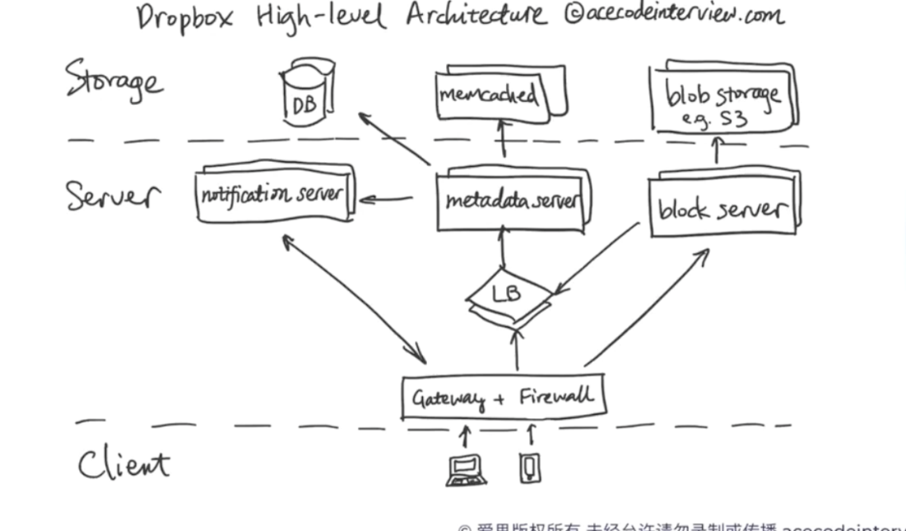
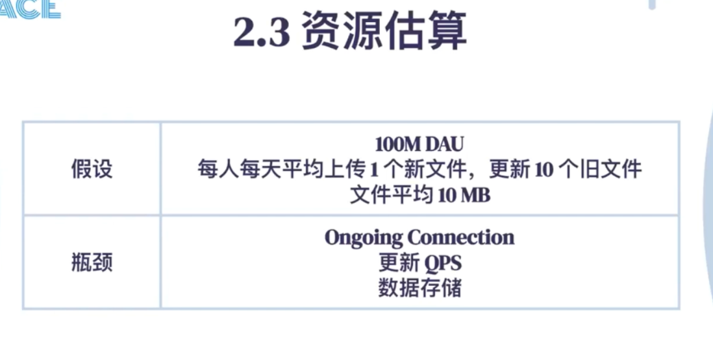
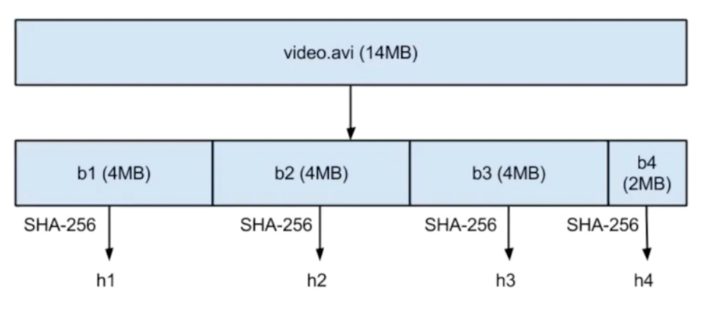
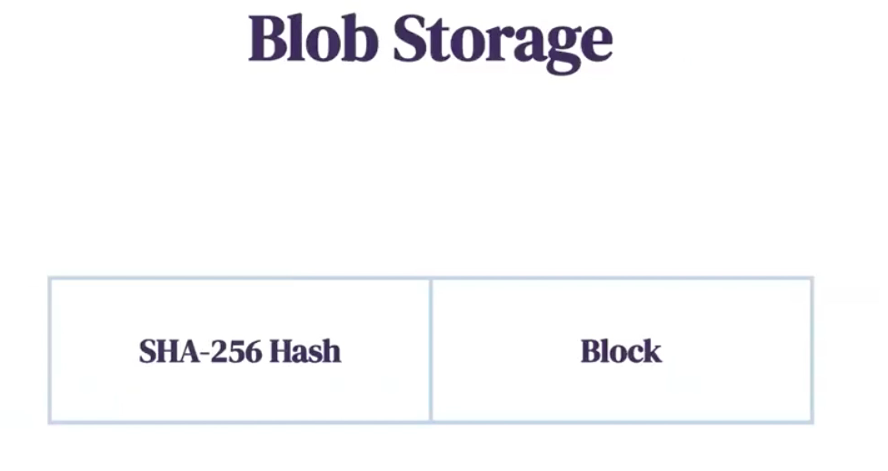
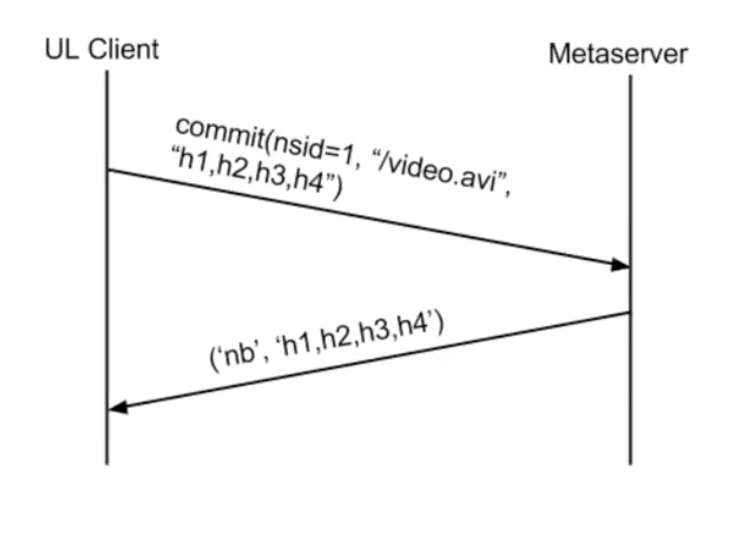

# Summary -ACE

Created: 2021-04-04 16:17:29 -0600

Modified: 2021-05-29 23:32:57 -0600

---

{width="5.0in" height="2.9375in"}

Function: shared the folder between different device

shared the folder between users

upload, download, update and delete the file

able to see the different version of the file

Non-function requirement:

Scalability - support billion of users

Efficiency - File storage and updates take up as little bandwidth and storage space as possible

Don't need to save the duplicate file

Eventual Consistency - keep consistency between different devices

{width="5.0in" height="2.5416666666666665in"}

{width="5.0in" height="2.6041666666666665in"}

{width="5.0in" height="3.0277777777777777in"}

1.  File storage , blob storage, chuck service
2.  Metadata
3.  Notification

Blob storage : hash - > block

{width="5.0in" height="3.6805555555555554in"}

{width="5.0in" height="5.361111111111111in"}

{width="5.0in" height="2.7777777777777777in"}

The address is base on the content

That means uses hash to find the file, system will first compare the hashes before each upload, and once there is a match, it means that the block already exists and there is no need to upload this block

The file will be cut into different block, and each block has a hash

{width="5.0in" height="2.2291666666666665in"}

Metadata service

{width="5.0in" height="3.486111111111111in"}

File history --- file journal -- like change log, each change has different journal id

{width="5.0in" height="2.3402777777777777in"}

Journal id will auto increase, like a version number

Block list store the list of hash

5.2 用户数据库

| **USER ID** | **USERNAME** | **EMAIL** | **NAME** | **DEVICE NAME** |
|-------------|--------------|-----------|----------|-----------------|

{width="5.0in" height="2.3194444444444446in"}

If namespace is a shared type --- list of owner

Like file id

{width="5.0in" height="2.6458333333333335in"}

upload file:

{width="5.0in" height="3.5277777777777777in"}

1.  client talk to meta data service said: I want to upload video.avi and the hash list is "h1, h2,h3,h4 " and name space id = 1 (file id = 1)
2.  Meta service will check if service already have h1.... H4, if no send a new block -- nb

![Client h2), [bl, b21) vow' store([h3, h4], [b3, b4]) ](../../media/File-System-Drop-box-Summary--ACE-image14.png){width="5.0in" height="5.048611111111111in"}

Then client will talk to [block service]{.mark} and store h1--b1, h2---b2 , h3--b3, h4-b4 to block server

Then client talk to mataservce and mata server give client a journal id = 15

{width="5.0in" height="3.7083333333333335in"}

[Download service]{.mark}

{width="5.0in" height="3.8958333333333335in"}

Client fist take to meta server: the current version of file is namespace 1,journal id 14 ; namespace 2, journal id 29

Meta data find namespace 1 has new update h1,h2,h3,h4

![, h2J) retrieve([h3, h4]) ](../../media/File-System-Drop-box-Summary--ACE-image17.png){width="5.0in" height="5.354166666666667in"}

Then client talk to block server to fetch the new update h1,,, h4

{width="5.0in" height="3.9722222222222223in"}

When metadata service found new update. It will ping client via WebSocket

{width="5.0in" height="3.1527777777777777in"}

When the UL client write the new data to block server and meta server, meta data server will ping another client --- DL client ( right picture), don't need to wait all writing finish

High level

{width="5.0in" height="3.0833333333333335in"}

{width="5.0in" height="4.493055555555555in"}{width="5.0in" height="3.5069444444444446in"}

When metadata found new file, it will notice client by WebSocket -- ping , and client will send last version of the file to service

