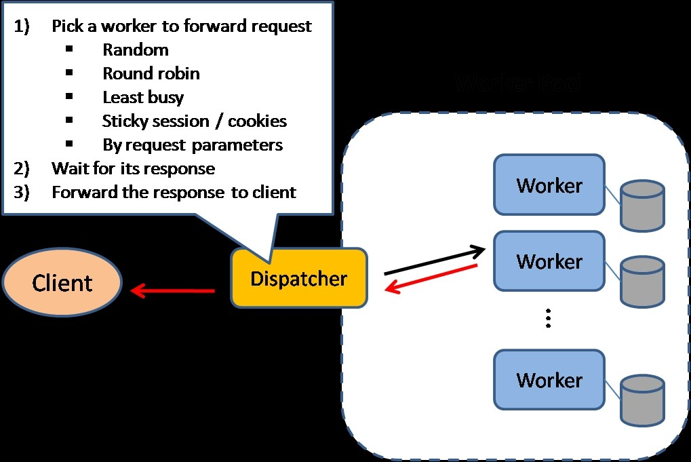

# Load balancing

Created: 2018-01-09 14:49:54 -0600

Modified: 2020-01-07 16:22:25 -0600

---

We can add Load balancing layer at three places in our system:

Between Clients and Application servers

Between Application Servers and database servers

Between Application Servers and Cache servers

Initially, a simple Round Robin approach;

It just distributes the incoming requests equally among backend servers

Another benefit of this approach is if a server is dead, LB will take it out of the rotation and will stop sending any traffic to it.

A problem with Round Robin LB is, it won't take server load into consideration. If a server is overloaded or slow, the LB will not stop sending new requests to that server. To handle this, a more intelligent LB solution can be placed that periodically queries backend server about its load and adjusts traffic based on that.

<https://github.com/donnemartin/system-design-primer/blob/master/README.md#load-balancer>

{width="5.0in" height="3.3333333333333335in"}

Additional benefits include:

- SSL termination - Decrypt incoming requests and encrypt server responses so backend

Session persistence - Issue cookies and route a specific client's requests to same instance if the web apps do not keep track of sessions

(session stored the client information into service side,

Cookie stored the client information in the client side

Layer 4 load balancers look at info at the[transport layer](https://github.com/donnemartin/system-design-primer/blob/master/README.md#communication)to decide how to distribute requests. Generally, this involves the source, destination IP addresses, and ports in the header, but not the contents of the packet.

Layer 7 load balancers look at the[application layer](https://github.com/donnemartin/system-design-primer/blob/master/README.md#communication)to decide how to distribute requests. This can involve contents of the header, message, and cookies, (url?)

At the cost of flexibility, layer 4 load balancing requires less time and computing resources than Layer 7, although the performance impact can be minimal on modern commodity hardware.

