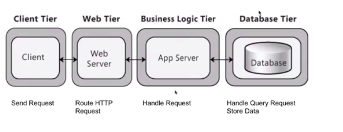
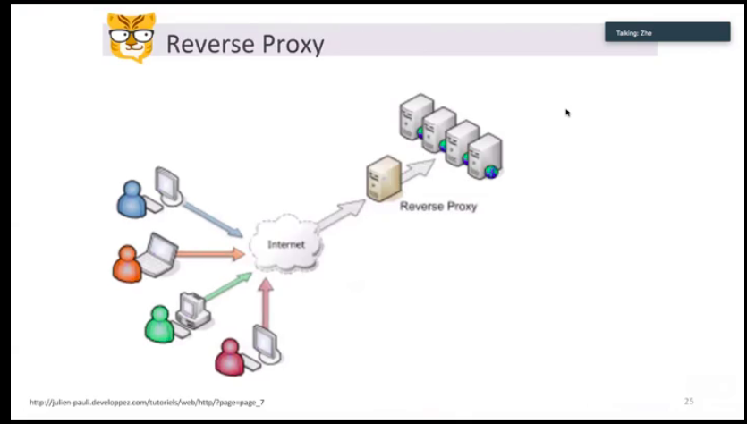
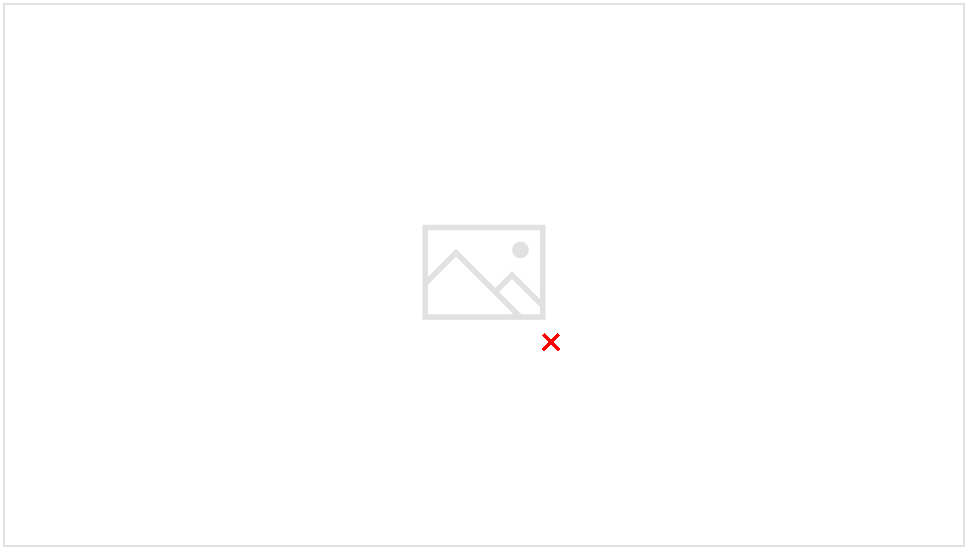

# nginx  and LVS f5

Created: 2018-01-27 18:37:10 -0600

Modified: 2020-07-22 22:25:48 -0600

---

reverse proxy server

1.distribute the load from incoming requests to several servers

2.hide the existence origin server or servers.

3.caching static content, as well as dynamic content

~~layer 7 and layer 4 ,layer 4 is useipaddress and port numberas the input and get a hash value and sent it to really service~~

~~layer 7 is more expensive than layer 4 and the routing decisions on manycharacteristics of the HTTP header and on the actual contents of the message, such as the URL, the type of data (text, video, graphics), or information in a cookie.~~

we also can use mutiple nginx and using Round Robin DNS to distribute different request to different nginx

drawbacks

1.  client side will cache the ip address and not ways go to DNS
2.  if one service is failed, DNS may continue send the request to that service
3.  the service chosed by DNS is not the best chose

Nginx bittiger

{width="10.083333333333334in" height="3.9270833333333335in"}

reverse proxy

Hide original server

{width="10.083333333333334in" height="5.760416666666667in"}

SSL termination https, the reverse proxy will Encrypt and decrypt the message

{width="10.083333333333334in" height="5.760416666666667in"}

{width="10.083333333333334in" height="5.71875in"}

least connected : the least connected service will get the next request

IP hash, the same ip address will go to the same service all the time, unbalanced

