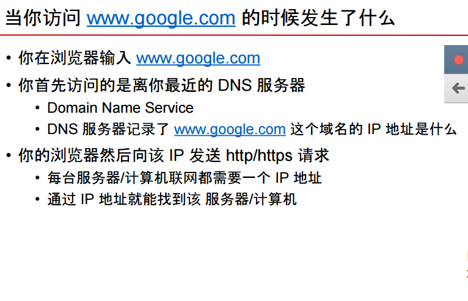

# 当你访问 www.google.com 的时候发生了什么

Created: 2017-05-01 00:08:48 -0600

Modified: 2017-10-19 00:41:17 -0600

---

{width="10.083333333333334in" height="6.53125in"}

{width="10.083333333333334in" height="5.635416666666667in"}

{width="10.083333333333334in" height="5.552083333333333in"}

{width="10.083333333333334in" height="5.4375in"}

