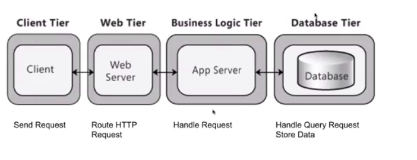
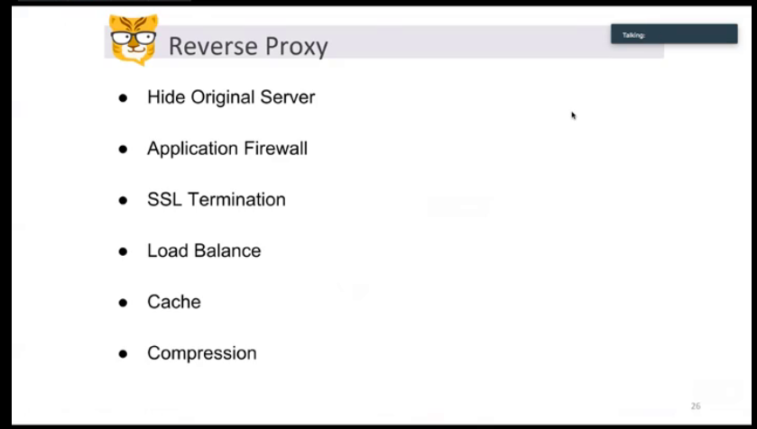
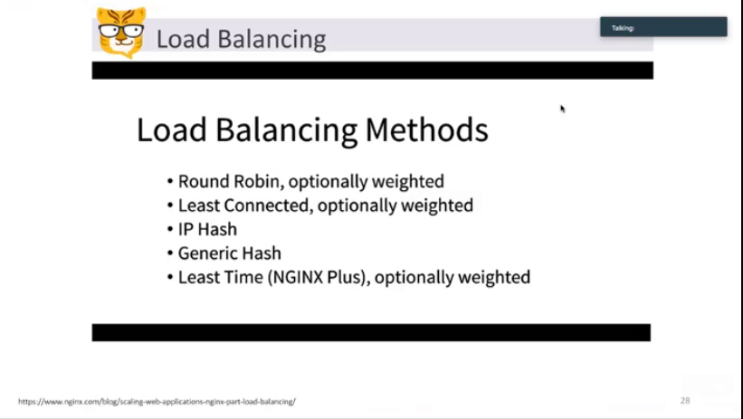

---

NGINX is commonly used as a reverse proxy
F5 and LVS (Linux Virtual Server) can function as reverse proxies.

**Reverse proxy server**

1. Distribute the load from incoming requests to several servers

2. Hide the existence origin server or servers.

3. caching static content, as well as dynamic content

~~layer 7 and layer 4 ,layer 4 is useipaddress and port numberas the input and get a hash value and sent it to really service~~

~~layer 7 is more expensive than layer 4 and the routing decisions on manycharacteristics of the HTTP header and on the actual contents of the message, such as the URL, the type of data (text, video, graphics), or information in a cookie.~~

We can also use multiple NGINX and use Round Robin DNS to distribute different requests to different NGINX

**Drawbacks**

1. Client side will cache the ip address and not go to DNS
2. If one service fails, DNS may continue to send the request to that service
3. The service chosen by DNS is not the best choice

**Nginx**

**Reverse Proxy**

Hide original server

SSL termination https, the reverse proxy will encrypt and decrypt the message

least connected: the least connected service will get the next request

IP hash, the same IP address will go to the same service all the time, unbalanced

