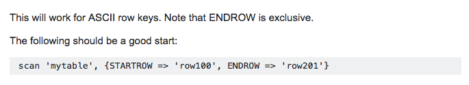
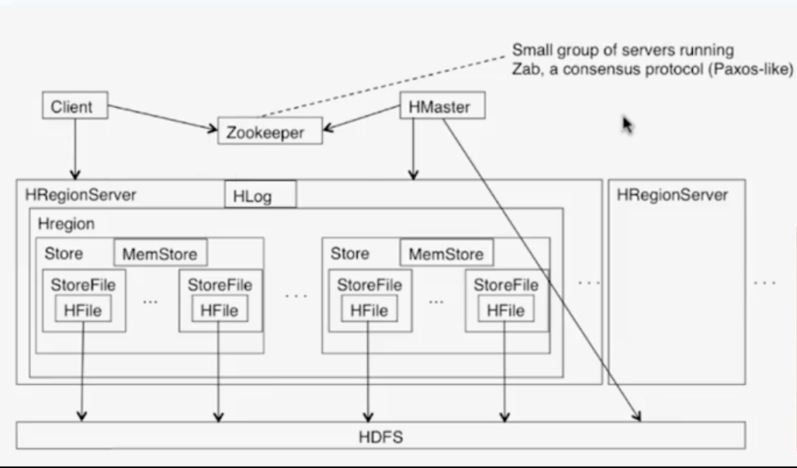
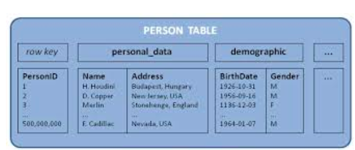

# HBase

Created: 2017-10-07 15:53:54 -0600

Modified: 2018-01-28 01:18:40 -0600

---

HBase supports Get or Put by key, just like key-value stores. You also allows you to scan by a row range, this allows you to do range queries. For instance, you might fetch all the users whose names start-start with A and B. And also it allows you to do MultiPuts where you put multiple key value pairs into system itself.

{width="5.0in" height="0.90625in"}

Unlike Cassandra, which preferred availability over consistency, under partitions, HBase prefers consistency over availability, under partitions.

{width="5.0in" height="2.9270833333333335in"}

So here is what the HBase architecture looks like:you have a client over herewhich can send queries, reads, and writes to the HBase system.

the coordination between the clients and the servers is doneby a Zookeeper,which is a small group of serversrunning a consensus-like protocol a Paxos-like protocol

HBase system itself has multiple HRegion Servers. The HRegion itself might contain multiple stores. The store might contain multiple store files,and each store file contains an HFile.The HFile is essentially a filethat is stored in the underlying HDFS.

The store in relation, also contains a MemStoreand a HRegion Server is associated with an HLog,over here.

There's also an HMaster communicateswith the Zookeeper and also coordinates with, the HDFS

So the HBase Table, when you have a table,you know a regular database table,the HBase Table is split into regions.for instance, essentially these regionsare a collection of rows in that HBase Table.Each of these regions is replicated across servers and split into regionsbecause you don't wanna store the entire table,some tables might be large, other tables might be small,you don't wanna store large tables as one,you wanna split them into regionsso that they are more manageable.

1.  **How does HBase enable Random Access to HDFS? ( why facebook choose HBase..)**
2.  **Facebook Messages data sets to constantly grow over time**

HBase stores data in HFiles that are indexed (sorted) by their key. Given a random key, the client can determine when region server to ask for the row from. The region server can determine which region to retrieve the row from, and then do a binary search through the region to access the correct row.

(META is a system table used to keep track of regions. It contains the server name and a region identifier comprising a table name and the start row-key. By looking at the start-key and the next region start-key clients are able to identify the range of rows contained in a a particular region.)

META store in the zookeeper

For example: a table may contain 10 TB of data. But, the table is broken up into regions of size 4GB. Each region has a start/end key. The client can get the list of regions for a table and determine which region has the key it is looking for. Regions are broken up into blocks, so that the region server can do a binary search through its blocks. Blocks are essentially long lists of key, attribute, value, version. If you know what the starting key is for each block, you can determine one file to access, and what the byte-offset (block) is to start reading to see where you are in the binary search.

**Keeping Replicas Current**

With read replicas enabled, the HMaster distributes read-only copies of regions (replicas) to different RegionServers in the cluster. One RegionServer services the default or primary replica, which is the only replica which can service write requests. If the RegionServer servicing the primary replica is down, writes will fail.

Other RegionServers serve the secondary replicas, follow the primary RegionServer and only see committed updates. The secondary replicas are read-only, and are unable to service write requests. The secondary replicas can be kept up to date by reading the primary replica's HFiles at a set interval or by replication.

If they use the first approach, the secondary replicas may not reflect the most recent updates to the data when updates are made and the RegionServer has not yet flushed the memstore to HDFS. If the client receives the read response from a secondary replica, this is indicated by marking the read as "stale". Clients can detect whether or not the read result is stale and react accordingly

For any given read request, a client can request a faster result even if it comes from a secondary replica, or if consistency is more important than speed, it can ensure that its request is serviced by the primary RegionServer.

The read replica feature includes two different mechanisms for keeping replicas up to date:

Using a Timer (interval)

In this mode, replicas are refreshed at a time interval controlled by the configuration option

Using Replication

In this mode, replicas are kept current between a source and sink cluster using HBase replication. This can potentially allow for faster synchronization than using a timer. Each time a flush occurs on the source cluster, a notification is pushed to the sink clusters for the table. To use replication to keep replicas current

Then you have a ColumnFamily.A ColumnFamily is essentially a subset of columnswithin table,and within that region with similar query patterns.

for every combination region and ColumnFamily,so for every ColumnFamily within a region, you maintain a store.

each store contains a MemStore,the Memstore is something that maintains an in-memory, uh, versionof the latest updates that have been done to that store.This is like the MemTables we discussed in Cassandra,when the MemStore is full or when it is oldit is flushed to disk.

There are also StoreFiles which are maintained on a per store basis for each region.This is where the actual data lives,and the store file contains an HFilewhich stores the actual data itself,and that is stored in the underlying HDFS

The Hfile contains a lot of data followed by more data and then there might be some metadata, file information indices, and a trailer information at the end.

data pieces: the data itself contains a magic numberto identify that uniquely,followed by a variety of key value pairs.The key value pair contains information such as the key length first,then the value lengths,and then the row length,so you know how many bytes each of these contain.Then you have the row itself you have the ColumnFamily lengthfollowed by the actual ColumnFamily, the column qualifier, a timestamp when this value was la-last written,the key type and value itself.

The HBase treats this entire segmentof entries as the HBase Key.What is the row?The row a particular applicationwhich maintains, for instance, census information,might be the Social Security numberof that particular individual.The ColumnFamily might bedemogragric-demographic information,so it might say all the demographic informationabout that particular individual.one of the columns within the ColumnFamilymight be the ethnicity of that particular individual. it might be Asian-American or Caucasionor African-American, and so on and so forth.

{width="5.0in" height="2.78125in"}

{width="5.0in" height="2.1145833333333335in"}

HBaseis a column-oriented key-value NoSQL database that can store

groups data together to store new data in a memory buffer and once the buffer is full, it dumps the data to the disk This way of storage not only helps storing a lot of small

data quickly but also fetching rows by the key or scanning ranges of rows.HBaseis also an efficient database to store variable size data, which is also required by our service.

How should clients efficiently fetch data from the server? Clients should paginate while fetching data from the server. Page size could be different for different clients,

e.g., cell phones have smaller screens, so we need lesser number of message/conversations in the viewport.

HBase maintain strong consistency?It does this by a write-ahead log, or a HLog.Again, the HLog is maintained on a-on a per HRegion Server basis.

the HRegion server appropriately routesthe operations to the appropriate HRegion.Uh, when an HRegion receives an operation such as for (k1),it first enters this into the HLog,and so it writes an entry to the HLogbefore it writes to the actual MemStore itself.

it does this so that, uh, if there is a failureafter writing into the log, then you can, replay this write by looking into your HLog.

So when you do have a failure, you just need to replay the log after you recover from your failure

HRegionServeror the HMaster does the following:it replays any stale log entries,again, it uses the timestamps to find outwhere the database is with respect to the logs,and it replays any of the log entries since the database timestamp itself then you add edits to the MemStore,

Now when you can have HBASErunning across multiple data centers as well,there is a single master clusterof all the data centers.You have one of the data centers markedas a "Master" data center.The other data centers are simply "Slave" data centers and they replicate the same tables.The Master cluster synchronously sends the logs,the HLogs, over to the Slave clusters,which then use the logsto simply update the corresponding MemStores,which eventually get flushed to disk.

The coordination among the Masterand the Slave clustersis done via Zookeeper again.And Zookeeper not just runs a Paxos-like consensus protocol,it also can be used to store information And then you can also store the HLog information

