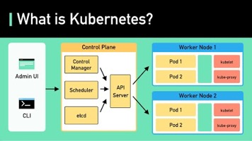

# Kubernetes

Created: 2023-03-25 16:42:11 -0600

Modified: 2024-02-03 12:41:02 -0600

---

**What is k8s (Kubernetes)**

k8s is a container orchestration system. It is used for container deployment and management. Its design is greatly impacted by Google's internal system Borg.

A k8s cluster consists of a set of worker machines, called nodes, that run containerized applications. Every cluster has at least one worker node. [1]

The worker node(s) host the Pods that are the components of the application workload. The control plane manages the worker nodes and the Pods in the cluster. In production environments, the control plane usually runs across multiple computers and a cluster usually runs multiple nodes, providing fault tolerance and high availability. [1]

- **Control Plane Components**

1.  API Server The API server talks to all the components in the k8s cluster. All the operations on pods are executed by talking to the API server.
2.  Scheduler The scheduler watches the workloads on pods and assigns loads on newly created pods.
3.  Controller Manager The controller manager runs the controllers, including Node Controller, Job Controller, EndpointSlice Controller, and ServiceAccount Controller.
4.  etcd etcd is a key-value store used as Kubernetes' backing store for all cluster data.

- **Nodes**

5.  Pods A pod is a group of containers and is the smallest unit that k8s administers. Pods have a single IP address applied to every container within the pod.
6.  Kubelet An agent that runs on each node in the cluster. It ensures containers are running in a Pod. [1]
7.  Kube Proxykube-proxy is a network proxy that runs on each node in your cluster. It routes traffic coming into a node from the service. It forwards requests for work to the correct containers.

Over to you: Do you know why Kubernetes is called "k8s"?

Reference [1]:[kubernetes.io/docs/concepts/overview/components/](http://kubernetes.io/docs/concepts/overview/components/)

[Kubernetes Explained in 6 Minutes | k8s Architecture](https://www.youtube.com/watch?v=TlHvYWVUZyc&ab_channel=ByteByteGo)

{width="3.701388888888889in" height="2.076388888888889in"}

