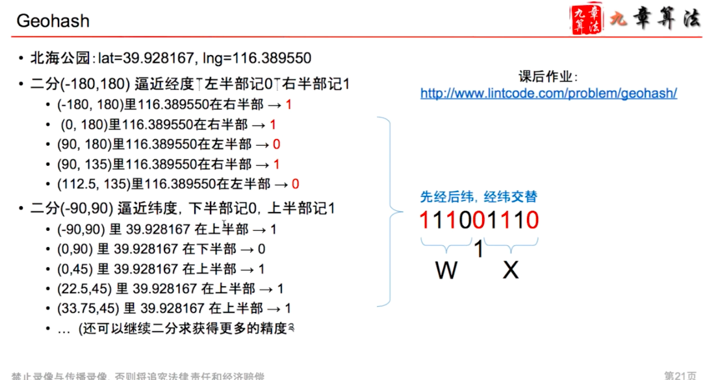

# GeoHash

---

1.  binary cover the longitude and latitude to a 30 bit 010101...
2.  combine togeter
3.  each 5 bit cover to a character
4.  get a 9hsets6..

![public String encode(double latitude, double longitude, // Write your code here String _base32 '0123456789bcdefghjkn1npqrstuvwxyz" ; String lat_bin getBin(1atitude, - 90, 90) String Ing_bin getBin(10ngitude, -180, 180) StringBuffer hash_code new StringBuffer(); StringBuffer b new StringBuffer(); for (int i --- b. charAt(i)) ; b. charAt(i)) ; for (int i --- int index i + S)); hash_code. charAt(index)) ; int precisim) { return hash_code. substring(Ø, precision); public int b2i(String bin) { return Integer. parselnt(bin, 2); public String getBin(doub1e value, double left, StringBuffer b new StringBuffer(); for (int i --- double mid (left + right) / 2.ø; if (value > mid) { left mid; } else { right mid; b. append( return b.toString(); double right) { ](../../media/Location-Service-Basic-GeoHash-image1.png)

if we have two string, we just compare their longest common prefix

more longer that meaning those two are more close

Geohash -- KM

