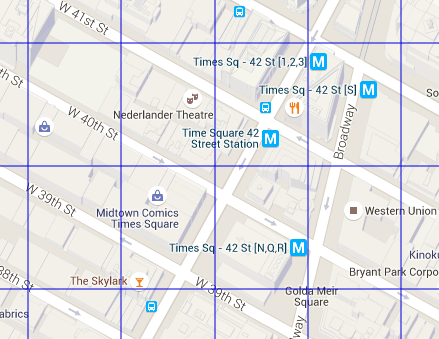
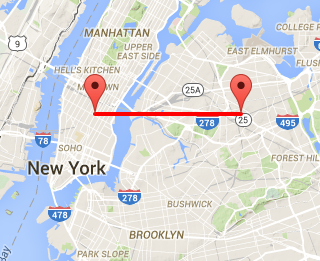

# Improved Location Caching with Quadtrees

---

Clipped from : <https://engblog.yext.com/post/geolocation-caching>

Scaling a web service to handle thousands of requests every second requires a good caching strategy. But when a geolocation (latitude and longitude) is the primary parameter of these requests, traditional caching techniques fall flat. This article explores different approaches to caching geolocations and their relative tradeoffs. We use quadtrees to achieve high cache hit ratios while keeping responses relevant even in dense areas.

**Background**

Yext recently launched a new product called [Xone](http://www.yext.com/products/xone/). Xone allows businesses to provide in-store experiences for their customers via mobile devices, enabled through a network of participating apps. In order to deliver a seamless user experience, these apps periodically request a list of participating businesses that are near to the user.

Here's an example of a request to query businesses near to Yext's NY office:

[GET /nearbyBusinesses?latitude=40.741111&longitude=-73.987448]{.mark}

The contract for this endpoint is to return up to 20 Xone-powered businesses near the specified location. For example:

{
"businesses": [
{
"id": "someid",
"name": "Some Business",
"location": { "latitude": 40.7423, "longitude": -73.98653 },
...
},
...
]
}

The Xone backend receives over 4,000 requests to this endpoint every second during peak times, which would quickly overload our database if we tried to compute the results for every request. Luckily many of the searches occur in similar locations and have identical responses. We save a lot of processing power and time by saving recently computed responses and reusing them when similar requests come in.

**Basic caching**

Most web servers use caching to avoid performing repeated work by temporarily saving previously calculated results. Projects such as [Memcached](http://memcached.org/) exist to make it easy for developers to implement caching, and many popular web frameworks have [features built in](https://www.playframework.com/documentation/1.4.x/cache) to integrate with common cache providers.

This is an example of how a blog server might use caching to speed up serving of individual posts:

public static void getPost(int postId) {
// Try to look up the post in the cache.
Post post = Cache.get("post_" + postId, Post.class);

// If this particular post wasn't cached, look it up in the DB and
// save it to the cache.
if (post == null) {
post = lookupPostFromDb(postId);
Cache.set("post_" + postId, post, "30mn");
}

render(post);
}

If we were try to use the same strategy for the Xone nearby businesses endpoint, the call to look up from the cache might look something like:

List<Result> results =
Cache.get(String.format("businesses-%f-%f", latitude, longitude));

The problem with this approach is that latitudes and longitudes are much too **[granular]{.mark}**. Two locations a few feet apart could have slightly different values for latitude and longitude. Even with a very high volume of requests, it is unlikely that multiple requests are made for the exact same latitude and longitude.

One way to measure the effectiveness of a caching strategy is by looking at the *cache hit ratio*. The cache hit ratio is defined as the percentage of incoming requests that were found in the cache. Cache hit ratios close to 0% mean that the application gains little benefit from caching.

We ran a simulation of the simple caching solution on requests we recorded from live traffic. Out of 1.6 million total requests, over 1.5 million contained distinct locations. This resulted in a cache hit ratio of only 5%!

**Tiles and grids**

Dealing with location coordinates is challenging in part because the source of the data, in this case mobile phones, is [inherently inaccurate](http://developer.android.com/guide/topics/location/strategies.html#Challenges). Due to the volatile nature of obtaining location readings, a user standing still could end up with different location estimates for every request.

However, even if a user reported a perfectly accurate location there would still be a problem trying to cache using location coordinates directly. A user who crosses a street might experience a [change in location](https://goo.gl/maps/fh5jwc5hzrx) from 40.74120, -73.98679 to 40.74124, -73.98676, but for the purposes of most applications this is not a meaningful difference.

The easiest strategy to deal with this problem is to truncate the latitude and longitude values to a fixed number of decimal places. The following image is a visualization of the grid formed by truncating coordinates to 3 decimal places:

Each cell in this grid is approximately 100m by 100m and represents all the coordinates that begin with the same 3 decimal places. By using lower precision location coordinates, small changes in location usually still map to the same cache key. The user in the previous example who crossed the street would most of the time still be in the same cell, and therefore our servers would be able to use the previously cached response.

In Java, you could construct a cache key with truncated coordinates like this:

String cacheKey = String.format("businesses-%.03f-%.03f", lat, lng);

**Grid accuracy**

We used our simulation framework to measure the cache hit ratio after truncating coordinates to 3 decimal places. Surprisingly, the cache hit ratio only improved to 18%! We tried different precision levels and observed the following results:

| **Decimal Places**        | **Cell Size** | **Cache Hit Ratio** |
|---------------------------|---------------|---------------------|
| 3 (e.g., 40.741, -73.986) | 100m          | 18%                 |
| 2 (e.g., 40.74, -73.98)   | 1km           | 65%                 |
| 1 (e.g., 40.7, -73.9)     | 10km          | 95%                 |

As we lowered precision (increasing the size of cells in the grid) the cache hit ratio went up, but this came with a different problem. Two users that are 10km apart are unlikely to have the same 20 nearby Xone businesses, especially in metropolitan areas. The following image shows two points that are 10km apart in New York:

By lowering the precision of location coordinates to 1 decimal place we were able to reach a reasonable cache hit ratio, but the cost is that the cached results were no longer valid. We define a set of results as *valid* if no business is excluded that is closer to the user than any business in their search results.

In the above example, suppose we tried to reuse the search results were originally calculated in Manhattan for a user in Brooklyn. There would be many businesses in Brooklyn that are close to the user but were not included; all of the businesses that we would return to the user would be in Manhattan. In this case the cached results are *invalid* because the coordinate truncation was too coarse.

**Dynamic Grids**

While 10km cells are too large to use in urban areas, there are many less dense areas outside of cities where two locations a few kilometers apart would actually have the same list of 20 nearby Xone businesses. Ideally we would be able to use large, imprecise cells in sparse areas and smaller, more granular cells in dense areas.

[[Quadtrees](https://en.wikipedia.org/wiki/Quadtree) are a data structure that encode a two-dimensional space into adaptable cells. Similar to binary trees, quadtrees are a tree structure where every non-leaf node has exactly four children.]{.mark} In the context of location, these nodes represent the four quadrants: NW, NE, SW, and SE. Each node in a quadtree can be recursively subdivided, with successive subdivisions resulting in smaller and smaller cells.

A quadtree can be depicted as a grid, with each square representing a node in the tree. The following image visualizes the process of subdividing nodes in a quadtree, starting with a single root node and finishing with a tree of depth 3:

We can use quadtrees to strike a balance between precision and validity of results. Conceptually, we want to build a tree where each leaf node is precise enough that searches for any location in that node result in the same set of businesses. We accomplish this by building a tree that starts with a single node representing the entire world, and continue subdividing as necessary until each node satisfies this criteria. The end result is a tree that is precise where needed but with as few nodes as possible in order to minimize the number of entries in the cache.[^1^](https://engblog.yext.com/post/geolocation-caching#fn:1)

Here is an image of the finished quadtree near Denver, CO, demonstrating how the the quadtree depth varies with population density:

Each square in this image represents a leaf node in the generated quadtree, and has the property that every location within its bounds has the same set of nearby businesses.

Every night we recompute the quadtree based on our currently subscribed businesses.[^2^](https://engblog.yext.com/post/geolocation-caching#fn:2) We use a simple heuristic to satisfy the main criteria of consistent search results: if the number of search results centered on a node exceeds a predefined threshold, then we subdivide.

public static void buildQuadtree(Node node) {
if (searchBusinesses(node).size() > 20) {
node.subdivide();
for (Node child : node.getChildren()) {
buildQuadtree(child);
}
}
}

Instead of using a fixed search radius, the algorithm searches with a radius proportional to the size of a quadtree node. This lets us simultaneously ensure that every entry in the cache will have a similar number of search results (for cache efficiency) and also guarantee that the results are still valid.

**Quadtrees in action**

When our server receives a request for businesses near to a location, we first look up the quadtree node for that location[^3^](https://engblog.yext.com/post/geolocation-caching#fn:3) and then [use that node both to build the cache key[^4^](https://engblog.yext.com/post/geolocation-caching#fn:4) and if necessary to search for businesses]{.mark}:

public static void getNearbyBusinesses(float latitude, float longitude) {
QuadtreeNode node = lookupQuadtreeNode(latitude, longitude);
String cacheKey = "quadtree_" + node.getId();
List<Result> results = Cache.get(cacheKey);
if (results == null) {
results = searchBusinesses(node);
Cache.set(cacheKey, results, "2h");
}
render(results);
}

The search performed on cache miss is the same as the search performed when building the cache tree; the search is centered on the node with a radius proportional to the size of the node.

**Results**

Quadtrees allow us to combine the advantages of caching geolocations with both high and low precision. Contrasted with the 18% cache hit ratio we acheived by truncating locations to 3 decimal places, using quadtrees resulted in a cache hit ratio of over 99.9% during peak times:[^5^](https://engblog.yext.com/post/geolocation-caching#fn:5)

Caching requests based on location is a challenging problem, compounding standard caching difficulties with a large and continously varying key space. Quadtrees help simplify the problem by allowing the granularity of cached results to vary based on their geographical distribution. If you are building a location-based application, the techniques discussed in this article can serve as a starting point for crafting your own caching solution.

1.  Cache hit ratio is linked to how many keys exist in the cache. With fewer keys, there is a higher likelihood of users mapping to the same key. [↩](https://engblog.yext.com/post/geolocation-caching#fnref:1)
2.  The quadtree is serialized and periodically refreshed by each instance of our web server. [↩](https://engblog.yext.com/post/geolocation-caching#fnref:2)
3.  You can find the leaf node corresponding to a location by recursing down the tree, selecting the quadrant that contains the location, until reaching a leaf node. [↩](https://engblog.yext.com/post/geolocation-caching#fnref:3)
4.  We use [geohashes](https://en.wikipedia.org/wiki/Geohash) to uniquely identify each node in a quadtree, but any encoding strategy that identifies both the center and size of the quadtree node can be used. [↩](https://engblog.yext.com/post/geolocation-caching#fnref:4)
5.  While the code examples had a fixed expiration period, we actually expire entries as new businesses sign up. This is what causes the small dips and spikes. [↩](https://engblog.yext.com/post/geolocation-caching#fnref:5)

