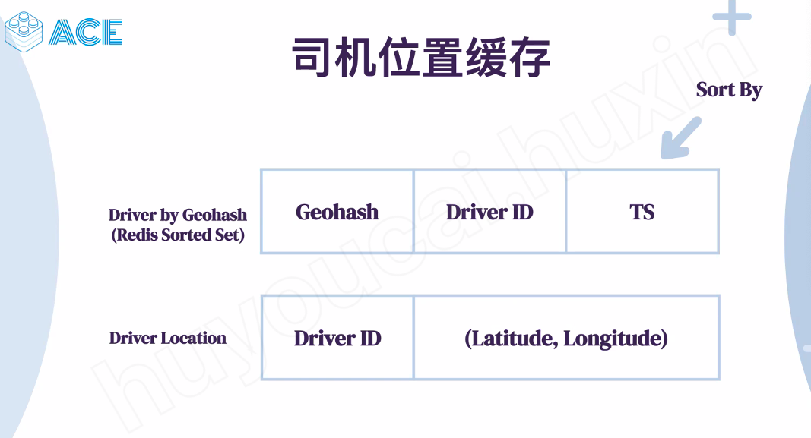
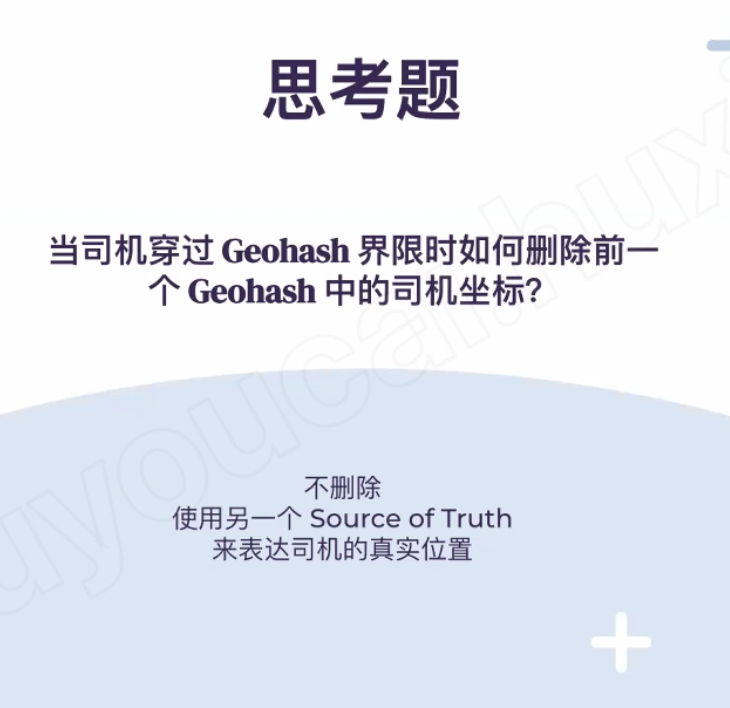
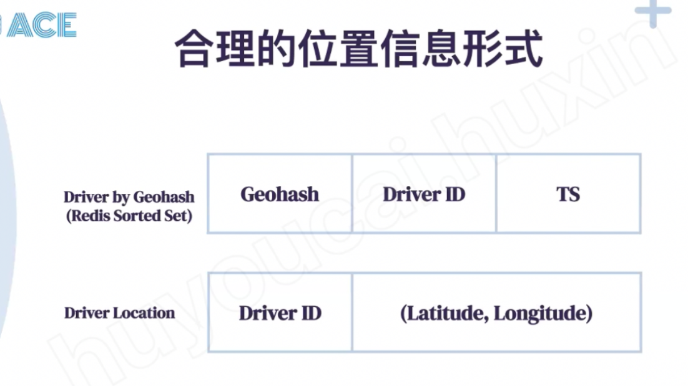
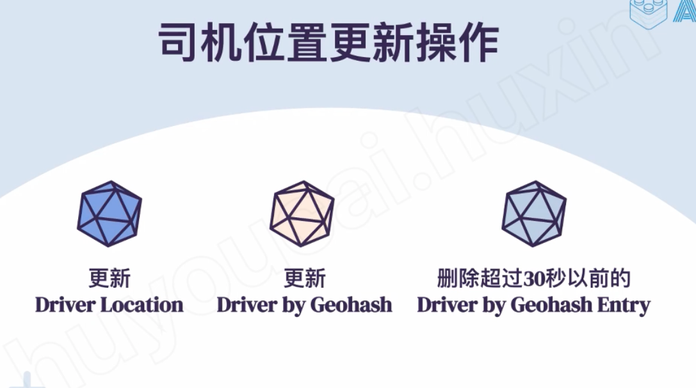
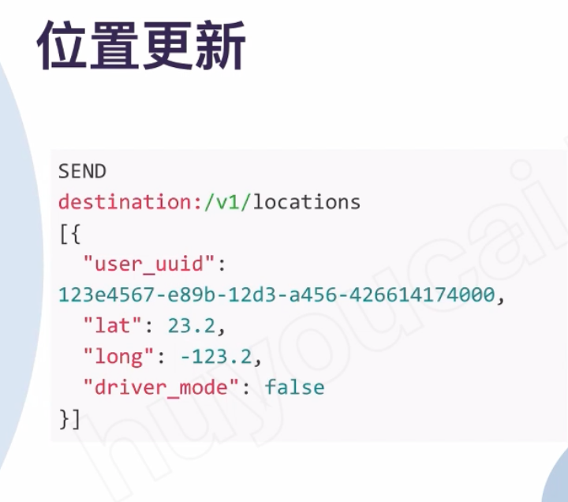
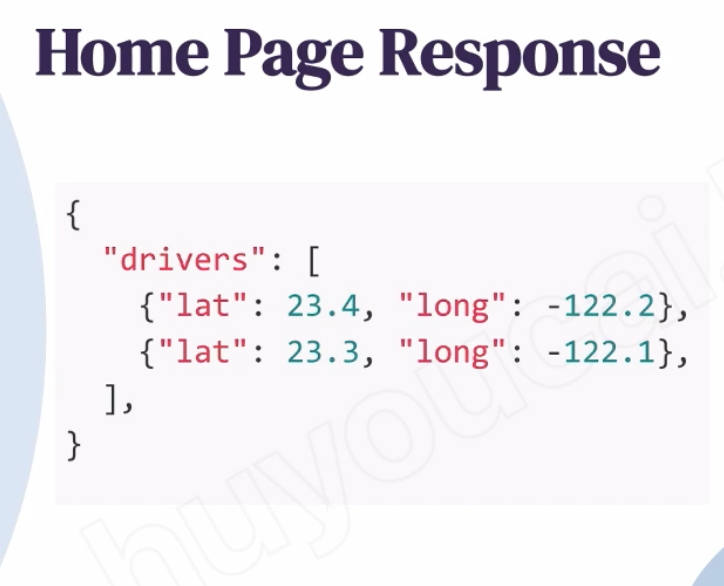
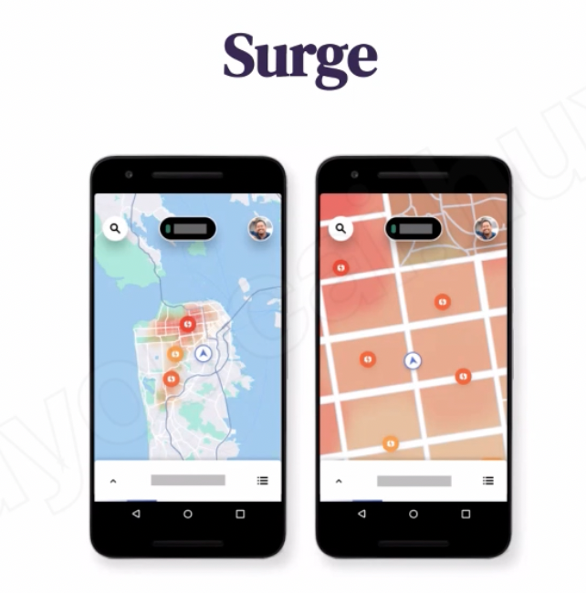
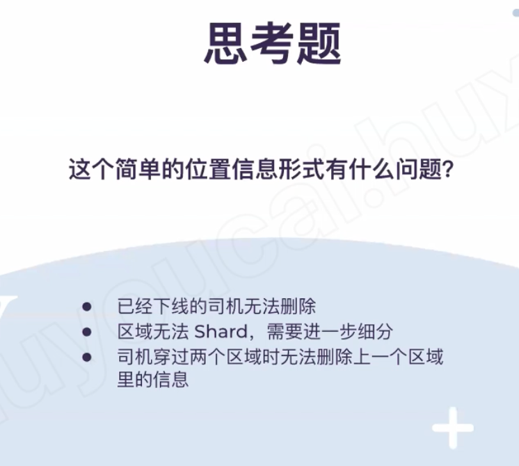

# Uber - ACE

---

There are two type of users in our system 1) Drivers 2) Customers.

1.  Drivers need to regularly notify the service (via websocket ) about their current location and their availability to pick passengers.

2.  Passengers are able to see all the nearby available drivers and return the ETA - estimated time arrival

3.  Passengers can request a ride; system will return all nearby drivers

4.  All drivers should be notified that a customer is ready to be picked up.

5.  Once a driver and customer accept a ride, they can constantly see each other's current location, until the trip finishes.

6.  Upon reaching the destination, the driver marks the trip complete and become available for the next ride.

Non function requirement

1.  Support million of user
2.  Low latency and efficiency, the passenger should able to see nerby available driver anytime. Should able to mach the driver and passenger very quickly

System has 4 part

1.  Matching service(supply and demand service) --- a. update the driver's and passenger's location, b. matching the passengers and customer
2.  ETA service and map service
3.  Pricing service
4.  Trip service -- remember the trip information
5.  Send a trip event to a analysis database like surge service or trip log service

Detail:

1.  How the driver update his location

[We can use google s2 cell, google s2 map the whole earth into cells. And every cell has a number , it index by "Hilbert curve", if two cell are next to each other, their index also should be close]{.mark}

When driver update his location 1 update driver location 2.. 3..

2.  How to find the driver

1.  Get passenger's Geohash
2.  Then get all the drivers in the same cell id or same geohash

(Shard by geohash -- consistent hash and store in memory)

3.  Then check if those drivers(list of driver ID ) are still in there, calculated the ETA

Calculated the ETA with multiple customer and multiple driver together

[Each node is communication with gossip, when driver first will send his information to any node and node will forward the information to destination node]{.mark}

Each node will have a hash range, the node will just for this range of driver information

Consistency --- best effort, not backup --

Trip id, base -- driver id and time stamp,

Status -- payment status

Node --

API -- websocket

Option: surge 1.2 price

Some tradeoff

Region 太大....

GeoHash ->{{ID,ts }, {ID,ts}}

Ts the last time driver update his location and sorted by timestamp

Delete all the Geohash - {driver id +ts } current -ts >=30 ms

