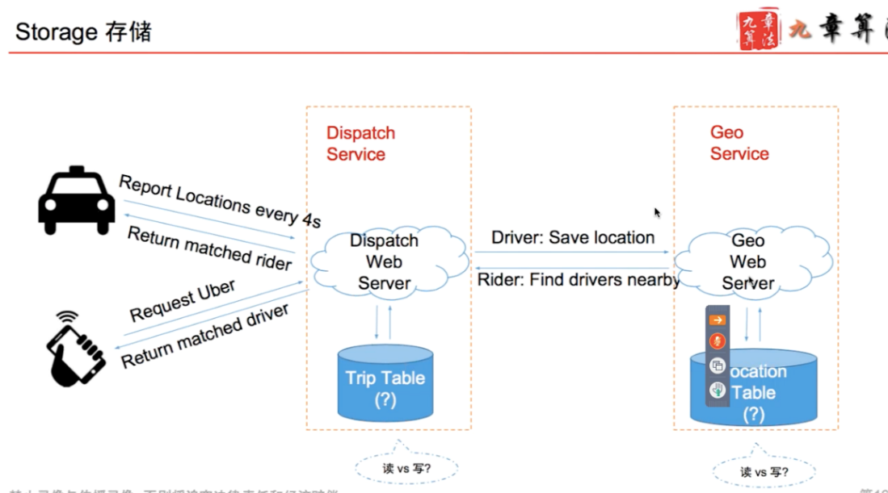

# uber Location 

Created: 2017-05-03 18:01:36 -0600

Modified: 2017-05-07 11:38:29 -0600

---

{width="5.0in" height="3.1041666666666665in"}

{width="5.0in" height="2.9583333333333335in"}

{width="5.0in" height="2.78125in"}

![打 车 用 户 的 角 度 · 用 户 发 出 打 车 请 求 ， 查 询 给 定 位 置 周 围 的 司 机 · (lat,lng) 宀 geohash 宀 [driver1, driver2,.. ] value ． 先 查 6 位 的 geohashT 找 0 ． 6 公 里 以 内 的 ． 如 果 没 有 T 再 查 5 位 的 geohashT 找 2 ． 4 公 里 以 内 的 · 如 果 没 有 T 再 查 4 位 的 geohashT 找 20 公 里 以 内 的 Location Table geohash {driverl id, driver2 id, driver3_id ． ． ． } · 匹 配 司 机 成 功 ， 用 户 查 询 司 机 所 在 位 置 · driverl 乛 (lat, Ing) DriverTable driver id value (lat,lng, ， updated-at ， trip-id) 禁 止 录 像 与 传 播 录 像 · 否 则 将 追 究 法 律 责 任 和 经 济 菇 偿 指 向 UserTable. U " rTa 存 在 其 他 数 据 库 中 ， 可 以 是 SQL 数 据 库 ](../../media/Location-Service-Uber-uber-Location-image4.png){width="5.0in" height="3.0in"}

{width="5.0in" height="3.0729166666666665in"}

![可 行 解 Work Solution 1 ． 2 ． 3 ． 4 ． 5 ， 乘 客 发 出 打 车 请 求 ， 服 务 器 创 建 一 次 Trip · 将 trip_id 返 回 给 用 户 · 乘 客 每 隔 几 秒 询 问 一 次 服 务 器 是 否 匹 配 成 功 服 务 器 找 到 匹 配 的 司 机 ， 写 ATrip 状 态 等 待 司 机 回 应 · 同 时 修 改 DriverTable 中 的 司 机 状 态 为 不 可 用 ， 并 存 人 对 应 的 trip_id 司 机 汇 报 自 己 的 位 置 · 顺 便 在 DriverTable 中 发 现 有 分 配 给 自 己 的 trip_id · 去 Trip Table 查 询 对 应 的 Trip, 返 回 给 司 机 司 机 接 受 打 车 请 求 · 修 改 DriverTable, Trip 中 的 状 态 信 息 · 乘 客 发 现 自 己 匹 配 成 功 ， 获 得 司 机 信 息 司 机 拒 绝 打 车 请 求 · 修 改 DriverTable, Trip 中 的 状 态 信 息 ， 标 记 该 司 机 已 经 拒 绝 了 该 trip · 重 新 匹 配 一 个 司 机 ， 重 复 第 2 步 ](../../media/Location-Service-Uber-uber-Location-image6.png){width="5.0in" height="3.5208333333333335in"}

{width="0.6354166666666666in" height="0.7604166666666666in"}{width="1.5625in" height="0.6666666666666666in"}

{width="0.22916666666666666in" height="0.22916666666666666in"}{width="0.22916666666666666in" height="0.22916666666666666in"}

