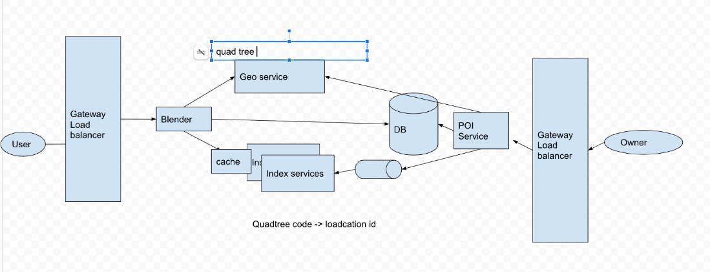

# Summary 3 

Created: 2021-01-23 17:21:45 -0600

Modified: 2021-04-27 14:34:29 -0600

---

{width="5.0in" height="1.9236111111111112in"}

Scenario

For POI

Service will store the information about different place and user can search on them and service will return the result base on user`s search

Functional Requirements:

1. Users should be able to add/delete/update Places.

2. Given their location (longitude/latitude), users should be able to find all nearby places within a given radius.

3. Users should be able to add feedback/review about a place. The feedback can have pictures, text, and a rating.

Service for POI:

How many place

have 500M places

100K queries per second (QPS).

[API]{.mark}

search(api_dev_key, search_terms, user_location, radius_filter, maximum_results_to_return,

category_filter, sort, page_token)

api key, each installed api have a different key and we can user this key to monitor the user and throttle user.

**Storage**

At a high level, we need to store the location `s information such as address, latitude, longitude

First we need two table, one is for the place Given that the location of a place doesn't change that often, we don't need to worry about frequent updates of the data.

Each location can have following fields:

1.  StoreID (8 bytes)-- primary key : Uniquely identifies a location. ( primary key)
2.  quadTreecode 12 bytes

Other information

3. Name (256 bytes)

4. Latitude (8 bytes)

5. Longitude (8 bytes)

6. Description (512 bytes)

7. Category (1 byte): E.g., coffee shop, restaurant, theater, etc.

Although a 4 bytes number can uniquely identify 500M locations, with future growth in mind, we will go with 8 bytes for LocationID.

Total size: 8 + 256 + 8 + 8 + 512 + 1 => 793 bytes

We also need to store reviews, photos, and ratings of a Place. We can have a separate table to store reviews for Places:

1.  StoreID (8 bytes)
2.  ReviewID (4 bytes): Uniquely identifies a review, assuming any location will not have more than 2^32 reviews.

3. ReviewText (512 bytes)

4. Rating (1 byte): how many stars a place gets out of ten.

Similarly, we can have a separate table to store photos for Places and Reviews.

Data collection part

1.  owner of POI should able to update, list, edit the POI information via POI service
2.  POI service will get the quadTree code then insert or update the information into DB
3.  Quadtree can be serialize into the disk, so when the service crash we can generated very quickly
4.  POI service should ask index service update the index
5.  Index service generate inverted index quadtreecode/quadtree id -- > location id

User query

1.  User will get the own quadtree code base on the lanti logti
2.  User will contact the index service to get all the location id around him
3.  Blender service will sort and ranking the result and return to user

How to partition

Partition by location id

