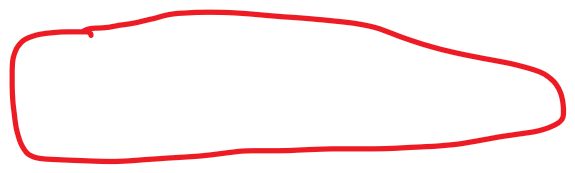

# Summary

---

Scenario

For POI

Service will store the information about different place and user can search on them and service will return the result base on user`s search

Functional Requirements:

1. Users should be able to add/delete/update Places.

2. Given their location (longitude/latitude), users should be able to find all nearby places within a given radius.

3. Users should be able to add feedback/review about a place. The feedback can have pictures, text, and a rating.

Service for POI:

How many place

have 500M places

100K queries per second (QPS).

At a high level, we need to store the location `s information such as address, latitude, longitude

first we need two table . one is for the place Given that the location of a place doesn't change that often, we don't need to worry about frequent updates of the data.

API

search(api_dev_key, search_terms, user_location, radius_filter, maximum_results_to_return,

category_filter, sort, page_token)

api key, each installed api have a different key and we can user this key to monitor the user and throttle user.

Store age

Each location can have following fields:

1. LocationID (8 bytes): Uniquely identifies a location.

2. Name (256 bytes)

3. Latitude (8 bytes)

4. Longitude (8 bytes)

5. Description (512 bytes)

6. Category (1 byte): E.g., coffee shop, restaurant, theater, etc.

Although a 4 bytes number can uniquely identify 500M locations, with future growth in mind, we will go with 8 bytes for LocationID.

Total size: 8 + 256 + 8 + 8 + 512 + 1 => 793 bytes

We also need to store reviews, photos, and ratings of a Place. We can have a separate table to store reviews for Places:

1. LocationID (8 bytes)

2. ReviewID (4 bytes): Uniquely identifies a review, assuming any location will not have more than 2^32 reviews.

3. ReviewText (512 bytes)

4. Rating (1 byte): how many stars a place gets out of ten.

Similarly, we can have a separate table to store photos for Places and Reviews.

How to present the location: GeoHash

Cassandra

From jiuzhang : store the geohash in Casandra

geohash and place id will be the column key and use range query to find nearby place. and value will be the name, category and other information

the shading key will be the Geofence key

we need a GeoFence is shape for the different city present by the different point and there already has 400 genfence, and we need define and calcuate first and store in the first.

first we need find the user in which genFence and than query the database find the palce nerby him

if the location is hot we can add write through cache and master slave mode

How to partition

Partition by city id or user way call geo fence, geo fence is human define geographic area. It is a polygon

in this case, we need another table just for geofence, key will be the geofence id and the value will be some points for this geofence, this information will use to calcite the given location is in this geofence or not.

geolocation table

key will be the geofence key + a increase number

column will be geohash and place id

for Uber

There are two kinds of users in our system 1) Drivers 2) Customers.

Drivers need to regularly notify the service about their current location and their availability to pick passengers.

Passengers get to see all the nearby available drivers.

Passengers can request a ride; nearby drivers are notified that a customer is ready to be picked up.

Once a driver and customer accept a ride, customer can see the driver`s location

Upon reaching the destination, the driver marks the journey complete to become available for the next ride.

3. Capacity Estimation and Constraints

Let's assume we have 300M customer and 1M drivers, with 1M daily active customers and 500K daily active drivers.

Let's assume 1M daily rides.

Let's assume that all active drivers notify their current location every 4 seconds.

The QPS will be 500/4 = 125k

We don`t need calculate the passages QPS

Once a customer puts a request for a ride, the system should be able to contact drivers in real-time.

Storage for U

Service:

We just need two service for 1 dispatch service 2. Geo service

Geo service driver will report his location to dispatch service every 4 seconds and dispatch service will save the location to Geo service

Passengers get to see all the nearby available drivers and request a ride and dispatch service will through Geo service find available driver and return to passage

Trip table and driver location table

If store in the memecahed or redis:

At least will 3 bucket : for example 9q9hvt

Key will be 9q9h, 9q9hv and 9q9hvt ( 0.6km) and 4 digital geohash is 20 km

Table will like { key, {drive id1 , drive id2....}}

Jiuzhang :

Chose redis:

First find 6 digital bucket then 5 then 4

In the redit, there is another table call driver table

If find the available drive

Key: drive id

Value {lat, lng, status, update at(time stamp}, trip id}

From drive side:

Report his location and update the location table( if necessary) and drive table

If drive accept the request

Update the trip id for drive table

And driver will get the trip information

For passage side

Request a ride, create a trip table for that passage

And will check the service every server second to find out any driver accepted his request or not

If any driver accept the request: passenger will get the driver information and drive current location

sharding will base on the geofence

How to update the driver information to customer

When user open the APP, customer will tell the current location to service and service will find out the a push service for this customer and set the nearby drives to that service then send to customer

there should be a hashmap in the push service, the key will be the customer key and value will be the push service the customer is connecting. Dispatch service will send the nearby drive information let assume every minutes and to push service and push service will sent it to the customer

