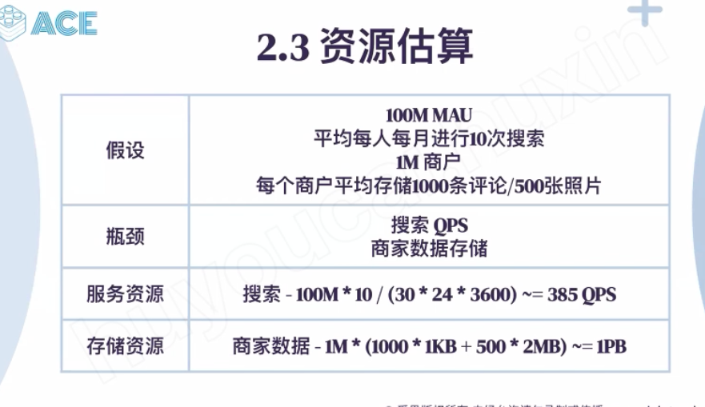
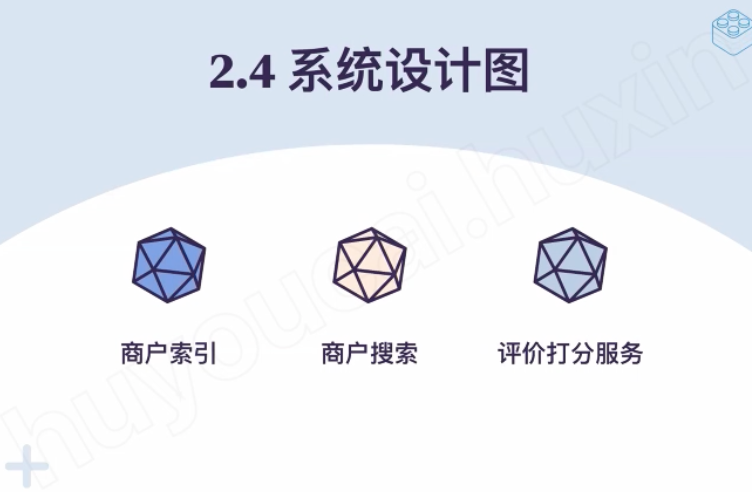
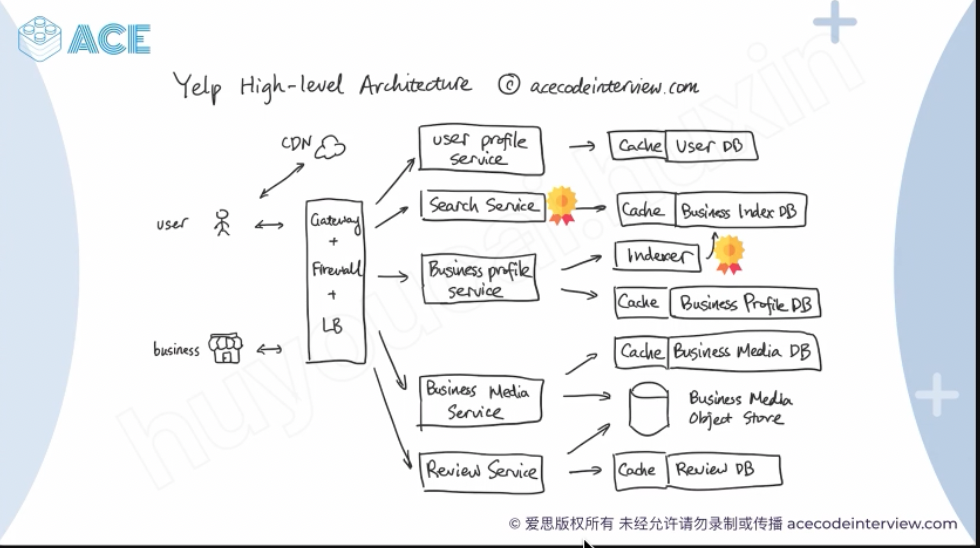
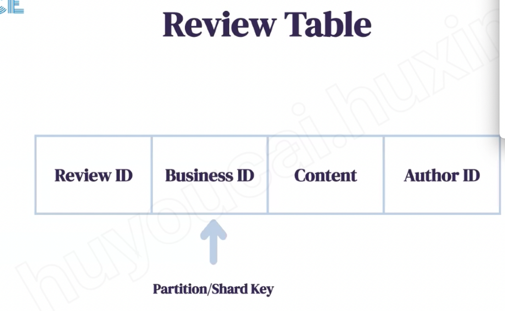
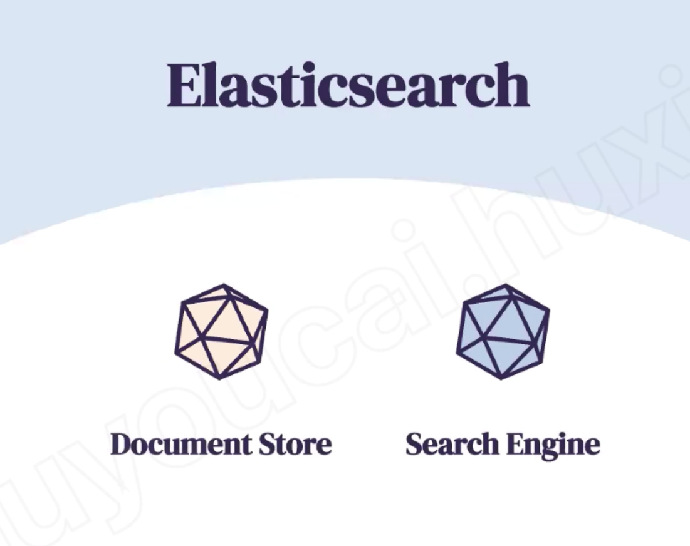
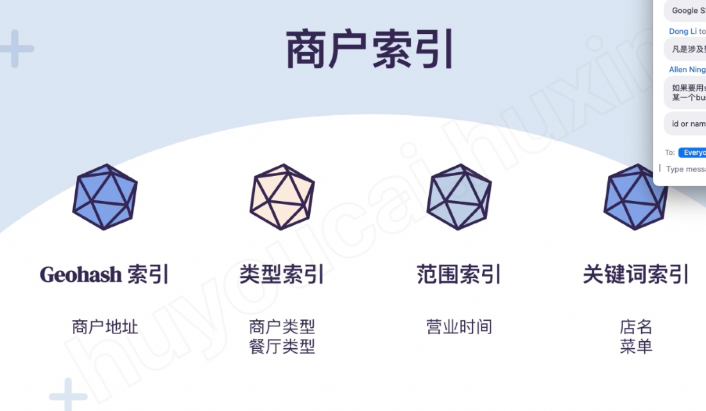
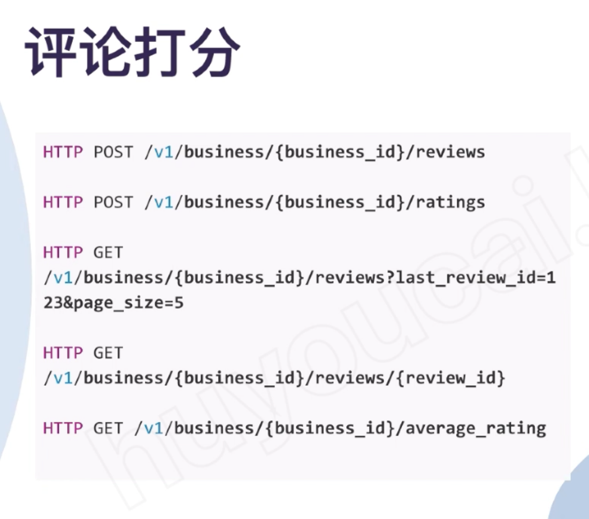

# Yelp -- ACE

---

1.  [requirement]{.mark}

Service will store the information about restaurants and user can search the restaurants base on the name, type...

them and service will return the result base on user`s location

Functional Requirements:

1. Users should be able to add/delete/update Places.

2. Given their location (longitude/latitude), users should be able to find all nearby places within a given radius.

3. Users should be able to add feedback/review about a place. The feedback can have pictures, text, and a rating.

non- function requirement:

1.  support million restaurants .. and billion user
2.  high availability - user can visit anytime

1200 * 10/30 = 400 ( 1M = 12)

2.  [service]{.mark}

3.  data follow

the system has 3 part :

1.  restaurants owner can create and update the restaurants information ( [business profile services]{.mark}) and system will build the index [(indexer service)]{.mark} for those restaurants and update to index DB or use elasticsearch
2.  search the restaurants ( search service)
3.  review and comments (reviewed service)

business media service will store restaurants picture

sharding base on the Geohash or if we use google S2, we can sharding base on the s2 cell id

[S2 cell is like quardtree it decode the earth into small cell ( one cell could be one city or one county)]{.mark}

[And every cell has a number , it index by "Hilbert curve", if two cell are next to each other, their index also should be close]{.mark}

according to the traffic pattern, active user count, user query count in one hour.. we can precompute sharding strategy

like s2 cell id 1 -10 into one sharding ..

the we know how to sharding the user base on user's geohash

from 1111-2222 go to service

if use elasticsearch -- don't need indexer service

s2 cell ID is sharding key

if the thumbnail need to be shown in the search, we need to sharding base on the cell id

flexible schema

[elasticsearch will build the index base on the column]{.mark}

3.  Data flow:

API

last_review_id...

