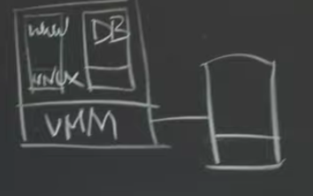
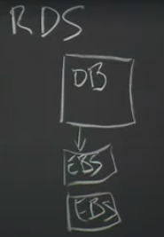

# Amazon Aurora

---

in the beginning, amazon had basically their very first offering cloud offering to

support people who wanted to build websites but using Amazon's hardware.

[EC2]{.mark}

in Amazon's machine room their first offering was something called ec2

~~the idea here is that Amazon had big machine rooms full of servers and they ran virtual machine monitors on their servers and they'd rent out virtual machines to their customers and their customers would then you know rent a bunch of virtual machines and run web~~

~~servers and databases and whatever ever.~~

~~All else they needed to run inside these ec2 instances,~~ so the picture of one physical server looked like this Amazon, we control the virtual machine monitor on this hardware server and then there'd be a bunch of guests a bunch of ec2 instances, each one rented out to a different cloud customer, each of these would just run a standard operating system like Linux and then you know a web server or maybe a database server ,

~~and these were relatively cheap relatively easy to set up and as a very successful service, so one little detail that's extremely important for us is that initially the way you get storage the way you've got storage if you rented ,~~an ec2 instance was that every one of their servers had a disk attached , a physical disk attached and each one of these instances that they rented to.

Their customers will get us a slice of the disk, so they said locally attached storage and you got a bit of locally attached storage which itself just look like a hard drive an emulated hard drive to the virtual machine guests

ec2 is like perfect for web servers for stateless web servers you know ,your customers with their web browsers would connect to a bunch of rented ec2 instances that ran a web server and if you added all of a sudden more customers you could just instantly rent more ec2 instances from Amazon ,and fire up web servers on them and sort of an easy way to scale up your ability to handle web load so it was good for web servers

but the other main thing that people ran in ec2 instance ,this was databases one ec2 instance running a database, your web servers would talk to your database instance and ask it to read and write records in the database,

unfortunately ec2 wasn't perfect was it nearly as well-suited to running a database as it was to running web servers and the most immediate reason is your ec2 database instance was on the locally attached disk, attached to whatever a piece of hardware your database instance was currently running on, in fact hardware crashed then you also lost access to whatever what is on its hard drive, so if it's a hardware that it was actually implementing a web server crashed ,no problem at all because there's really keeps no state, itself you

just fire up a new web server on a new ec2 instance, if the ec2 instance it's a (database )hardware running, it crashes have become unavailable you have a serious problem.

well is that Amazon did provide this, sort of large scheme for storing large chunks of data called s3 and you could take snapshots. you could take periodic snapshots if you need a basis state and stored in s3 and use that for sort of backup disaster recovery, but you know that style of periodic snapshots means you're gonna lose updates that happen between the periodic backups

[EBS]{.mark} and this stands for elastic block store

so with EBS is a service that looks to an ec2 instances, it looks to one of these instances one of these guest virtual machines , just as if it were a

hard drive ~~an ordinary way you could format it as a hard drive~~, ~~but a file system like ext3 or whatever Linux file system you like on this on this thing that looks to be guest just like a hard drive~~ but the way it's actually implemented is as a replicated pair of EBS servers ,each with an attached hard drive, so if your software here maybe you're running a database now and your databases mount's one of these EBS volumes as its storage, when the database server does a write what that actually means is that the right to send out over the network and using chain replication. first written to the EBS server 1,on the first EBS server that's backing your volume and, then the second one and finally you get the reply

similarly, when you do a read I guess some chain replication, you'll be the last of the chain.

It actually would survive the crash of or the you know death of the hardware that they were running on, if this physical server died ,you could just get another ec2 instance fire up your database and have it attached to the same old EBS volume, that the sort of previous version of your database was attached to and it would see all the old data just as it had been left off by the previous database, just like you moved a hard drive from one machine to another

one thing to that is sort of important for us about EBS is that it's really it's not a system for sharing at any one time only one ec2 instance, only one virtual machine can mount a given EBS volume so everybody's EBS volumes are stored on this big pool of servers but each one of each EBS volume can only be used by only one ec2 instance ,only one customer all

[Problem about EBS]{.mark}

if you run a database on EBS it ends up sending large volumes of data across the network so there's the database on EBS ended up generating a lot of network traffic

important the other problem with EBS is not very fault tolerant it turns out that for performance reasons they amazon would always put both of the EBS both of the replicas of your EBS volume in the same data center, and so we have a single server crashed if you know one of the two EBS servers that you're using crashed it's okay because you switch to the other one, but there was just no story at all for what happens if an entire data center went down and apparently a lot of customers really wanted a store that would allow their data to survive an outage of an entire data center, maybe it lost his network connection, it was a fire in the building

or a power failure to the whole building

something people really wanted to have at least the option if they're willing to pay more of having their data stored in a way: there is that both an instance and its EBS to EBS replicas are in the same ability zone and ~~an Amazon jargon an availability zone is a particular data center~~ and the way they structure their data centers is that there's usually multiple independent data centers in more or less the same city or relatively close to each other and all the multiple availability zones maybe two or three

that are near by each other are all connected by redundant high speed networks so there's always pair or triples of nearby availability centers , [but at least for EBS in order to keep the sort of costs of using chain replication down they required the two replicas to be in the same availability zone]{.mark}

Transaction

transaction you know transaction is just a way of wrapping multiple operations, on maybe different pieces of data and declare in that that that's entire sequence of operations should appear a

atomic to anyone else who's reading or

writing the data so you might see transposing we're running a bank and we

How mysql transaction works -- 课件

[Traditional database Mysql crash recovery]{.mark}

RDS:

x = x + 10
y = y - 10

I want the database to just do them both without allowing anybody else to sneak in and see the state between these two statements and also with respect to crashes, if there's a crash at this point

somewhere in here we're going to make sure that after the crash and recovery that either the entire transactions worth the modifications are visible or

none of them are

database users expect that the database will tell

them tell the client that submitted the transaction whether the transaction really finished and committed or not and, if a transaction is committed we expect clients expect that the transaction will

be permanent will be durable still there even if the database should crash and reboot

usual way these are implemented is that the transaction locks each piece of data before it uses

it so you can view the they're being locks x and y for the duration of the transaction and these are only released after the transaction finally commits that is known to be permanent

implemented is that the transaction locks each piece of data before it uses, it so you can view the they're being locks x and y for the duration of the transaction and these are only released after the transaction finally commits

we just assume we have a database with a attached to a disk ,the on disk structure that stores these

records is some kind of indexing structure like a b-tree maybe so there's a sort of pages with the paper

calls data pages, that holds us you know real data of the of the database , X and y are typically just a

couple bites on some page in the database so on

actual data plus on the disk there's also a write ahead log or wal and the write ahead logs are a critical part of why the system is gonna be fault

tolerant inside the database server

there's the database software the database typically has a cache of pages that it's read from the disk that it's recently used ,when you execute a transaction, what that actually executes these statements, what that really means is you know" what x equals x plus 10 turns into the runtime" is that the database reads the current page, holding X from the disk and adds 10 to it but so far until the transaction commits it

only makes the modifications in the local cache, not on the disk because ~~we don't want to expose~~ ,we don't want to write on the disk yet, ~~and the part~~

~~possibly expose a partial transaction~~ so

~~while then when the database but before~~

~~because the database wants to sort of~~

~~pre to clear the complete transaction so~~

~~it's available to the software after a~~

~~crash and during recovery~~ [before the database is allowed to modify the real data pages on disk, its first required to add log entries that describe the]{.mark}

[transaction,]{.mark} so it has to in order before it can commit the transaction ,it needs to put a complete set of log ahead entries in the write ahead log on disk

I'm describing all the data bases modification

before writing the pages the database is going to add at least typically 3 log: records 1 this that says well as part of this transaction I'm modifying X

and it's old value is 500 here's the old value and we're adding and here's the new value say 510,

so that's one log record another y may be old value is 750 we're subtracting 10 so the new value is 740,

and then when the database if [it actually manages to get to the end of the transaction before crashing its]{.mark}

[gonna write a commit record saying and typically these are all tagged with some sort with a transaction ID]{.mark} so that the recovery software eventually will know how this commit record refers to these log records

so if the database manages to get as far as getting the transactions log records on the disk and the commit record marking is finished, then it is entitled to apply to the client we said the transactions committed the database can reply to the client and the client can be assured that its transaction will be sort of visible forever and

now one of two things happens the database server

doesn't crash then eventually so it's modified in its cache these these X&Y records to be 510 and 740 eventually,the database will write it's cached updated blocks to their real places on the disk

over writing you know these be tree nodes or something and then the database can reuse this part of the log so databases tend to be lazy about that

because they like to accumulate you know maybe there'll be many updates to these pages in the cache

if the database server crashes before writing the day

writing these pages to the disk so they still have their old values then it's guaranteed that the recovery software when you restart that database, scan the log see these records for the transaction see that that transaction was committed and apply the new values to the to the stored data

[RDS]{.mark}

next step in Amazon's development a better and better database infrastructure for its cloud customers is something called RDS, RDS is that it was a first attempt to get a database that was replicated in multiple availability zones

with RDS is that there's one you have one EC2 instance that's the database server, you just have one you just want to running one database it stores its data pages and log just basically with this instead of on the local disk its stores them in EBS so whenever the database does a log write or page write or whatever those writes , actually go to these two EBS volumes, EBS replicas in addition so and so this is in one availability zone

In addition for every write that the database software does, [Amazon would send those writes to a special set up in a second availability zone]{.mark} in a second machine room -a separate computer or ec2 instance or something whose job was just a mirror writes that the main database did, so this other sort of mirroring server would then just copy these writes to a second pair of EBS servers

every time the database appends to the log or writes to one of its pages, the data has to be sent to these two replicas has to be sent on the network connection across the other availability zone on the other side of town sent to this mirroring server which would then send it to it's two separate EBS replicas and

then finally this reply would come back and then only then with the writes be finished

so this RDS arrangement gets you better fault tolerance because now you have a complete up-to-date copy of the database like seeing them all the very latest writes in a separate availability zone even if you know fire burns down this entire data center boom you can weaken you can run the database in a new instance and the second availability zone and lose no data at all

Problem:

this turns out to be extremely expensive

you know we're writing fairly large volumes of data ~~because you know even this transaction which seems like it just modifies two integers like maybe eight bytes or I don't know what sixteen who knows only a few bytes of data are being modified here what that translates to as far as the database reading and writing the disk is I actually these log~~

~~records are that also quite small so this these two log records might themself only be dozens of bytes long so that's nice but the reads and writes of the actual data pages are likely to be much much larger than just a couple of~~

~~dozen bytes because each of these pages is going to be you know eight kilobytes or 16 kilobytes or some relatively large number the file system or disk block~~

~~size and it means that just to read and write these two numbers when it comes time to update the data pages.~~

there's a lot of data being pushed around on to the disk .it sends huge amounts of data over these relatively slow Network links and that was the problem that was the performance problem they're really trying to fix

[Aurora,]{.mark}

it I'm renting a server running Amazon's Aurora database software on it rent an Aurora database server from them and

it's it's just one instance it sits in some availability zone and there's two interesting things about the way it's set up first of all is that the data you know it's replacement basically for EBS [involves six replicas now in each of three availability zones]{.mark}

for super fault tolerance and it needs to send a write one way or another writes have to get sent to all six of these replicas. [The key to making and the only thing being written over the network is the log records]{.mark}

the replicas, their storage system is now not very general purpose this is a storage system that

understands what to do with mysql log entries right it's not just you know EBS was a very general purpose just emulated to disk ~~you read them right~~

~~block's doesn't understand anything about anything except for blocks~~ this is a storage system that really understands that it's sitting underneath the

database ~~so that's one thing they've done is ditched general-purpose storage and switched to a very application specific storage system~~

they don't require that the writes be acknowledged by all six replicas in order for the database server to continue ,instead the database server can continue as long as a quorum and which turns out to be for as [long as any 4 of these servers responds.]{.mark}

so if one of these availability zones is offline or maybe the network connection to it is slow or maybe even just these servers just happen to be slow doing something else at the moment we're

trying to write the database server can basically ignore the two slowest or the two most dead of the server's when it's doing it writes, so it only requires

acknowledgments from any four out of six and then it can continue and so this quorum scheme is the other big trick they use to help them have more replicas in more availability zones and yet not pay a huge performance penalty because they never have to wait for all of them just the four fastest of the six

replicas

fault tolerance goals they wanted to be able to do [writes]{.mark} even [if one availability zone was completely dead]{.mark} so they're gonna write you know even with they wanted to be able to read even [if there was one dead availability zone plus one other dead server]{.mark}

[quorum]{.mark}

for quorums, the idea is you have n replicas if you want to write or you have to get you have to in order to write you have to make sure your write

is acknowledged by W where W is less than n of the replicas so W writes you have to send each writes to

these W are the replicas and if you want to do a read you have to get input read information from at least R replicas

so that any quorum of W servers that you manage to send a writes to must necessarily overlap with any quorum of our servers that any future reader might

read from (the servers you manage to send a writes and the service receive the future reads must overlap at least one service)

and so what that means is R plus W has to be greater than N so that any [W servers must overlap in at least one server with any R servers]{.mark}

~~you know that quorum could include a server that~~

~~didn't see the writes but it has to include at least one other in order to get to so that means the any future read must ,for example consult both this~~

~~server that didn't see the write plus at least one that did. that is a requirement of write form must overlap in at least one server so any read must consult a server that saw any previous writes~~

reader is gonna get back our results possibly are different results because and the question is how does a reader know which of the our results it got back from the our servers in its forum which one

actually uses the correct value

[quorum systems need version numbers so every write]{.mark} ,every time you do a write,

you need to accompany your new value with you know an increasing version number and then the reader it gets back a bunch of different values from the read, quorum and it can just use them only the highest version number

this is why this is preferable to something like chain replication is that it can easily ride out temporary dead or disconnected or slow servers, so in fact the way it would work is that if you want to read or write if you want to write you would saying your newly written about you would send the newly written value plus its version number to all of the servers to all n of the servers but only wait for W of them to respond and similarly if you want to read you would in a quorum system you would send the read to all the servers and only wait for a quorum for R of the servers to respond

you can adjust the R and W to make either reads to

favor either reads or writes so here we could actually say that well the writes forum is 3 every write has to go to all three servers and in that case the read quorum can be 1 so you could if you wanted to favored reads with this setup you could have read equals 1 write equals 3, read are much faster they only have to wait for one server but then return the writes are slow if you wanted to favor right

only one server might have the latest value but readers have to consult all three but they're guaranteed that their 3 will overlap with this

[of course these particular values makes writes not fault tolerant and here reads not fault tolerant because all the server's have to be up]{.mark}

Aurora in order to achieve its goals here of being able to write with one dead availability zone and read with one dead availability zone plus one other server it uses a quorum system [with N equals 6 , w equals 4 and R equals 3]{.mark}

in fact its writes never overwrite anything its writes just append log entries to the current log

really the meaning is that each new log record has to be appended to the least 4 replicas before the write can be considered to have completed and when Aurora gets to the end of a transaction before it can reply to the

client until the client tell a hi you know your transaction is committed and finished and durable

[Log]{.mark}

okay so these these storage servers are getting incoming log records, just getting log records that just describe changes to the data pages

some day but not right away is that the changes in that log record the new value here has to be applied to the relevant page but we don't at the source of it doesn't have to do that until someone asks just until

the database server or the recovery software asks to see that page

what happens to a new log record is that the log records are just appended to each page so for each page ,[old version of the page plus the string of the sequence of log records.]{.mark}

[it'll send a read request out to one of the storage servers and say look you know I need a copy I need an updated copy a page one and at that point the storage server will apply these log records to the page, then send the updated page back to the database service]{.mark} and erase the log list and just store the newly updated page

[more about read]{.mark}

it turns out that in ordinary operation the database server knows quorum reads ,because the database server tracks for each one of the storage servers how far how much of the prefix of the log that storage server is actually received, so the

database server is keeping track of these 6 numbers, so first of all log entries are numbered just one two three four five, the database server sends that new log entries to all the storage servers

[the database server keeps track of these numbers how far each server has gotten or what the highest sort of contiguous log entry number is that each of the servers has gotten ,s]{.mark}o that way when the database server needs to do a read it just picks a storage server that's up to date and sends the read request for the page. It wants just to that storage

server so the database server does have to do quorum writes but it basically doesn't ordinarily have to do quorum reads

and knows which of these storage servers are up to date and just reads from one of them

[now it does sometimes use quorum reads]{.mark} ,it turns out that during crash recovery if the crash during crash recovery of the database server (not replica, master) and so this is different from a crash recovery of the storage service if the database server itself crash ,Amazon will automatically fire up a new ec2 instance start up the database, software and that ec2 instance and sort of tell it look your data is sitting on ~~this particular volume,~~ this set of storage systems ,please clean up any partially executed transactions that are evident in the logs stored in these storage servers continue

why need quorum read after crash

(

so we have to and that's the point at which Aurora uses quorum logic for read because this database server when the old when the previous database server crashed, it was almost certainly partway through executing some set of transactions, so the state of play at the time of the crash was well it's completed some transactions and committed them and their log entries are on a quorum plus in the middle of executing some other set of transactions which also may have log entries on a quorum, but because a database server crashed midway through those transactions they can never be completed and for those transactions that haven't completed in

addition there may be you know we may have a situation in which you know maybe

log entry this server has log on 100and the that server has logon 102 and there's a 104 somewhere but no server got a copy of log entry 103. so after a crash and remember the new database service recovering it does quorum reads to basically find the point in the log the highest log number for which every preceding log entry exists somewhere in the storage service so basically it finds the first missing the number of the first missing log entry which is 103 and says well and so we're missing a log entry

we can't do anything with a log after this point

it finds a 103 is the first entry that's I can't you know I look at my quorum the server's I can reach and 103 is not there and the database server will send out a message to all the server saying look please just discard every log entry from 103 onwards and those must necessarily not include log entries from committed transactions because we know a transaction can't commit until all of and you know that's the point at which Aurora needs this these old values in the log entries so that a server that's doing recovery after a crash, can sort of back out of partially completed transactions all write

)

[one another thing I'd like to talk about is how Aurora deals with big databases]{.mark}

~~we couldn't have a database that was bigger than the amount of storage that you could put on a single machine there's the fact that we have six machines~~

~~doesn't give us six times as much usable storage because each one I'm storing a replica of the same old data again and again~~

~~something we can put you know terabytes of storage on a single machine but we can't put you know hundreds of terabytes on a single machine,~~ so in order to support customers who need like more than ten terabytes , Amazon will split up the databases data onto multiple sets of six

replicas ,so and the kind of unit of sharding, the unit of splitting up the data I think is 10 gigabytes

so a database that needs 20 gigabytes of data will use two protection groups these these PG things to its data it on half of it will sit on the six

servers of protection Group 1 and then they'll be another six servers you know possibly a different set of six storage servers

if the servers crashes we want to be able to replace it as soon as possible.

background:

(the service may store 10 gigabyte segments of a hundred or more different Aurora instances so what's what's on this physical machine is you know 10 terabyte era byte or 10 terabytes or whatever of data in total

so when there's a when one of these storage servers crashes it's taking with it not just the 10 gigabytes from my database but also 10 gigabytes from a hundred other people's databases as well ( different instance)

and what has to be replicated is not just my 10 gigabytes but the entire terabyte or whatever or more that's stored on this servers solid-state drive

and if you think through the numbers you know maybe we have 10 gigabit per second network interfaces if we need to move 10 terabytes across a 10 gigabyte per second network interface from one

machine to another it's gonna take, I don't know a thousand seconds ten thousand seconds maybe ten thousand seconds and that's way too long right we don't want to have to sit there and wait

)

you know it we don't want to have a strategy in which the way we can reconstruct this is to find is to have another machine that was replicating everything on it and had that machine

the replacement strategy is that we pick if we're say we're storing a hundred of these segments on it, we pick a hundred different storage servers each of which is gonna pick up one new segment that is each of which is going to now be participating in one more protection group

so one one we miss like one server to be replicate on for each of these ten gigabytes segments and now we have you know maybe 100 sort of different segment servers

now we have a hundred different 10 gigabyte copies going on in parallel across the network and assuming you know we have enough servers that these can all be disjoint ,now we can copy our terabyte or 10 terabytes or whatever of data and total in parallel with a hundredfold parallelism and the whole

thing will take you know 10 seconds or something instead of taking a thousand seconds if there were just two machines involved anyway

so this is this is the strategies they use and it means that they can recover you know for machine dies they can recover in parallel from one machine's death extremely quickly ,they can be replicate from single machine crashes extremely quickly

[Read only DB]{.mark}

Amazon does set up a situation where we have read

only database replicas that can read from these storage servers , addition to the main database server that handles the write requests there's also a set of read-only databases

when a client sends a read request to read only database what happens is the read only database figures out you know [what data pages it needs to serve that request and sends reads into the directly into the storage system]{.mark}

without bothering the main readwrite database

[so the the read-only replica database send page requests read requests directly the storage servers and then they'll be cache those pages so that]{.mark}

[they can you know respond to future read requests right out of their cache]{.mark}

of course they need to be able to update those caches and for that reason Aurora also the main [database sends a copy of its log to each of the read-only databases ~~and~~]{.mark} ~~that's the horizontal lines you see between the blue boxes and figure three that~~ the main database sends all the log entries do these mean only databases which they use to update their cached copies to reflect recent

transactions in the database

and it means it does mean that the read only database is lag a little bit behind the main database but it turns out for a lot of read-only workloads

we don't want these relay databases to see data from uncommitted transactions yet and so in this stream of log entries the database may need to

be sort of denotes which transactions have committed and they're read-only databases are careful not to apply uncommon uncommitted transactions to their caches they wait till the transactions commit.

(Problem: need to prevent replica from seeing B-Tree &c in intermediate state
Solution: atomic mini-transactions within larger transactions.):

the other complexity that these read-only replicas impose is that the these structures he of these

the database structures are quite complex this

might be a b-tree it might need to be rebalanced periodically for example I'm the rebalancing is quite a complex operation in which a lot of the tree has

to be modified in atomically and so the

tree is incorrect while it's being be balanced and you only allowed to look at it after the rebalancing is done

if these read-only replicas directly read

the pages out of the database there's a risk they might see the be tree that the database that's being stored here in these data pages they may see the b tree in the middle of a rebalancing or some other operation and the data is just totally illegal and they might crash or just malfunction and when the

paper talks about mini transactions and

the vdl verses vcl distinction what it's

talking about is the machinery by which the database server can tell the storage servers look this complex sequence of log entries must only be revealed all or

nothing' atomically to any read-only

transactions that's what the mini

transactions and VDL are about and

basically the read when a read only

database asks to see data a data page

from a storage server the storage server

is careful to either show it data from

just before one of these sequence many

transaction sequences of log entries or

just after but not in the middle all

right so that's the all the technical

stuff I have to talk about just to kind

of summarize what's interesting about

the paper and what can be learned from

the paper one thing to learn which is

just good in general not specific to

this paper but everybody in systems

should know is the basics of how

transaction processing databases work

and the sort of impact that the

interaction between transaction

processing databases and the storage

systems because this comes up a lot it's

like a pervasive you know the

performance and crash recoverability

complexity of running a real database

just comes up over and over again in

systems design another thing to learn

this paper is this idea of quorums and

overlap the technique of overlapping

read/write quorums in order to always be

able to see the latest data but also get

fault tolerance and of course this comes

up in raft also raft has a strong kind

of quorum flavor to it

another interesting thought from this

paper is that the database and the

storage system are basically Co designed

as kind of an integrated there's

integration across the database layer

and the storage layer or nearly

redesigned to try to design systems so

they have you know good separation

between consumers of services and the

sort of infrastructure services like

typically storage is very

general-purpose not aimed at a

particular application just you know

because that's a pleasant design and it

also means that lots of different uses

can be made of the same infrastructure

but here the performance issues were so

extreme you know they would have to get

a 35 times performance improvement by

sort of blurring this boundary this was

a situation in which general-purpose

storage was actually really not

advantageous and they got a big win by

abandoning that idea and a final set of

things to get out of the papers all the

interesting sometimes kind of implicit

information about what was valuable to

these Amazon engineers who you know

really know what they're doing about

what concerns they had about cloud

infrastructure like the amount of worry

that they put into the possibility of an

entire availability zone might fail it's

an important tidbit the fact that

transient slowness of individual storage

servers was important is another thing

that actually also comes up a lot and

finally the implication that the network

is the main bottleneck because after all

they were it went to extreme lengths to

send less data over the network

but in return the storage servers have

to do more work and they put it they're

willing to you know 6 copies the data

and have 6 CPUs all replicating the

execution of applying these redo log

entries apparently CPU is relatively

cheap for them whereas the network

capacity was extremely important

all right that's all I have to say and

see you next week

