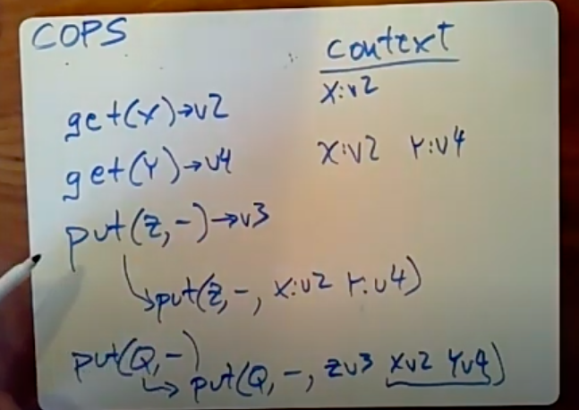
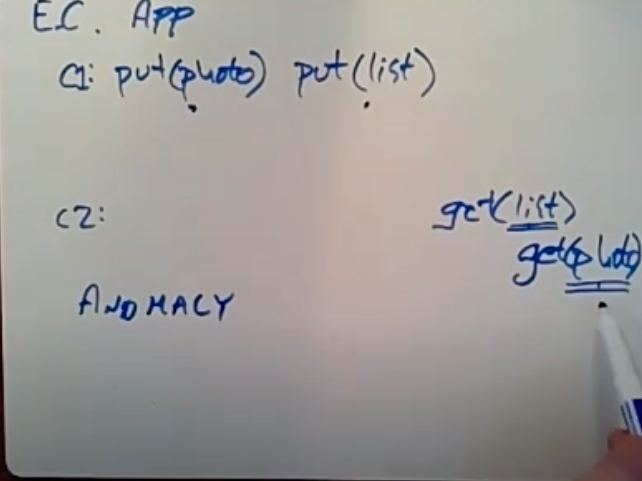

# COPS, Causal Consistency

---

we're talking again about big websites that have data in multiple data centers and they want to replicate the data in each ~~of their all their data in each their~~ data centers have to keep a copy close to users and for perhaps for fault tolerance, so as usual we have maybe I'll have three data centers and you know because we're building big systems we're going to shard the data and every data center is going to have multiple servers with you know ,

you really like reads to be certainly like reads to be fast because these web workloads tend to be read dominated and you know youi0kl'd like writes to work and you'd like to have us as much consistency as you can

The wirtes might be little more complicated, so one system that fits this pattern is spanner and spanner writes involved Paxos, that runs across all the data centers, so if you do a write in paxos maybe a client in a data center needs to ~~do a write the communication involve actually need requires paxos maybe~~ running on one of these servers to talk to at least a majority of the other data centers that are replicas so the wirtes tend to be a little bit slow but there consistent

in addition spans supports two-phase commit so we had transactions and the reads are much faster because the reads used a true time scheme that the span of paper described and really only consulted local

we also read the Facebook memcache new paper which is another ~~design in this demo pattern the Facebook memcacheD paper~~ there's a primary site that has the primary set of

my sql databases so if a client wants to do a write, I suppose the ~~primary side~~ clinent send all writes to primary and then primary sends out new information or invalidations to the other data centers, writes so actually a little bit expensive and not unlike spanner ,on the other hand all the reads are local when a client needs to do a read it could consult a memcache key server in the local data center and there's memcachedb just blindingly fast, this the paper reporting them a single memcache the server conserve a million reads per second which is very fast so again the Facebook memcache D scheme needs to involve cross data center of communication for writes but the reads are local

[design for writing locally and read locally]{.mark}

only problem is consistency

I'm gonna actually talk about two strawman designs to sort of okay but not great designs on the way to before

design 1 eventual consistency:

first i want to talk about a simplest design that follows this local reading strategy that I can think of I'll call this straw man 1, s~~o in straw and one~~ we're going to have three data centers and let's just assume that the data is shard two ways in each of them,

shard it the same way in each of the data centers and the clients will read locally and if a client writes so supposing a client needs to write it key, that starts with M the clients gonna send a write of key M to the shard server the local shard server that has its responsible he's starting with M, that shard server would return reply to the client immediately saying oh yes, I did you're writes ,but in addition each server will maintain a queue of outstanding writes that have been sent to it recently got clients ,that it needs to send to other data centers, and it will stream these writes asynchronously in the background to the corresponding servers in the other data center ,so after applying to the client our shard server here will send a copy of the clients writes to each of the other data setups and you know those writes go through the network maybe they take a long time, eventually, they're gonna arrive at the target data set, the other data centers and each of those sharding servers will then apply the writes to its local table of data

so this is a design that has very good performance writes, the reason writes are all done locally may never have two clients never have to wait there's a lot of parallelism, because you know this shard server for service A and the shard for service B are for a more opportunity independently, if the shard server for a gets writes, you know it has

to push its data to the corresponding shard servers and other data centers but it can do those push independently of other shard service pushes so there's parallelism both in serving and it also can push the writes around ~~if you think about it a little bit it's this design also essentially effectively favors read~~s, and the reads really never have any impact beyond the local data center, the writes though do a bit of work whenever you do a writes ,you know the client doesn't have to wait for it , but the shard server then has to push the writes out to the other data centers and you know means that new data the other data center then proceed very quickly, so reads involve less work than wrties and that's appropriate for a read heavy workload

if you are more worried about write performance ,you could imagine other designs for example you can imagine design in which reads actually have to consult multiple data centers and writes are purely local ,so you can imagine a scheme in which you have when you do a read you actually read the data from each of the other date center, the current copy of the key you want read from each of the other data centers and choose the one that's most recent ,perhaps and then write are very cheap and read are expensive

you can imagine combinations of these two strategies some sort of quorum overlap scheme or you write a majority and write a majority ,at the only a majority of data centers and meet a majority of data centers and rely on the overlap and

~~in fact there are real live systems that people use in commercially in real websites that follow much this design so, if you're interested in sort of a real world version of this you can look up Amazon's [dynamo]{.mark} system or the open source [Cassandra]{.mark} system~~

~~(there was much more elaborated than when I've sketched out here) but they follow, the same basic pattern so the usual name for this kind of scheme is eventual consistency and the reason for that is that at least initially)~~ if you do a write other readers and other data centers are not guaranteed to see your write, but they will someday because you're pushing out the writes so they'll eventually see your data

these may travel at different speeds or different routes on the wide area network and maybe the client wrote first and then A but maybe if they for a arrives M first and then the update for A and maybe I arrive at the opposite order at the other datacenter ,so different clients are gonna observe updates in different orders ,so there's you know no order guarantee , eventual consistency is that if things settle down and people stop writing and all of these write messages finally arrive at their destinations are processed t~~hen I'm eventually consistent~~ (all)system ought to end up with the same value stored at all of the all of the replicas, ~~that's the sense of which it's eventually consistent if you wait for the dust to settle,~~ you're gonna end up with everybody having the same data

if this is an eventual consistency app example suppose we're building a website that stores photos and every user has a you know set of photo, photos stored as key value pairs with some sort of unique ID is the key and every user has a list of their public photos that they allow other people to see so supposing,I take a photograph and I want to insert it into this system or you know I human contact the web server and the web server runs code that's gonna insert my photo into the storage system, and then add a reference to my photo to my photo list, run maybe this happens we'll say it happens on clients c1 which is the web server ,I'm talking to and maybe but the code looks like is there's a code calls

~~the put() operation for my photo,~~

~~and it really should be a keen about you~~

~~I'm just gonna candidates just a few~~

~~plus value so I insert my photograph and~~

~~then~~

when this put finishes then I I add the photo to my list (put(list)

right that's what my my clients code

looks like somebody else is looking at my photographs loosely gonna look fetch a copy of my list of photos and then they're gonna look at the photos that are on the list, so client to maybe calls get(list) and then looks down the list and then calls get on that photo maybe they see the photo I just uploaded it on the list (get(photo))

and they're gonna do a get it for the

you know key for that photo yeah so this

is like totally straightforward code

looks like it ought to work but in an

eventually consistent system it's not necessarily going to work and the

problem is that these two puts() even though the client did them in such an obvious order, first insert the photo and then add a reference to that photo to my list of photos, the fact is that in this event early consistent scheme that I outlined this second put could arrive at other data centers before the first put , so this other client if it's reading at a different data center might see the updated list with my new photo in it, but

when that other client and another data center goes to fetch the photo that's in the list this photo may not exist yet, because the first write may not have arrived ~~over the wife of the client~~

Tuesday's so if this is just gonna be

routine occurrence in an eventually

consistent system if we don't sort of

think of anything more clever this kind

of behavior where it sort of looks like

the code out of work you know at some

intuitive level but when you actually go

and read the spec for the system which

is to say no guarantees you realize that

ah you know this obviously this correct

looking code may totally not do it I

think it's going to do these are often

called anomalies and

you know the way to think about it is

not necessarily that this behavior you

know you saw the list third on a list

but the photo didn't exist yet it's not

an error it's not incorrect because

after all the system never guaranteed

that this food was gonna do that it's

gonna actually yield the photo here so

it's not that it's incorrect it's just

that it's weaker than you might have

hoped so it's still possible to program

such a system and people do it all the

time and there's a whole lot of tricks

you can use for example

you know a defensive programmer might observe programmer might write code, knowing that well if you say something I mean list it may not really exist yet and so if you see a reference to a photo in the list you get a photograph ,that's not there you just retry just wait a little bit and retry because the photo will probably show up and if

it doesn't we'll just skip it and don't display it to the user

[how to decide on which write is most recent]{.mark} , so for some data if data might ever be written by more than one party there's the possibility that we might have to decide which data item is newer

suppose we have some key or call K and to writes for it you know 2 clients launch writes for K, so when a client writes a value 1, another client writes a value of 2, we need to set up a system so that all three data centers agree on what the final value of key K is ,because after all we're at least guaranteeing eventual consistency, when the dust

settles all the data centers all have the same data, so you know data center 3 is gonna get these two writes and it's gonna pick one of them as the final value for K

the most straightforward way to sign version numbers is to use the wall clock time ,so the idea is that when a what a client generates a put either it or the shard server the local shard server talks to will look at the current time, oh it's you know it's 1:25 right now and it'll sort of associate that time as a version number on its version of the key ,so then we'd annotate these these write messages these actually both store the timestamp in the database and annotate these write messages sent between data centers with the time ,so you know maybe this one was written at 1:02 and this write occurred at 1:03 and ~~so if 1:02 writer or~~ suppose the 1:03 writes arrives first then the data center 3 will put in its database this key and the timestamp 1:03,and when the writes for 1:02 arrives the standard Center will say oh actually that's an older writes, I'm just gonna ignore this writes because it has a lower timestamp and the time stamp I already have, and of course if they arrive and the other order, ~~did a sentence~~ we would have actually stored this wirte briefly until the writs with the higher timestamp arrived but then it would replace it,

and there's two there's two little problems, with it one is that the two data centers if they do writes at the same time may actually assign this little time stamp, this is relatively easy to solve and the way it's typically done is the time stamps are actually pairs of time or whatever and the High bits essentially hand some sort of identifier like the data center name or ID or something in the low bits ,just to cause all pipe signs from different data centers or different servers and then if two writes arrive with the same time from different data centers are gonna have different low bits and these little bits will be used to disambiguate which of the two writes

the other problem is that this system works okay, if all of the data centers are exactly synchronized in time, if the clocks on all the servers that all the data centers agree and this is gonna be okay,but if the clocks are off by seconds or maybe even minutes then we have a serious problem here ,one not so important problem is that writes that come earlier in time that should be overwritten by later writes ,so it could be that later writes that came earlier in real time are because the clocks are on are assigned high time stamps, and therefore not superseded by writes that came later in time ,~~now we never made any guarantees about this ID eventual consistency and we don't want to have it have needlessly strange behavior like users really well notice they update something and then they updated later doesn't seem to take effect because the earlier update was assigned the times stamp thinks it's too large, in addition if some servers clock is too high and it doesn't right you know if it's caucus say a minute fast then it'll be a whole minute when no other write can take effect , we have to wait for all the service thoughts to catch up to the minute fast servers clock before anybody else can do the write the key~~

in order to solve that problem one way to solve that problem is this idea called [Lamport clocks,]{.mark} Lamport clock is way to assigned time stamps that are related to real time, but which hope would this problem at some servers having clocks that are running too fast, so every server keeps a value called this T max which is the highest version number it seems so far from anywhere else. So if somebody else is generating

timestamps that are you know ahead of real-time ,you know the other servers to see this timestamps their Tmax will reflect ahead of real time then when a server needs to assign a timestamp of version number to a new put ,the way it will do that is it'll take the max of this time max +1 and the wall clock time, the real-time ,so that means so each new version number is going to be higher than the highest version number seen, so higher than whatever the last write was for example to the data that we're updating and at least as high as real-time, so if nobody's clock is higher this Tmax +1 will probably actually be smaller than real time and the time stamp tool end up in real time,

if some server has a crazy clock that's too fast then that will cause all other servers, all the ones it's updates advanced the time max, so that when they allocate new version numbers higher than the version number of whatever later write they saw from the server whose

clock is too fast

another problem I want to bring up about our eventually consistent system is the problem of what to do about concurrent writes to the same key, ~~it's actually even worse the possibility that concurrent writes might carry might both carry important information that ought to be preserved,~~ [so for example different clients one and client -, they both issue a put to the same key]{.mark} and let's get sent it to datacenter 3, the question is what's a data center 3 do about the information here,

the what the paper uses is the last writer wins, that is datacenter 3 he's gonna look at the version number that is signed here and the version number is assigned here, one of them will be higher slightly later in time, I'm a datacenter 3 you will simply throw away the data with the lower timestamp and accept the data with the higher parts that stamp in and that's it so it's using this last writer wins policy and in that has the virtue that it's deterministic and everybody's gonna get the same answer you can think of examples in which it's people so you know for example supposing what these puts are trying to do is increment a counter, so these clients both saw near the counter with value 10, they both had one and maybe we've put 11 writes and but you know what we really wanted to do is have them both increment the counter and

have it had value 12, so in that case last writes wins is really not that great ,what we really would have wanted was for datacenter 3 to sort of combine this increment and that increment end up with the value of 12 ,so you know these systems are really generally powerful enough to do that but we would like better what we'd really like is more sophisticated conflict resolution

~~and the way other systems we've seen saw this the most powerful system to support real transactions, so instead of just having put () get () it actually has increment operators that do atomic transactional ,increments weren't lost and that's sort of a transactions of maybe the most powerful way of doing resolving conflicting updates, we've also seen some systems that support a notion of mini transactions ,where at least on a single piece of data you can have atomic operations, like atomic increment or atomic test and set~~

~~you can also imagine wanting to have a system that does come, sort of custom conflict resolution so exposing this value that we're keeping here is a shopping cart, you know with a bunch of items in it and our user may because they're running you know two windows in the web browser ,adds two different items to their shopping cart from two different web servers, we'd like these two conflicting writes to the same shopping cart to result probably by taking set union of the two shopping carts in all instead of throwing one away and accepting the other~~

~~I'm bringing this up satisfying solution indeed the paper doesn't really propose much of a solution, it's just a drawback of weakly consistent systems, that it's easy to get into a situation where you might have conflicting writes to the same data~~

[this is straw man 2]{.mark}

in this scheme I'm gonna propose a new operator not just put and get but also a sync() operator that clients can use and the sync() operator will do will be the key and a version number and what sync() does when a client calls it is sync waits until all data centers copies of key K are at least up to date as of the specified version number, so it's a way of forcing order

sync(k v#)

the client can say look ,I'm gonna wait as well everybody knows about this value and I wanna only see after every one everything data center knows about this value, and in order for clients to know what version numbers to to pass the sync(), we're gonna change the put call a bit so that you say put key value and put returns the version number of the of this updated K, ~~you could call this sync() is asking that acting is a sort of a barrier offense ,we could call this eventual consistency plus barriers ,sync() calls the barrier~~

just keep in mind this sync() calls likely to be pretty slow because the natural implementation of it is that it actually goes out and talks to all the other data centers and asked them: do you know is your version of key, pay up to at least you know this version number and then have to wait booth for the data centers to respond and if any of them say no ,it's got to wait until that data center say yes

~~so how would you use this, well again for our photo list now maybe client one that's updating photos, it's going to call put to insert the photo, it's gonna get a version number now, you know the programmer now has to there's a danger here that update the photo this ,but you know what if some other data center you know hasn't seen my photo yet, so then the programmer is gonna say sync, and you're gonna sync the photo wait for all data centers to have that version number that was returned by put and only after the sync () return will client 1 call put() update the photo list~~

~~now if client two comes along I must read the photo list an then read the photo , client 2 is going to do a get of the photo list and if it sees the photo on that list, it'll do a get you know again in its local data center of the photo~~

~~now we're actually in much better situation if client 2 in a different data center saw the photo in this list then that means that client 1 had already called put on this list because it's this put that adds the photo of the list, if client 1 already called put on this list that means the client 1 now given the way this code works had already called sync () and sync() doesn't return until the photo is present at all data centers ,so that means the programmer for client two can rely on well the photograph in the list that means this whoever added the photo to the list their sync() completed means the photo is present everywhere and therefore we can rely on client 2 get function to get the photo actually returning the photograph~~

this happens the readers so that sync() and sort of explicitly forces order for

writers-- need put(photo) sync(photo, version) put(list)

~~readers also have to think about order, the order is actually obvious in this example but it is true that if the writer (clinet1) did a put() then sync() and then put of a second thing then almost always readers (client2) need to read the second thing(photo list) and then read the first thing(photo) because guarantees you out of this sync() scheme these barriers is that if a reader sees the second piece of data then they're guaranteed to also see the first piece of data, so that means the reader sort of need to be the second piece of data first and then and then the first item of data~~

okay so there's a there's a question about fault tolerance, mainly at if one data center goes down that means the sync() blocks until the other data centers brought up?

this sync() called would block the way this actually,that sort of version of this that people use in the real world to avoid this problem will you know whatever data centers down will the sync() block forever, is that puts and gets() both actually consult a quorum of data center ,so that this a sync() will only wait for you know say a majority of data centers to

acknowledge that they have the latest version of the photo and it get will actually have to consult an overlapping majority of data centers to in order to get the data,

you're interested it's dynamo and Cassandra and they use quorums to avoid the full tolerance problem

this is a straightforward design and has decent semantics even though it's slow and this as you observe not very fault tolerant, the read performance is outstanding because the reads are still for local ,at least if we if the quorum setup is read one write all , the write performance is not great but it's okay, if you don't write very much or if you don't mind great waiting and the reason why you can maybe convince yourself that the write performance is not a disaster is that after all the Facebook memcache D paper has to send all write through the primary data center. so yeah you know Facebook runs multiple data centers and clients talk to all of them, but the writes have to all be sent to the my sql databases at the one primary data center

similarly spanner writes have to wait for a majority of replica sites to acknowledge the writes before the clients thought to proceed

[can we have the semantics of sync(), without the cost?
can we tell remote data centers the right order, w/o sync-style waiting?]{.mark}

[single log service and log receving service]{.mark}

as a non scalable implementation is that at each data center, so this is a logging approach at each data center instead of having the different shard servers talk to their counterparts in other data servers sort of independently, instead at every day the center we're gonna have a designated log server that's in charge of communicating of sending writes to the other data center, so that means if a client does it writes, does it put to its local shard ,that shard instead of just sending that the data out sort of separately to the other data centers, it will talk to his local log server and append the write to the one log that this data center is accumulating and then if a client say does a write to a different key maybe , we're writing key A and key B here instead of again instead of this shard server sending the write to key B sort of independently ,it's gonna tell the local log server to append the write to the log and then the log server send out their log to the other data centers (log receving service )in log order ,so that all data centers are guaranteed to see the write to A first and they're gonna hope process that write to A first and then all data centers are going to see our write to B and that means if a client does a write to A fir st and then does it write to B, the writes will show up in that order, and it in its log A and B and they'll be sent the writes to a first and then the writes to B to each of the t's data centers

and they probably actually have to be sent to a kind of [single log receiving server]{.mark} which plays out the writes one at a time as they arrive in log order so

this is the logging strategy if the paper criticizes it's actually regain some of the performance we want, because now clients we're no longer we now eliminate the sync() the clients, can go back to this going put of A and then put B and they client puts can return as soon as the data is sitting in the log at the local log server ,so now client puts and gets are now quite fast again, but we're preserving order sort of by basically put the sequence numbers of the entries of the logs rather than by having the clients wait ~~so that's nice, we get the order you know now we're forcing ordered writes and we're causing the writes to show up in order at the other data center so that reading clients will see them in order and so our my example application might actually work them out with this scheme~~

the drawback that the paper points to about this style of solution is that the log server now all the writes have to go through this, one log server [B ] and so if we have a big big database with maybe hundreds of servers serving at least in total a reasonably high workload the writes workload, all the writes have to go through this log server and possibly all the writes have to be played out through a single receiving log server[A] ,at the far end and a single log server as the system grows ,there get to be more and more shards a single log server may stop being fast enough to process all these writes

~~and so COPS (paper) does not follow this approach to conv~~

~~eying the order constraints to other data centers~~

okay so we want to build a system that can at least from the clients point of view process writes ,and reads purely locally, you don't want clients to wait in order to get order we want a forward we like the fact that these writes are being forward asynchronously but we somehow want to eliminate the central log server

so we want to somehow convey order information to other data centers without having to final all our writes through a single logs alright so now

[COPS update version]{.mark}

client as a get of X and then I get it Y and then a put of Z with some value

the context the library that the client uses that implements is going to be accumulated in this context information on the side, if a client doese get and that yields some value with version 2, I'm just going to save that as an example maybe get returns the current value of x and that current value of version 2 and maybe Y returns the current value of version 4 , what's going to be accumulated in the context is that this client has read X and a got version 2 then after the get for Y,the client libraries gonna add to the context, so that it's not just we've read X and gotten version 2, but also now we've read Y and gotten version 4 and when the client does a put the information that's sent to the local shard server is not just put key and what if the value is, but also these dependencies ,so we're going to tell the local shard server for Z that this client has already read before doing the put X and got version 2 and Y and got version 4

and you know what's going on here is that we're telling where the client is expressing this ordering information, that this put to Z now the client had seemed X version 2 and Y version 4 before doing the put, so anybody else who write this version of Z had also better be seeing X&Y with the least these versions

similarly if the client then does a put of something else say Q, what's going to be sent to the local shard server is not just the Q and this but also the fact that this client had previously done some gets() and put(), ~~you know the local shard server assigned version 3 to your new value for Z~~ then when we come to do the put of Q is going to be accompanied with dependency information that says this:

put of Q comes after the put of Z that created Z version 3and at least notionally the rest of the context -- all to be passed as well although

we'll see that for various reasons cops can optimize away this information and if there's a proceeding put only sends the version information for the put,

the question is is it important for the context to be ordered I don't believe so

so the clients are accumniate this context and basically send the context with each put and the context is encoding, this put needs to come after these previous values and this put needs to come after these previous values ,cops calls these relationships that this put needs to come after these previous values of dependency

supposing this put produces Z version 3 we express it as really there's two dependencies here one is that X version two comes before Z version three and the other is that Y version 4 comes before Z version,these are it's just definition or notation that the paper uses to talk about these individual pieces of order information that cops needs to enforce, alright so then what is this dependency information this passed to the local shard server

what does that actually cause cops to do ,well each cops shard server when it receives a put from a local client, first it assigns the new version number then, it stores the new value you know it stores for Z, this new value along with the version number that alloacted, then it sends the whole mess to each of the other data center, so at least some non cops the local shard server only remembers the key value and latest version number doesn't actually remember the dependencies and only forwards them across the network to the other data centers, so now the position were in is that let's say we had a client produced a put of Z and some value it was assigned version number v3 and it had these dependencies XV 2 , a YV 4 r and this is sent from datacenter 1 let's say to the other data center, so we got a datacenter 2, and datacenter 3 both receive this now in fact this information is sent from the Shard server for z, so there's lots of shard servers but only the shard for Z is involved in this

so here datacenter 3, the shard are for Z is going to receive this, put from sending by the client, shard server forwards it, this shard server with this dependency information that you know X V 2 and Y before come before Z B 3 ,but that really means is operationally is that this new version of Z can't be revealed to clients until its dependencies these versions of x and y have already been revealed to clients in datacenter 3

so that means that the shard server must hold this write, must delay applying this write to Z until it knows that these 2 dependencies are visible in the local data center, so that means that Z has to go off ,let's

Z's gotta actually send a message to the shard server for X and the shard server for Y saying you know what's the version number for a current version for a number for x and y, and has to wait for the result, if both of these shards servers say oh you know they give a version number that's 2 or higher or 4 or higher for Y then Z can go ahead and apply to put to its local table of data

however you know maybe these two shard servers haven't received the updates, that correspond to version 2 of x and version 4 for Y and that in that case, Z has to hold on to this update the shard serveris, he has to hold on to this update and tell the indicated versions of X or Y ever actually arrived and been installed on these two shard servers ,so there may be some delays, now and only after these dependencies are visible at datacenter 3, only then can the shards of Z go ahead and write updated stable for Z to have version 3, ok and what's what that means of course is that if the datacenter 3 does a read for Z and sees version 3 then because he already waited that means if that client then reads X or Y, it's guaranteed to see at least version 2 of X and at least version 2 of

Y because he didn't reveal the shards or didn't reveal Z until it was sure the dependencies would be visible

for a photo example, this is the scheme this cop scheme will actually solve our photo example, and the reason is that you know this put, we're talking about is the put for the photo list, the dependencies is gonna have and its dependency list is the insert of the photo and that means that when the put for the photo arrives at the remote site ,the remote shard server is essentially going to wait for the photo to be inserted and visible before it updates the photo list,so any client in a remote site that is able to see the new photo of the updated photo list is guaranteed to be able to see the photo as well

this the scheme the cops is implementing is usually called causal consistency,

so there's a question is it's off to the programmer to specify the dependencies

no it turns out that though that context information, this context information that's accumulated, here the cops client library can accumulate it automaticall, so the program only does gets and puts and may not even need to see the version numbers ,so simple program we just do gets, inputs and internally the cops library maintains these contexts and adds this extra information to the put our pcs so that the programmer just does get some puts and system kind of automatically tracks the dependency information

there's a question would cops gain any more information by including puts () in the client context okay so it's this may be

if a client does get of X get(x) mean look at its context does the get of X, maybe and then put to Y ( put(y) ) and then a put to Y in the context, initially is X version something you know that when we client since the puts of the server it's gonna include this context along with it, but in the actual system there's this optimization that after a put the context is replaced by simply the version number for the put and any previous stuff in the context like namely this information about X is a erace from the clients context

so it only includes after put the context is just replaced with number returned from the put that so version 7 of Y and the reason why this is correct and doesn't lose any information for the non-transactional cops is that for this when this put is sent out to all the remote sites ,the put is accompanied by X version (cleared from context )whatever in the dependency list ,so this put won't be applied until at all and each data center until this X is also applied ,so then when if the client then does this put writes, what this turns into is sent to other data centers is really a put with Z and some value and the dependency is just Y version 7, all the other data centers are going to wait for they're gonna check before applying Z, they're gonna check that Y version 7 has been applied at their data center, well we know the Y version 7 won't be applied at their data center until X version whatever is supplied at that data center, so there's sort of a cascading delays here where that is telling other data centers to wait for Y version 7 to be installed implies that they must also already be waiting for whatever Y version seven depended on and because of that we don't need to also include X version, the X version and this dependency list because those data centers will already be waiting for it that version of X

so the answer the question is no cops call the non-transactional cops doesn't need to have anything doesn't need to remember the gets in the context after it's done put

all right a final thing to note about

this scheme is that cops only see

certain relationships it's only aware of

certain causal relationships that is it

only you know cops is aware that if a

single client thread does a put and then

another put client you know cops record

so this the second put depends on the

first book furthermore cops is aware

that oh what a client does a read of a

certain value that it's depending on I'm

the one to put the created that value

and therefore depending on anything that

that depended on so you know cops is

directly aware of these dependencies

here however it could it is often the

case that causality in the larger sense

is conveyed through channels that cops

is not aware of so for example you know

if client one does a put of X and then

the human you know who's controlling

client one calls up client to on the

telephone or it's you know email or

something that says look you know I just

updated the database with some new

information why don't you go look at it

right and then client to you know does

it get of X sort of in a larger sense

causality would you know

suggest the client to really ought to

see the updated X because client to new

from the telephone call that X had been

updated and so if cops had known about

the telephone call it would have

actually included the it would have

actually caused the extra sorry if the

telephone call had been itself a put

right you know it would have been a put

of telephone call here and I get of

telephone call here and if this get had

seen that put cops would know enough to

arrange that this get would see that put

but because cops was totally unaware of

the telephone call there's no reason to

expect that this get would actually

yield the put value so cops is sort of

enforcing causal consistency but only

for the sources the kinds of causation

the cops is directly aware of and that

means that the sense in which cops is

causal consistency sort of eliminates

anomalous behavior well it only

eliminates anomalous behavior if you

restrict your notion of causality to

what cops can see it in the larger sense

you're going to still see odd behavior

you definitely going to see situations

where you know someone believes that a

values been updated and yet they do not

see the updated value that's because

their belief was caused by something

that cops wasn't aware of all right

another potential problem which I'm not

gonna talk about is that the remember

for the photo example with the photo

list there was a particular order of the

adding a photo and that particular

different order of looking at photos

that made the system work with causal

consistency as we're definitely relying

on the there being sort of if the reader

reads the photo list and then reads the

photo in that order that the fact that a

photos refer

joana photo list means that the read of

the photo will succeed it is however the

case that there are situations where no

one order of reading or combination of

orders of reading or writing will cause

sort of the behavior we want and that

but this is leading into transactions

which I'm not gonna have time enough to

explain but at least I want to mention

the problems the paper set up so

supposing we have our photo list and

it's protected by an access control list

and an access control this is basically

a list of usernames that are allowed to

look at the photos on my list

does that means that the software that

implements these photo lists with access

control this needs to be able to you

know read the list and then read the

access control list and see if the user

trying to do the read is in the access

control list and however neither order

of getting the access control list and

the list of photos works out so if the

client code first gets the access

control list and then gets the list of

photos that order actually doesn't

always work so well because supposing my

client Reesie access control list and

sees that I'm on the list but then right

here the owner of this photo this

deletes me from the access control list

and inserts a new photograph that I'm

not supposed to see in the list list

right so c2 does a you know a port of

access control is to delete me and then

a put of the photo list to add a photo

I'm not allowed to see then my client

gets around to the second get it sees

this list you may see this list which is

the now the updated list that has the

photo I'm not allowed to see but my

client thinks aha I'm in the access

control list because it's reading an old

one

and here's this photo so I'm allowed to

see you so in that case you know we're

getting an inconsistent what we know to

be an inconsistent sort of combination

of a new list and an old access control

list but there was really nothing but

but causal consistency allows this it'll

it calls a consistency only says well

you're gonna see data that's at least as

new as the dependencies every time you

do a get so and indeed if you know as

the paper points out if you think it

through it's also not correct for the

reading client to first read the list of

photos and then read the access control

this because sneaking in between this

though this might have a this that I

read may have a photo I'm not allowed to

see and at that time maybe the access

control this didn't include me but at

this point the owner of the list may

delete the private photo add me to the

access control list and then I may see

myself in the list so again if we do it

in this order it's also not right

because we might see we might get an old

list and a new access control list so

causal consistency as I've described it

so far isn't powerful enough to deal

with this situation

you know we need some notion of being able to get a mutually consistent list and access

control lists through either sort of both before some update or both after and cops GT actually provides a way of doing this it by essentially doing both get()s, but but cops GT sends the full set of dependencies back to the client when it doesn't get and that means that the client is submit is in a position to actually check the dependencies of both of these return values and see thatthat there might be a the dependency list for the access control list ,me mention that it depends on a version of list that's in the farther ahead than

the version of Lists the begone and in that case cops GT would be fetch the data

alright with one question

is it related to the threat of execution

yeah so it's true their causal

consistency doesn't really it's not

about wall clock time so it has no

notion of wall clock time there's only

the only sort of forms of order that

it's obeying that are even a little bit

related to walk walk time or that if a

single thread does one thing and then

another and another

then causal consistency does consider

these three operations to be in that

order but it's because one client thread

did these sequence of things and not

because there was a real time

relationship

so just a wrap up here to sort of put this into a kind of larger world context causal consistency has has been an is like a very kind of promising research area and has been for a long time, because it does seem like it might provide you with good enough consistency

but also opportunities more opportunities and linearise ability to get high performance ,however it hasn't actually gotten much traction in the real world

people use eventual consistency systems and they use strongly consistent systems but it's very rare to see a deployed system and as causal consistency and there's a bunch of reasons potential reasons for that you know it's always hard to tell exactly why people do or don't use some technology for real-world systems one reason is that it can be awkward to track per client causality in the real world a user and browser are likely to contact different web servers at different times and that means it's not enough for a single web server to keep users context, we need some way to stitch together context for a single user as they visit different web servers at the same website, so that's painful

I know there is this problem that cops doesn't track only tracks causal dependencies it knows about and that means it doesn't have a sort of ironclad solution or doesn't sort of provide ironclad Mand only sort of certain kinds of causality which is

well sort of limits how appealing it is ,another is that the you know eventual and causal consistent systems can provide only the most limited notion of transactions and people more and more I think as time goes on are sort of wishing that their storage systems had

transactions, I'm finally the amount of overhead required to push around a track and store all that dependency information can be quite significant and you know I was unable to kind of detect this in the performance section of the paper but the fact is it's quite a lot of information that has to be stored and pushed around and it you know if you were hoping for the sort of millions of operations per second level of performance that at least Facebook was getting out of memcache D the kind of overhead that you would have to pay to use causal consistency might be

extremely significant for the

performance so those are reasons why I'm

causal consistency maybe hasn't

currently caught on although maybe

someday it will be okay that's all I

have to say and actually starting next

lecture we'll be switching gears away

from storage and sequence of three

lectures that involve block chains so

I'll see you on Thursday

you

A is [log receiving server]{.mark}

B is log service

