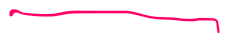
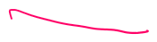

# CRAQ

Created: 2020-06-16 15:41:48 -0600

Modified: 2020-11-29 01:23:13 -0600

---

crack

CRAQ is sort of an optimization to an older scheme called chain replication.

older system chain replication, chain replication is a it's just a scheme for you have multiple copies ,you want to make sure they all seen the same sequence of writes

that there's a chain of servers and chain replication and the first one is called the head last one's called the tail when a write comes in when a client wants to write something say some client,

it sends always get sent to the head the head updates its or replaces its current copy of the data, ~~that the clients writing so you can imagine be go put key value store, so you know if everybody started out with you know version a of the data and under chain replication when the head process is the write and maybe we're writing value B, you know the head just replaces its a with a B~~ and passes the right down,

the chain as each node sees the writes, it replaces over writes, its copy the data the new data when the right gets the tail the tail sends the reply back to the client saying we completed.

that's how writes work , reads if a client wants to do a read it sends the read to the tail the read request of the tail , and the tail just answers out of its current state

any writes that could have been acknowledged to a client, to the writing client or any writes that could have been exposed in a read that'll neither of those will ever happen unless that write reached the tail, in order for it to reach the tail it had to a pass through them in process by every single node in the chain, so we know that if we ever exposed to write, ever acknowledged write ,ever use it to a read, that means every single node in the tail must know about that writes. we don't get these situations like if you'll call

high level failure recovery is relatively simple also if the head fails then to a first approximation the next node can simply take over his head and nothing else needs to get done , while it was the head that failed, if there's a writes that made it to the head before a crash but the head didn't forward ,it well that's definitely not committed nobody knows about it and we definitely didn't send it an acknowledgment to the writing client because the write didn't get down. Here so we're not obliged to do anything about a write it only reached a crashed head before it failed

actually very similar the tale fails the next node can directly take over because

everything the tale knew ,then next the node just before it also knows ,because the tale only hears things from the node.

just before it and it's a little bit complex of an intermediate node fails, but basically what needs to be done is we need to drop it from the chain

and now there may be write that it had received that the next node hasn't received yet and so if we drop a node out of the chain, the predecessor may need to resend recent writes to the to its new successor

compared with raft

reason is that in raft if you recall we you know if we have a leader and a bunch of you know some number of replicas, right with the leader it's not in a chain, we got these the replicas are all directly fed by the leader. so if a client write comes in ~~or a client read~~

~~for that matter~~ ,the the leader has to send it itself to each of the replicas

whereas in chain replication the leader on the head only has to do once and these send on the network are actually reasonably expensive, and so that [means the load on a raft leader is going to be higher than the load on a chain replication leader and]{.mark}

so that means that you know as the number of client requests per second that you're getting from clients goes up, a raft leader will hit a limit and stop being able to get faster sooner than a chain replication head because it's doing more work than the chain replication had another

interesting difference between chain replication and raft is that the writes in raft are all also required to be processed by the leaders, the leader sees every single request from clients where's here, the head sees everybody ,sees all the writes but only a tail sees the read requests so there may be an extent to which the load is sort of split between the head and the tail rather than concentrated in the leader

there's always an external Authority you know this chain that decides ,who's that sort of makes a call on who's alive and who's dead and make sure everybody agrees on a single story about who constitutes the change there's never any disagreement. some people think the change is this node and some people think the chain is this other node, so what's that's usually called as a [configuration manager and its job is just a monitor aliveness and]{.mark}

every time it sees of all the servers, every time the configuration manager thinks the server's dead, it sends out a new configuration in which you know that this chain has a new definition had whatever tail and that's server that

the configuration manager thinks is that may or may not be dead but we don't care because everybody is required to follow your configuration and so there can't be any disagreement

~~how do you make a service that's fault tolerant and doesn't disagree with itself but doesn't suffer from split brain if there's network partitions and the answer to that is that the~~ configuration manager usually uses raft or paxos or in the case of crack zookeeper which itself of course is built on a raft like scheme so

so you to the usual complete set up in your data center is it you have a configuration manager , it based on the raft, paxos, whatever so it's fault tolerant and does not suffer from split brain

this chain replication has a performance problem that if one of these replicas is slow because even for a moment you know because every writes has to go through every replica even a single slow replica slows down all offer all writes operations and I can be very damaging

well it's so raft for example if one of the followers is so it doesn't matter because that [leader only has to wait for a majority it doesn't have to wait for all of them, you]{.mark} know ultimately they all have to catch up but raft is much better resisting transient slowdown and

some Paxos based systems although not really raft are also good at dealing with the possibility that the replicas are in different data centers and maybe far from each other and because you only need a majority you don't have to necessarily wait for acknowledgments from a distant data center ,and so that can also leads people to use paxos raft like majority schemes rather than chain replication

but this is sort of a it

depends very much on your workload and

what you're trying to achieve but this

overall architecture is in I don't know

if it's Universal but it's extremely

common

like intentional topologies okay the for

a for a network that's not broken the

usual assumption is that all the

computers can talk to each other through

the network for networks that are broken

because somebody stepped on a cable or

some routers misconfigured any crazy

thing can happen

so absolutely due to miss configuration

you can get a situation where you know

these two nodes can talk to the

configuration manager and the

configuration managers think sir they're

up but they can't talk to each other so

yes and and that's a killer for this

right because other configuration

manager thinks that are up they can't

talk to each other boy it's just like

it's a disaster and if you need your

system to be resistant to that then you

need to have a more careful

configuration manager you need logic in

the configuration manager that says gosh

I'm only gonna form a chain out of these

services not only I can talk to that but

they can talk to each other and sort of

explicitly check and I don't know if

that's common I mean I'm gonna guess not

but if you were super careful you'd want

to because even though we talked about

network partition that's like a

abstraction and in reality you can get

any combination of who can talk to who

else and some are may be very damaging

okay I'm gonna wrap up and see you next

week

CRAQ preserving linearise ability and preserving the strong consistency

{width="0.3020833333333333in" height="0.6145833333333334in"}{width="0.3645833333333333in" height="0.4583333333333333in"}{width="0.2708333333333333in" height="0.6354166666666666in"}

{width="0.2604166666666667in" height="0.2604166666666667in"}{width="0.3229166666666667in" height="0.46875in"}{width="7.958333333333333in" height="0.4270833333333333in"}{width="4.59375in" height="0.4375in"}{width="2.3854166666666665in" height="0.4375in"}{width="7.739583333333333in" height="0.40625in"}{width="8.1875in" height="0.4166666666666667in"}{width="8.072916666666666in" height="0.4895833333333333in"}{width="1.21875in" height="0.875in"}{width="4.0625in" height="0.3958333333333333in"}{width="1.2604166666666667in" height="0.59375in"}{width="0.71875in" height="0.5104166666666666in"}{width="0.375in" height="0.23958333333333334in"}{width="0.22916666666666666in" height="0.23958333333333334in"}

{width="0.9270833333333334in" height="0.4375in"}{width="0.3958333333333333in" height="0.46875in"}{width="0.53125in" height="0.9270833333333334in"}{width="0.2604166666666667in" height="0.2708333333333333in"}{width="0.46875in" height="0.5625in"}{width="0.6041666666666666in" height="0.4583333333333333in"}{width="0.375in" height="0.4270833333333333in"}{width="0.3854166666666667in" height="0.4479166666666667in"}{width="0.22916666666666666in" height="0.3229166666666667in"}

{width="0.3854166666666667in" height="0.4583333333333333in"}{width="1.34375in" height="0.5625in"}

{width="0.3020833333333333in" height="0.65625in"}

{width="5.614583333333333in" height="0.4583333333333333in"}{width="1.8333333333333333in" height="0.4895833333333333in"}

{width="2.2291666666666665in" height="0.375in"}

{width="0.3958333333333333in" height="0.5208333333333334in"}

{width="7.770833333333333in" height="0.4270833333333333in"}{width="8.416666666666666in" height="0.4791666666666667in"}

{width="7.1875in" height="0.4479166666666667in"}

