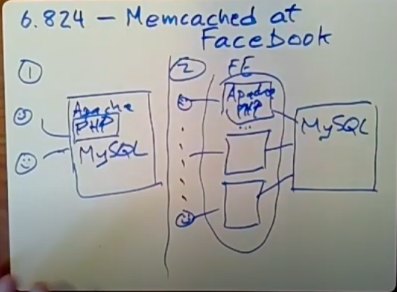
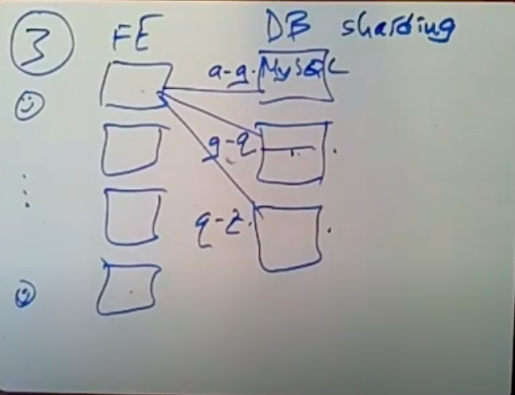
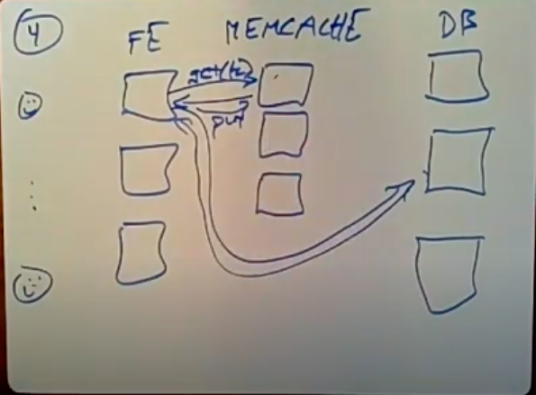
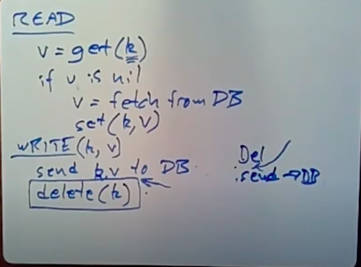
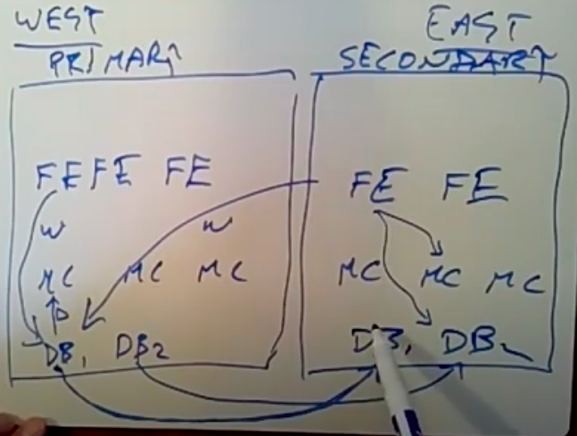
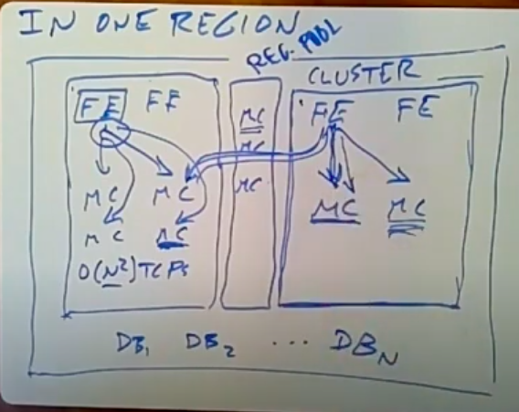
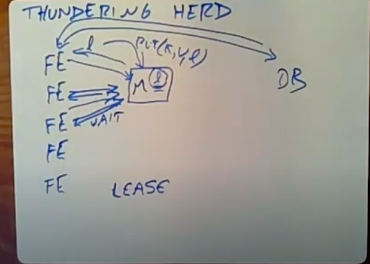
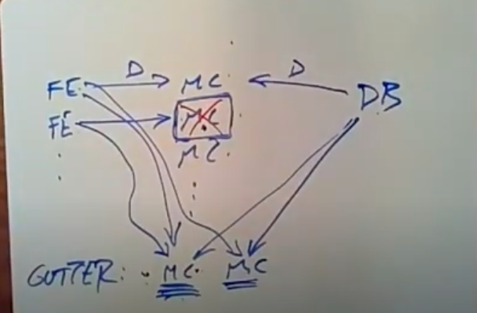

# Cache Consistency: Memcached at Facebook

Created: 2020-07-01 10:30:15 -0600

Modified: 2021-02-09 17:46:48 -0600

---

a typical starting scenario in a ways when a some website is very small is you know there's no point in starting with anything more than just a single machine ,right you know maybe you started you only have a couple users sitting in front of their browsers and you know they talk over the internet here with your single machine, your single machine is gonna maybe run the Apache web server ,maybe you write the scripts that produce web pages using PHP or Python or some other convenient easy to program sort of scripting style language and Facebook uses PHP

you need to store your data somewhere or you can just download sort of standard database and Facebook happen to use my sql, my sql is a good choice because it implements the query language is very powerful

you're with site provides and so at some point almost certainly the first thing that's going to go wrong is that the PHP scripts are gonna take up too much CPU time, that's usually the first bottleneck ,people encounter if they start with a single server so what you need is some way to get more horsepower for your PHP scripts and so that takes us to kind of

architecture number 2 for websites in which you know you have lots and lots of users right or more users than before you need more CPU power for your PHP scripts, so [you run a bunch of front end servers whose only job is to run the web servers that users browsers talk to and these are called front end servers, so these are going to run a patch either]{.mark}

[webserver and the PHP scripts]{.mark} now you know you users are going to talk to different servers at different times

~~maybe your users co-operate each other they message each other, they need to see each other's posts or something, so all these front-end servers are going to need to see the same back-end data and in order to do that you probably can't just stick at least for a while~~

~~you can jus~~t all web service will stick with one database server so you gonna have a single machine already my sql that handles all of the database, all queries and updates reads and writes from the front end servers

from class note:

[FEs are stateless, all sharing (and concurrency control) via DB
stateless -> any FE can serve any request, no harm from FE crash]{.mark}

{width="5.0in" height="3.6805555555555554in"}

~~next and typically what goes wrong next is that the database server since you can always add more CPU more web servers you know what inevitably goes wrong is that after a while the database server runs out of steam,~~ okay so what's the next architecture this is web

architecture 3 and the kind of standard evolution of big websites here we have ,the same if you know now thousands and thousands of users lots and lots of front ends and now we basically we know [we're gonna have to have multiple database servers so now behind the front ends we have a whole rack of database servers, each one of them running my sql]{.mark}

again, but we're going to shard the data we're driven now to sharding the data over the database server ,so you know maybe the first one holds keys you know a through A to G through second one holds keys G through Q and you know whatever

the sharding happens to be and now the front-end you know you have to teach your PHP scripts here to look at the data, they need and try to figure out which database server they're going to talk to it you know in different times for different data they're going to talk to different servers so this is sharding, and of course the reason why this gives you a boost is that now the all the work of reading and writing has split up hopefully evenly split up between these servers, since they hold different data ,now replicas rating word sharding the data and they can execute in parallel and have big parallel capacity to read and write data

it's a little bit painful the PHP code has to know about the sharding ,if you change

the setup of the database servers that you add a new database server or you realize you need to split up the keys differently ,you know now you need a you're gonna have to modify the software running on the front ends or something in order for them to understand about how to cut over to the new sharding , so there's some there's some pain here, there's also if you need transactions and you know many people use them if you

need transactions but the data involved in a single transaction, is on more than one database server, you're probably going to need two-phase commit or some other distributed transaction scheme

it's also a pain and slow all write well you can you can get fairly far with this arrangement, however it's quite expensive my sql or sort of you know fully featured database servers like people, like to use it's not particularly fast , it can probably perform a couple hundred thousand reads per second and far fewer writes and you know web sites tend to be read heavy so it's likely that you're gonna run out of steam for reads before writes that traffic will be that we load on the web servers will be dominated by reads and

so after a while you know you can slice the data more and more thinly over more and more servers but two things go wrong, with that one is that the some sometimes, you're you have specific keys that are hot that are used a lot and "no amount of slicing" really helps there because each key is only on a single server so that ,keeps very popular that servers can be overloaded, no matter how much you partition or shard the data , and the

other problem with adding was adding lots and lots of my sql , database servers for sharding is that it's really an expensive way to go as it turns out and after a point you're gonna you're going to start to think that well instead of spending a lot of money to add another database server running My sql, l I could take the same server run something much faster on it like as it happens memcache D and get a lot more reads per second out of the same Hardware using caching than using databases

{width="5.0in" height="3.8194444444444446in"}

so the next architecture and this is now starting to resemble what [Facebook is using the next architecture still need users we still have a bunch of front end servers, running web servers in PHP and by now maybe a vast number of front end servers we still have our]{.mark}

[database servers]{.mark} because you know we need us a system that will store data safely on disk for us and we'll provide things like transactions for us, and so you know probably want a database for that but in [between we're gonna have a caching layer ,that's this is where]{.mark}

[memcache D comes in and of course]{.mark} ,the idea now is you have a whole bunch of these memcache servers and when a front-end needs to read some data ,the first thing it does is ask one of the memcache servers look do you have the data I need, so it'll send a get()request with some key to one of the memcache servers and the memcache server will check it's got just a table in memory, it's in fact memcache is extremely simple

it just has just as a big hash table on memory it checks with that keys in the hash table ,if it is it sends back the data saying oh yeah here's the value I've cashed for that and if we if the front end hits in this memcache server, great I can then produce the webpage with that data in it,

[if it misses in the webserver though the front-end has to then re- request the data from relevant database server]{.mark} and the database server will say: oh you know here's the here's the data you need and at that point [in order to cash it in for the next front-end that needs it ,the front end we'll send a "put" with the data it fetch the database into that memcache server]{.mark} and because memcacheD runs at least 10 , maybe maybe more than 10 times faster for read than the database ~~for a given amount of hardware~~ ,[they still need to send writes to the database because you want write to an updates to be stored durably on the database as]{.mark} this can still be there ,if there's a crash or something ,but you can send the read to the cache very much more quickly

{width="5.0in" height="3.6875in"}

the question is why wouldn't the memcacheD server actually hit the "put" on behalf of the front-end and cache the response before responding the front-end

that's a great question, you could imagine a caching layer that you would send a get to it and it would if it missed the memcache layer would forward the request to the database and database will respond the memcache, memcache would add the data to its tables

for this is that memcache is like a completely separate piece of software that it doesn't know anything about databases and it's actually not even necessarily used and combined in conjunction with the database ,although it often is ,so we can't bake in knowledge of the database into memcache

(Sort of deeper reason is that the front ends are often not really storing one for one (relationship.. ) database records and memcacheD ,almost always or very frequently what's going on is that the front-end will issue some requests to the database and then process the results somewhat, maybe take a few steps to turning it into HTML or sort of collect together results from multiple rows in the database and cached partially processed information in memcache just to save the next reader from having to do the same processing and for that reason)

[memcacheD it doesn't really does not understand the relationship between what the front-end would like to see cached and how did you write that data from the database]{.mark} ,that knowledge is really only in the PHP code on the front end, so therefore even though we could be architectural a good idea we can't have this integration here sort of direct contact between memcache and the database, although it might make the cache consistency story much more straightforward

next question that is the difference between a lookaside cache and a look through cache, the fact the lookaside business is that the front end looks asides to the cache to see if the data is there and if it's not it makes its own arrangements for getting the data

a look through cache forward request of the database and directly and handle the response

[now part of the reason for the popularity in memcache is that it is it is a lookaside cash]{.mark} that is completely neutral about whether there's a database or what's in the database or the relationship between stuff in memcache and what's in the end items in the database

[the data store in the cache would get out of sync with the data in the database.]{.mark}

when you modify something in the database, you need also do sth in the memcache

you know take care of the fact that memcache may then be storing stale data, that doesn't reflect the updates

~~if one of your memcache servers were to fail and meaning that the front ends would now have to contact the database because they didn't hit they couldn't use this to store data you're gonna be increasing a load in the databases dramatically write because memcache do you know supposing it has a you know hit rate of 99 percent or whatever it happens to be you know memcache is gonna be absorbing almost all the reads the database backends only going to be seeing a few percent of the total reads ,so any failure here is gonna increase that few percent of the reads~~

[a super important aspect of that is that fresh data is not absolutely necessary in that]{.mark}

[circumstance]{.mark} you know suppose the reads are you know due to caching supposed to

reads yield data that's a few seconds out of date, so you're showing your users

data not the very latest data but the data from a few seconds ago you know what the users are extremely unlikely to notice except in special cases right, if I'm looking at a news feed of today's you know today's news you know if I see the news from a few times ago versus the news from now ,it not a big deal, nobody's gonna notice nobody's gonna complain.

you know that's not always true for all data but for a lot a lot of the data that they have to deal with sort of super up-to-date consistency, in the sense of like linearise ability is not actually important, what is important is that you don't cache stale data ,indefinitely you know what they can't do is by mistake have some data that they're showing users that's from yesterday or last week or even an hour ago ,those users really will start to notice, that so [they don't care about consistency like second-by-second, but they care a lot about not being in cannot show stale data from more than well, more than a little while ago]{.mark}

the other situation in which they need to provide consistency is if a user updates their own data or if a user updates almost any data and then reads that same data that the human knows that they just updated, it's extremely confusing for the user to see stale data if they know they just changed it and so in that specific case, the Facebook design is also careful to make sure that [if a user changes data that that user will see the change data]{.mark}

Facebook has multiple data centers which they call regions and ~~I think at the time this paper was written~~ they had two regions, their sort of primary region was on the west coast California and their sort of secondary region was in the East Coast and the two data centers look pretty similar: you set of database servers running my sql ,the sharding date over these my sql database servers, they had a bunch of memcache D servers which we'll see they are actually arranged in independent clusters and then they had a bunch of front ends, again sort of a separate arrangement in each data center and

there's a couple reasons for this one is that their customers were scattered all over the country and it's nice just for a performance that people on the East Coast can talk to a nearby data center and people on the west coast can also talk to a nearby ,deficit it just makes internet delays less ,now the data centers were ~~not~~ symmetric(each data center's DBs contain full replica ) ,each of them held a complete copy of all the data, they didn't sort of shard the data across the data centers so the West Coast I think was a primary and it sort of had the real copy of the data and the

[East Coast was a secondary and what that really means is that all writes had to be sent to the relevant database and the primary date center,]{.mark} so you know any writes gets sent here and they use a feature of my sql, [they use asynchronous log replication scheme, ~~t~~]{.mark}~~o have~~ each database in the primary region send every update to the corresponding database in secondary region so that with a lag of maybe even a few seconds, these database servers would have identical content ,the secondary database servers would have identical content to the primaries reads though we're local

so these front ends when they need to find some data I'm in general would talk to memcache in that data center, and if they missed in memcache they talked to the they'd read from the database in that same data center, again though the databases are complete replicas all the data's on both of these these in both of these regions,

{width="5.0in" height="3.8333333333333335in"}

[how to use lookside cache]{.mark}

[read]{.mark}

which is executing on a front-end ,the first thing if you read any data that might be cached ,the first thing that code in the front-end does is makes this get() library call with the key of the data they want, and get just generates an RPC to the relevant memcache server ,so they hash this library routine hashes on the client hashes the key to pick the memcache server and sends an RPC to that memcached server, they casually reply yes

here's your data or or maybe it'll point no, saying I don't have that data it's not cached, so if replay is no, then [the front-end will issue whatever my sql query is required to fetch the data from the database]{.mark} and then make another RPC call - set(k,v) the relevant memcache server to install the fetch data in the memcache server so

[the writing]{.mark} is we have a key and a value and library routine on an each front end we're gonna send the new data to the database and you know I as I mentioned before the Key and value may be a little bit different, you know what's stored in the database is often in a somewhat different from what's stored in memcached, [once the database has the new data then the write library routine sends an RPC to memcache telling: it look you got to delete this key ,so I want to write invalidating the key in memcache]{.mark} ,what that means is that the next front-end that tries to read that key from memcache D is gonna get no back because, it's no longer cached and will fetch the updated value from the database and install it into memcache,

all right so this is an invalidation, in particular it's not you could imagine a scheme that

would send the new data to memcacheD, at this point but it doesn't actually do that instead of delete it, and actually in the context of facebook scheme the real reason why this delete is needed is so that we'll see their own writes because in fact in their scheme the database servers also send deletes, send the relevant deletes to the memcache servers that that might hold this key so the database servers will actually in stuff invalid memcache by-and-bye may take them a while, because that might take a while, [the front ends also delete the key, said that a front end won't see a stale value for data that it just updated]{.mark}

{width="5.0in" height="3.701388888888889in"}

[question]{.mark} this means that the replicated updates from the primary my sql database to the secondary must also issue deletes -

observation is that yes indeed, when a front-end sends a write to the database server ,database server updates its data on disk, and [database service will send an in a delete to whatever memcachD server]{.mark}, there is in the local region the local data center that

might have had the key that was just updated ,the database server also sends a

sort of representation of the [update to the corresponding database serve in the other region which process it applies the write to its disk data on disk]{.mark} ,it

also using them sort of log reading apparatus figures out which memcache server might hold the [key that was just updated and sends it delete]{.mark} also to that memcache server so that the ,if it's the key is cache is invalidated in in both data centers

{width="5.0in" height="3.7708333333333335in"}

[question]{.mark} what would happen if we delete first in the right and then send to the

database?

so that's or with reference to this thing here would what if we did to the delete first, you know if you do delete first then you're increasing the chances that some other clients so supposing you delete and then send to database ,if another client reads that same key they're gonna miss at this point,they're gonna fetch the old data from the database and they're gonna then insert it cache and then you're going to update it, leaving memcache for a while at least with stale data and then if this the writing client reads it again it may see the stale data even though it just updated it ,doing the delete second

send kv to db

delete k

you know these over the possibility that somebody will read during this period of

time and see steal data but they're not worried about stale data in general, they're really most worried in this context about clients reading their own writes so on balance even though there's a consistency problem by the way I'm doing the delete second ensures that

clients will be their own writes

[question]{.mark} is it's really we didn't do delete at all would just tell the database but not explicitly delete the data from memcache

the problem with this is that if the client sent this write to the database and then immediately read the same data ,that read would come out of the memcache and because memcache still has the old data, you know memcache hasn't seen this write yet.

a client that updated some data and then read it, you know updates it in the database but it reads the data if the stale data from memcache and then a client might update some data but still see the old data and if you delete it from memcache then if a client do this delete then a client writes some data and deletes it from memcache and then reads it again it'll miss in memcache because of the delete and they have to go to the database and read the data and the database will give it fresh data

[question]{.mark} is how come why do we delete here gosh ,why don't we just instead of this delete have the client just directly, since it knows the new data just send a set() RPC - memcache D

and so here we're doing I have an invalidate scheme this would often be called an update scheme and let me try to cook up an example that shows that.

now we have two clients reading and writing the same key.

let me say client 1 going to increment X from zero to one so set X to one and then

supposing meanwhile client 2 also wants to increment X to 2 , so it's going to read this latest value in the database and update the value in database to 2 and set the value of x in memcachedD to 2

we will left the value 1 in the memcachedD even the correct value in the database is 2

{width="5.0in" height="2.6944444444444446in"}

[performance of partition vs replica]{.mark}

okay so I was going to about [performance]{.mark} they this sort of route of how they get performance is through parallel parallelization,

there's really two ways that you can get a good performance

one is by partition, which is [sharding]{.mark} ,that is you take your data and you split, it up over you know into ten pieces over ten servers and those ten servers can run independently hopefully [(partition)]{.mark}

the other way you can use extra hardware to get higher performance is [replication]{.mark}

at is have more than one copy of the data and you kind of for a given amount of hardware,

you can kind of choose whether to partition your data or replicate it in order to use that

hardware

there's you know from memcache see what we're talking there [is splitting the data over the available memcache servers by hashing the key]{.mark} ,so that every key sort of lives on one memcache server and from memcache, what we would be talking about here is having [each front-end just talk to a single memcache server]{.mark} and send all its requests there so that each memcache server only a subset of the front ends and sort of serves all their needs

Facebook actually uses a combination of both partition and replication, [for partition the things that are in its favor one is that it's memory efficient,]{.mark} because you only store a single copy of each item ,where's in replication you're gonna store every piece of data, maybe on every server. [on the down side of partition is that it's as long as your keys are sort of roughly equally popular, it will work pretty well, but if there's some hot a few hot keys partition doesn't really help you much, once you get those partition enough that those]{.mark}

hot keys are on different servers ,you know once the if there's a single hot key for example, no amount of partitioning helps you, because no matter of how much you partition that hot key, is still sitting on just one server

the problem partition is that it ~~doesn't~~ mean that the front if front ends need to use lots of data lots of different keys ,it means in the end each front-end is probably going to talk to lots of partitions and at least if you use protocols like TCP that keep state ,there's significant overhead to as you add more and more sort of N squared communication

for a replication ,it's fantastic if your problem is that [a few keys are popular because now you know you're making replicas of those hotkeys and you can serve each replica the same key in parallel ,i]{.mark}t's good because there's fewer this there's not n squared communication, each front-end maybe only talks to one memcache server, but the [bad thing is it's there's a copy of data in every server you can cache far fewer distinct data items with replication then with partition]{.mark} , so there's less total data can be stored in the cache

these are just generic for pros and cons of these two main ways of using extra hardware to get higher performance

[Facebook choose replica in the region]{.mark}

~~the highest level at which they're playing this game is between regions and,~~ so it at this high level, [each region has a complete replica of all the data]{.mark} ~~right~~, [they have a each region as a complete set of database servers ,]{.mark}each database corresponding database servers for the same data and assuming users are looking at more or less the same stuff

that means the memcache servers in the different regions are also storing more or less basically replicating where we have yours replicating in both the database servers and the memcache servers

facebook has one complete in the west coast and another complete copy in the east coast

if we have partitioned the data between the two regions then a front-end want to create a page and look at my friends and some of my friends are on the East Coast and some on the west coast that means if we partitioned that would might require the front ends to actually make many requests you know 50 milliseconds each to the other data center and users would users would see this kind of latency and be very upset

so the another reason to replicate is to keep the front ends always close to the data to all the data they need of course this makes writes more expensive ,because now

if a front-end and the secondary region needs to write in east, send the data all the way across the internet, the reads are far far more frequent than write, so it's a good trade-off

it it's possible that another reason for [complete replication between the two sites]{.mark} is so that if the primary site goes down perhaps they could switch the whole operation to the secondary site

[within a data center within a region]{.mark} so in each region, there's a single set of database servers, so [at the database level the data is sharding and not replicated inside each region, however at the memcache level they actually use replication as well as sharding,]{.mark} so they had this notion of clusters ,so a given regions actually supports multiple clusters of front-ends and database servers

(multiple mc clusters *within* each region
cluster == complete set of mc cache servers
i.e. a replica, at least of cached data)

so here [I'm going to have two clusters in this region]{.mark}, this cluster has a bunch of front ends and a bunch of memcache servers and these are completely independent almost completely independent, so that a front-end and cluster ,one sends all its

reads to the local memcache servers in the cluster and misses it needs to go to the one instead of database servers ,and similarly each front-end in this cluster talks only to memcache servers in the same cluster

so [why do they have this multiple clusters]{.mark} ,why not just have you know essentially a single cluster a single set of front end servers and a ingle set of memcache server is shared by all those front ends, one is that if you did that and that would mean you know if you need to scale up capacity you sort of be adding more and more memcache servers in front ends to the same cluster ,you don't get any win there ~~for~~ in performance for popular Keys, you know so there the data sort of this memcache service is used by a small number of users ,but there's some stuff there that lots and lots of users need to look at and by [using replication as well as sharding they get you know multiple copies of the very popular keys]{.mark}, and therefore they get sort of parallel serving of those keys between the different clusters

(adding mc servers to cluster doesn't help single popular keys
replicating (one copy per cluster) does help)

another reason to not want to increase the size of the cluster individual cluster too much is that all the data within a cluster is spread over partitioned, over all the memcache servers and any one front end is typically actually going to need data from probably every single memcache server eventually and so this means you have a sort of n-squared communication pattern between the front ends and the memcache servers ,and to the

extent that they're using TCP for the communication that involves a lot of overhead, a lot of sort of connection state for all the different TCP, so they wanted to limit so you know this is N squared TCP's they want to limit the growth of this and the way to do that is to make sure that no one cluster gets to be too big so this N squared doesn't get too large

and well related to that is this in caste congestion business they're talking about the if a front end needs data from lots of memcache servers , it's actually it's gonna send out the requests more or less all at the same time and that means this front-end is gonna get the responses from all the memcache servers to query, it more or less the same side time and that may mean dozens or hundreds of packets arriving here all at the same time which

if you're not careful we'll cause packet losses that's in-cast congestion and in order to limit how bad that was that you had a bunch of techniques they talked about ,but one of them was not making the clusters too large ,so that the number of memcache has given front-end tend to talk to and they might be contributing to the same caste never got to be too large

a final reason the paper mentions is that it's or behind this is a big network in the data center and it's hard to build networks that are both fast like many bits per second and

can talk to lots and lots of different computers ~~and ,by splitting the data center up into these clusters and having most of the communication go on just within each cluster that means they need a smaller, they need you know a modest size fast Network for this cluster and a modest size you know reasonably fast network for this cluster ,but they don't~~

~~have to build a single network that can sort of handle all of the traffic between among all the computers of the giant cluster, so it limits how expensive underlying network is on the other hand~~

~~of course they're replicating the data and the two clusters and for items that aren't very popular and aren't really going to benefit from the performance win of having multiple copies ,this it's wasteful to sit on all this RAM and you know we're talking about hundreds or thousands of servers so the amount of money they spent on RAM for the memcache~~

~~services is no joke,~~ so in addition to the pool of memcache servers inside each cluster, [there's also this regional pool of memcache servers that's shared by all the clusters]{.mark} in a region and into this regional pool, they then modify the software on the front end so that the software on the front end knows this key the data for this skis actually not use that often [instead of storing it on a memcache server my own cluster, I'm going to store this not very popular key in the appropriate memcache server of the regional pool,]{.mark} so this is

the regional pool and this is just sort of an admission that some data is not popular enough to want to have lots of replicas of it they can save money by only cashing a single copy

[when they want to create a new cluster]{.mark} in a data center they actually have a sort of temporary performance problem as they're getting that cluster going so you know supposing they decide to install you know couple hundred machines to be a new cluster

with the front end , new memcache errors and then they fire it up and you know maybe cause half the users to start using the new cluster, in the beginning there's nothing in these memcache servers and all the front end servers are gonna miss on the memcache

servers and have to go to the databases and increase the load on the database servers

instead they have this cold start idea, in which a new cluster is sort of marked

by cold start state and in that situation when a front end and the new cluster

misses that actually first ,it has its own local memcache, if that says no I don't have the data then the front end, we'll ask the corresponding memcache in another cluster, [in some warm cluster that already has the data for the data, if it's popular data chances are it'll]{.mark}

be cached ,my friend and will get its data and then it will install it in the local memcache and it's only if both local memcache and the warm memcache don't have the data that this is front end and the new cluster will read from the database servers ,and so this is it and so they run in this kind of cold mode for a little while the paper I think mentions a couple hours until the memcache servers source and the new clusters start to have all the popular

data and then they can turn off this cold feature and just use the local cluster memcache alone

{width="5.0in" height="3.9722222222222223in"}

it's alright so another load problem is kind of look aside caching strategies is called the [thundering herd]{.mark}

the scenario, is that supposing we have some piece of data ,there's lots memcache servers ,but there's some piece of data stored on this memcache server, there's a whole bunch of front ends that are ordinarily reading that one piece of very popular data,so they're all sending constantly sending get requests for that data the memcache server has it in the cache it answers them and you know their memcache server is conserve like millions to million requests per second ,so we're doing pretty good and of course there's some database server sitting back here that has the real copy of that data but we're not bothering it, because it is cached well suppose

some front-end comes along and modifies this very popular data, so it's going to send a write to the database with the new data and then it's gonna send a delete to the memcache server because that's the way rights work so now we've just deleted this extremely popular data we have all these front ends constantly sending gets for

that data ,they're all gonna miss all at the same time, they're all gonna now having missed send a read request to the front end database all at the same time, and so now this front-end database is faced with maybe dozens or hundreds of simultaneous requests for this data so the loads here is gonna be pretty high, and it's particularly disappointing

because we know that all these requests are for the same key ,so the database is

going to do the same work over and over again to respond with the latest written copy of that key until finally the front ends get around to install the new key in memcache and then people start hitting again and so this is the Thundering hurt

what we'd really like is a single request if there's a write and the leads and a miss happens in memcache, [we'd like is the for the first front end that misses to fetch the data and install it and for the other front ends just like take a deep breath then wait until the new data is cached]{.mark} and that's just what their design, this thing called [lease]{.mark} so now suppose we have a popular piece of data the first front end that asks for a data that's missing memcacheD, will send back an error saying oh no I [don't have the data in my cache but it will install lease]{.mark} which is a bit unique number it'll pick a least number install it in a table and the send this lease, token back to the front end and then other front ends that come in and ask for the same key, [they'll simply get a just be asked to wait you know a quarter of a second or whatever some reasonable amount of time by the memcache D ,]{.mark}because

the memcache key will see a haha [I've already issued the lease for that key, now there's at least potentially a server will notice it's already issued at least for the can tell these ones to wait,]{.mark} [so only one of the server's get lease, this server then asks for the data from the database ,then it sends the put for the new data with a key and the value]{.mark}

the lease proved that it was the one who was allowed to write the data, memcached looking for this lease and say aha yeah you are the person whose lease was granted and it'll actually do the install and other front ends who are told the wait will reissue their reads now that it will be there and so we all if all goes well get just one request to the database instead of dozens or hundreds

if the front-end fails who has the lease at an awkward moment and doesn't actually request the data from the database or doesn't get around it installing it in memcache D ,eventually memcache D will delete the lease cause it times out and the next front end to ask will get a new lease and will hope that it will talk to the database and install new data

{width="5.0in" height="3.5625in"}

another problem they have is that [if one of these memcache servers fails]{.mark} , the most natural you-know-whats if they don't do anything special, if the memcache server fails the front ends will send a request ,they'll get back a timeout then it requests the database so if a memcache server fails and we don't do anything special the database is now going to be

exposed directly to the reads all of these reads, and the memcache server may well have been serving you know a million reads per second that may mean that the database server would be then exposed to those million reads per second, then it's nowhere near fast enough to deal with all those reads

now Facebook they don't really talk about in the paper but they do have automated machinery to replace a failed memcache server but that takes a while to sort of

set up a new server a new memcache server and redirect all the front-end to the new server instead of the old server ,so in the meantime [they need a sort of temporary solution and that's this gutter idea, so let's say the scoop is that we have our front ends we have the sort of ordinary set of memcache servers,]{.mark} the database the one of the memcache service has failed we're kind of waiting until the automatic memcache server replacement system replaces this memcache server, in the meantime, fronts-end are sending requests to it they get a sort of server did not respond error from the network and then there's a presumably small set of gutter servers ~~whose only purpose in life is to eye~~ they must be idle except when a real memcache server fails and when the front end gets an error back [saying that get couldn't contact the memcache server, it'll send the same request to one of the gutter servers]{.mark} ,the front end will again hash the key in order to choose which gutter server to talk to and if the gutter server has the value that's great, otherwise the front end server will contact the database server to read the value and then install it in the

memcache server ,in case somebody else answer asks for the same data

so while this means down the gutter servers will handle basically handle its request and so they'll be a miss you know handled by lease, leases the Thundering Herd

they'll be at lease , I need a miss on each of the items that was a no-fail memcache server so there will be some load in the database server but then hopefully quickly, this memcache server will I get all the data that's at least use and provide good service and then by and by this will be replaced and then the front-end will know to talk to a different replacement server and because they don't

[all front-ends and datbase also will sent the delete message to gutter service.]{.mark}

these gutter servers aren't doing anything and don't cache anything and it doesn't matter and so in order to avoid all these extra deletes ,they actually fix the gutter servers so that they delete Keys very rapidly instead of hanging on to them until they're explicitly deleted

{width="5.0in" height="3.2847222222222223in"}

here's another example of a race an

update race that if they hadn't done

something about it would have left data

indefinitely

stale data and definitely in memcache

it's going to be a similar flavor to the

previous example so supposing we have

client one he wants to read a key but

memcache says it doesn't have the data

it's a Miss so C one's gonna read the

data from from the database and let's

say it gets back some value that you

want

meanwhile client to wants to update this

data so it sends you know its rates he

equals v2 and sends that to the database

and then you know the rule for writes

the code for writes that we saw is that

the next thing we do is delete it from

the database from memcache d.c c2 is

going to delete

ah the key from the database oh that's a

Friday you know it was actually c2

doesn't really know what's in memcache d

but the leading was ever there is always

safe because certainly not gonna cause a

stale data to be deleting won't cause

her to be stilled Leena um and this is

the sense that the paper claims that

delete is idempotent said delete it's

always safe to kabhi but if you recall

the pseudocode for what a read does if

you miss and you read the data from the

database you're supposed to just insert

that data into memcache so client 1 you

know may have been slow and finally gets

around to sending a set RPC two memcache

T but it read version 1 and read a you

know what is now an old outdated version

of the data from the database but it's

going to set that into

set this into memcache and yeah you know

one other thing that happened is that we

know the database is is whenever you

write something I'm database that sends

deletes to memcache D so of course maybe

at this point the database will also

have sent a delete

for k2m caste and so now we get to

deletes but it doesn't really matter

right these lease may already have

happened by the time client one gets

around to updating this key and so at

this point indefinitely the memcache D

will be cashing a stale version of of

this data and there's just no mechanism

anymore or this is them if the system

worked in just this way there's no

mechanism for the memcache D to ever see

to ever get the actual correct value

it's gonna store and serve up stale data

for key K forever

and they because they ran into this and

while they're okay with data being

somewhat out-of-date they're not okay

with data being out of date forever

because users will eventually notice

[Problem Race1]{.mark}

that they're seeing ancient data and so they had to solve this they had to make

sure that this scenario didn't happen they actually solved this this problem also with the lease mechanism, at the same lease mechanism that we describe for the Thundering herd although there's an extension to the lease

mechanism that makes this work so what happens is that when memcache descends back a "miss indication" ,seeing the data wasn't in the cache, it's gonna grant the

lease so we get the Miss indication plus this lease, which is basically just a big unique number and the memcache server is gonna remember that the association between this lease and this key, it knows that somebody out there with a lease to update this key, the new rule is that when the memcache server gets a delete from either another client or

from the database server, the memcache server is gonna as well as deleting the

item is going to invalidate this lease, so as soon as these deletes come

in, assuming that lease arrived first ,the memcache server is gonna delete this lease from its table about leases ,

this set() is carring the lease back from the front end ,now when the set arrives the memcache server will look at the lease and say wait a minute. you don't have a lease for this key, invalid this lease for this key, I'm gonna ignore this set() so because one of these deletes came in before the set , this sees to be invalid, invalidated and the memcache server would ignore this set() and that would mean that the key would just stay missing from memcache and the next client that tried to read that key you'll get a Miss would read the fresh data now from the database, and would install it in memcache and presumably the second time around, the second readers lease would be valid

from node:

Race 1:
k not in cache
C1 get(k), misses
C1 v1 = read k from DB
C2 writes k = v2 in DB
C2 delete(k)
C1 set(k, v1)
now mc has stale data, delete(k) has already happened
will stay stale indefinitely, until k is next written
solved with leases -- C1 gets a lease from mc, C2's delete() invalidates lease,
so mc ignores C1's set
key still missing, so next reader will refresh it from DB

Race 2:
during cold cluster warm-up
remember: on miss, clients try get() in warm cluster, copy to cold cluster
k starts with value v1
C1 updates k to v2 in DB
C1 delete(k) -- in cold cluster
C2 get(k), miss -- in cold cluster
C2 v1 = get(k) from warm cluster, hits
C2 set(k, v1) into cold cluster
now mc has stale v1, but delete() has already happened
will stay stale indefinitely, until key is next written
solved with two-second hold-off, just used on cold clusters
after C1 delete(), cold mc ignores set()s for two seconds
by then, delete() will (probably) propagate via DB to warm cluster

Race 3:
k starts with value v1
C1 is in a secondary region
C1 updates k=v2 in primary DB
C1 delete(k) -- local region
C1 get(k), miss
C1 read local DB -- sees v1, not v2!
later, v2 arrives from primary DB
solved by "remote mark"
C1 delete() marks key "remote"
get() miss yields "remote"
tells C1 to read from *primary* region
"remote" cleared when new data arrives from primary region

um you may and indeed you should ask

what happened that the order is

different so supposing these deletes

instead of happening before the set

these deletes were instead to have

happen after the set I want to make sure

this scheme still works then and so how

things would play out then is that since

if these Dilys were late happened after

the set the memcache server wouldn't

delete these from its table of visas

Solis would still be there when the set

came and yes indeed we would still then

it would accept the setting we would be

setting key to a stale value but our

assumption was this time that the

deletes had been late and that means the

Dilys are yet to arrive and when they

when these deletes arrive then this stay

on theta will be knocked out of the

cache and so the stale date will be in

the cache a little bit longer but we

won't have this situation where stale

data is sitting in the cache

indefinitely and never deleted

any questions

lissa machinery okay um to wrap up you

it's certainly fair to view this system

a lot of the complexity of the system as

stemming from the fact that it was sort

of put together out of pieces that

didn't know about each other like it

would be nice for example memcached he

knew about the database I'm understand

memcache D and the database kind of

cooperated in a consistency scheme and

perhaps if Facebook could have at the

very beginning you know predicted the

how things would play out on what the

problems would be and if they have had

enough engineers to work on it they

could have from the beginning built a

system that could provide both all the

things they needed high-performance

multi data center replication partition

and everything and they're having

companies that have done that so the

example I know of that sort of most

directly comparable to the system in

this paper is that if you care about

this stuff you might want to look at it

is Yahoo's peanuts storage system which

in a sort of designed from scratch and

you know different different in many

details but it does provide multi-site

replication with consistency and good

performance so it's possible to do

better but you know all the issues are

present that's just had a more

integrated perhaps elegant set of

solutions

the takeaway so for us from this paper

one is that for them at least and for

many big operations caching is vital

absolutely vital for to survive high

load and the caching is not so much

about reducing latency it's much more

about hiding enormous load from

relatively slow

storage servers that's what a cache is

really doing for Facebook is hiding sort

of concealing almost all the load from

the database servers another takeaway is

that you always in big systems you

always need to be thinking about caching

versus control versus sorry partition

versus replication I mean you need ways

of either formally or informally sort of

deciding how much your resources are

going to be devoted to partitioning and

how much to replication and finally

ideally you'd be able to do a better job

in this paper about from the beginning

integrating the different storage layers

in order to achieve good consistency

okay that is all I have to say please

ask me questions if you have

