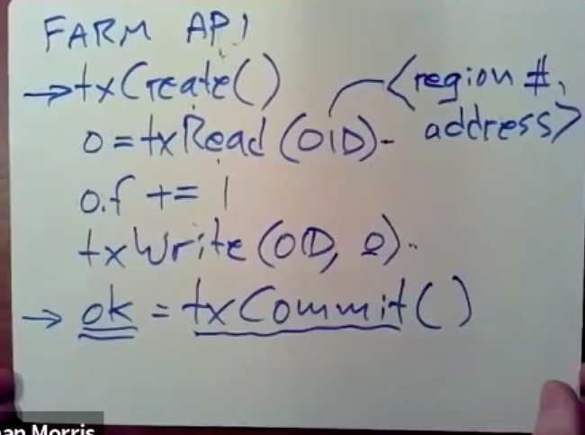

# Lecture 14 Optimistic Concurrency Control

Created: 2020-06-28 22:55:44 -0600

Modified: 2020-09-29 17:23:42 -0600

---

it's really still an exploratory system, it assumes that all replicas are in the same data center.

spanner and farm target different bottlenecks and span are the main bottleneck the people worried about is the speed of write, and network speed of write delays and network leaves between data centers, whereas in farm the main bottlenecks that the design is worried about is is CPU time on the server's because they kind of wished away the speed of write and network delays by putting all the replicas in the same data center

farm is that you have it's all running in one datacenter ,there's a sort of [configuration manager]{.mark} this which we've seen before and the configuration managers in charge of deciding which servers should be the primary in the backup before each shard of data and they use zookeeper in order to help them implement this configuration manager

the data is sharded split up by key across a bunch of primary backup payers, so I mean one shard goes on you know primary ,one server primary one backup, one another shard, one primary to backup, two and so forth and that means that anytime you update data you need to update it both on the primary and on the backup , these replicas are not maintained by paxos , or anything like it instead all the replicas of the data are updated whenever there's a change and if you read you always have to read from the primary

the reason for this replication of course is fault tolerance and the kind of fault tolerance they get is that as long as one replicas of a given shard is available, then that shard will be

available, so they only require one living replica not a majority and ~~the system as a whole if there's say a data center power failure,~~ it can recover as long as there's at least one replicas of every shard in the system

I'll mostly think of them as as being a separate set of clients and the clients are running transactions and the transactions need to read and write data objects that are stored in the in the sharded servers, in addition each client not only runs the transactions but also acts as that transaction coordinator for two-phase commit

[store in the RAM]{.mark}

okay so first I'll talk about non-volatile Ram said all the data and for farm is stored in RAM when you update it when a client transaction updates a piece of data what that really means is it reaches out to the relevant servers that store the data and causes those servers to modify the whatever object ,is the transaction is modifying to object modify it, write in RAM and that's as far as the writes get they don't go to disk

this is you know contrast to your raft implementations for example which spent a lot of time persisting data to disk, there's no persisting and in farm this is a big win, writing stuff in RAM write a write to ram , which is pretty fast that modify things but of course RAM loses its content when the power failure so it's not persistent by itself

as a side, you might think that writing modifications to the RAM of multiple servers that if you have replica servers and you update all the replicas that that might be persistent enough and so after all, if you have F +1 replicas you can tolerate up to F failures and

the reason why just simply writing to Ram on multiple servers is not good enough is that a site-wide power failure will destroy all of your servers and thus violating the assumption that the failures are in different servers are independent ,so we need a scheme that it's gonna work even if power fails to the entire data center

so what what Farm does is it it puts a battery, a big battery in every rack and runs the power supply system through the batteries, so the batteries automatically take over if there's a power failure and keep all their machines running at least until the battery fails, but of course you know the battery is not very big ,it may only be able to run their their

machines for say 10 minutes or something, so the battery by itself is not enough

to make this the system be able to withstand a lengthy power failure. so instead the battery system when it sees that the main power is failed the battery system while it keeps the server's running also alerts the server's all the servers and with some kind of interrupt or message ,telling them look the powers just failed you know you only got 10 minutes left before the batteries fail also so at that point the software on farms servers stops all processing it for farm first ,and then copies all of its RAM to a solid-state drive, attached to that server ,I'm what wished could take a couple minutes and once all the RAM is copied to the solid-state drive then the machine shuts itself down and turns itself off.

when the power comes back up in the datacenter all the machines will when they reboot will read the memory image that was saved on disk restored into RAM ,and but there's some recovery that has to go on but basically they won't have lost any of their persistent state due to the power failure

there's some other reason causing the server to fail, like something goes wrong with the hardware or there's a bug in the software that causes a crash those crashes ,the non-volatile Ram system is just nothing to do with those crashes, those crashes will cause the machine to reboot and lose the contents of its RAM and it won't be able to recover them so this NVRAM scheme is good for power failures, but not other crashes and so that's why

in addition to the NVRAM farm also has multiple copies, multiple replicas of each shard

( if the datacenter power fails and farm lose everything for solid-state drive would it be possible to carry all the data to a different data center and continue operation? There in principle absolutely, in practice I think would be would all certainly be easier to restore power to the data center then to move the drives ,the problem is there's no power and the

power in the old data center, so you'd have to physically move the drives and the computers maybe just the drives to the new data center, so this was if you wanted to do this it might be possible but it's certainly not it's not what the farm designers had in mind they assumed the power be restored)

(bottlenecks have to do with the CPU and the network in fact in farman, and indeed

a lot of the systems that i've been involved with the a huge bottleneck has

been the cpu time required to deal with network interactions, so now we're can

CPU are kind of joint bottlenecks here farm, doesn't have any kind of speed of

light network problems it just has the

problems or it just spends a lot of time

eliminating bottlenecks having to do is

getting network data into and out of the

computers

)

so first as a background I

(

want to lay out what the conventional architecture is for getting things like remote procedure call packets between applications and on different computers,

one computer that maybe wants to send a procedure call message you might have an application (app) and then the application is running in user space,

there's a user kernel boundary, here the application makes system calls into the

kernel which are not particularly cheap ,in order to send data and then there's a

whole stack of software inside the kernel involved is sending data over the network, there might be ,what's usually called a socket layer that does buffering which involves copying the data which takes time, there's typically a complex TCP, the protocol stack that knows all about things like retransmitting and sequence numbers and check sums and flow control,there's quite a bit of processing there at the bottom, there's a piece of hardware called the network interface card which is has a bunch of registers that the kernel can talk to ,configure it and it has hardware required to send bits out over the cable onto the network

so there's some sort of network interface card driver in the kernel and then all self respecting that we're gonna use direct memory access to move packets into and out of

host memory, so there's going to be things like queues of packets that the network interfaces card has made into memory the waiting for the kernel to read and outgoing queue the packets that the kernel would like ,then that we're going to face to card to send as soon as convenient

all right so you want to send a message like an RPC request, let's go down from the application through the stack network interface card sends the bits out on a cable and then there's the reverse stack on the other side, there is a network interface Hardware here ,in the kernel ,then network interface card (NIC) might interrupt the kernel, kernel runs driver code which hands packets to the TCP protocol which writes them into buffers,

waiting for the application to read them.

---

the application directly interacts with NIC and the application can see the bytes arriving directly without kernel intervention and when the application needs to send data the application can create queues that the network interface card can directly read with DMA and send out over the wire, so now we've completely eliminated all the kernel code involved in networking kernels, just not involved there's no system calls there's no interrupts. the application just directly reads network memory that the network interface

card sees and of course the same thing on the other side

idea step two is we have the applications and application access memory and now though the application can essentially send a special message through the net work interface card that asks, so we have a an application on the source host and maybe we would call this the destination host ,can send a special message through the our DMA system that tells this network interface card to directly read or write a byte, some bytes of memory, probably a cache line of memory, in the target applications address space directly ,so hardware and software on the network interface controller are doing a read and write read or write of the application target applications memory directly

the destination host then sending the result back to really two other incoming queue on the source application and the cool thing about this is that this computer's the CPU this application didn't know anything about the read or write, the read or write is executed completely in firmware in the network interface card

the application didn't have to think about the request or think about replying network interface card ,just reads or writes a memory and sends a result back to the source application and this is much much lower overhead way of getting at ,of all you need to do is read or write memory and stuff in the RAM of the target application,this is a much faster way of doing a simple read or write than sending in our PC call even with magic kernel bypass networking

this stuff only works over a local network I don't believe our DMA would be satisfactory like between distant data centers

so there's all tuned up for very

low speed of light access okay a

particular piece of jargon that the

paper uses is one-sided our DMA and

that's basically what I've just

mentioned when application uses our DMA

to read or write the memory of another

that's one site our DMA now in fact farm

uses our DMA to send messages in an RPC

like protocol so in fact sometimes farm

directly reads with one sided our DMA

but sometimes what farm is using our DMA

for is to append a message to an

incoming message queue inside the target

so sometimes what the what the

well actually always with writes what

farm is actually doing is using our DMA

to write to append a new message to an

incoming queue in the target which the

target will pull since there's nobody

interrupts here the way target

the way the destination of a message

like this knows I got the messages that

periodically checks one of these keys

queues and memory to see how have I

gotten a recent message from anyone

okay so once I did already MA is just to

read or write but using our DMA to send

a message or append either to a message

queue or to a log

sometimes farm appends messages or log

entries to a log and another server also

uses our DMA and you know this memory

that's being written into is all

non-volatile so all of it the message

queues it's all written to disk if

there's a power failure

so the challenges to using our DMA in a transactional system that has replication and sharding so that

that's the challenge we have is how to

combine already made with transactions

charting and replication because you

need to have sharding and transactions

replication to have a seriously useful

database system it turns out that all

the protocols we've seen so far for

doing transactions replication require

active participation by the server

software that is the server has to be in

all the protocols we've seen so far the

server's actively involved in helping

the clients get at read or write the

data so for example in the two-phase

commit schemes we've seen the server has

to do things like decide whether a

record is locked and if it's not walk

set the lock on it right it's not clear

how you could do that with our DMA the

server has to do things like in spanner

you know there's all these versions it

was the server that was thinking about

how to find the latest version similarly

if we have transactions in two-phase

commit

data on the server it's not just data

there's committed data there's data

that's been written but hasn't committed

yet and again traditionally it's the

server that sorts out whether data

recently updated data is committed yet

and that's to sort of protect the

clients from you know prevent them from

seeing data that's locked or not yet

known to be committed and what that

means is that without some clever

thought

RDMA or one-sided pure use of our DME

one-sided RDMA doesn't seem to be

immediately compatible with transactions

and replication and

indeed farm while farm does use one-sided it reads to get out directly at data in the database it

is not not able to use one-sided write

to modify the data

36 min

if you remember I mentioned earlier that

concurrency control schemes are kind of divided into two broad categories: pessimistic and optimistic

Pessimistic schemes use locks and the idea is that if you have a transaction that's gonna

read or write some data ,before you can read or write the data or look at it at,all it must acquire a lock and it must wait for the lock and, so you read about two-phase locking for example in that reading from 633, so before you use data,you have to lock it and you hold the lock for the entire duration of the transaction and only if the transaction commits or aborts , you release the lock and, if there's conflicts because two transactions want to write the same data at the same time or one wants to read and one that must write, they can't do it, at the same time one of them has to block or, all but one of the transactions that went to you some data block wait for the lock to be released

this locking scheme is the fact that the data has to be locked and that somebody has to keep track of who owns the lock and when the lock is released etcetera

okay so what farm actually uses as an optimistic scheme ,and here in an optimistic scheme [you can use at least you can read without locking]{.mark}

you also don't directly write the data in optimistic schemes ,instead you buffered so you buffer ,writes locally and in the client until the transaction finally ends and then when the transaction finally finishes and you want to try to commit, it there's a validate what's called a validation stage in which the transaction processing system tries to figure out whether the actual read write you did were consistent with serializability

~~if they we can't commit this transaction because it computed with garbage instead of~~

~~consistent read values and,~~ so if the validation succeeds then you commit and if the validation doesn't succeed if you detect somebody else was messing with the data while you were trying to use it, it abort. so that means that if there's conflicts, if you're reading or writing data and some other transactions also modifying at the same time ,optimistic schemes abort at that point, because the computation is already incorrect at the commit point that is you already read the damage data, you weren't supposed to read , so there's no way to for example block you know until things are okay, instead the transactions already kind of poisoned and just has to abort and possibly be try, okay so farm uses optimistic because he wants to be able to use one-sided RDMA to just read

whatever's there very quickly

(so this this design was really forced by use of our DMA this is often abbreviated OCC

for optimistic concurrency control all writes and then the interesting thing an

optimistic concurrency control protocols is how validation works how do you actually detect that somebody else was writing the data while you were trying

to use it and that's actually mainly)

Farm API

you create a new transaction and then you explicitly read those functions to read objects and you have to supply an object identifier, an O-ID indicating what object you want to read then you get back some object and you can modify the object in local memory and we didn't write it ,you have a copy of it that you've read from the server the" TX read "back from the server, so you know you might increment some field in the object and then when you want to update an object, you call this" TX write" and again you give it the object ID and the new object contents and finally when you're through with all of this, you've got to tell the system to commit this transaction, actually do validation and if it succeeds cause the write to really take effect and be visible and you call this commit

and it returns this okay value and it's required to tell the application oh did the commit succeed or was it aborted so we need the return this okay return valued you know correctly indicate by the transaction succeeded

--commit as a sort of complex write that actually runs the transaction coordinator code first

just repeat that the while the read call goes off and actually reads the relevant server ,the write call just locally buffers, the modified object and it's only in commit that the objects are sent to the servers ,these object IDs are actually compound identifiers for objects and they contain two parts, one is the identify a region which is that all the memory of all the servers is split up into these regions and the configuration manager sort of tracks which servers replicate which region number , so there's a region number in here and then and then client can look up in a table the current primary and backups for a given region number and then there's an address such as the straight memory address within that region and so the client uses the region number to pick the primary ,in the backup to talk to and then it hands the address to the our DMA NIC and tells it look please read at

this address in order to get fetch this object

{width="10.083333333333334in" height="7.510416666666667in"}

look at the server memory layout, I'm in any one server ,there's a bunch of stuff in

memory, so one part is that the server has in its memory, if it's it's replicating one or more regions ,it has the actual regions and or what a region contains is a whole bunch of these objects and ~~each object~~ there's a lot of objects sitting in memory, each object has ~~in it,~~ a header which contains the version number, the header of an object ,there's a lock flag in the high bit and then a version number in a low bit ,and then the actual data of the object ~~so each object has~~ the same servers memory has the same layout, a lock bit in the high bit and the current version number a low bit and every time the system writes modifies an object it increases the version number

{width="10.083333333333334in" height="4.083333333333333in"}

In addition in the server's memory, there are pairs of queue, pairs of message queues and logs one for every other computer in the system, if there's 4 servers that are running

transactions ,there's going to be 4 logs (for each service) sitting in memory that can be appended to with our DMA, one for each of the other servers and that means that one for each of the other computers can run transactions, so that means that the transaction code running on computer 2 when it wants to talk to this server and append to its log, which as well see it's actually going to append to server 2's log in this servers memory ,so there's a

total N =4 squared of these queues floating (transaction records ) around in in in each servers memory, and it certainly seems like there's actually one set of logs which are meant to be non-volatile and then also possibly a separate set of message queues which are used just for more RPC like communication ,again one in each server one queue message incoming message queue per other server, written with our DMA writes

[Paper, Figure 4]{.mark}

[OCC commit protocol farm use]{.mark}

when needs to read something ,it uses one-sided RDMA we to simply read it out of the relevant primary servers memory, so what we got here was a primary backup, primary backup ,primary backup for 3 different shards and we're imagining that our transaction read something from one object from each of these shards ~~using one-sided RDMA reason that means, these blindingly fast five microseconds each~~

okay so the client reads everything it needs to read for the transaction also anything that's going to write it, first reads and it has to do it do this read has to first read because it needs to get the version number, the initial version number

that's the execute phase then when the transaction calls TX commits to indicate that it's totally done ,the library on, the you know the TX commit call on the client acts as a transaction coordinator and runs this whole protocol which is a kind of [elaborate version of two-phase commit]{.mark}

the first phase ~~and that's described in terms of rounds of messages,~~ so the transaction coordinator sends a bunch of log messages and wait for them to reply and then validate

messages and wait for the all the replies

so the first phase in the commit protocol is the lock phase, in this phase what the client is sending to [each primar]{.mark}y the identity of the object, ~~in for each object for clients written and needs to send that updated object to the relevant primary~~ ,so it sends the updated objects the primary and as an as a new log entry in the primaries log for this client,~~so the client really using already made to append to the primaries log~~ and what it's appending is the object ID of the object wants to write ,the version number that the client initially read when it read the object and the new value, so it appends the object of yours number and new value to the primary log ~~for the primary beach of the shards~~ ,~~that it's written an object in~~

when the transaction coordinator gets back , so now the these new log records are sitting in the logs of the primaries, the primary though has to actually actively process these log entries because it needs to check and they sort of do a number of checks

involved with validation to see if the if this primary is part of the transaction can be allowed to commit

so at this point we have to wait for each primary to to poll the this clients log in the primaries memory ,see that there's a new log entry and process that new log entry and then send a yes-or-no vote to say ,whether it is or is not willing to do its part of the transaction

so what does the primary do ,when it's polling loop sees that an incoming log entry from a client ,first of all if that object with the object ID is currently blocked, then the primary rejects this lock message and sends back a message to the client using RDMA saying no that this transaction cannot be allowed to proceed ,I'm voting no and two-phase commit and that will cause the transaction coordinator to abort the transaction

and the other is not locked then the next thing the primary does is check the version numbers it checks to make sure that the version number that the client sent it that is the version number of the client originally read is unchanged and if the version numbers changed that means that between when our transaction read and when it wrote somebody else wrote the object, if the version numbers changed and so the version numbers changed again, the primary will respond no and forbid the transaction from continuing, but if the version number is the same and the lock that's not set ,the primary will set the lock and return a positive response back to the client

now because the primary's multi-threaded running on multiple CPUs and there may be other transactions, there may be other CPUs reading other incoming log queue from other clients at the same time on the same primary ,there may be races between different transactions or lock record processing from different transactions trying to modify the same object, so the primary actually uses an atomic instruction, a compare and swap instruction in order to both check the version number and lock and set the

lock a bit on that version number as an atomic operation, and this is the reason

why the lock of it has to be in the high bits of the version number so that a single instruction can do a compare and swap on the version number and the lock bit

one thing to note is that if the objects already locked, there's no blocking ,there's no waiting for the lock to be released the primary simply sends back a No ,if some other

transaction has it locked.

the client which is acting his transaction coordinator it waits for responses from all the primaries ~~,from the primaries of the shard~~ ,so for every object that the transaction modified if any of them say no, if they need them reject the transaction, then the

transaction coordinator aborts the whole transaction and actually sends out messages to all the primaries saying-- I changed my mind ,I don't want to commit this transaction after all, but if they all answered yes of all the primaries answer yes, then the transaction coordinator thinks that decides that the transaction can actually commit, but the primaries of course don't know whether they all voted yes or not ,so the transaction coordinator has to notify every primary so yes, indeed everybody voted yes so please do actually commit this and the way the client does this is by appending another record to the logs of the primaries for each modified object this time --- commit backup record

the transaction coordinator goes on to commit primary ,sends appends that "COMMIT-PRIMARY" to each primaries log and the transaction coordinator only has to wait for the hardware RDMA acknowledgments, it doesn't have to wait for the primary just actually process the log record ,the transaction coordinator, it turns out as soon as it gets a single acknowledgment from any of the primaries ,it can return yes the okay equals true to the transactions signifying that the transaction succeeded and then there's another stage

later on where the once the transaction coordinator knows that every primary

knows that the transaction coordinated committed, you can tell all the primaries

that they can discard all the log entries for this transaction

okay now

there's one last thing that has to happen the primaries which are looking at the logs their polling the logs, they'll notice that there's a commit primary record at some point and then on the primary that receives the "commit -primary" log entry will it knows that it had locked that object previously, and that the object must still be locked so what the primary will do is update the object in its memory with the new contents that were previously sent in the lock message ,it increment the version number associated with that object and finally clear the lock bit on that object and what that means is that as soon as a primary receives and processes a "commit- primary" log message, it may since it clears the lock a bit and updates the data it may well expose this new data to other transactions, other transactions after this point are free to use it

1:12

I think I'm gonna a few minutes we have left I want to talk about validate, so what's going on here is that the what the validate does is the transaction coordinator refetch is th object header ,so you know it would have read an object-- say this object in the execute phase when it's committing it instead of sending a lock message, it be fetches the object hit header and checks whether the version number now is the same as the version number when it first read the object and it also checks if the lock of it is clear, so so that's how it works, so instead of setting a lock message ,send this validate message should be much faster for a read-only operation so

there's a you know a bunch of other restrictions I already mentioned like on farm like the data must all fit in the RAM and all the computers must mean that the same data center

nevertheless this was viewed at the time

and still as just a very surprisingly

high-speed implementation of distributed

transactions like just much faster than

any system in sort of in production use

and it's true that Hardware involves a

little bit exotic and really depends on

this non-volatile Ram scheme and it

depends on these special RDMA NICs and

those are not particularly pervasive now

but you do but you can get them and with

performance like this it seems likely

that they'll both in viewing and already

me will eventually be pretty pervasive

in data centers so that people can play

these kind of games and that's all I

have to say about farm happy to take any

questions if anybody has some and if not

I'll see you next week with a spark

which is you may be happy to know

absolutely not about transactions I

heard everyone bye-bye

[Music]

{width="0.22916666666666666in" height="0.5833333333333334in"}

