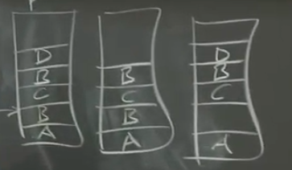

# MIT- 3- GFS 

Created: 2020-06-02 17:22:00 -0600

Modified: 2021-01-21 16:21:14 -0600

---

we're gonna split our data over a huge number of servers in order to be able to read many servers in parallel ,so we're gonna get and that's often called sharding

always one or several services will go down -- fault tolerance --

the most powerful ways to get fault tolerance is with replication just keep two or three

or whatever copies of data, one of them fails you can use another one , we wants to the fault tolerance, it lead to the replication

you can get rid of inconsistency and make the data look very well-behaved, but if you do that it almost always requires extra work and extra sort of chitchat between all the different servers and clients in the network that reduces performance, so if you want consistency you pay for with low performance

~~if you're not careful ,they're gonna get out of sync~~

exactly what I mean by good consistency but you can think of strong consistency or good consistency as being we want to build a system whose behavior to applications or clients looks just like you'd expect from talking to a single server,

we're gonna build you know systems out of hundreds of machines but a kind of ideal strong consistency model would be what you'd get if there was just one server with one copy of the data doing one thing at a time so this is kind of a strong consistency

think about strong consistency,so you might think you have one server, we'll assume that's a single-threaded server and that it processes requests from clients, one at a time and that's important because there may be lots of clients sending concurrently requests into the server and see some current requests, it picks one or the other to go

first and excuse that request to completion then excuse the next so for

storage servers or you know the server's got a disk on it and what it means to

process a request, is it's a write request you know which might be writing

an item or may be increment and I mean incrementing an item, if it's a mutation

then we're gonna go and we have some table of data and you know maybe index by keys and values and we're gonna update this table and if the request comes in and to read we're just gonna you know pull the write data out of the table,

one of the rules here: if a sequence of writes come in and the server process them in some order ,then when you read ,you see the sort of you ~~know~~ value you would expect ,if those writes that occurred one at a time

this of course is that a single server has poor fault tolerance , right if it crashes or it's disk dies or something we're left with nothing and so in the

real world of distributed systems we actually build replicated systems we have a second copying data

here's a bad replication design, we're gonna have two servers now each with a complete copy of the data and so on disks that are both gonna have this this table of keys and values, ~~the intuition of course is that we want to keep these tables~~ we hope to keep these tables identical so that if one server fails, we can read or write from the other server and so that means that somehow every write must be processed by both servers and reads have to be able to be processed by a single server, otherwise it's not fault tolerant

the problem is gonna come up well I suppose we have client 1 and client 2 and they both want to do these write. say one of them gonna write 1 and the other is going to write 2

it is bad design since we haven't done anything here to ensure that the two servers process the two requests in the same order, that's a bad design

so if server 1 processes client ones request first it'll end up it'll start with a value of 1 and then it'll see client twos request and overwrite that with 2 ; if server 2 just happens to receive the packets over the network in a different order it's going to execute client 2's requests and set the value to 2 and then then it will see client ones request set the value to 1

(goal for GFS, also can be used to the system design interview)

what they were looking for one goal was just that the thing be big and fast, they also wanted a file system that was sort of global in the sense that many different applications could get at it one way to build a big storage system

so the idea was to build a sort of file system where anybody you know anybody inside Google could name and read any of the files to allow sharing

in order to get bigness and fastness they need to split the data through every file will be automatically split by GFS over many servers ,so that writes and reads would just

automatically be fast as long as you were reading from lots and lots of

reading a file from lots of clients, you get high aggregate throughput and also

be able to for a single file be able to have single files that were bigger than

any single disk

because we're building something out of hundreds of servers we want automatic failure your recovery

GFS was for internal use by applications written by Google engineers. so it wasn't they weren't directly selling this they might be selling services they used GFS internally but

they weren't selling it directly, so it's just for internal use

and it was tailored in a number of ways for big sequential file reads and writes ,there's

a whole nother domain like a system of storage systems that are optimized for

small pieces of data, like a bank that's holding bank balances, probably wants a

database that can read and write an update you know 100 byte records ,that

hold people's bank balances, but GFS is not that system so it's really for big

or big is you know terabytes gigabytes some big sequential not random access

~~it's also that has a certain batch~~

~~flavor there's not a huge amount of~~

~~effort to make access be very low~~

~~latency the focus is really on~~

~~throughput of big you know multi~~

~~megabyte operations~~

the structure of the GFS.

Master:

all right so the general structure and we have a bunch of clients hundreds of clients we have one master although there might be replicas of the master the master, [keeps the mapping from file names to where to find the data.]{.mark}

~~basically although there's really two tables so and then~~ [there's a bunch of chunk servers maybe hundreds of chunk servers]{.mark} each with perhaps one or two discs the separation.

here's the master is all about naming and knowing where the chunks are and the chunk servers store the actual data.

~~this is like a nice aspect of the design that these two concerns are almost completely separated from each other and can be designed just separately with separate properties~~

the master knows about all the files for every file the [master keeps track of a list of chunks]{.mark} ,chunk identifiers that contain the successive pieces that file

[each chunk is 64 megabytes]{.mark} so if I have a you know gigabyte file ,the master is gonna know that maybe the first chunk is stored here and the second chunk is stored here, the third chunk is stored here [and if I want to read whatever part of the file I need to ask the master oh which server hold is that chunk and I go talk to that server and read the chunk]{.mark}

[in the master, it's got two main tables that we care about it's got one table that map's file name to an array of chunk IDs or chunk handles. this just tells you where to find the data or what the identifiers are the chunks are.]{.mark}

File name -> {chunk ids or chunk handles}

[The master also happens to have a second table that map's each chunk handle to a bunch of data about that chunk, so one is the list of chunk servers that hold replicas of that data, each chunk is stored on more than one chunk server so]{.mark}

Chunk id -> {chunk services }

it's a list chunk servers, every chunk has a current version number so, [this master has a remembers the version number for each chunk,]{.mark}

for a chunk have to be sequence ,the [chunks primary ,it's one of the replicas so master remembers the which chunk servers the primary]{.mark} and there's also that [primary is only allowed to be primary for a certain least time]{.mark} ,so the master remembers the expiration time of the lease

(How to recover from the failure)

this stuff so far it's all in RAM and the master so just be gone if the master crashed so in order that you'd be able to reboot the master and not forget everything about the file system, the master actually stores all of this data on disk as well as in memory, so reads

just come from memory but writes to at least the parts of this data that had to be reflected on this writes, have to go to the disk

Master has log on the disk, every time it changes the data it appends an entry to the log on disk and checkpoint.

so some of this stuff actually needs to be on disk and some doesn't it turns out

I'm guessing a little bit here but certainly the array of [chunk handles has to be on disk,(file -> chunk id]{.mark}

[chunk servers it turns out doesn't because the master if it reboots talks to all the chunk servers and ask them]{.mark}

what chunks they have so this is I imagine not written to disk, [the version I'm gonna vote written to disk,]{.mark} the primary it turns out not almost certainly not written to disk, the reason is the master is reboots and forgets therefore it can simply wait for the lease expiration time and then it knows that absolutely no primary will be functioning for this

chunk and then it can designate a different primary safely and similarly

[so that means that whenever a file is extended with a new chunk goes to the next 64 megabyte boundary or the version number changes because the new primary is designated that means that the master has to first append a little record to his log]{.mark}

saying oh I just added a such-and-such a chunk to this file or I just changed the version number so every time I change is one of those that needs to write

the reason for using a log rather than a database you know some sort of b-tree or hash table on disk is that you can append to a log very efficiently because you only need you can take a bunch of recent log records they need to be added, log makes a little bit faster to write . to reflect the operation on to the disk,

if the master crashes and has to reconstruct its state you wouldn't want to have to reread its log file back starting from the beginning of time from when the server was first installed ,you know a few years ago .~~in addition the master sometimes checkpoints its complete state to disk which takes some amount of time seconds maybe a minute or something and then~~ [when master restarts what it does is goes back to the most recent checkpoint and plays just the portion of a log]{.mark} that sort of starting at the point in time

when checkpoint is created.

read steps:

the client and what a read means that the application has a file name in mind and an offset ( beginning of the bytes) in the file that it wants to read some data front, so it sends the file name and the offset to the master and the master looks up the file name in its file table and then you know each chunk is 64 megabytes who can use the [offset divided by 64 megabytes]{.mark} to find which chunk (chunk handler )and , then it looks at that chunk (chunk handler) in its chunk table finds the list of chunk servers that have replicas of that data and returns that list to the client

the paper says that clients try to guess which server is closest to them in the network maybe in the same rack and send the read request to that to that replica

[the client actually caches the result so that if it reads that chunk again and indeed the client. so it doesn't have to keep beating on the master asking the master for the same information over and over]{.mark}

now the client talks to one of the chunk servers, tells the chunk server handling offset and the chunk servers store these chunks each chunk in a separate Linux file on their hard drive, file just named by the handler, all the chunk server has to do is go find the file with the right name, I'll give it that entire chunk and then just read the desired range of bytes out of that file and return the data to the client

how does that or you mean if the if the client asks for a range of bytes that

spans a chunk boundary ?the client will ask that well the clients linked with this library is a GFS library that noticed, how to take read requests apart and put

them back together and so that library would talk to the master and the master would tell it well you know chunk 7 is on this server and chunk 8is on that server and then why the library would just be able to say oh you know I need the last couple bites of chunk seven and the first couple bites of chunk eight and then would fetch

those put them together in a buffer and return them to the calling application

Write

library saying look here's a file name and a range of bytes I'd like to write or append this buffer of bytes to the file, client asks the master I would like to pend to this named file. [please tell me where to look for the last chunk in the file]{.mark} because the client may not know how long the file is

[for writing though there needs to be a primary]{.mark} ,so at this point on the file may or may not have a primary already designated by the master. so we need to consider the case of if there's no primary already and all the master knows well there's no primary 1. .[so one case is no primary in that case the master needs to find out the set of chunk servers that have the most up-to-date copy of the chunk,]{.mark} because know if you've been running the system for a long time due to failures or whatever there may be chunk servers out there that have old copies of the chunk from you know yesterday or last week that I've been kept up to date ,because maybe that server was dead for a couple days and wasn't receiving updates ,so there's you need to be able to tell the difference between up-to-date copies of the chunk and non up-to-date

[so the first step is to find you know find up-to-date .]{.mark}this is all happening in the master because the client has asked the master told the master: look I want up end of this file, please tell me what chunk service to talk to, so a part of [the master trying to figure out what chunk servers the client should talk to you.( which chunk servers has current copy)]{.mark}

so when we finally find up-to-date replicas and what update means is [a replica whose version of the chunk is equal to the version number that the master knows i]{.mark}s the most up-to-date version number. it's the master that hands out these version numbers. the master remembers that oh for this particular chunk you know the chunk server is only up to date

[this is why it has to be version number stored on disk]{.mark} because if it was lost in a crash and

there were chunk servers holding stale copies of chunks, the master wouldn't be able to distinguish between chunk servers holding stale copies of a chunk from last week and a chunk server that holds the copy of the chunk that was up-to-date as of the crash that's why the master members of version number on disk

the master has to talk to the chunk servers anyway if it reboots in order to find which chunk server holds which chunk because the master doesn't remember that so you might think that you could just take the maximum you could just talk to the chunk servers find out what chunk and versions they hold and take the maximum for a given chunk overall.

(

Question: we master need remember the version number for each chunck?

That would work if all the chunk servers holding a chunk responded

but the risk is that at the time the master reboots maybe some of the chunk servers are offline or disconnected or whatever themselves rebooting and don't respond and so all the master gets back is responses from chunk servers that have last week's copies of the block and the chunk servers that have the current copy haven't finished rebooting or offline or something

)

master needs to assemble the list of chunk servers that have the most recent version. [the master knows the most recent versions stored on disk each.]{.mark} Chunk server along with each chunk also remembers the version number of the chunk that it's stores . so that when chunk slivers reported into the master saying look I have this chunk, the master can ignore the ones whose version does not match the version the master knows is the most recent.

the client want to append and if master doesn't have a primary. it figures out maybe you have to wait for the set of chunk servers that have the most recent version of that chunk, then picks a primary: I'm gonna pick one of them to be the primary and the others to be secondary servers among the replicas. [the master then increments the version number]{.mark} and writes that to disk so it doesn't forget it the crashes.

then it sends the primary and the secondaries and that's each of them a message saying look for this chunk, here's the primary here's the secondaries. you know recipient maybe one of them and here's the new version number ,so then it tells primary and secondaries this information plus the version number. The primaries and secondaries all write the version number to disk ,

so they don't forget because you know if there's a power failure or whatever they have to report in to the master with the actual version number they hold

(

Queustion : what happen if the master write the primary and secondary version number , even after all the of the chunk service are crash, it could let masker cannnot find any one have the current version number ...

that's a great question , so I don't know there's hints in the paper that I'm slightly wrong about this. so the paper says I think your question was explaining something to me about the paper. the paper says if the master reboots and talks to chunk servers and one of the [chunk servers reboot reports a version number that's higher than the version number the master remembers. The master assumes that there was a failure while it was assigning a new primary and adopts the new the higher version number]{.mark}

that it heard from a chunk server so it must be the case that in order to handle a master crash. At this point that the master writes its own version number to disk after telling the primaries there's a bit of a problem here though

if the was that is there an ACK,

all right so maybe the master tells the primaries and backups and that their primaries and secondaries if they're a primary secondary tells him the new version number waits for the ACK and then writes to disk

or something unsatisfying about this I don't believe that works because of the possibility that the chunk servers with the most recent version numbers being offline at the time the master reboots, we wouldn't want the master doesn't know the current version number.

I don't really understand whether the master update system version number on this first and then tells the primary secondary or the other way around and I'm not sure it works either way okay

)

[the master update is version number tells the primary secondary]{.mark}, look your primaries and secondaries, [here's a new version number and so now we have a primary which is able to accept writes.]{.mark}

What the primaries job is to take writes from clients and organize applying those writes to the various chunk servers

(and you know the reason for the version number stuff is so that the master will recognize the which servers have this new. You know the master hands out the ability to be primary for some chunk server. we want to be able to recognize if the master crashes you know that it was that was the primary that only that primary and it secondaries which were actually processed, which were in charge of updating that chunk that only those primaries and secondaries are allowed to be chunk servers in the future and the way the master does this is with this version number logic)

master tells the primaries and secondaries that there it they're allowed to modify this block. it also [gives the primary a lease]{.mark} which basically tells the primary look you're allowed to be primary for the next 60 seconds, after 60 Seconds you have to stop and this is part of the machinery for making sure that we don't end up with two primaries

okay so now we were primary now [the master tells the client who the primary and the secondary. the client sends a copy of the data it wants to be appended to the primary and in all the secondaries , the]{.mark} primary and in the secondaries write that data to a temporary location it's not appended to the file yet after they've all said yes. we have the data. the client sends a message to the primary saying: [look you know you and all the secondaries have the data I'd like to append it for this file]{.mark}

the client request one at a time and for each client the append request, the primary looks at the offset at the end of the file or the current end of the current chunk, makes sure there's enough remaining space in the chunk and then writes the clients record to the end of the current chunk and tells all the secondaries to also [write the clients data to the end to the same offset in their chunks]{.mark}

all right, so the primary picks an offset, all the replicas including the primary are told to write the new appended record at at offset.

the secondary's they may do it they may not do it. I'm either run out of space maybe they crashed maybe the network message was lost from the primary. so if a secondary actually wrote the data to its disk at that offset , it will reply yes to the primary, if the primary collects a yes answer from all of the secondaries.

so if they all of all of them managed to actually write and reply to the primary and saying yes I did it then the primary is going to reply success to the client ,[if the primary doesn't get an answer from one of the secondaries or the secondary reply sorry something bad]{.mark}

happened I ran out of disk space my disk, then the primary replies "no" to the client and the paper says oh if the client gets an error like that , back in the primary, the client is supposed to reissue the entire append sequence starting again talking to the master to find out the most recently the chunk at the end of the file

if the record append succeeded if the client got a success message back then that means all of the replicas appended that record at the same offset

[the version number only changes when the master assigns a new primary]{.mark} which would ordinarily happen, client sends it to only the closest of the replicas and then that replica forwards the data to another replica, along I sort of chained until all the replicas had the data and that path of that chain is taken to sort of minimize crossing bottleneck inter switch links in a data center

the version number only gets incremented if the master thinks there's no primary

[split brain and why need lease]{.mark}

if there's something wrong with a network between master and primary so there's a possibility that the primary is alive. I'm pin you the network is dropping that packets but you can talk to other clients and you're serving requests from other clients you know and if the master sort of designated a new primary for that chunk

now we'd have two primaries processing writes, but two different copies of the data and so now we have totally diverging copies the data and that's called that error having two primaries or whatever processing requests without knowing each other it's called "split brain". usually said to be caused by network partition that is some network error in

which the master can't talk to the primary but the primary can talk to clients, sort of partial network failure.

when designates a primary it says it gives a primary lease, which is basically the right to be primary until a certain time the master knows it remembers and knows, how long the lease lasts and the primary, knows how long is lease lasts, if the lease expires the primary knows that it expires and will simply stop executing client requests. it'll ignore or reject client requests after the lease expired and therefore [if the master can't talk to the primary and the master would like to designate a new primary the master must wait for the lease to expire for the previous primary]{.mark} so that means master is going to sit on its hands for one lease period 60 seconds after that

it's guaranteed the old primary will stop operating its primary and now the master can see if he doesn't need a new primary without producing this terrible split brain situation

one primary and 2

this scheme we have good properties for appends that the primary sent back a successful answer for and sort of not so great properties for appends where the primary sent back of failure and the records the replicas just absolutely be different all different sets of replicas

{width="3.78125in" height="2.1979166666666665in"}

observation is the system could have been designed to keep the replicas in precise sync

<table>
<colgroup>
<col style="width: 91%" />
<col style="width: 8%" />
</colgroup>
<thead>
<tr>
<th>
Learn: Strong consistency, version number, master - chunk service, replication

log and how to recovery for the failure,

write to primary

master pick up the primary and secondary , lease time
</th>
<th></th>
</tr>
</thead>
<tbody>
</tbody>
</table>

single master -- approve -> Raft

