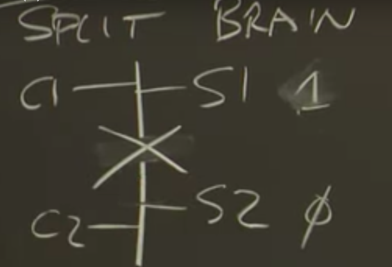
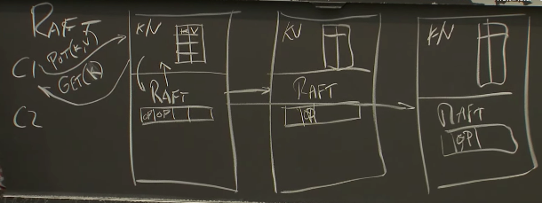
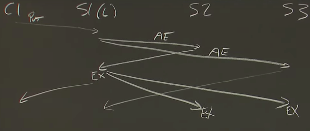
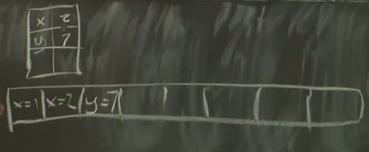
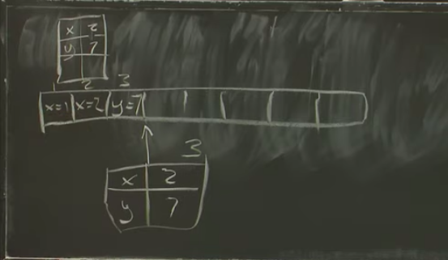

# MIT- 6- Raft 

Created: 2020-06-05 11:17:05 -0600

Modified: 2020-11-23 12:22:21 -0600

---

one is that MapReduce replicates computation, but the replication is controlled the whole computation is controlled by a single master

GFS replicates data right as this primary backup scheme for replicating ,the actual contents of files but it relies on a single master to choose who the primary is for every piece of data

why it's difficult to get this but brain problem correctly

the problem situation the lowly worried about split-brain arises when a client can talk to one of the servers but can't talk to the other

we can't possibly require the client to actually you know wait for both servers to respond if we don't have fault tolerance we need it to be able to proceed so another obvious answer is that if the client can't talk to both

the troubling scenario is if the other server is actually alive so suppose the actual problem or encountering is not that this server crashed which would be good for us but the much worse issue that something went wrong with the network cable and that client1 can talk to server one, but not server two and there's maybe some other client out there that conduct a server two but not server one , so if we make the rule that if a client can talk

to both servers that it's okay in order to be fault tolerant that I just talked

to one

what's just inevitably gonna happen said this cable is gonna break thus cutting the network in half client one is gonna send a test and set request to server 1, server 1 will you know set it state to one and return the previous value of zero to client one and

so that mean client1 will think it has the lock and if it's a VMware ft server will think it can be takeovers primarily but this replica still of zero

in it all right so now if client2 who've also sends a test and set request to you know what price to send them to both sees that server 1 appears to be down follows the rule that says well you just send to the one server but you can talk to then it will also think that it would either quiet because client you also think that it acquired the lock and

~~so now you know if we were imagining this test and that server was going to~~

~~be used with the and where ft we have not both replicas both of these VMware machines I think they could be primary by themselves without consulting the other server~~

so that's a complete failure so with this set up and two servers it seemed like we had this we just had to choose either you wait for both and you're not fault-tolerant or you wait for just one and you're not correct and ~~then our correct version~~ it's often called split brain

{width="2.7708333333333335in" height="1.8958333333333333in"}

[General concept of voting system]{.mark}

first step is to have an odd number of servers instead of an even number of servers

let's say votes for leaders, arrived then at every step the majority you assemble for that step must contain at least one server that was in the previous majority that is any two majorities overlap in at least one server

and it's really that property more than anything else that raft is relying on to avoid split brain. if you have an odd number of servers then it's not symmetric anymore right at least a single network split will be presumably two servers on one side and one server on the other side and they won't be symmetric at all

so basic ideas you have an odd number of servers in order to make progress of any kind so

in raft elect a leader or cause a log entry to be committed in order to make any progress, at each step you have to assemble a majority of the server's more than half more than half of all the servers in order to sort of approve that step like vote for a meet or accept a

new log entry and commit it so you know the most straightforward way is that two

or three servers required to do anything one reason this works, just to be totally clear when we're talking about a majority it's always a majority out of all of the server's not just a live servers

(if you have a system with three servers and maybe some of them have failed or something if you need to assemble in the majority it's always two out of three, even if you know that one has failed the majority is always out of the total number of servers there's a more general formulation of this because a majority voting system in which two out of three

are required to make progress it can survive the failure of one server, any two servers are enough to make progress if you need to be able to if you're you know you worried about how reliable your servers are or then you can build systems that have more servers

and so the more general formulation is if you have 2F + 1 servers then you can withstand you know so if it's three that means F is one and the system with three servers you can tolerate F servers step one failure and still keep going, all right often these are called quorum systems because the two out of three is sometimes held a quorum )

if you always need a majority of the servers to proceed and you go through a sort of succession of operations, each step must contain at least one server that was in the previous majority that is any two majorities overlap in at least one server

or example when you have a a successful leader election and leader assembles votes from

a majority its majority is guaranteed to overlap with the previous leaders majority and so for example the new leader is guaranteed to know about the term number used by the previous leader, because it's a majority overlaps with the previous leaders majority and

everybody in the previous leaders majority knew about the previous leaders term number

It is big part of why it is that raft is correct.

[Raft]{.mark}

raft is a takes the form of a library intended to be included in some service application so if you have a replicated service that each of the replicas in the service is gonna be some application code which you know receives rpcs or something plus a raft library and the raft libraries cooperate with each other to mean replication maintain replication.

a single raft replica is that at the top we can think of the replicas having the application code so it might have a key-value server, so maybe we have some key value server and raft is helping it manage replicated state , for a key value server it's going to be a table of keys and values, the next layer down is a raft layer so the key value server is gonna sort of make function calls into raft and they're gonna chitchat back and forth a little bit and raft keeps a little bit of state

raft has a log of operations and you know 3 servers that have exactly the same identical structure and hopefully the very same data sitting in sitting at both layers

outside of this there's gonna be clients and the game is that so we have,client 1 and client 2 whole bunch of clients, the clients don't really know that they're talking to a replicated service that to the clients that are looking almost like it's just one server and they talked with one server and so the clients actually send client requests to the key to the application layer of the current leader the replica ,the current leader in raft and so these are gonna be you know application level requests for a database for a key value

one of these commands gets sent from the requests get sent from the clients of the server what actually happens is you know on a ~~non~~ replicated server the application code would like execute this request and say update, the table and response to a put( request) , ~~but not in a raft replicated service instead if assuming the~~ client sends a request to leader ~~what really happens is~~ then the application layer simply sends the clients request down into the raft layer to say:

look you know here's a request, please get it committed into the replicated log and tell me when you're done ,and so at this point the rafts chitchat with each other [until all the replicas are a majority the replicas get this new operation into their logs.]{.mark} and then when its leader knows that all of the replicas of a copy of this,

only then as a leader raft sent a notification back up to the key value (application layer) saying aha that operation you sent me it's been now committed into all the replicas ,and so it's safely replicated at this point it's okay to execute that operation ,

a raft you know the client sends a request with the key value layer, key value layer does not execute it yet so we're not sure because it hasn't been replicated only when it's in out and the logs of all the replicas

then raft notifies the leader now the leader actually execute the operation which corresponds to you know for a put updating the value ,yet reading correct value out of the table and then finally sends the reply back to the client

{width="2.7708333333333335in" height="1.0416666666666667in"}

yeah and so in addition when operations finally committed each of the replicas sends the operation up each of the raft library layer sends the operation up to the local application layer, in the local application layer applies that operation to its state

(so hopefully all the replicas seem the same stream of operations, they show up

in these up calls in the same order they get applied to the state in the same order and you know assuming the operations are deterministic which they better be the state of the replicas, replicated State will evolve in identically on all the replicas)

[time diagram of how the messages work]{.mark}

the client sending the original request to server 1, after that server 1 raft layer sends an append entries RPC to each of the two replicas ,this is just an ordinary, I'll say a put request

this is append entries requests ,the server is now waiting for replies and the server's from other replicas as soon as replies from a majority arrive back including the leader itself, so in a system with only three about because the leader only has two, wait for one other

replica to respond positively to an append entries, as soon as it assembles positive responses from a majority, the leader execute a command ~~figures out what the~~

~~answer is like~~ and sends the reply back to the client,

when the leader execute it and reply yes to the client

~~because it's committed but server 2doesn't know anything yet it just knows well you know I got this request from the leader but I don't know if it's committed yet, so there's actually another stage~~ once the server 1, or leader realizes that a request is committed it then needs to tell the other replicas to execute the operation and apply the command to their state

(in raft there's not an explicit commit message instead the information, is piggybacked inside the next append entries that leader sends out.)

(the next append entries RPC it sends out for whatever reason like, there's a commit meter commit or something filled in that RPC and the next time the leader needs have to send a heartbeat or needs to send out a new client request. because some different client requests or something it'll send out the new hire leader commit value and at that point the replicas will execute the operation and apply it to their state)

{width="2.7708333333333335in" height="1.1770833333333333in"}

I don't think the time at which the replicas execute the request is critical because

nobody's waiting for it at least if there's no failures ,if there's no failures replicas executing the request isn't really on the critical

[why use log]{.mark}

the answer to why the system is totally focused on logs is that the log is the kind of mechanism by which the leader orders operations. it's vital for these replicated state machines that all the replicas apply not just the same client operations, not just apply the operation from the same client, ~~to their start~~ but the same operations in the same order

I give you know ten clients send operations to the leader at the same time, the leader has to pick an order make sure everybody all the replicas obey that order and the log is you know the fact that the log has numbered slots ~~as part of half a meter expresses.~~

replica has received an operation that it is not yet sure is committed and it cannot execute it yet. it has to put the this operation aside somewhere until the increment to the leader commit value comes in

~~(and so another thing that the log is doing is that on the followers, the log is the place where the follower sort of sets aside operations that are still tentative that have arrived but are not yet known to be committed and they may have to be thrown away)~~

another use is on the leader side is that the leader needs to remember operations in its log because it may need to retransmit them to followers if some followers offline, ~~maybe it's something briefly happened to its network action or something misses some messages, the leader needs to be able to resend log messages that any followers missed and~~ so the leader needs a place where can set aside copies of messages of client requests ~~even ones that it's already executed in order to be able to resend them to the client I mean we send them to replicas that missed that operation~~

a final reason for all of them to keep the log is that at least in the world , if a server crashes and restarts and wants to rejoin, ~~in fact we start and rejoin the raft cluster otherwise you're now operating with only two out of three servers and you can't survive ,any more failures we need to reincorporate failed and rebooted servers and the log is sort of where or~~ what a server rebooted server. uses the log persisted to its disk because one of the rules is that each raft server needs to write its log to its disk, where it will still be after it crashes and restarts that log is what the server uses or replays the operations in that log from the beginning to sort of create its state as of when it crashed ~~and then it carries on from there~~ so the log is also used as part of persistence plan as a sequence of commands to rebuild the state

(note is that the the replicas the followers acknowledge commands before they execute them )

[Question:]{.mark}

(the question is if one of these servers crashes, it has this log that it persisted to disk , so the server will be able to be just logged back from disk but of course that server doesn't know how far it got in executing the log, and also it doesn't know at least when it first reboots, it doesn't even know how much of the log is committed )

the first answer to your question is:

(immediately after a restart you know after a server crashes and restarts and reads its log it is not allowed to do anything with the log, because it does not know how far the system has committed in its log ,maybe as long as has a thousand uncommitted entries and zero committed entries for all it nodes

none of them know how far they had been have executed before the crash

so what happens is that you leader election one of them gets picked as a leader and the leader will actually figure out by ~~sending out a by product or~~ sending out the first heartbeat really, it'll figure out what the latest point is basically that all of the majority of the replicas agree on their logs, because that's the commit point

another way of looking at it is that once you choose a leader, through the append entries mechanism the leader forces all of the other replicas to have identical logs to the leader ,and at that point plus a little bit of extra the leader knows that it's forced all the replicas to have logs are identical to it or at least majority of replica, the leader will increment the leaders commit point and everybody can now execute the entire log from the beginning and recreate their state )

[( Summary of Raft]{.mark}

key value layer with its state and the, raft layer underneath it .there's on each replica ~~and there's really two main pieces of the interface between them there's this method by which the key value layer can relay if a client sends in a request~~,

~~the key value layer has to give it to wrap and say please you know fit this request into the log~~

)

[one interesting thing about the logs is that they may not be identical,]{.mark} there are a whole bunch of situations in which at least for brief periods of time the ends of the

different replicas logs may diverge like

for example if a leader starts to send out a round of append messages but crashes before it's able to send all them out, you know that'll mean that some of the replicas that got the append message will append, you know that new log entry and the ones that didn't get

that append messages RPC won't have appended them so it's easy to see that the logs are I'm gonna diverge sometimes.

[the good news is that the the way a raft works actually ends up forcing the logs]{.mark}

[to be identical after a while there may be transient differences but in the long]{.mark}

[run all the logs will sort of be modified by the leader until the leader insurers are all identical]{.mark}

[leader election]{.mark}

raft uses these" term numbers" in order to sort of disambiguate which leader we're talking about. it turns out that followers don't really need to know the identity of the leader. they really just need to know what the current term number is ,each term has at most one leader, that's a critical property you know for every term there might be no leader during that term or there might be one leader but there cannot be two leaders during the same term.

every term has it must most one leader.

How do the leaders get created, in the first place, every raft server keeps this election

timer which is just a it's basically just out of time , it has recorded that says well if that time occurs ,I'm going to do something and the something that it does is that if an entire leader election period expires without the server having heard any message from the current leader, then the raft servers sort of assumes probably that the current leader is dead and starts an election, so we have this election timer and if it expires, we start an election and what it means to start an election is basically that you increment the term.

~~the candidate the server that's decided it's going to be a candidate and sort of force a new election.~~

First increments this term because it wants them to be a new leader namely itself. And you know leader a term can't have more than one leader ,so we got to start a new term in order to have a new leader.

and then it sends out these requests votes, RPC, I'm going to send out a full round of request votes and you may only have to send out n-1 one requests votes because one of the rules is that a new candidate always votes for itself.

In the election, so one thing to note about this is that it's not quite the case that if the leader didn't fail we won't have an election, but if the leader does fail then we will

have election. ~~an election assuming any other server is up . Because some day, the~~

~~other servers election timers go will go off but as leader didn't fail we might still unfortunately get an election. So if the network is slow or drops a few~~

~~heartbeats or something we may end up having election timers go off and even~~

~~though there was a perfectly good leader we may nevertheless have a new election~~

(this can lead to un-needed elections; that's slow but safe)

(old leader may still be alive and think it is the leader)

okay so we got these leader elections, we need to ensure that there is at most at

most one leader per term.

How does Raft do that, well Raft requires in order to be elected for a term, Raft requires a candidate to get yes votes from a majority of the server's . each server will only cast one yes vote per term, so in any given term you know it basically means that in any given term ,each votes only once for only one candidate, you can't have two candidates both get a majority of votes because everybody votes only once

so the majorities rule causes there to be at most one winning candidate and so then we get at most one candidate elected per turn

and in addition critically the majority rule means that you can get elected even if some servers have crashed ,right if a minority of servers are crashed aren't available and network problems we can still elect a leader if more than half a crash or not available or in another partition or something then actually the system will just sit there trying again and again to elect a leader and never elect one if it cannot in fact they're not a majority of live servers

if the candidate wins the election will actually know directly -- I got a majority of votes but nobody else directly knows who the winner was or whether anybody one. So the way that the candidate informs other servers is that heartbeat, if you're in an election your immediately required to send out an independent entries to all the other servers, now the append entries that heartbeat append entries doesn't explicitly say I won the election ,you know I'm a leader for term 19, the way the information is communicated is that no one is allowed to send out an append entries unless they're a leader for that term. So the fact that I I'm a you know I'm a server and I saw oh there's an election for term 19 and then I sent an append entries whose term is 19 that tells me that somebody I don't know who but somebody won the election. So that's how the other servers knows they were receiving append entries for that term

and that append entries also has the effect of resetting everybody's election timer, so as long as the leader is up and it sends out heartbeat messages or append entries at least you know at the rate, that's supposed to, every time a server receives an append entries it'll reset its selection timer

raft also random these election timers so the way to think of it and the everybody received the last append entries ,and then maybe the server died let's just assume the server send out a last heartbeat and then died. well all of the followers re-set their election timers when they received at the same time. because they probably all receive this append enters at the same time. They all reset their election timers for some point in the future ,But they chose different random times in the future which the timers are gonna go off

Assuming they picked different random, numbers one of them is first and the, other one is second. Assuming this gap is big enough, the one that's first it's election time will go off first before the other ones election timer and if we're close were not unlucky it'll have time to send out a full round of vote requests and get answers from everybody who everybody's alive before the second election timer goes off from any other server

(so one obvious requirement is that the election timer has to be at least as long as the expected interval between heartbeats.

because the network may drop packets you probably want to have the minimum election timer value be a couple of times the heartbeat interval )

(you know where should we set the kind of maximum time that we're randomizing over there's a couple of considerations here, in a real system you know this maximum time effect how quickly the system can recover from failure because remember from the time

at which the server fails until the first election timer goes off the whole system is frozen, there's no leader)

[contents of logs]{.mark}

I'm gonna write out log entries for each of the servers, ~~sort of aligned to indicate slots~~ (corresponding) each slots in the log and the values I'm going to write here are the term numbers rather than client operations

Raft 2

[election restriction]{.mark}

sophisticated election restriction that the request vote handling RPC handling code is supposed to check before it says yes, before votes yes for a different peer and the rule is we only vote you, vote yes for some candidate who send us over request votes only if candidate has a higher term in the last log entry or same last term

how to back up faster a little bit better and the general idea is to be able to have the follower send enough information to the leader can jump back an entire

terms, worth of entries that have to be deleted per append entries ,so it leader may only have to send one in append entries per term in which the leader and follower disagree instead of one per entry

35

Figure two this three items only three items are persistent so that's the [log entries, current term ,and voted for.]{.mark}

why log has to be persisted is that we have to persist the application state so only the logins and so when the server restarts the only information available to reconstruct the application state is the sequence of commands in the log

what about current term why does current term have to be persistent.

they're both about ensuring that there's only one that each term has at most one leader, so yeah so voted for the

if a server receives a vote request and votes for server 1 and then it crashes and if it didn't persist. this the identity of who had voted for and in my crash we start get another vote request for the same term from server 2 and say gosh I haven't voted for anybody because my voted for is blank. now I'm gonna vote for server 2 and now. our servers voted for server 1 and for server 2 in the same term and that might allow two servers since both server and server to voted for themselves, they both may think they have a majority out of three and they're both going to become leader

the reason that's important is that writing stuff to disk is can be very expensive.

if you want it to build a system they could serve more than a hundred quests per second then there's a bunch of options, one is you can use a solid-state drive or some kind of flash

if you're even more sophisticated maybe you can build yourself "battery backed DRAM" and do the persistence into battery back DRAM and then if the server reboots hope that reboot was took shorter than the amount of time the battery lasts and that this stuff you persisted is still in the RAM

the other trick people play a lot is to try to batch . That is if you can if client requests are if you have a lot of client requests coming in, maybe you should accept a lot of them and not reply to any of them for a little bit. We call a lot of them accumulate

and then persist you know a hundred log entries at a time from your hundred

clients and you know only then send out the append entries .because you do actually have to persist this stuff to disk ,if you receive a client request you have to persist the new entry to disk before you send the append entries RPCs the followers, the leader it's essentially promising to commit that that request and can't forget about it

the followers have to persist the new log entry to their disk before they reply to the append entries because they were apply to the append entries it's also a promise to preserve and eventually commit that log entry so they can't be allowed to forget about it if they crash

it's worth

scratching your head a little bit about

why commit index lasts apply next index

and match index why it's fair game for

them to be simply thrown away if the

server crashes and restarts like why

wasn't you know commit index or last

apply it like geez last applied is the

record of how much we've executed right

if we throw that away aren't we gonna

execute log entries twice and is that

correct how about that why is why is it

safe to throw away last applied

yes I am we're all about simplicity and

safety here with raft so that's exactly

correct the the reason why all that

other stuff can be non-volatile as you

mentioned I mean sorry volatile the

reason why those other fields can be

volatile and thrown away is that we can

the leader can reconstruct sort of

what's been committed by inspecting its

own log and by the results of append

entries that it sends out to the

followers I mean initially the leader if

it if everybody restarts because they

experienced a power failure

initially the leader does not know

what's committed what's executed but

when it sends out log and append entries

it'll sort of gather back information

and essentially from the followers about

What's in how much of their logs match

the leaders and therefore how much must

have been committed before the crash

another thing in the 4-2 world which is

not the real world

another thing about figure two is that

figure two assumes that the application

state is destroyed and thrown away if

there's a crash in a restart so the

figure two world assumes that while log

is persistent that the application state

is absolutely not persistent required

not to be consistent in figure 2 because

the in figure 2 the log is preserved

persisted from the very beginning of the

system and so what's going to happen if

you sort of play out what the various

rules in figure 2 after a leader restart

is that the leader will eventually re

execute every single log entry that is

handed to the application you know

starting with log entry one after a

reboot it's the raft is gonna hand the

application every log entry starting

from one and so that will after a

restart the application will completely

reconstruct its state from scratch by a

replay from the beginning of the time of

the entire log after each restart and

again that's like a sort of

straightforward elegant plan but

obviously potentially very slow

[snapshot and log compaction]{.mark}

if we just follow the figure 2 rules the log just keeps on growing may end up you know millions and millions of entries long and so requires a lot of memory to store

the log looks like

{width="2.7708333333333335in" height="1.1354166666666667in"}

when raft feels that it's log has gotten to be too large you know more than a

megabyte or ten megabytes or whatever some arbitrary limit raft will ask the

application to take make a snapshot of it the application state as of a certain

point in the log

then we can safely throw away the log before that point , the snap is basically

the table it's just about a database server,

we also need to annotate the snapshot with the entry number that are corresponds to you so it's basically you know if the entries are 1 2 3 this snapshot corresponds to,just after log

index 3 ,with the snapshot in hand, if we persist it to disk rats persistent to disk raft never again will need this part of the logs and it can simply throw it away as long as it persists a

snapshot as of a certain log index plus the log after that index as long as that's persisted to disk,we never going to need to log before that and so this is what raft does the raft ask the application for snapshot gets the snapshot saves it to disk with the log after that it just throws away this log here

{width="2.7708333333333335in" height="1.6041666666666667in"}

what happens on a restart, so the raft will find the latest (snapshot -log pair) on its disk and hand the snapshot to the application because we no longer are able to replay you know all the log entries so there must be some other way to initialize the application basically,

not only is the application have to be able to produce a snapshot of application state but it has to be able to absorb a previously made snapshot and sort of reconstruct it

stable in memory from a snapshot

for the follower, leader will send its current snapshot plus current log well send its current snapshot to the follower and then presumably immediately follow it with an append entries that has the leaders current log

of X - 2 and then after it the read of X

it yields - and this this read of X of 1

if we assume that the X didn't already

have the value 1 there there must be in

this relationship and that is the read

must come after the right and this read

also must become for this right and

maybe there's some other restrictions -

anyway we can take these we can take

this set of arrows and flatten it out

into an order and that actually works so

the order that's the total order that

demonstrates that this history is

linearizable is first the right of x - 1

then the read of x yielding 1 then the

right of x - 2 and the read of x that

yields 2

alright so the fact that there is this

order that does obey the ordering

constraints shows that this history is

linearize ability and doesn't you know

if we're worried about the system that

produced this history whether it's a but

that system is linearizable then this

particular example we saw it doesn't

contradict the presumption that the

system is linearizable any questions

about what I just did each read sees you

know read of X the value it sees must be

them value written by the most the most

recent proceeding right in the order so

you know in this case in this case we're

totally ok with this order because this

read the value it saw is indeed the

value written by the most recent write

in this order and this read the value it

sighs I mean in informally it's that

reads can't real should not be yielding

stale data if I write something in Rita

back gosh I should see the value I wrote

and that's like a formalization of the

notion that

oh yes oh yeah yeah all right let me let

me he's right up example that's not

indeed linearizable so example two let's

suppose our history is we had a right of

X value one right back with value two

and so this one we also want to write

out the arrows and so we know what the

constraints are on any total order we

might find the right of X to one because

of time because it finished in real time

before the right x to started and must

come before in any satisfying order we

produce the right of Ecsta two has to

come before the right before the read of

X that yields two so we have this arrow

the read of X had to finished before the

read of X to one started so we have this

arrow and the read of X to one because

it saw value one has to come after the

right of X - 1 and more crucially before

the right of X 2 - right so we can't

have this read of X yielding one if it's

immediately preceded by I'll write out X

- 2 so we also have this arrow like this

and because there's a cycle in these

constraints there's no order that can

obey all these constraints and therefore

this history is not linearizable and so

the system that produced it is

is not a linearizable system you know

would be linearizable the history was

missing any one of these three and I

would break the cycle yes maybe I'm not

sure because suppose or I don't know how

to incorporate very strange things like

supposing somebody red 27 you know it

doesn't really if there's no right of 27

a read of 27 doesn't at least the way

I've written out the rules doesn't sort

of well there may be some sort of anti

dependency that you would construct okay

um I will continue this discussion next

week

