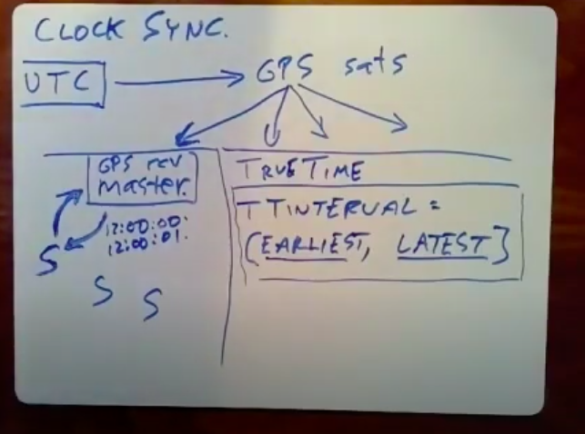
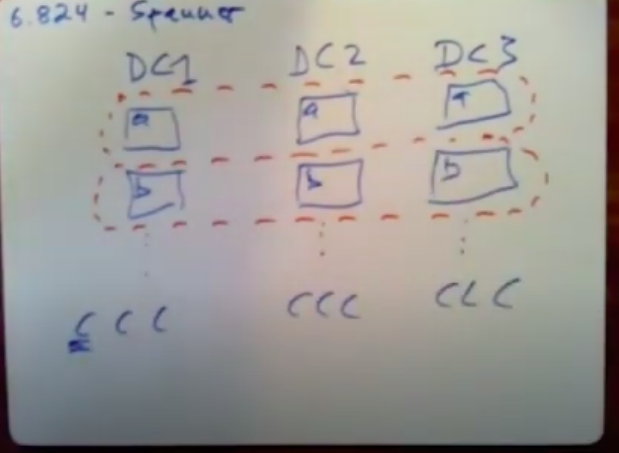
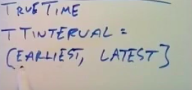

# Spanner

Created: 2020-06-24 11:40:55 -0600

Modified: 2021-01-17 02:08:53 -0600

---

workload was dominated by read-only transactions, the there's billions of read-only transactions and only millions of read write transactions so they're very interested in the performance of read-only of transactions that only do reads and apparently they also required strong consistency and that you know

what transactions in particular so they wanted serializable transactions and they also wanted external consistency which means that if one transaction commits and then after it finishes committing another transaction starts, the second transaction needs to see any modification is done by the first.

its servers are spread over data centers presumably all over the world certainly all over the United States and each piece of data is replicated at multiple data centers

multiple data centers let's say there's there's three data centers really,

so we have all data centers then the data shard it that it's broken up you can think of it has been being broken up by key into and split over many servers so maybe there's one server that serves keys starting with A in this data center or another starting with B and so forth lots of lots of charting with lots of servers ,in fact every data center has on any piece

of data is any shard is replicated at more than one data center so there's going to be another copy, another replica of the A keys and the B keys and so on

addition each data center has multiple clients ~~or their clients of spanner and what these clients really are as web servers, so if our ordinary human beings sitting in front of a web browser connects to some Google service that uses spanner they'll connect to some web server in one of the data centers and that's going to be one of these one of these spanner clients~~

The replication is managed by Paxos ,in fact that really a variant of Paxos that has leaders and is really very much like the raft that we're all familiar with, [each Paxos instance manages all the replicas of a given shard of the data]{.mark}, so this shard (shard A) all the copies of this shard form one Paxos group, and all the replicas are this shard form other packs was group and

~~the reason for the sharding and for the independent paxos instances per shard is to allow parallel, speed-up~~

[you can think of or each of these paxos groups has a leader ,if you need to if a client needs to do a write it has to send that write to the leader of the of the shard]{.mark} ,

Paxos instances are what they're really doing is sending out a log the leader is sort of replicating a log of operations to all the followers and the followers execute that log which is for data is gonna be reads and writes so it executes those logs all in the same order

the reason for these for this setup the sharding as I mentioned for throughput the multiple copies in different data centers is for two reasons, one is you want copies and different data centers in case one data center fails if you know maybe you power fails to the entire city the data centers in or there's an earthquake or a fire or something you'd like other

copies that other data centers that are maybe not going to fail at the same time and then you know there's a price to pay for that because, now the paxos protocol now has to talk maybe over long distances to talk to followers and different data centers.

The other reason to have data in multiple data centers is that it may allow you to have copies of the data near all the different clients that use it so if you have a piece of data that may be read in both California and New York, maybe it's nice to have a copy of that data one copy in California,one copy in New York so that reads can be very fast and indeed a lot of the focus that time is to make reads from the local the nearest replica

both fast and correct finally another interesting interaction between Paxos and multiple data centers is that paxos like raft only requires a majority in order to replicate a log entry and proceed and that means if there's one slow or distant or flaky data center. The Paxil system can keep chugging along and accepting new requests even if one data center is being slow

they really want to do reads from local data centers but because they're using Paxos and because Paxos only requires each log entry to be replicated on a majority that means a

minority of the replicas may be lagging and may not have seen the latest data that's been committed by paxos and that means that if we allow clients to read from the local replicas for speed they may be reading out-of-date data.

Another issue they have to deal with is that a transaction may involve multiple shards and therefore multiple paxos groups, so you may be reading or writing a single transaction may be reading or writing multiple records in the database that are stored in multiple shards and multiple Paxos group.

spanner actually beats implements readwrite transactions quite differently from read-only transactions

for read write transactions

so let me start with your

beauty of readwrite transactions which

are so have a lot more conventional in

their design alright so first readwrite

transactions let me just remind you at a

transaction looks like so let's just

choose a simple one that's like

mimicking bank transfer so I'm one of

those client machines a client of

spanner you'd run some code you run this

transaction code the code would say oh

I'm beginning a transaction and then I

would say oh I want to read and write

these records so maybe you have a bank

balance in database record X and we want

to you know increment and increase this

bank balance and decrease y's bank

balance and oh that's the end of the

transaction and now the client hopes the

database will go off and commit that

alright so I want to trace through all

the steps that that have to happen in

order to in order for spanner to execute

this read write transaction so first of

all there's a client in one of the data

centers that's driving this transaction

so I'll draw this client here let's

imagine that x and y are on different

shards since that's the that's the

interesting case and that those shards

each of the two shards is replicated in

three different data centers so know we

got our three data centers here and at

each data center there's a server that

I'm just going to write x for the

replicas of the shard that's holding act

with the bank balance for x and y for

the these three servers

spinner once two-phase commit just to totally stand our two-phase commit and two phase locking ,the huge difference is that instead of the participants and the transaction manager being individual computers, the participants in the transaction manager are Paxos replicated groups of servers ,for increased fault tolerance , so that means just to remind you that the shard the three replicas of the shard that stores X .It's a really app access group same with these three replicas stores Y and we'll just imagine that for each of these one of the 3 servers is the leader, so let's say the server and data center 2 is the Paxos leader for the X shard and the servant is saying 1 is the Paxos leader for y shard.

okay so the first thing that happens is that the client picks a unique transaction ID ~~which is going to be carried on all these messages, so that the system knows that all the different operations are associated with a single transaction,~~

the first thing that does the client has to be read, so despite the way the code looks where it reads and writes X then read some write Y, in fact the way, the code has transaction code has to be organized it has to do all its reads first and then at the very end do all the writes at the same time essentially as part of the commit

[Read the value first]{.mark}

so the clients to do good reads ,it turns out that it in order to maintain locks , the server responsible for it has to associate a lock with that data item , the locks are maintained the read locks and spanner maintain only in the Paxos leader, so when the client transaction wants to read access sends a read X request to the leader of X shard and that leader of the shard returns the current value of x plus sets a lock on X, of course if the locks already set then you won't respond to the client until whatever transaction currently has the data locked releases, the lock by committing

Then the leader for that shard since back the value of x to client ,the client needs to read Y

: sent the read request to the Y leader and Y leader set the locker and return the value to the client.

[Write the update]{.mark}

clients on all the reads it does internal computations and figures out the writes that wants to do what values wants to write to x and y and so now the clients going to send out the updated values for the records that it wants to write

so the first thing it does is it chooses one of the paxos groups to act as the transaction coordinator , ~~as it chooses us in advance and it's gonna send out the identity of the which Paxos group is going to act as the transaction coordinator~~, let says we choose leader Y as the trnasaction coordinator, here to say that not only is this server the leader of Y Paxos group it's also acting as transaction coordinator for this transaction, then the client sends out the updated values that it wants to write so it's going to send a write extra write X request here with a new value and the identity of the transaction coordinator.

when each the Paxos leader for each written value receives the write request, it sends out a prepare message to its followers and gets that into the Paxos log ,because it's promising to be able to carry out this transaction that it hasn't crashed for example and lost its locks ,so it sends out this prepare message through paxos, when it gets a majority of responses from the followers then this paxos eader sends a yes to the transaction coordinator saying yes I am a promising to be able to carry out my part of the transaction

the client also sent the updated y value to Y paxos leader and the paxso leader also sends out prepare messages to his followers and logs it impacts those waits for the acknowledgments from a majority and then you can think of it as the Paxos leaders sending the transaction coordinator which is on the same machine, maybe the same program a yes vote saying yes, I can I can commit , okay so when the transaction coordinator gets responses from all the different from the leaders

of all the different shards whose data is involved in this transaction, if they all said yes then the transaction coordinator can commit, otherwise it can't let's assume it decides to commit at that point the transaction

coordinator sends out to its paxos followers ( Y folloers) a commit message ,saying look please remember that permanently in the transaction log that we're committing this transaction and it also tells the leaders of the other paxos those groups involved in the transaction

they can commit as well and so now this leader sends out commit messages to his

followers as well as soon as the commits are

the transaction coordinator probably doesn't send out the commit message to

the other shards until it's committed as safe in the log ,so that the transaction coordinator is not to forget its decision, once commits these commit messages are committed into the paxos logs of the different shards, each of those shards can actually execute the writes that is place the written data and release the locks on the data items, so that other transactions can use them and then the transactions over

one is that it's that the locking that is insuring serializability that is of two transactions conflict because they use the same data one has to completely wait for the other

releases locks before it can proceed so

it's using so spanners using completely standard two-phase locking in order to get serializability and completely standard two-phase commit to get distributed transactions

the two-phase commits widely hated because if the transaction coordinator should fail or become unreachable than any transactions, it was managing block indefinitely until

the transaction coordinator comes back up and they block with locks help

so people have been in general very reluctant to use two-phase commit in the

real world because it's blocking

spanner solves this by replicating the transaction manager ,the transaction manager itself is a Paxos replicated state machine ,so everything it does like for example remember whether it's committed or not is replicated into the paxos log, so if the leader here fails

even though it was managing the transaction because it's raft replicated can spring to life take over leadership and also take over being the transaction manager and they'll have in

their law if it's the transaction manager decided to commit , any leader that takes

over will see a commitment it's log and be able to then tell the other writes away, tell the other participants and two-phase commit that look oh this transaction was committed .so this effectively eliminates the problem a two-phase commit that it can block with locks held if there's a failure

another thing to note is that there's a huge amount of messages on in this diagram here and that means that many of them are across data centers and said the some of these messages that go between the shards or between a client and a shard whose leaders in another data center may take many milliseconds and in a world in which you know

computations take nanoseconds this is essentially pretty grim expense

the performance of a spanner deployment where the different replicas are on different sides of the United States, east and west coast and it takes about a hundred milliseconds to do complete a transaction where the different replicas involved are on different coats that's a huge amount of time, the throughput may be very high

[Read only transaction]{.mark}

if we possibly can so that's going to take us to read-only transactions, it turns out that if you're not writing that is if you know in advance that all of the operations in a transaction are guaranteed to be reads, then spanner has a much faster much more streamlined much less massive message intensive scheme for executing read-only transactions

in spanner eliminates two big costs and it's read-only transaction design eliminates two of the costs that were present and readwrite transactions ,first of all as I mentioned it reads from local replicas and so if you have a replica as long as there's a replica, the client

needs the transaction needs in the local data center, you can do the read and from that local replica which may take a small fraction of a millisecond to talk to instead of maybe dozens of milliseconds if you have to go cross country, so it can read from local

replicas but node you know again a danger here is that any given replicas may not be up-to-date, so there has to be a story for that

and the other big savings and the read-only design is that it doesn't use locks, it doesn't use two-phase commit ,I mean that doesn't need a transaction manager and this the voids things like cross data center or inter data center messages to paxos, those leaders and because no locks are taken out not only does that make the read-only transactions faster but it avoids slowing down read write transactions because they don't have to wait for locks held by read-only transactions now.

two main correctness constraints that they wanted to have read-only transactions imposed the, first is that they like all transactions they still need to be serializable and what that means is that even though just a review ,even though [the system may execute transactions concurrently in parallel the results that a bunch of concurrent transactions]{.mark}

[must same as if the transactions execute one by one]{.mark}

(means is that the an entire all the reads of a read-only transaction must effectively fit neatly between all the writes of a bunch of transactions ,that can be viewed

as going before it and and it must not see any of the writes of the transactions that we're

going to view as it's going after it ,so we need a way to sort of fit to read all the reads of a transaction read-only transaction kind of neatly between readwrite transactions well )

[an r/o xaction must essentially fit between r/w xactions.See all writes from prior transactions, nothing from subsequent.]

the other big constraint that the paper talks, about is that they want external consistency and what this means it's actually equivalent to linearise ability

that we've seen before what this really means is that [if one transaction commits finishes committing, and another transaction starts after the first transaction completed in real time then the second transaction is required to see the writes done by the first]{.mark}

[transaction,]{.mark} another way of putting that is that transactions even read-only

transactions should not see stale data, and if there's a committed write from a completed transaction, that's prior to the readonly transaction, prior to the start of the read-only transaction the read-only transaction is required to see that writes.

but standard databases like my SQL, or something for example can be configured to provide this kind of consistency

The first big idea is an existing idea it's called [snapshot isolation (time stamp)]{.mark}

and the way I'm gonna describe this is that let's imagine that all the computers involved had synchronized clocks, what we mean by a wall clock time a time, so it's assumed that all the computers assume even though this isn't true that all the computers involved have synchronized times, furthermore let's imagine that every transaction is assigned a particular time a time stamp and time stamps taken from these synchronized clocks

for readwrite transaction its timestamp is I'm going to say just for this for this simplified design is the real time at the commit or at the time at which the transaction manager starts the commit for the readwrite transaction and for read-only transaction the timestamp is equal to the start time

~~if all the transactions had executed in timestamp order, so we're going to assign the transactions each transaction a timestamp and then we're going to arrange the executions so that the transactions gets the results as if they had executed in that order, so given works for read-only transactions is that each replica when it stores data it actually has multiple versions of the data, so we have a multiple version database, every database record has you know maybe if it's been written a couple times, it has a separate copy of that record for each of the times ,it's been written, each one of them associated with the~~

~~timestamp of the transaction that wrote it.~~

whatever server that stores the replicas of the data that the transaction needs it's going to look into its multi version database and find the record that's being asked for that

as the highest time that's still less than the timestamp

we have two readwrite transaction t1 and t2, they are allocating the timestamp as their commit time, t1, timestamp = 10 and t2 = 20. ( t1 at time 10, its value is 9 and 11, t2 at time 20, its value is 8 and 12 )

however when transaction 3 started it ,chose a timestamp by looking at the

looking at the current time and so let's say since we know in real time that

transaction 3 started after transaction, let's suppose it started it time 15 and

chose timestamp 15 for itself so that mean when it does the read of X it's

gonna send a request the local replica that holds X and it's gonna accompany it with it it's time stamp of 15 it's gonna say please give me the latest data as of

time 15 of course transaction 2 did not executed yet and but nevertheless the highest time stamp copy of X is the 1 from time 10 written by transaction 1 so we're gonna get x value 9 for this one time,

passes transaction 2 commits now transaction 3 does the second read again at a company suit the read requests with its own time stamp of 15 ,the server's now the server's have to

records but again because the server gets transaction 3 time stamp of 15,it looks at its records and say ha 15 sits between these two I'm gonna return the highest time stamp record for r y it's less than the requested time stamp, and that's still the version of Y

from time 10 so the read of Y will return at 11

this just essentially emulates a serial one at a time execution in which the

order is timestamp order transaction 1,3 then transaction 2 that is a serial order that is equivalent to that was also actually produced is the time stamp order of 10 15 20

one question you might have is why it was okay for transaction 3 to read an old value of y that is it issued this read of Y at this point in time the freshest data for why was this value 12, but the value would actually got was intentionally a stale value not the freshest value, but the value from a while ago this value 11 so why is that

okay why is it okay not to be using the freshest version of the data and the

kind of technical justification for that is that transaction 2 and transaction 3 are concurrent that is the overlap in time, concurrent and the rules for linearise ability and external consistency or that if two transactions are concurrent then the serial order that the database is allowed to use can be can put the two transactions, in either order and here

the database spanner has chosen to put transaction 3 before transaction 2 in the serial order okay

would say yes and another question how does this not absolutely blow up storage

the system discards old records that paper does notsay what the policy is but presumably

well it must be discarding old records, certainly if the only reason for the multiple records is to implement snapshot isolation of these kinds of transactions then you don't really need to remember values too far in the past

because you only need to remember values back to the sort of earliest time that a that a transaction could have started at that's still running now and if your transactions mostly you're always finish or force the finish by killing them or something within say one minute if no transaction can take longer than a minute then you only have to remember

the last minute of versions in the database now

[replica is in the minority]{.mark}

okay another problem that comes up is that the transaction T3 is needs to read data as of a particular timestamp, but you know the reason why this is desirable is that were it allows us to read from the local replicas in the same data center, but maybe that local replica is in the minority of paxos followers that didn't see the latest log records the leader

so the way he spanner deals with this is with our notion of safe time and the scoop is that each replica remembers you know it's getting log records from its paxos leader and the log records it turns out that the paper arranges

so that the leader sends out log records and strictly increasing timestamp order, so a replica can look at the very last log record it's gotten from its leader to know how up to dated it so if I ask for a value as of timestamp 15 but the replica has only gotten log entries from my paox leader a few times stamp 13, the replicas gonna make client delay, it's not gonna answer until it's gotten a log record with time stamped 15 from the leader, and this ensures that replicas don't answer a request for a given timestamp until they're guaranteed to know everything from the leader up through that time stamp , so this may

delay, this may delay the reads okay

[so the topic is time synchronization which is sort of making sure clocks say the same real time value]{.mark}

basically the time it says on a collection of highly accurate expensive clocks in a set of government laboratories, so we can't directly read them although we can know is that these government laboratories can broadcast the time in various ways and the

broadcast take time and so it's some time later some possibly unknown time

later we hear these announcements at different time due to the delays

first we want to consider [the problem of what the impact]{.mark} is if on snapshot isolation if the clocks are not synchronize which they won't be okay

so what if the clocks are there's actually no problem at all for the spanners readwrite transactions because the readwrite transactions used locks and two-phase commit they're not actually using snapshot isolation

let's suppose a read-only transaction chooses a timestamp that is too large so

that is far in the future you know it's now 12:01 p.m. and it chooses a timestamp at 1 o'clock p.m. so if a transactions chosen timestamps too big, that's actually not that bad what it'll mean is that it will do read requests

it'll send a read request to some replicas the replicas would say wait a minute you're you know your clock it's far greater your time seems far greater than the last log entry, I saw for my paxos was leader, so I'm gonna make you wait until the paxo was at the time and the log entries and the Paxos leader catches up to the time ,you've requested I'm only gonna respond then so this is correct ,but slow the reader will be forced away

if we have a read-only transaction and it's timestamp is too small. this is a obviously causes a correctness problem, this will cause a violation of external consistency because the multi version databases you'll give it a timestamp that's far in the past, say an hour ago

and the database will read you a value associated with it the timestamp from an hour ago which may ignore more recent writes, it will cases you to miss recent committed writes and that is a violation of external consistency

[About clock synchronization]{.mark} the as I mentioned we're done come from this it's actually a collection of clocks and government labs, the way that we hear about the time is that it's broadcast by various protocols ,sometimes by radio protocols like basically what GPS is doing for spanner

GPS acts as a radio broadcast system that broadcasts the current time from some government lab through the GPS satellites, to GPS receiver sitting in the Google machine rooms

government labs and the government labs with their accurate clocks define a universal notion of time that's called UTC, so we've UTC coming from some clocks in some labs then we have some you know radio internet broadcast or something for the case of spanner, it's the we can think of the government allowed to broadcasting to GPS satellites ,the satellites in turn broadcast and the broadcaster you know the millions of GPS receivers that are out there.

Then there's in each data center, there's a GPS receiver that's connected up to what the paper calls a time master which .is some server, there's going to be more than one of these for data center in case one fails

and then there's all the hundreds of servers in the data center, that are running spanner either as servers or as clients each one of them is going to periodically send a request

saying what time is it to the local one or more usually more than one piece

{width="10.083333333333334in" height="7.520833333333333in"}

[this unfortunately is a certain amount of uncertainty]{.mark} and the primary sources

of uncertainty I think well there's there's fundamentally uncertainty in that we don't actually know how far we are from the GPS satellites exactly, so the you know radio signals take some amount of time even though the GPS satellite knew exactly what time it is ,those signals take some time to get to our GPS receiver ,we're not sure what that is that means that when the we get a message from the radio message from the GPS satellite saying exactly 12 o'clock

you know if the propagation delay might have been you know a couple of nanoseconds that mean that's there were actually the propagation delays much more than that, it's really uncertainty in the propagation delay means that we're not really sure exactly whether it's 12 o'clock or a little before a little after, in addition all the times is communicated there's did uncertainty that you have to account for and the biggest sources are that when a server sends requests, after a while it gets a response

if the response says it's exactly 12 o'clock but the amount but um say a second pass, you know between when the server sent the request and when I got the response, all the server knows is that even if the master had the correct time ,all the server knows is that the time is within a second of 12 o'clock because maybe that, may be the request was instant but the reply was delayed or maybe the request was delayed by a second and the response was the incident

so all you really know is that it's between you know 12 o'clock and zero seconds and twelve o'clock and one second.

[in order to capture this uncertainty]{.mark} and account for it, spanner uses this true time scheme in which when you ask what time it is what you actually get back as one of these TT interval things which is a pair of an earliest time and a latest time, is their early as the time could possibly be and the second is the latest the time can possibly be

so when the application you know makes this library call that asked for the time it gets back this pair, all it knows is that the current time is somewhere between earliest and latest, that's what you know earliest might be in this case earliest might be twelve o'clock and may this might be twelve o'clock in one second

just our guarantee that the that the correct time ,isn't less than earliest and isn't greater than latest

now let's return to our original problem was that if the clock was too slow that a read-only transaction might read data too far in the past, and that it wouldn't read data from a recent committed transaction , so we need to know what we're looking for is how spanner uses these TT intervals in its notion of true time, in order to ensure that despite uncertainty in ,[what time it is transaction a external consistency that is a read-only transaction, it's guaranteed to see writes done by a transaction completed before us]{.mark}.

[there are two rules]{.mark} that the paper talks about that one of them is the start rule and the other is commit wait.

start rule

transactions timestamp has to be equal to the latest half of the current time, so this is T T now() call which returns one of those earliest latest pairs, that's the current time and that transactions timestamp has to be the latest one.

that is it's going to be a time that's guaranteed not to have happened yet, because the true time is between earliest and latest, and for a read-only transaction, it's a sign the latest time as of its the time it starts.

and for a read or write transaction is to assign a timestamp this latest value as of the time it starts to commit

[the wait rule is only for the read-write transaction]{.mark}

for readwrite transactions says that when a transaction coordinator is you know collects the votes and sees that it's able to commit and and chooses a time stamp after chooses this time stamp, it's required to delay to wait a certain amount of time before I have to actually commit and write the values and release locks. so a readwrite transaction has to delay until it's time stamps that it chose when

so what's going on here is the sits in a loop calling TS now and it stays in that loop until the timestamp that it had chosen at the beginning of the commit process is less than the

current times earliest half (TS.earliest) and what this guarantees is that since now the

earliest possible correct time is greater than the transactions timestamp, that means that when this loop is finished, when the commit wait is finished this time stamp of the transaction is absolutely guaranteed to be in the past

{width="10.083333333333334in" height="7.75in"}

system actually make use of these two

rules in order to enforce external

consistency for read-only transactions I

want to go back to our or I want to cook

up a someone simplified scenario in

order to illustrate this so I'm gonna

imagine that the writing transactions

only do one write each just reduce the

complexity let's say that there's two

read/write transactions so we have t0

and t1 are read/write transactions and

they both write X and we have a t2 which

is going to read X and we want to make

sure that t2 sees you know it's going to

use snapshot isolation on timestamps we

want to make sure that sees the latest

written value so we're going to imagine

that t2 does a write of X and writes one

to X and then commits we're going to

imagine that

sorry t1 write sex and come at t2 also

writes X writes a value 2 to X and we

need to distinguish between can prepare

and commit so we're going to say it it's

really a prepare that the transaction

chooses its timestamps so this is a

point at which it chooses timestamp and

it commits some time later and then

we're imagining by assumption that t2

starts after t1 finishes so it's going

to read X

afterwards and we want to make sure it

sees - all right so let's suppose that

t0 chooses a time stamp of one commits

writes the database let's say t1 starts

at the time it chooses a time stamp it's

gonna get some it's not get a single

number from the true time system really

gets a range of numbers you know

earliest and a latest value let's say at

the time it chooses its time stamp it

the range of values that earliest time

it gets is 1 and the latest field in the

current time is 10 so the rule says that

it must choose 10 the latest value as

its time stamp so t1 is gonna commit

with its time step 10

now you can't commit yet because the

commit weight rule says it has to wait

until it's time stamp is guaranteed to

be in the past so transaction 1 is going

to sit there keep asking what time is it

what time is it

until it gets an interval back that

doesn't include time 10 so at some point

it's gonna ask what time it is is gonna

get a time that we're the earliest

values 11 and elitist is I don't know

let's say 20 and now I was gonna say AHA

now I know that my time Sam it's

guaranteed to be in the past and I can

commit so t1 will actually this is its

commit wait period to sit there and wait

for a while before it commits okay now

after it commits transaction two comes

along a monster B Dex it's gonna choose

a time stamp also we're assuming that it

starts after t1 finishes because that's

the interesting scenario for external

consistency so let's say when it asks

for the time it asks at a time after

time 11 so it's going to get back an

interval that includes time 11

so let's suppose it gets back in a

little bit goes from time ten this is

the earliest and time twelve the latest

and of course the time twelve has to be

since we know that must be at least time

11 since transaction two started after

transaction one finished that means that

the 11th must be less than the latest

value transaction 2 is going to choose

this latest 1/2 as its timestamp so it's

gonna actually choose timestamp 12 and

in this example when it does its read

it's gonna ask the storage system oh I

want to read as of timestamp 12 since

transaction 1 wrote with timestamp 10

that means that you know assuming the

safe wait the safe time machinery works

we're actually gonna read the correct

value and what's going on here is that

the so this happened to work out but

indeed it's guaranteed to work out if

transaction 2 as long as transaction 2

starts after transaction 1 commits and

the reason is that commit weight causes

transaction 1 not to finish committing

until its timestamp is guaranteed to be

in the past

all right so transaction 1 chooses a

timestamp it's guaranteed to commit

after that timestamp transaction 2

starts after the commit it and so we

don't know anything about what its

earliest value will be but its latest

value is guaranteed to be after the

current time but we know that the

current time is after the commit time of

T 1 and therefore that teaches latest

value the timestamp it chooses is

guaranteed to be after when C committed

and therefore after the timestamp that C

used and because transaction 2 if

transaction 2 starts after T 1 finishes

transaction 2 is guaranteed to get a

higher timestamp

and the snapshot isolation machinery the

multiple versions will cause it to read

to it's read to see all lower valued

writes from all the lower time-stamped

transactions that means teach you is

going to see t1 nom and that basically

means that we're this this is how

spanner enforces external consistency

for its transactions so any questions

about this machinery alright um I'm

gonna step back a little bit there's

really from my point of view sort of two

big things going on here one is snapshot

isolation by itself snapshot isolation

by itself is enough to give you that

it's keeping the multiple versions and

giving every transaction a timestamp

snapshot isolation is guaranteed to give

you serializable read-only transactions

because basically what snapshot

isolation means is that we're going to

use these timestamps as the equivalent

serial order and things like the safe

wait the safe time ensure that read-only

transactions really do read as of their

time stamps see every readwrite

transaction before that and none after

that so there's really two pieces

snapshot isolation snapshot isolation by

itself though is actually often used not

just by spanner but generally doesn't by

a self guarantee external consistency

because in a distributed system it's

different computers choosing the

timestamp so we're not sure there's

timestamps will obey external

consistency even if they'll deliver

serialize ability so in addition to

snapshot isolation spanner also has

synchronized timestamps and it's the

synchronized timestamps plus the commit

weight rule that allow spanner to

guarantee external consistency as well

as serializability and again the reason

why all this is interesting is that

programmers really like transactions and

I really like external consistency

because that makes the applications much

easier to write

they traditionally not been provided in

distributed settings because they're too

slow and so the fact that spanner

manages to release make read-only

transactions very fast is extremely

attractive right no locking no two-phase

commit and not even any distant reads

for a read-only transactions they

operate very efficiently from the local

replicas and again this is what's good

for a basically attend factor of 10

latency improvement as measured in

tables 3 & 6 but just to remind you it's

not all it's not all fabulous the the

all this wonderful machine it really

only applies to read-only transactions

readwrite transactions still use

two-phase commit and locks and there's a

number of cases in which even spanner

will have the block like due to the safe

time and the commit wait but as long as

their times are accurate enough

these commit weights are likely to be

relatively small okay just to summarize

the spanner at the time was kind of a

breakthrough because it was very rare to

see deployed systems that operate

distributed transactions where the data

was geographically in very different

data centers I'm surprising you know

spanner people were surprised that

somebody was using a database that

actually did a good job of this and that

the performance was tolerable and the

snapshot isolation and a timestamp being

part of the probably the most

interesting aspects of the paper and

that is all I have to say for today any

last questions okay

I think on

we're gonna we're going to see farm

which is a sort of very different slice

through the desire to provide very high

performance transactions so I'll see you

on Thursday

{width="10.083333333333334in" height="7.40625in"}

{width="10.083333333333334in" height="7.5in"}

{width="10.083333333333334in" height="7.0625in"}

{width="7.916666666666667in" height="3.75in"}

