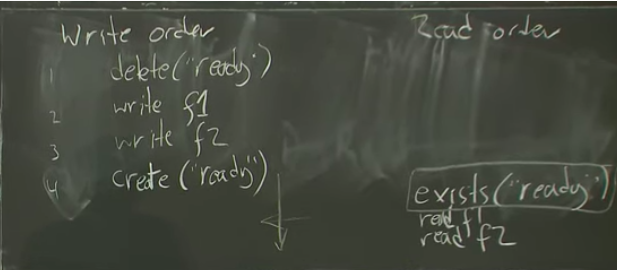
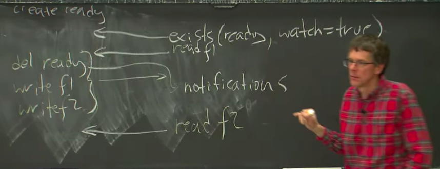

# Zookeeper

Created: 2020-06-10 11:40:20 -0600

Modified: 2020-11-28 17:27:30 -0600

---

36''

zookeper -

~~standalone general-purpose system could be defined that would be helpful for people building separate distributed systems~~

the general picture is that you know we have a bunch of clients maybe hundreds maybe hundreds of clients. we have a leader the

leader has a zookeeper layer that clients talk to and then under the

zookeeper layer is the zab system that manages replication then just like rafts

what's that is doing is maintaining a log that contains the sequence of operations that clients have sent in really very similar to raft may have a bunch of these, and each of them has a log but it's a pending new request that's a familiar set up , so the client sent the request to the zookeeper and the Zab layer you know sends a copy of that request to each of the replicas and the replicas append this to their in-memory log and

probably persisted onto a disk so they can get it back if they crash and restart

[leader-replica mode, read heavy, problem]{.mark}

so the question is as we add more servers you know we could have four servers or five or seven or whatever does the system get faster as we add more more CPUs more horsepower to it do?

yeah yeah there's nothing about this that makes it faster as you add more servers right it's absolutely true like as we have more servers you know the leader is almost certainly a bottleneck, [the leader has to process every request and it sends a copy of every request to every other server as you add more servers it just adds more work to this bottleneck node]{.mark}

in the real world, a huge number of workloads are read heavy that, is there's many more reads like when you look at web pages, you know it's all about reading data to produce the web page

[a lot of systems so maybe we'll send write to the leader but send reads just]{.mark}

[to one of the replicas, just pick one of the replicas and if you have a read-only request just send it to one of the replicas and not to the leader]{.mark}

if a client sends a request to a random replica.

[That there's no reason to believe that anyone replicas other than the leader is up to date]{.mark} because well there's a bunch of reasons why replicas may not be up to date. one of them is that they may not be in the majority that the leader was waiting for you. think about what raft is doing the leader is only obliged to wait for responses to its append entries from a majority of the followers and then it can commit the operation and go on to the next operation. So if this replica wasn't in the majority

it may never have seen a write, it may be the network dropped it and never got it

I'll just be totally get a stale value from this one even if this replica actually saw this new log entry it might be missing the commit command

so the leader sends out a log entry and then when the leader gets a majority of positive replies the leader sends out a notification saying yeah I'm gonne committing that log entry. some replicas may not have gotten the commit

this replica may be partitioned from the leader or may just absolutely not be in contact with leader at all and you know the follower doesn't really have a way of knowing that actually it's just been cut off a moment ago from the leader

[how zookeeper deal with it]{.mark}

zookeepers read performance goes up dramatically

you know zookeepers not obliged to provide fresh data to reads.

~~we have to keep in the back of our minds question of if the system doesn't provide linearize ability is it still going to be useful and you do a read and you just don't get the current answer or current correct answer the~~

~~most latest data~~

the basic problem zookeeper really does allow client to send read-only requests to any replica and the replica responds out of its current state and that replicate may be lagging it's log may not have the very latest log entries and so it may return stale data even though there's a more recent committed value

between performance and strict and strong consistency, zookeeper is to just not provide strong consistency

zookeeper does actually have some it does have a set of consistency guarantees

1.  it says that writes is linearizable

(the write is ordering)

clients might submit writes concurrently nevertheless the system behaves as if [it]{.mark}

[executes the writes one at a time in some order ,]{.mark} so if one writes has seen to have completed before another writes has issued then

zoo keeper will the other guarantee of gives is FIFO client order: each client has a partial order for writes and reads

for reads this is a little more complicated,

the reasons I said before don't go through the writes all go through the leader, the reads just go to some replicas and if the client issues a

(sequence of reads and those clients reads each have to occur at some particular point of the log, in the successive reads have to observe points that don't go backwards that is if a client issues one read and then another read and the first read executes at this point in the log the second read is that you know allowed to execute it the same or later points in the log but not allowed to see a previous state. by issue one read and then another read the second read has to see a state that's at least as up-to-date as the first state

if the client is talking to one replica for a while and it issues some reads, issue to

read here and then I read there if this replica fails and the client needs to start sending its read to another replica that guaranteed this FIFO client or a guarantee still holds, if the client switches to a new replica and so that means that if you know before a crash, the client did a read that sort of

state as of this point in the log that means when the clients switch to the new replicas if it issues another read you know it's its previous read executed here, if a client issues another read that read has to execute at this point or later even though it's switched replicas

and you know [the way this works is that each of these log entries is tagged by the leader tags it with a ZX ID which is basically just a entry number]{.mark}

whenever a replica responds to a client read request it, [you know executed the request at a particular point]{.mark} and the replica responds with the ZX ID of the immediately preceding log entry back to the client, the client remembers this was the ZXid of the most recent data you know is the highest zx id, the client sends a request to the same or a different replica it accompanies their request with that highest ID, has ever seen and that tells this other replica aha you know , need to respond to that request with data that's at least relative to this point in a log

if this replica is less up to date, and the replica receives a request from a client ,the client says oh

[gosh the last read I did executed this, spot in the log and some other replica, this replica needs to wait until it's gotten the entire log up to this point before it's allowed to respond to the client]{.mark}

if I do a write from a client and I send a write to the leader, it takes time before that write is sent out committed, whatever so I may send it write to the leader the leader hasn't processed it or committed it yet and then in order to guarantee FIFO, client order the read and they have to stall until this client has actually seen ~~and executed the previous the~~

~~client's previous write operation~~

the client must when it sends a read and say look you know I the last write request I sent a leader with ZX ID something in this replica has to wait till it sees that ( it guarantee what i write is what I read)

~~(if a client writes a particular piece of data, you know sends a write to the leader and then immediately does a read of the same piece of data and sends that read to a replica boy, it better see its own written value right if I write something)~~

[there is a guarantee about read write ordering but it's only per client so if I send a write in and then I read that data the system guarantees that my read observes my writes. if you send a write in and then I read the data that you wrote this isn't does not guarantee that I see your write]{.mark}

asynchronous right the system doesn't

execute it yet but it does reply to me

saying yeah you know I got your right

and here's this yaks ID that it will

have if it's committed I just like start

return so that's a reasonable theory I

don't actually know how it does it and

then the client if it doesn't read needs

to tell the replicas look you know

that's right I did you know if I do a

read of the data is of the operation

okay so if you send a read to a replica

the replicas in return you that you know

really it's a read from this table is

what your no way notionally what the

client thinks it's doing so you client

says all I want to read this row from

this table the server this replica sends

back its current value for that table

plus the GX ID of the last operation

that updated that table

yeah so there's so actually I'm I'm not

prepared to so the the two things that

would make sense and I think either of

them would be okay is the server could

track this yet for every table row the

ZX ID of the last right operation that

touched it or it could just to all read

requests returned the ZX ID as a last

committed operation in its log

regardless of whether that was the last

operation of touch that row because all

we need to do is make sure that client

requests move forward in the order so we

just need something to return something

that's greater than or equal to the

right that last touched the data that

the client read all right so these are

the guarantees so you know we still left

with a question of whether it's possible

to do reasonable programming with this

set of guarantees and the answer is well

this you know at a high level this is

not quite as good as linearizable it's a

little bit harder to reason about and

there's sort of more gotchas like reads

can return stale data just can't happen

in a linearizable system but it's

nevertheless good enough to do to make

it pretty straightforward to reason

about a lot of things you might want to

do with zookeeper so there's a so I'm

gonna try to construct an argument maybe

by example of why this is not such a bad

programming model one reason by the way

is that there's an out there's this

operation called sink which is

essentially a write operation and if a

client you know supposing I know that

you recently wrote something you being a

different client and I want to read what

you wrote so

if I actually want fresh data, I can send in one of these sync() operations which is effectively well ,the sync operation makes its way through the system as if it were a write and [you know finally showing up in the logs of the replicas that really at least the]{.mark}

[replicas that I'm talking to ,and then I can come back and do a read and you know]{.mark}

[I can tell the replica basically don't serve this read until you've seen my last sync()]{.mark}

if I need to read up-to-date data send in a syck() then do a read() and the read is guaranteed to see data as of the time the same was entered into the log so reasonably fresh

so that's one out but it's an expensive one because you now we converted a cheap read into the synk() operation which burned up time on the leader

( sync() causes subsequent client reads to see preceding writes.useful when a read must see latest data)

{width="5.0in" height="2.1875in"}

the interesting thing that

FIFO client order guarantees if exists() returned true that is if

the replica that client was talking to said yes , the exisit("ready") return yes,

that means that file exists, then you know as were as that what that means is that at least with this setup is that as that replica had actually

seen the recreate of the ready file, in order for this exist to see the ready file exists and because successive read operations are required to only march along forwards in the log

and never backwards that means that you know if the replicas the client was talking to ,if it's log actually contained and then it executes this creative the ready file that means that subsequent client reads must move only forward in the sequence of writes, you know that the leader put into the log ,( (must read the log after the line 4, re-create the ready file) so if we saw this ready(ready file recreate successfully) , that means that the read occurs that the replica execute to read down here( after line 4) somewhere after the write that created ~~the ready and that means~~

exists( filename, watch = true)

but the zookeeper API actually is more clever than this and it can cope with it and so what actually happens the way you would actually use ooh keeper is that

when the client sent in this exists request to ask does this file exist and

would say not only does this file exist but it would say you know tell me if it

[exists even set a watch on that file which means if the files ever deleted or if it doesn't exist if it's ever created]{.mark}

but in this case if it if it is ever deleted please send me a notification

and furthermore the notifications that zookeeper sends ~~you know it's a the reader here it's only talking to t~~he replica guarantees to send a notification for some change to this ready file at the correct point relative to the responses to the clients reads and so what

if you ask for a watch on something and then you issue some reads, if that replica you're

talking to execute something that should trigger the watch, in during your sequence of reads, then the replica guarantees to deliver the notification about the watch before it responds to any read that came that you know saw the log after the point of the operation that triggered the watch notification executed and so this is the log on the

we set up this watch and the guarantee is that will receive the note if , [somebody deletes this file, and we can notified then that notification will appear at the]{.mark}

[client before a read that yields]{.mark} anything subsequently, in the log will get the notification before we get the results of any read that's that saw something in log after the operation

that produced the notification

so what this means that the delete ready is gonna since we have a watch on the ready

file that elite ready is going to generate a notification and that notification is guaranteed to be delivered before the read result of f2

{width="5.0in" height="1.9236111111111112in"}

if f2 was gonna see this second write (write 2) and that means that before the reading

client has finished the sequence in which it looks at the configuration it's

guaranteed to see the watch notification before it sees the results of any write

that happened after this delete that triggered the notification

who generate the watch?

replica let's say the client is talking to, this replica and it sends in the exists request, the exist is a read only request it sends with his replica, the replica is being painting on the

side a table of watches saying oh you know such-and-such a client asked for a

watch on this file and furthermore the watch was established at a particular Z X ID , t~~hat client did a read with the replica ,executed the read at this point in the log and return~~

~~results are relative to this point in the log,~~ members owe that watch is relative to that point in the log, and then if a delete comes in ,you know for

every operation that there execute, so it looks in this little table it says aha

you know the a there was a watch on that file, and maybe it's indexed by hash of

filename or something

okay so the question is oh yeah this this replica has to have a watch table you know if the replica crashes and the client is officially different replica you know what about the watch table right it's already established these watch and

[the answer to that is that no. the rep your replica crashes the new replica you switch to won't have the watch table]{.mark}

and but the client gets a notification at the appropriate point in the stream of responses, it gets back saying oops your replica you were talking to you crashed, and so the client

then knows it has to completely reset up everything

and so tucked away in in the

examples are missing event handlers to

say oh gosh you know we need to go back

and we establish everything if we get a

notification that our replicas crashed

all right I'll continuous

