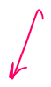
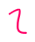
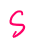
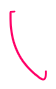
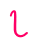
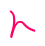

# distribution transaction -- two phase committ

Created: 2020-06-22 11:05:16 -0600

Modified: 2020-12-08 02:02:43 -0600

---

first what's correctness well databases usually have a notion of correctness called acid

A it stands for atomic and this means that a transaction that has multiple steps. you know maybe writes multiple different records if there's a failure, despite failures either all of the write should be done or none of them it shouldn't be the case that a failure at an awkward time in the middle of a transaction should leave half the updates completed invisible and half the updates never done it's all or nothing so this is or not despite failures the

C stands for consistent it's actually we're not going to worry about that that's usually meant to refer to the fact that database will enforce certain invariants declared by the application it's not really our concern today

the I, though it's quite important it usually stands for isolated and this is a really a property of whether or not two transactions that run at the same time , can see each other's changes, before the transactions have finished whether or not they can see sort of intermediate updates and from the middle of another transaction and your goal is no

the sort of technical specific thing that most people generally mean by isolation is that the transaction execution is serializable and I'll explain what that means is that transactions can't see each other's changes can't see intermediate states but only complete transaction results

and the final D stands for durable and this means that after a transaction commits after the client or whatever program that submitted, the transaction gets a reply back from the database, saying yes ,you know we've executed your transaction

the D in acid means that the transactions modifications the database will be durable that they'll still be there they won't be erased by a some sort of failure and making sure that the data is there still they are after even if something crashes

so the most interesting part of this for us is the specific definition of ice of isolated or serializable so the isolated is usually and the definition for this if a set of transactions executes ,you know concurrently more or less at the same time, yield the set of results and here the results refer to both the new database records created by any modifications the transactions might do and in addition any output that the transaction is produced

so the way you check whether an execution is serializable whether some concurrent execution is serializable is you look at the results and see if you can find actually some one at a time, execution of the same transactions that does produce the same results

the implementation strategy for transactions for these a set transactions I'm gonna split into two big pieces , the first big implementation topic is concurrency control this is the main tool we use to provide serializability

the current or isolation so concurrency control by its isolation from other concurrent transactions that might be trying to use the same data

the other big pieces I mentioned is atomic commit and this is what's going to help us deal with the possibility that to recover even if there's a partial failure of only some of the machines the transactions running off and the big tool people use for that is this atomic commit

you'll talk about all right so first concurrency control there's really two classes two major approaches to concurrency control I'll talk about both during the course if they're just mean strategies, the first strategy is a pessimistic usually called pessimist

[pessimistic concurrency]{.mark} control and this is usually locking we've all done, it turns out databases transaction processing systems also used locking and the idea here is before transaction uses any data it needs to acquire a lock on that data and if some other transactions already using the data ,the lock will be held and we'll have to wait before we

can acquire the lock wait for the other transaction to finish and in pessimistic systems if there's locking conflicts somebody else has the lock, it'll cause delays so you're sort of treating performance for correctness

the other main approach is [optimistic approaches]{.mark} the basic idea here is you don't worry about whether maybe some other transactions reading or writing the data at the same time as you just go ahead and do whatever reads and writes, you're gonna do although typically into some sort of temporary area and then only at the end, you go and check whether actually maybe some other transaction might have been interfering and if there's no other transaction now you're done and you never had to go through any of the overhead or weighting of taking out locks ,the locks are reasonably expensive to manipulate but if somebody else was modifying the data in a conflicting way at the same time you were then you have to abort that transaction and we try and the abbreviation for this is often optimistic concurrency control um it turns out that under different

circumstances these two strategies one can be faster than the other

[if conflicts are very frequent you probably actually want to use pessimistic concurrency control not because of conflicts are frequent you're gonna get a lot of aborts due to conflicts for optimistic seems if complex are rare than optimistic concurrency control can be faster because it completely avoids locking overhead]{.mark}

about pessimistic schemes refers basically to locking and in particular for today the reading was about [two-phase locking]{.mark}, which is the most common type of locking and the idea in two-phase locking for transactions is that transactions gonna use a bunch of Records like X&Y and our example the first rule is that you acquire a lock before using date any piece of data we're reading or writing any record

the second rule for tansactions is that a transaction must hold any locks it acquires until after it commits or aborts ,you're not allowed to give up locks in the middle of the transaction, you have to hold them all,

you can only accumulate them until you're done until after you're done so

so this is two-phase, locking are the phases which we acquire locks and then phase in which we just hold onto them until we're done

distributed transactions versus failures

the task we need to perform is split up over multiple servers each of which needs to do some part, a different part each one of them ,so for example because I'm set up I showed here in which the it's really the data that split up and so the tasks being split up our incrementing X and decrementing Y

we're going to assume that [there's one computer that's driving the transaction called the transaction coordinator]{.mark} there's lots of ways of arranging how the transaction coordinator steps in but we'll just imagine it as a computer that is actually running the transaction there's one computer ,the transaction coordinator that's executing the sort of code for the transaction like the puts and the gets and the adds and it sends messages to the computers that hold the different pieces of data that need to actually execute the different parts so

for our setup ,we're going to have one computer of the transaction coordinator and it's going to be these server one and server two that hold X&Y transaction, coordinator we'll send a message to server one saying oh please increment X send a message to server Y saying oh ,please decrement Y and then there'll b more messages in order to make sure that either they both do it or neither than do it and that's where two-phase commit steps in something to keep in the back your mind is that in the full system

there may be many different transactions running concurrently and many transaction coordinators, sort of executing their own transactions and so the various parties here need to keep track of oh you know this is a message for such-and-such a transaction and where they keep state

there's a notion of transaction IDs and every message in the system is tagged with the transaction with the unique transaction ID of the transaction, it applies to and

these IDs are chosen by the transaction coordinator when the transaction starts the transaction coordinator will send out oh this is a message for transaction and it'll keep all its state here

all right

so let me draw out the two-phase commit protocol example execution ,the parties involved are the transaction coordinator and we'll just say there's two participants that is we've got participant a and participant B these are two different servers holding data

so the transaction coordinator it's running the whole transaction, it's gonna send puts and gets to a and B to tell them to you know read the value of x or y or add one to X so we're going to see at the beginning of the tree action that the transaction coordinator is sending for example maybe a get requests to the participant a and it gets a reply , and then maybe it sends that put for whatever

if there's a complicated transaction then when transaction coordinator gets to the end

of the transaction and wants to commit it and be able to you know release all those locks and make the transactions results visible to the outside world and maybe reply to a client or a human user. So they were assuming there's a sort of external client or human that said oh please run this transaction and it's waiting for a response before we can do any of that

the transaction coordinate coordinator has to make sure that all the different participants can actually do their part of the transaction and in particular, if there were any puts in the transaction we need to make sure that the participants who are doing those puts well are actually still capable of doing the puts. So in order to find that out the transaction coordinator sends prepare messages to all of the participants so we're going to send pair messages to both A and B and when A or B would receive a preparer message you know they know the transaction is nearing completion but not over yet they look at their state and decide whether they are actually able to complete the transaction, you know maybe they needed to abort it break a deadlock or maybe they've crashed and we started but between you know when they did the

last operation are now and they've completely forgotten about the transaction and can't complete it so A and B you know look at their state and say oh I'm going to be able to or I'm not gonna be able to do this transaction and they respond with either yes or no

so the transaction coordinator is waiting for these yes or no votes from each of the participants, if they all say yes then the transaction can commit nothing goes wrong the transaction can commit and the transaction coordinator [sends out a commit]{.mark} message to each of the participants and then the participants usually reply with an acknowledgement saying yes we now know the outcome this is called the acknowledgement

all right so they all transaction coordinator since I preparers if all the participants say yes it can commit if anyone in any of them even a single one says no actually I cannot complete this transaction because I had a failure or there was an inconsistency like a missing record and I have to abort even a single participant says no at this point then the transaction coordinator won't commit it'll send out a round of abort messages saying oops please

retract this transaction

either way the after the commit sort of to two things happen of interest to us one is the transaction coordinator will sent whatever the transactions output is to the client or human that requested it and say look oh yes the transactions finish and so now if it didn't abort a committed it's durable.

the other interesting thing is that in order to obey these locking rules the participants unlock, when they see either commit or an abort and indeed in order to obey the two phase locking rule each participant locked any data that it read

each participant there's a table of the locks associated with the data stored at that participant and the participant sort of lock things in those tables remember oh this is you know this piece of data this record is locked for transaction29 and one finally the commit or abort comes back versions action 29 the participant unlocks that data and then other transactions can use so we may have to wait here and this unlock may unblock other transactions

there's really two scenarios we have to worry about one is B might have crashed before sending it's yes message back, so B crash before sending its yes message back then it never said yes so the transaction coordinator couldn't possibly have committed or be about to commit because it has to wait for a yes from all participants, so if B can

convince itself that it could not possibly have sent a yes back that is a crash before sending the yes then [B is entitled to unilaterally abort the transaction itself and forget about it because it knows the transaction coordinator can't possibly commit it so]{.mark}a

B crashes and reboots so B just won't know anything about transactions that haven't haven't sent yes back yet and then if the transaction coordinator sends a prepare message to a participant that doesn't know anything about the transaction because it crashed before sending yes

maybe B crashed after sending a yes back so that's a little more tricky so wasn't in the crash, this wasn't a B gets a prepare its it's happy it says yes I'm going to commit and then it crashes, before it gets the commit message from the transaction, employer coordinator well now we had coordinator got yes from A and B and a sent a commit message to a so that A actually will do its part of the transaction and make it permanent and release locks and in that case in order to honor all or nothing we're absolutely required it B should crash at this point that on recovery that it be still prepared to complete its part of the transaction

it doesn't actually know at that point whether you know because it hasn't received the committee and whether it should commit or not, but it must still be prepared to commit and what that means the fact that we can't lose the state for a transaction across

crashes and reboots

[before B replies to a prepare it must make]{.mark} the transaction state this sort of intermediate transaction state, ~~the memory of all of the changes that's made which may have to be undone if~~ there's an abort plus the record of all the locks the transactions how it held it must make that durab[le on disk in]{.mark}. it's almost always in a log on disk so before B replies yes before B sends the yes in reply to a prepare message it first must write to disk in

its log all the information required to commit, that transaction that is all the new values produced by put plus a full list of locks on the disk or some other

persiste memory before applying with yes and then

if it B's crash after send yes that's part of recovery when it restarts that a look at his it's log and say oh gosh I was in the middle of a transaction ,I had replied yes for transaction 92, I mean you know here's all the modifications it should make if committed and all the locks it held, I better restore that state and then when he finally gets a commitment nor an abort it'll know from having read its log how to actually finish its part of the transaction

that B must write to its disk at this point and this is part of what makes two-phase commit a little bit slow is that there's necessary persisting of

information here

okay so we also have to

worry about okay and you know the final

place I guess where you might crash is

you might crash be my crashed after

receiving the commit or or after both

you might crash after actually

processing the commit and but in that

case it's made modifications that the

transaction means to make permanent in

its database presumably also on disk

before after it received a commit

message and in that case there's maybe

not anything to do if it restarts

because the transaction is finished so

when B receives the commit message it

probably writes the copies the

modifications from its log on to its

permanent storage releases this locks

erases the information about the

transaction of months log and then

replies and of course we have to worry

about you know what if it receives a

commit message twice probably the right

thing to do is either for B to remember

about the transaction that takes memory

so it turns out that it B simply forgets

about committed transactions that it's

made durable on disk it can reply to a

repeated commit message if it doesn't

know anything about that transaction by

simply acknowledging it again and

that'll be an important a little bit

later on ok so that's the story of one

of the participants crashes at various

awkward points what about the

transaction coordinator it's also just a

single computer sorry you know if it

fails might be a problem okay so again

the critical where things start getting

critical is if any party might have

committed then we cannot forget about

that if any either of these participants

might have committed or if the

transaction coordinator might have

replied to the client then we cannot

have that transaction go away right if a

is committed but maybe its transaction

the coordinator sent out a commit

message to a but hadn't gotten around to

sending a commitment to be the crashes

at that point the transaction

coordinator must be prepared on restart

to resend the commit messages to make

sure that both parties know that the

transaction is committed so okay

so you

know whether that matters depends on

where the transaction coordinator

crashes if the crash is before sending

commit messages it doesn't really matter

neither party if you know since the

transaction coordinator didn't send

commit messages before crashing it can

just abort the transaction and if either

participant asks about that transaction

because they you know see it's in their

log but they never got a commit message

the transaction coordinator can say I

don't know anything about that

transaction it must have been aborted

possibly due to a crash so that's what

happens if the transaction coordinator

crashes before the commit but if a

crashes after sending one or more

commits message then it cannot defends

action coordinator can't be allowed to

forget about the transaction and what

that means is that at this point when

that after the transaction coordinator

it's made its commit versus abort

decision on the basis of these yes/no

votes before sending out any commit

messages it must first write information

about the transaction to its login in

persistent storage like a disk that will

still be there if it crashes and

restarts so transaction coordinator

after receives a full set of yeses or

noes writes the outcome and the

transaction ID to its log on disk and

only then it starts to send out commit

messages and that way if a crash is at

any point maybe before its end the first

commit message or after its sent one or

maybe even after sent all of them if it

crashes that point its recovery software

will see in the log AHA which is in the

middle of a transaction the transaction

was either known to have been committed

or aborted

and as part of recovery it will resend

commit messages to all the participants

or abort messages whatever the decision

was in case it hadn't sent them before

it crashed and that's one reason why the

participants have to be prepared to

receive duplicated commit messages okay

so there's some other so those are the

main crash stories we also have to worry

about what happens if messages are lost

in the network you might send a message

maybe the message never got there you

might send a message and be waiting for

a reply maybe the reply was sent but the

reply was dropped so any one of these

messages may be dropped and need to

think through what to actually do in

each of these cases so for example

supposing the transaction coordinator

sent out prepare messages but hasn't

gotten some of the yes or no replies

from participants what are the

transaction coordinators options at that

point well one thing I could do is send

out a new set of prepare messages saying

you know I didn't get your answer please

tell me your answer yes or no and you

know I could keep on doing that for a

while but if one of the partisans is

down for a long time we don't want to

sit there waiting with locks held right

because you know supposing a is

unresponsive but but B is up but because

that we haven't committed or aborted B

is still holding locks and that may

cause other transactions to be waiting

so we don't want to wait forever if we

can possibly avoid it so

if the transaction coordinator hasn't gotten yes or no responses after some amount of time from the participants then it can simply unilaterally decide we're gonna abort this transaction because it knows

since it didn't get a full set of yes or no messages of course

~~that can't~~

~~possibly have sent a commit yet so no~~

~~participant could have committed so it's~~

~~always valid to abort if the transaction~~

~~coordinator hasn't yet committed so the~~

~~transaction coordinator times out~~

~~waiting for yes or no x' this messages~~

~~were lost or somebody crashed or~~

~~something~~

~~it can just decide alright we're~~

~~aborting this transaction we'll send out~~

~~a round of abort messages and if some~~

~~participant comes back to life and says~~

~~oh you know I didn't hear back from you~~

~~about transaction 95 the transaction~~

~~coordinator will see you oh well I don't~~

~~know anything about transaction 95~~

~~because it aborted it and erased its~~

~~State for that transaction and it will~~

~~tell the participant you know you should~~

~~abort this transaction too similarly if~~

~~one of the participants times out~~

~~waiting for the preparer here then you~~

~~know for participant hasn't received a~~

~~preparer that means it hasn't send a yes~~

~~message back and that means the~~

~~coordinator can't possibly have sent any~~

~~commit messages~~

~~so~~

if participant A or B out here waiting for the preparer it's also always allowed to just bail out and

decide to abort the transaction and if it's some future time the transaction coordinator comes back to life and sends out preparer messages then B will say no I don't know anything about that transaction so I'm voting no and that's okay because it can't possibly have committed started to commit anywhere

again if something goes wrong with the network or the transaction coordinator is down for a while

and the participants are still waiting for prepares (message) ,it's always valid for participants to abort and thereby release the locks that other transactions may be waiting for and that

so the question is if B has received prepare and replied with yes and waiting for the commit message. isn't entitle to unilaterally abort after it's waited say you know 10 seconds or 10 minutes or something to get the commit message and the answer to that unfortunately is no

in this region after receiving the prepare we're out

really after sending the yes and before getting the commit it's your time out waiting for the commit you're not allowed to abort you must keep waiting

you must usually called block so in this region of the protocol if you don't receive the commit you have to wait indefinitely

the reason is that since be sent back a yes that means the transaction coordinator may have

received the yes from all of the participants and it

may have started sending out commit messages to some of the participants, and that means that a may have actually seen the commit message and committed and made us changes permanent and unlocked and showing the changes to other transactions and since that could be the case for all B knows in this region of the protocol B cannot unilaterally decide to abort at the times out ,it must

wait indefinitely to hear from the transaction coordinator as long as it

takes some human may have to come and

repair the transaction coordinator and

finally get it started again and have it

read this log and see oh yes you

committed that transaction and finally

send long delayed commit messages so and

similarly if on a time I you can't you

can't unilaterally abort it turns out

you can't unilaterally commit either

because for all B knows a might have

voted no but he just hasn't got the

important message yet so you could in

this region you can either abort nor

commit

on a timeout and so this actually this

this blocking behavior is sort of

critical property of two-phase commit

and it's not a happy property

it means if things go wrong you can

easily be in the situation where you

have to wait for a long time with locks

held and holding up other transactions

and so among other things people try

really hard to make this part of

two-phase commit acts as fast as humanly

possible so that the window of time in

which a failure might cause you to block

with locks held for a long time is as

small as possible so they try to make

this part of the protocol very

lightweight or even have variants of the

protocols that for certain special cases

may not have to wait at all okay so

that's the basic protocol one thing to

notice about this that is a fundamental

part of why we're able to get to

actually build a protocol that allows a

and B to sort of both you know they both

commit or they both have or abort one

reason for that is that really the

decision is made by a single entity it's

made by the transaction coordinator

alone a and B are neither of them you

know except that they vote no neither a

nor B is deciding whether to commit or

not and they certainly are not engaged

in a conversation with each other to try

to reach agreement about what is the

other thinking or they thinking commit

may be all commit to instead we have

this much is quite sort of fundamentally

simple protocol in which only the

transaction coordinator makes the

decision a single entity and it just

tells the other party here's my decision

please go do it

the penalty for that for having the transaction coordinator really the single entity make the final decision again is the fact that you have to block there's some points in which you have to block waiting for the transaction recording coordinator to tell you what the decision.

was one further question is that we know

the transaction coordinator must

remember information about transactions

and its log in case it crashes and so

one question is when the transaction coordinator can forget about information in its log about transactions and the answer to that is that if it manages to get a full set of acknowledgments from

the participants, then it knows that all the participants know that that transaction committed or aborted that all the transactions, no participants

knew the fate of that transaction and have done their part in it and will never need to know that information right as they both acknowledged it so

when the transaction coordinator gets acknowledgements it can erase all information, all memory the transaction

similarly participants once they received a commit or abort message and

done their part of the transaction and

made their updates permanent and

released their locks at that point the

participants also can completely forget

about that transaction after they send

their acknowledgment back to the

transaction coordinator now of course

the transaction coordinator may not get

their acknowledgement and may send and

may therefore decide to resend the

commit message on the theory that maybe

it was lost and in that case a

participant if it receives a commit

message for a transaction which it know

nothing about because it's forgotten

about it then the participant can just

send another acknowledgement back

because it knows that it gets a commit

message for an unknown transaction it

must be because it had forgotten about

it because it already knew whether it

committed or aborted okay so that's

two-phase commit for atomic commitment for a little perspective two-phase commit is used in a lot of sharded databases that have split up their data among multiple servers and it's used specifically in databases or storage systems that need to support transactions in which records in which multiple records may be read or written

however two-phase commit has an evil reputation one reason is it's slow due to multiple rounds of messages there's a lot of chitchat here in order to get a transaction that involves multiple participants to finish . In addition a lot of disk writes both A and B have to not just write data to their disk between the prepare and the sending of the yes, they have to wait for that disk write to finish

~~so certainly if you're using a mechanical Drive that takes 10 milliseconds to append to the log that puts a real serious limit on how fast participants can process transactions. you know 10 milliseconds a pop means no without some cleverness ,you're limited to 100 transactions per second which is pretty slow and~~

in addition the transaction coordinator also has a point in which it must after it receives the last yes, they must first write to its log make sure the data is safe on disk and only then is that allowed to send that commit messages and that's another 10 milliseconds and both of these are 10 millisecond periods in which locks are held in the participants

~~and other transactions are slowed up and I keep mentioning that but it's very important because in a busy transaction processing system there's lots and lots of transactions and many of them may be waiting for the same data and we'd really prefer not to hold locks over long periods of time in which there's lots of messages going back and forth then we have to wait for long disgrace~~

but two-phase commit forces us to do those waits and a further problem with it is that if anything goes wrong messages are lost something crashes then if you're not if you're a little bit unlucky then the participants have to wait for long times with locks held

[so therefore to face commit you really only see it within relatively small domains within a single machine room within a single organization you don't see it for example did you transfers between banks between different bank]{.mark}s because of this blocking business you don't want to put the fate of you know your database and whether it's operational in the

hands of some other organization where they crash at the wrong time you're forced your database was forced to hold locks for a long time and the question is could you

build some sort of combined system that has the high availability of Raft to replication but has two phase commits ability to call as various different parties each to do their part of the transaction

[and two-phase commit is not high available and any crash can hold up the whole system]{.mark}

The construction you want actually is to use raft or paxos or some other protocol like that to rep individually replicate each of the different parties so then we would for

this set up we would have like 3 different clusters the transaction coordinator would actually be replicated service with you know 3 servers and

you know we'd run raft on these three servers, one will be elected as leader, they'd have replicated state they'd have a log that helped them replicate, we don't only have to wait for a majority the leader, we'd only have to have a minority of these to be up in order for the transaction coordinator to do its work and of course they would all and you know sort of execute through the various stages of the transaction and the two-phase commit protocol by basically by appending relevant records to their logs

then each of the participants would also be a cluster of a raft replicated cluster

so we would end up and they would chain exchange messages back and forth you know we'd send a commit message from the replicated transaction coordinator service to the replicated A server and the replicated B server

any one of these servers can crash and the remaining two ,you keep operating, plus we get on this atomic commitment of a and B are doing complete different parts of the same transaction and we can use two-phase commit to have the transaction coordinator ensure that you know that either both commit the whole thing or they both abort their parts of the transaction

{width="0.8194444444444444in" height="0.3263888888888889in"}{width="0.375in" height="0.4375in"}{width="0.25in" height="0.22916666666666666in"}

{width="0.3472222222222222in" height="0.5625in"}

{width="0.3541666666666667in" height="0.5069444444444444in"}{width="5.402777777777778in" height="0.4652777777777778in"}

{width="0.4027777777777778in" height="0.5625in"}{width="0.4583333333333333in" height="0.4583333333333333in"}{width="0.3125in" height="0.6458333333333334in"}

{width="2.048611111111111in" height="0.5in"}{width="3.7083333333333335in" height="0.4861111111111111in"}{width="3.7777777777777777in" height="0.3541666666666667in"}{width="0.7013888888888888in" height="0.3125in"}

{width="7.395833333333333in" height="0.3958333333333333in"}{width="0.25in" height="0.24305555555555555in"}{width="8.402777777777779in" height="0.2847222222222222in"}{width="8.166666666666666in" height="0.4027777777777778in"}{width="8.458333333333334in" height="0.4027777777777778in"}{width="7.145833333333333in" height="0.4375in"}{width="7.479166666666667in" height="0.3055555555555556in"}{width="8.027777777777779in" height="0.4444444444444444in"}{width="7.125in" height="0.3263888888888889in"}{width="5.222222222222222in" height="0.3541666666666667in"}

{width="0.3819444444444444in" height="1.2083333333333333in"}

{width="2.1180555555555554in" height="0.3333333333333333in"}{width="0.6041666666666666in" height="1.0347222222222223in"}{width="0.875in" height="0.5486111111111112in"}{width="0.5625in" height="0.5277777777777778in"}{width="0.4791666666666667in" height="0.5625in"}{width="0.5in" height="0.5in"}{width="0.2847222222222222in" height="0.4583333333333333in"}{width="0.6458333333333334in" height="0.4652777777777778in"}{width="0.375in" height="0.4375in"}{width="0.4652777777777778in" height="0.4444444444444444in"}{width="0.3125in" height="0.4444444444444444in"}{width="0.4166666666666667in" height="0.4236111111111111in"}{width="0.3680555555555556in" height="0.4166666666666667in"}{width="0.5625in" height="0.2638888888888889in"}{width="0.7986111111111112in" height="0.5208333333333334in"}{width="0.4375in" height="0.2708333333333333in"}{width="0.3472222222222222in" height="0.5208333333333334in"}{width="0.5069444444444444in" height="0.4027777777777778in"}{width="0.5486111111111112in" height="0.5in"}{width="0.375in" height="0.4652777777777778in"}{width="0.625in" height="0.4791666666666667in"}{width="0.25in" height="0.3333333333333333in"}{width="0.375in" height="0.4791666666666667in"}{width="0.5069444444444444in" height="0.4861111111111111in"}{width="0.25in" height="0.375in"}{width="0.3819444444444444in" height="0.4652777777777778in"}{width="0.7291666666666666in" height="0.4791666666666667in"}{width="0.4236111111111111in" height="0.4791666666666667in"}{width="0.4375in" height="0.7430555555555556in"}{width="0.3263888888888889in" height="0.4583333333333333in"}{width="0.625in" height="0.5in"}{width="0.3680555555555556in" height="0.4583333333333333in"}{width="0.4166666666666667in" height="0.4861111111111111in"}{width="0.2916666666666667in" height="0.25in"}{width="0.4652777777777778in" height="0.3819444444444444in"}{width="0.7777777777777778in" height="0.5069444444444444in"}{width="0.2638888888888889in" height="0.5in"}{width="0.24305555555555555in" height="0.375in"}{width="0.3541666666666667in" height="0.3680555555555556in"}{width="0.4444444444444444in" height="0.2638888888888889in"}{width="0.25in" height="0.3680555555555556in"}{width="0.4861111111111111in" height="0.25in"}{width="0.4027777777777778in" height="0.5069444444444444in"}{width="0.5625in" height="0.6666666666666666in"}{width="0.4791666666666667in" height="0.8611111111111112in"}{width="0.5069444444444444in" height="0.5in"}{width="0.4027777777777778in" height="0.5486111111111112in"}{width="0.5833333333333334in" height="0.6041666666666666in"}{width="0.4166666666666667in" height="0.5486111111111112in"}{width="0.3125in" height="0.4861111111111111in"}{width="0.3472222222222222in" height="0.5486111111111112in"}{width="0.6388888888888888in" height="0.5208333333333334in"}{width="0.5972222222222222in" height="0.5277777777777778in"}{width="0.6597222222222222in" height="0.4861111111111111in"}{width="0.2638888888888889in" height="0.2638888888888889in"}{width="0.4652777777777778in" height="0.4861111111111111in"}{width="0.4583333333333333in" height="0.4791666666666667in"}{width="0.24305555555555555in" height="0.2638888888888889in"}{width="0.3958333333333333in" height="0.4861111111111111in"}{width="0.24305555555555555in" height="0.3472222222222222in"}{width="0.4027777777777778in" height="0.4861111111111111in"}{width="0.375in" height="0.4652777777777778in"}{width="0.4444444444444444in" height="0.6388888888888888in"}{width="0.3333333333333333in" height="0.4791666666666667in"}{width="0.3958333333333333in" height="0.4375in"}{width="0.75in" height="0.4583333333333333in"}{width="0.3680555555555556in" height="0.4791666666666667in"}{width="0.24305555555555555in" height="0.3333333333333333in"}{width="0.4375in" height="0.4583333333333333in"}{width="0.4791666666666667in" height="0.4236111111111111in"}{width="0.25in" height="0.3263888888888889in"}

{width="7.25in" height="0.4583333333333333in"}{width="7.215277777777778in" height="0.4375in"}{width="7.388888888888889in" height="0.3680555555555556in"}{width="5.652777777777778in" height="0.4236111111111111in"}{width="8.166666666666666in" height="0.6041666666666666in"}{width="4.520833333333333in" height="0.4444444444444444in"}

{width="1.5625in" height="0.3055555555555556in"}{width="0.2847222222222222in" height="1.0833333333333333in"}{width="0.25in" height="0.2916666666666667in"}{width="0.24305555555555555in" height="0.24305555555555555in"}{width="0.4861111111111111in" height="0.4791666666666667in"}{width="0.4861111111111111in" height="0.4861111111111111in"}{width="0.4652777777777778in" height="0.7083333333333334in"}{width="0.4652777777777778in" height="0.4861111111111111in"}{width="1.5in" height="0.3541666666666667in"}{width="7.854166666666667in" height="0.3958333333333333in"}{width="7.75in" height="0.4583333333333333in"}{width="0.9791666666666666in" height="0.3472222222222222in"}{width="7.409722222222222in" height="0.3472222222222222in"}{width="1.75in" height="0.4166666666666667in"}{width="7.770833333333333in" height="0.4375in"}{width="2.4791666666666665in" height="0.4375in"}

{width="0.3958333333333333in" height="0.5in"}{width="0.3055555555555556in" height="0.5625in"}{width="0.3055555555555556in" height="0.5625in"}{width="0.3472222222222222in" height="0.4791666666666667in"}{width="0.4861111111111111in" height="0.5069444444444444in"}{width="0.3472222222222222in" height="0.4444444444444444in"}{width="0.4652777777777778in" height="0.2708333333333333in"}{width="0.6666666666666666in" height="0.5416666666666666in"}{width="0.4652777777777778in" height="0.5277777777777778in"}{width="0.3472222222222222in" height="0.4236111111111111in"}{width="0.9027777777777778in" height="0.7430555555555556in"}{width="0.5069444444444444in" height="0.5833333333333334in"}{width="0.22916666666666666in" height="0.2708333333333333in"}{width="0.3541666666666667in" height="0.6666666666666666in"}{width="0.3680555555555556in" height="0.5625in"}{width="0.3680555555555556in" height="0.6180555555555556in"}{width="0.4166666666666667in" height="0.5069444444444444in"}{width="0.375in" height="0.7013888888888888in"}{width="0.24305555555555555in" height="0.6388888888888888in"}{width="0.3472222222222222in" height="0.5416666666666666in"}{width="0.3472222222222222in" height="0.4791666666666667in"}{width="0.2847222222222222in" height="0.5069444444444444in"}{width="0.4375in" height="0.5069444444444444in"}{width="0.2916666666666667in" height="0.4375in"}{width="0.3680555555555556in" height="0.5277777777777778in"}{width="0.4444444444444444in" height="0.4583333333333333in"}{width="0.5069444444444444in" height="0.4791666666666667in"}{width="0.4444444444444444in" height="0.4583333333333333in"}{width="0.5208333333333334in" height="0.3125in"}{width="0.5in" height="0.2847222222222222in"}{width="0.3680555555555556in" height="0.25in"}{width="0.3819444444444444in" height="0.24305555555555555in"}{width="0.4444444444444444in" height="0.2708333333333333in"}{width="0.4027777777777778in" height="0.24305555555555555in"}{width="0.8958333333333334in" height="0.625in"}{width="0.3819444444444444in" height="0.7430555555555556in"}{width="0.4236111111111111in" height="0.7291666666666666in"}{width="0.4027777777777778in" height="0.6875in"}{width="0.5208333333333334in" height="0.3680555555555556in"}{width="0.22916666666666666in" height="0.625in"}{width="0.4027777777777778in" height="0.4791666666666667in"}{width="0.4236111111111111in" height="0.4652777777777778in"}{width="0.3819444444444444in" height="0.8402777777777778in"}{width="0.3055555555555556in" height="0.4583333333333333in"}{width="0.4027777777777778in" height="0.4652777777777778in"}{width="0.3819444444444444in" height="0.6388888888888888in"}{width="0.4583333333333333in" height="0.2916666666666667in"}{width="0.5069444444444444in" height="0.3541666666666667in"}{width="0.3958333333333333in" height="0.6666666666666666in"}{width="0.4583333333333333in" height="0.5625in"}{width="0.2708333333333333in" height="0.2638888888888889in"}{width="0.3333333333333333in" height="0.4861111111111111in"}{width="0.2638888888888889in" height="0.4861111111111111in"}{width="0.4652777777777778in" height="0.4444444444444444in"}{width="0.6388888888888888in" height="0.4166666666666667in"}{width="0.4166666666666667in" height="0.4236111111111111in"}{width="0.4791666666666667in" height="0.2916666666666667in"}{width="0.4166666666666667in" height="0.7083333333333334in"}{width="0.5208333333333334in" height="0.6805555555555556in"}{width="0.3333333333333333in" height="0.5486111111111112in"}{width="0.4444444444444444in" height="0.5486111111111112in"}{width="0.2638888888888889in" height="0.5069444444444444in"}{width="0.5625in" height="0.5486111111111112in"}{width="0.5416666666666666in" height="0.4652777777777778in"}{width="0.4027777777777778in" height="0.4791666666666667in"}{width="0.3472222222222222in" height="0.5in"}{width="0.2916666666666667in" height="0.5in"}{width="0.375in" height="0.4444444444444444in"}{width="0.4652777777777778in" height="0.4861111111111111in"}{width="0.7916666666666666in" height="0.4791666666666667in"}{width="0.4444444444444444in" height="0.3541666666666667in"}{width="0.24305555555555555in" height="0.375in"}{width="0.4444444444444444in" height="0.2638888888888889in"}{width="0.4027777777777778in" height="0.25in"}{width="0.3263888888888889in" height="0.5in"}{width="0.5in" height="0.4861111111111111in"}{width="0.3055555555555556in" height="0.4652777777777778in"}{width="0.2708333333333333in" height="0.5in"}{width="0.2847222222222222in" height="0.2638888888888889in"}{width="0.7222222222222222in" height="0.4861111111111111in"}{width="0.3263888888888889in" height="0.4375in"}{width="0.3541666666666667in" height="0.4166666666666667in"}{width="0.4583333333333333in" height="0.2916666666666667in"}{width="0.375in" height="0.5486111111111112in"}{width="0.3541666666666667in" height="0.5208333333333334in"}{width="0.22916666666666666in" height="0.6041666666666666in"}{width="0.3333333333333333in" height="0.4375in"}{width="0.4583333333333333in" height="0.4166666666666667in"}{width="0.4375in" height="0.4652777777777778in"}{width="0.5in" height="0.2916666666666667in"}{width="0.4444444444444444in" height="0.3055555555555556in"}{width="0.4583333333333333in" height="0.24305555555555555in"}{width="0.5625in" height="0.5763888888888888in"}{width="0.4791666666666667in" height="0.4027777777777778in"}{width="0.7222222222222222in" height="0.7430555555555556in"}{width="0.4583333333333333in" height="0.4375in"}{width="0.4791666666666667in" height="0.4375in"}{width="0.4375in" height="0.5in"}{width="0.4583333333333333in" height="0.4027777777777778in"}{width="0.7569444444444444in" height="0.4236111111111111in"}{width="0.3055555555555556in" height="0.4444444444444444in"}{width="0.25in" height="0.3680555555555556in"}{width="0.4861111111111111in" height="0.4375in"}{width="0.4791666666666667in" height="0.2847222222222222in"}{width="0.5486111111111112in" height="0.5763888888888888in"}{width="0.3680555555555556in" height="0.4583333333333333in"}{width="0.5833333333333334in" height="0.6041666666666666in"}{width="0.2916666666666667in" height="0.5in"}{width="0.3333333333333333in" height="0.5277777777777778in"}{width="0.2847222222222222in" height="0.5972222222222222in"}{width="0.4375in" height="0.5763888888888888in"}{width="0.4444444444444444in" height="0.4236111111111111in"}{width="0.3958333333333333in" height="0.4375in"}{width="0.4861111111111111in" height="0.5486111111111112in"}{width="0.3263888888888889in" height="0.5833333333333334in"}{width="0.75in" height="0.5277777777777778in"}{width="0.5069444444444444in" height="0.2916666666666667in"}{width="0.5833333333333334in" height="0.4375in"}{width="0.4861111111111111in" height="0.4444444444444444in"}{width="0.3819444444444444in" height="0.4652777777777778in"}{width="0.375in" height="0.4652777777777778in"}{width="0.4652777777777778in" height="0.4861111111111111in"}{width="0.2708333333333333in" height="0.4652777777777778in"}{width="0.4444444444444444in" height="0.4652777777777778in"}{width="0.5833333333333334in" height="0.5069444444444444in"}{width="0.8194444444444444in" height="0.5972222222222222in"}{width="0.4583333333333333in" height="0.3055555555555556in"}{width="0.3819444444444444in" height="0.5972222222222222in"}{width="0.3263888888888889in" height="0.4652777777777778in"}{width="0.2847222222222222in" height="0.6180555555555556in"}{width="0.5in" height="0.4027777777777778in"}{width="0.2847222222222222in" height="0.25in"}{width="0.4375in" height="0.3541666666666667in"}{width="0.2847222222222222in" height="0.5763888888888888in"}{width="0.6666666666666666in" height="0.5625in"}{width="0.4791666666666667in" height="0.5208333333333334in"}{width="0.3472222222222222in" height="0.4027777777777778in"}{width="0.4166666666666667in" height="0.75in"}{width="0.5069444444444444in" height="0.4652777777777778in"}{width="0.3333333333333333in" height="0.4791666666666667in"}{width="0.25in" height="0.25in"}{width="0.3958333333333333in" height="0.5208333333333334in"}{width="0.3819444444444444in" height="0.4652777777777778in"}{width="0.2916666666666667in" height="0.5in"}{width="0.6041666666666666in" height="0.4375in"}{width="0.3819444444444444in" height="0.4583333333333333in"}{width="0.3333333333333333in" height="0.5833333333333334in"}{width="0.4583333333333333in" height="0.2638888888888889in"}{width="0.625in" height="0.4791666666666667in"}{width="0.25in" height="0.3680555555555556in"}{width="0.5in" height="0.2638888888888889in"}{width="0.9583333333333334in" height="0.7708333333333334in"}{width="0.5625in" height="0.4652777777777778in"}{width="0.3472222222222222in" height="0.5277777777777778in"}{width="0.2916666666666667in" height="0.4861111111111111in"}{width="0.6180555555555556in" height="0.5208333333333334in"}{width="0.4027777777777778in" height="0.2708333333333333in"}{width="0.3125in" height="0.5in"}{width="0.6805555555555556in" height="0.4791666666666667in"}{width="0.6041666666666666in" height="0.5in"}{width="0.2708333333333333in" height="0.5763888888888888in"}{width="0.5277777777777778in" height="0.8194444444444444in"}{width="0.22916666666666666in" height="0.22916666666666666in"}{width="0.4444444444444444in" height="0.5069444444444444in"}{width="0.3263888888888889in" height="0.5208333333333334in"}{width="0.3541666666666667in" height="0.4375in"}{width="0.4583333333333333in" height="0.3125in"}{width="0.3819444444444444in" height="0.5in"}{width="0.7986111111111112in" height="0.4236111111111111in"}{width="0.3541666666666667in" height="0.4791666666666667in"}{width="0.3680555555555556in" height="0.4027777777777778in"}{width="0.3125in" height="0.5833333333333334in"}{width="0.2916666666666667in" height="0.5416666666666666in"}{width="0.5833333333333334in" height="0.4791666666666667in"}{width="0.3541666666666667in" height="0.4375in"}{width="0.5069444444444444in" height="0.4027777777777778in"}{width="0.5277777777777778in" height="0.22916666666666666in"}{width="0.4444444444444444in" height="0.2708333333333333in"}{width="0.625in" height="0.4583333333333333in"}{width="0.7916666666666666in" height="0.5277777777777778in"}{width="0.6597222222222222in" height="0.5208333333333334in"}{width="0.7291666666666666in" height="0.4652777777777778in"}{width="0.4583333333333333in" height="0.4236111111111111in"}{width="0.6597222222222222in" height="0.5486111111111112in"}{width="5.958333333333333in" height="0.4791666666666667in"}{width="1.0833333333333333in" height="0.7013888888888888in"}{width="0.4236111111111111in" height="0.5625in"}{width="0.2847222222222222in" height="0.5763888888888888in"}{width="0.375in" height="0.4375in"}{width="0.3680555555555556in" height="0.4027777777777778in"}{width="0.2708333333333333in" height="0.5208333333333334in"}{width="0.3819444444444444in" height="0.4444444444444444in"}{width="0.5972222222222222in" height="0.7916666666666666in"}{width="0.3680555555555556in" height="0.7708333333333334in"}{width="0.5833333333333334in" height="0.9236111111111112in"}{width="0.4236111111111111in" height="0.5208333333333334in"}{width="0.3680555555555556in" height="0.5833333333333334in"}{width="0.5277777777777778in" height="0.7083333333333334in"}{width="0.3263888888888889in" height="0.5069444444444444in"}{width="0.4236111111111111in" height="0.75in"}{width="0.3125in" height="0.7222222222222222in"}{width="0.3541666666666667in" height="0.5069444444444444in"}{width="0.3680555555555556in" height="0.4444444444444444in"}{width="0.3541666666666667in" height="0.4861111111111111in"}{width="0.4027777777777778in" height="0.5069444444444444in"}{width="0.3958333333333333in" height="0.6805555555555556in"}{width="0.5069444444444444in" height="0.7569444444444444in"}{width="0.2916666666666667in" height="0.6388888888888888in"}{width="0.4166666666666667in" height="0.5069444444444444in"}{width="0.6805555555555556in" height="0.5in"}{width="0.4583333333333333in" height="0.6805555555555556in"}{width="0.3125in" height="0.5763888888888888in"}{width="0.375in" height="0.4791666666666667in"}{width="0.4236111111111111in" height="0.5763888888888888in"}{width="0.3472222222222222in" height="0.4652777777777778in"}{width="0.375in" height="0.5208333333333334in"}{width="0.3125in" height="0.8194444444444444in"}{width="0.2708333333333333in" height="0.5972222222222222in"}{width="0.5833333333333334in" height="0.5833333333333334in"}{width="0.5486111111111112in" height="0.8194444444444444in"}{width="0.5486111111111112in" height="0.5208333333333334in"}{width="0.7291666666666666in" height="0.5069444444444444in"}{width="0.4375in" height="0.5069444444444444in"}{width="0.2847222222222222in" height="0.4861111111111111in"}{width="0.3055555555555556in" height="0.5069444444444444in"}{width="0.5in" height="0.5208333333333334in"}{width="0.4236111111111111in" height="0.5416666666666666in"}{width="0.3055555555555556in" height="0.5in"}{width="0.3333333333333333in" height="0.5416666666666666in"}{width="0.6875in" height="0.7569444444444444in"}{width="0.4444444444444444in" height="0.3125in"}{width="0.4027777777777778in" height="0.4375in"}{width="0.4375in" height="0.2916666666666667in"}{width="0.4652777777777778in" height="0.4652777777777778in"}{width="0.4652777777777778in" height="0.4375in"}{width="0.4027777777777778in" height="0.4861111111111111in"}{width="0.4444444444444444in" height="0.2638888888888889in"}{width="0.2638888888888889in" height="0.3819444444444444in"}{width="0.5208333333333334in" height="0.4027777777777778in"}{width="0.4375in" height="0.5486111111111112in"}{width="0.2916666666666667in" height="0.5277777777777778in"}{width="0.7291666666666666in" height="0.7986111111111112in"}{width="0.7430555555555556in" height="0.6180555555555556in"}{width="0.7708333333333334in" height="0.5208333333333334in"}{width="0.5277777777777778in" height="0.5416666666666666in"}{width="0.7291666666666666in" height="0.5486111111111112in"}{width="0.4861111111111111in" height="0.3472222222222222in"}{width="0.3125in" height="0.5277777777777778in"}{width="0.5833333333333334in" height="0.5416666666666666in"}{width="0.5486111111111112in" height="0.5in"}{width="0.5208333333333334in" height="0.4791666666666667in"}{width="0.3819444444444444in" height="0.4791666666666667in"}{width="0.4652777777777778in" height="0.4861111111111111in"}{width="0.3333333333333333in" height="0.6388888888888888in"}{width="0.6597222222222222in" height="0.5486111111111112in"}{width="0.24305555555555555in" height="0.24305555555555555in"}{width="0.7222222222222222in" height="0.8402777777777778in"}{width="0.8402777777777778in" height="0.6597222222222222in"}{width="0.2847222222222222in" height="0.4791666666666667in"}{width="0.7916666666666666in" height="0.5277777777777778in"}{width="0.4652777777777778in" height="0.4791666666666667in"}{width="0.2708333333333333in" height="0.2847222222222222in"}{width="0.3333333333333333in" height="0.5069444444444444in"}{width="0.4444444444444444in" height="0.3472222222222222in"}{width="0.5833333333333334in" height="0.5277777777777778in"}{width="0.3263888888888889in" height="0.5208333333333334in"}{width="0.7986111111111112in" height="0.4652777777777778in"}{width="0.4583333333333333in" height="0.4444444444444444in"}{width="0.5625in" height="0.4861111111111111in"}{width="0.375in" height="0.4583333333333333in"}{width="0.2916666666666667in" height="0.3819444444444444in"}{width="0.6180555555555556in" height="0.5625in"}{width="0.2847222222222222in" height="0.5763888888888888in"}{width="0.4166666666666667in" height="0.5486111111111112in"}{width="0.4375in" height="0.5416666666666666in"}{width="0.3125in" height="0.4861111111111111in"}{width="0.3263888888888889in" height="0.5in"}{width="0.2708333333333333in" height="0.4027777777777778in"}{width="0.4375in" height="0.4791666666666667in"}{width="0.2847222222222222in" height="0.5277777777777778in"}{width="0.6041666666666666in" height="0.5208333333333334in"}{width="0.4583333333333333in" height="0.2916666666666667in"}{width="0.4652777777777778in" height="0.5208333333333334in"}{width="0.5486111111111112in" height="0.5208333333333334in"}{width="0.2847222222222222in" height="0.4583333333333333in"}{width="0.4583333333333333in" height="0.4791666666666667in"}{width="0.3819444444444444in" height="0.4375in"}{width="0.4444444444444444in" height="0.4375in"}{width="0.4375in" height="0.2708333333333333in"}{width="0.2847222222222222in" height="0.2222222222222222in"}{width="0.4791666666666667in" height="0.3958333333333333in"}{width="0.5416666666666666in" height="0.4444444444444444in"}{width="0.7222222222222222in" height="0.5625in"}{width="0.3333333333333333in" height="0.5972222222222222in"}{width="0.6458333333333334in" height="0.5625in"}{width="0.4652777777777778in" height="0.5763888888888888in"}{width="0.5in" height="0.5208333333333334in"}{width="0.4166666666666667in" height="0.4791666666666667in"}{width="0.5833333333333334in" height="0.5416666666666666in"}{width="0.75in" height="0.5069444444444444in"}{width="0.9513888888888888in" height="0.5069444444444444in"}{width="0.2708333333333333in" height="0.2916666666666667in"}{width="0.3680555555555556in" height="0.4375in"}{width="0.6597222222222222in" height="0.5069444444444444in"}{width="0.4652777777777778in" height="0.4861111111111111in"}{width="0.3055555555555556in" height="0.4166666666666667in"}{width="0.3680555555555556in" height="0.3958333333333333in"}{width="0.3958333333333333in" height="0.4791666666666667in"}{width="0.4791666666666667in" height="0.8333333333333334in"}{width="0.4652777777777778in" height="0.5625in"}{width="0.5208333333333334in" height="0.3472222222222222in"}{width="0.8402777777777778in" height="0.5416666666666666in"}{width="0.5972222222222222in" height="0.6458333333333334in"}{width="0.4583333333333333in" height="0.5416666666666666in"}{width="0.2708333333333333in" height="0.5208333333333334in"}{width="0.4583333333333333in" height="0.4236111111111111in"}{width="0.4375in" height="0.4375in"}{width="0.4583333333333333in" height="0.4652777777777778in"}{width="0.4652777777777778in" height="0.4444444444444444in"}{width="0.6041666666666666in" height="0.4583333333333333in"}{width="0.5972222222222222in" height="0.5208333333333334in"}{width="0.2638888888888889in" height="0.25in"}{width="0.5069444444444444in" height="0.4375in"}{width="0.4166666666666667in" height="0.3333333333333333in"}{width="0.5069444444444444in" height="0.2638888888888889in"}

{width="0.5277777777777778in" height="0.9166666666666666in"}{width="7.131944444444445in" height="0.3541666666666667in"}{width="6.777777777777778in" height="0.3819444444444444in"}{width="7.5625in" height="0.375in"}{width="7.326388888888889in" height="0.4444444444444444in"}{width="6.479166666666667in" height="0.3472222222222222in"}{width="5.8125in" height="0.2916666666666667in"}{width="6.270833333333333in" height="0.3958333333333333in"}{width="7.770833333333333in" height="0.3333333333333333in"}{width="7.569444444444445in" height="0.3125in"}{width="1.9375in" height="0.3055555555555556in"}{width="8.256944444444445in" height="0.3680555555555556in"}{width="6.680555555555555in" height="0.3125in"}{width="7.548611111111111in" height="0.3472222222222222in"}{width="0.4791666666666667in" height="0.8541666666666666in"}{width="6.333333333333333in" height="0.2847222222222222in"}

{width="4.0in" height="0.3680555555555556in"}{width="8.243055555555555in" height="0.3958333333333333in"}{width="8.208333333333334in" height="0.375in"}{width="1.4166666666666667in" height="0.3125in"}

{width="8.20138888888889in" height="0.3819444444444444in"}{width="8.395833333333334in" height="0.3680555555555556in"}{width="8.36111111111111in" height="0.3958333333333333in"}{width="8.256944444444445in" height="0.3541666666666667in"}{width="8.333333333333334in" height="0.3958333333333333in"}{width="7.3125in" height="0.3125in"}{width="0.4444444444444444in" height="0.6597222222222222in"}{width="8.159722222222221in" height="0.4583333333333333in"}{width="4.958333333333333in" height="0.4583333333333333in"}

{width="1.1875in" height="0.3263888888888889in"}{width="7.409722222222222in" height="0.4791666666666667in"}{width="7.631944444444445in" height="0.3472222222222222in"}{width="7.5in" height="0.4375in"}{width="1.4930555555555556in" height="0.2916666666666667in"}

{width="8.277777777777779in" height="0.3819444444444444in"}{width="8.0625in" height="0.4236111111111111in"}{width="7.833333333333333in" height="0.4027777777777778in"}{width="7.722222222222222in" height="0.4027777777777778in"}{width="8.472222222222221in" height="0.5in"}{width="8.29861111111111in" height="0.4375in"}{width="6.8125in" height="0.3472222222222222in"}

{width="7.833333333333333in" height="0.4027777777777778in"}{width="7.368055555555555in" height="0.4444444444444444in"}{width="7.416666666666667in" height="0.4166666666666667in"}{width="7.395833333333333in" height="0.3263888888888889in"}{width="6.506944444444445in" height="0.3472222222222222in"}

{width="2.673611111111111in" height="0.3125in"}

{width="0.3125in" height="0.4444444444444444in"}

{width="1.8333333333333333in" height="0.3680555555555556in"}{width="5.833333333333333in" height="0.3680555555555556in"}

{width="3.7430555555555554in" height="1.0in"}

{width="5.0in" height="1.5833333333333333in"}

{width="5.0in" height="1.6875in"}

