# Function requirement: key-value cache, support get, set, delete and support LRU-- least recently used eviction

Created: 2021-04-16 00:13:08 -0600

Modified: 2021-04-27 18:03:24 -0600

---

Function requirement: key-value cache, support get, set, delete and support LRU-- least recently used eviction

Support TTL , expiration

non-function requirement support million data, high availability, low latency

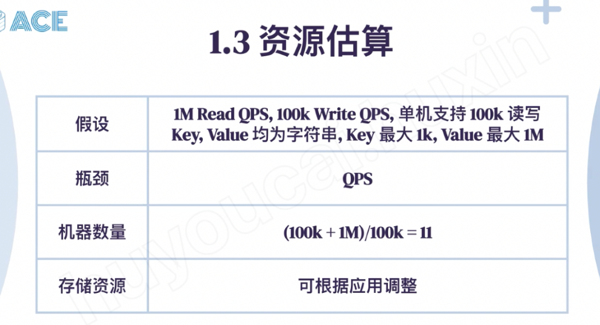{width="10.083333333333334in" height="5.510416666666667in"}

{width="10.083333333333334in" height="5.427083333333333in"}

[Should we support multiple thread?]{.mark}

1.  Cache client sent a RPC call or http request to cache proxy
2.  Cache proxy will talk to zookeeper or configuration center to find out which cache service the it should contact
3.  The whole system, we use LRU strategy to remove the old data if the cache is full
4.  ~~In each service, we maintain hash table + linked list, update is constant time~~
5.  Basic cache just a key value pair in each service, if the collision happen, we can use hash table+ linked list or open address

for hash table, if there is a collision, we need a linklist to store all the collision in one slot, if the list is long, it will take time to find the key: search is O(L) l is the length of list

Or we can use ["open address"]{.mark} , there 3 option, if there is a collision, we just store the value to his next slot ( 1 position away) , if his next slot is full, we will choose the ( 2 position away, 4 position away, 8 position away)

Open addressing : each slot is key value pair, the memory can be pre allocated

For open addressing, first we calculated a slot based on the hash algorithm, if that slot has been occupied, we need to jump to 1 position away, 2 position away ..

For search, we need to search 1 position away, 2 position away ... Until we find the key value pair

If we supposed it is in the 8 position way, after we deleted ,we need to move the furthest slot or key -value pair ( assume it is in 128 position away) to 8 position -- reinsert

{width="10.083333333333334in" height="6.979166666666667in"}

Linear probing is if current slot is full, use the next slot: slot next to the current slot

Quadratic probing, 1 position away , 2 position away, 4 position away, 8 positions away

Double hashing, same hash algorithm and using the last result as the input to hash again

Linear probing' s cache performance is better than others since we don't need much calculation

But double hashing will [have minimize the clustering]{.mark} compared with other 2 solution

{width="10.083333333333334in" height="6.104166666666667in"}

Load factor = 1 mean every slot has a data, we need to add more memory space, chaining or list solution will slow when the load factor >1

Memory pool: in the memory, there are lot of discontinuous memory, we can use them as the nodes of the linked list, each node is connected by a point

{width="10.083333333333334in" height="8.479166666666666in"}

Dynamic rehashing: we can create a new memory space, use new hash algorithm to write the data to the new memory space , only use the old hash algorithm to read

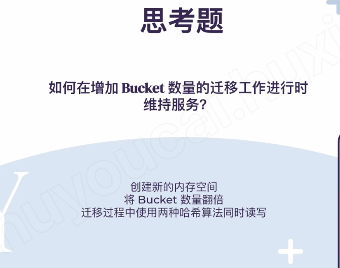{width="10.083333333333334in" height="7.989583333333333in"}

How to choose:

1.  Do you want to drymatic rehashing
2.  The complexity is in memory relocate -- LinkedList or dynamic rehashing

Trade off is use a tree struct binary search tree or B+tree for index instead of hash table, the search will be logn, but tree structure is supposed range query, ( binary tree need less memory compared with hashtable)

We can just replace the long LinkedList to binary search tree

![Hash Table 优 化 策 Copy " 有 点 像 " 即 。 t 我 理 留 的 是 关 于 dynmic rehashing 地 那 ca h newchange* 地 很 难 " h up " changeW 翅 果 每 次 祁 是 完 全 新 的 庶 到 en N 9 to E 虍 我 记 得 归 ' ] h hm s 寞 坝 就 是 EST 代 替 linkedlist 》 亻 y 四 m " 開 here„. 0 使 用 BST 替 代 链 表 Rehash 增 加 Bucket 数 量 ](../../media/Memeory-ACE-cache-Function-requirement--key-value-cache,-support-get,-set,-delete-and-support-LRU---least-recently-used-eviction-image7.png){width="10.083333333333334in" height="5.239583333333333in"}

{width="10.083333333333334in" height="5.65625in"}

[Problem, need to shared a global Double linked list and lock the whole linked list. It is a bottlenecks]{.mark}

{width="10.083333333333334in" height="8.802083333333334in"}

Lazy expiration: when we read a data, if the data is expired, we just return a cache miss and delete it

Active expiration, a cron job just read the key randomly, if the data is expired, we just deleted

How to Memory allocation

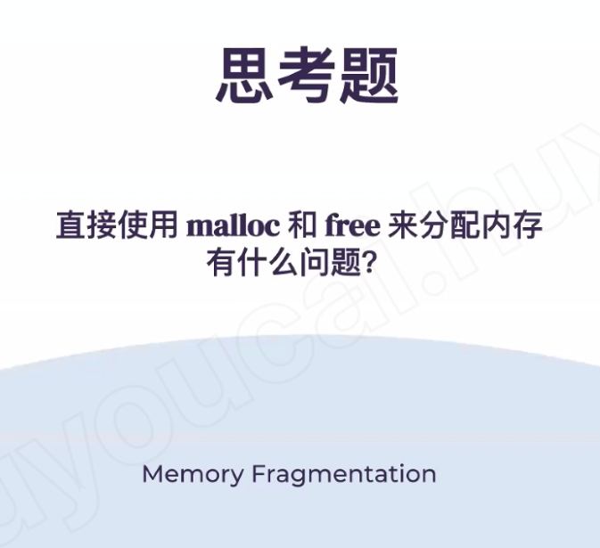{width="10.083333333333334in" height="9.21875in"}

{width="10.083333333333334in" height="6.229166666666667in"}

The memory has different slab, in each slab, they have multiple pages,

[~~All page's size is 1mb~~]{.mark}

Each page they have multiple chucks

each chuck has different (chuck) size, we put the same chuck size in the same slab

All the 8bytes chuck in the slab 1

All the 10 bytes chuck in the slab 2 ( increase 20%)

The largest chuck is 1MB

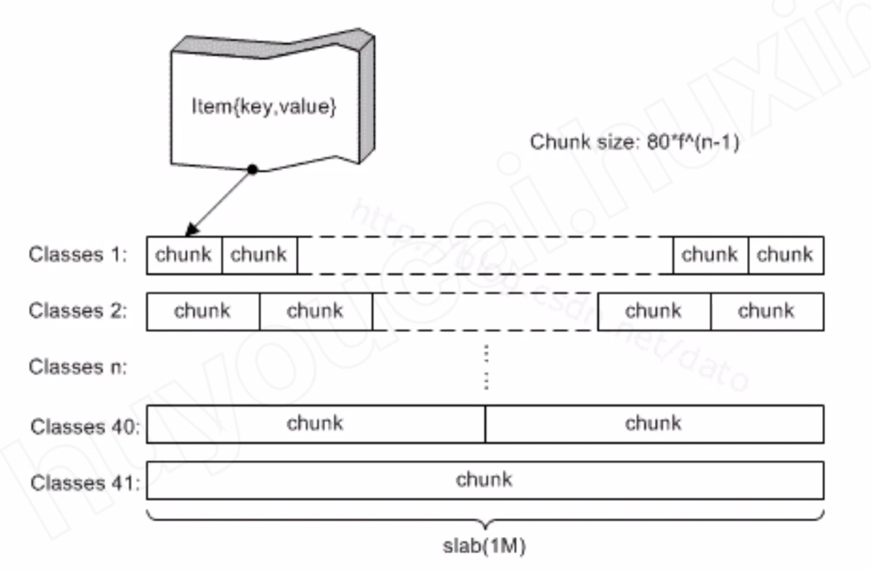{width="10.083333333333334in" height="6.635416666666667in"}

Each slab has multiple pages, all pages is connected by the point, (the pages are not necessarily contiguous) each pages has multiple chuck, slab1's page is form from 8byts chucks; slab2's page is form from 10 bytes chunk

[System will find the best slab based on the size of the key value pairs]{.mark}

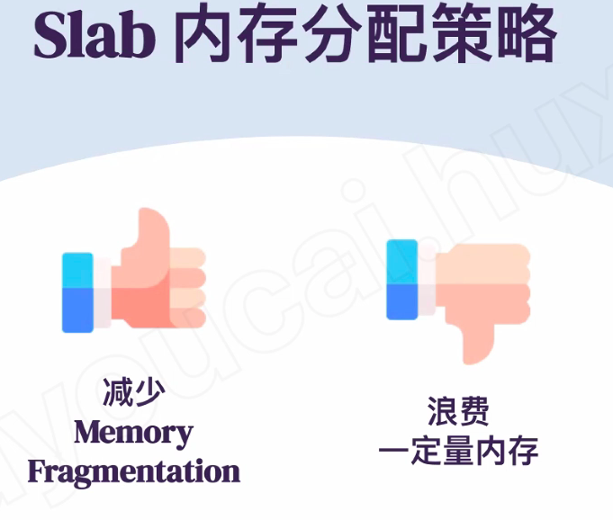{width="10.083333333333334in" height="8.572916666666666in"}

{width="10.083333333333334in" height="9.21875in"}

Concurrency Control

{width="10.083333333333334in" height="5.4375in"}

CAS compare and swap, before write the new value, we need to read a old value first

{width="10.083333333333334in" height="9.385416666666666in"}

Lock the resource

{width="10.083333333333334in" height="9.90625in"}

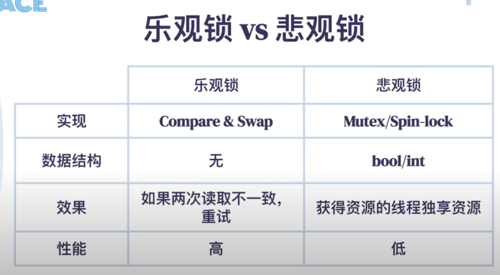{width="10.083333333333334in" height="5.59375in"}

Bool/ in is indicate the resource has lock or not/ who own the lock

{width="10.083333333333334in" height="5.5in"}

Spin-lock ---- while() ..... Wait the lock release

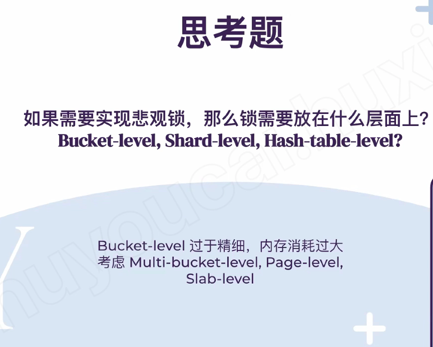{width="10.083333333333334in" height="8.104166666666666in"}

Web service

{width="10.083333333333334in" height="10.020833333333334in"}

The web service first has a acceptor thread to accept the request than sign the request to a thread in the tread pool

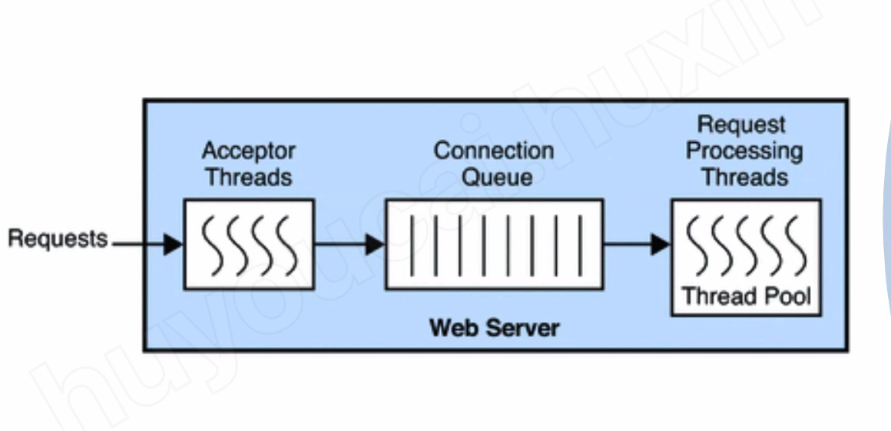{width="10.083333333333334in" height="4.916666666666667in"}

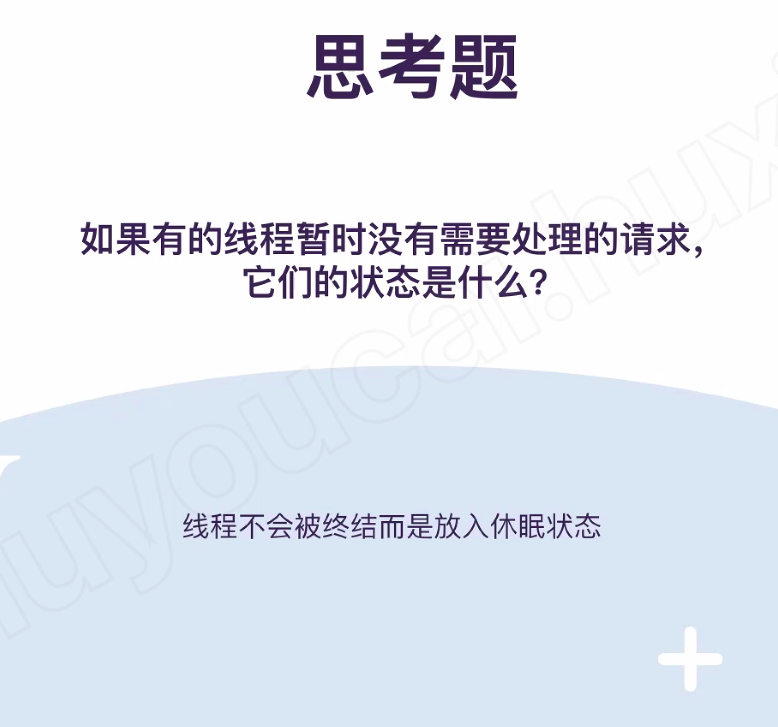{width="10.083333333333334in" height="9.427083333333334in"}

It just for read, write still use TCP

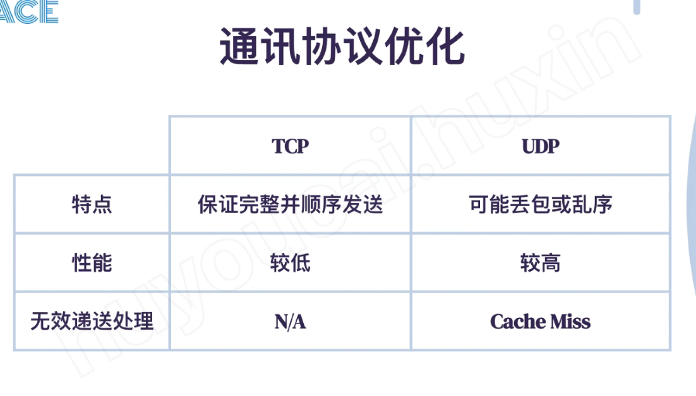{width="10.083333333333334in" height="5.8125in"}

{width="10.083333333333334in" height="4.96875in"}

{width="10.083333333333334in" height="4.833333333333333in"}

Client lib/Daemon --- client know which service he should talk to

Proxy --- client talk to proxy and proxy know which service should talk to

Client talk to any service and service will forward the request to another service

{width="10.083333333333334in" height="7.53125in"}

{width="10.083333333333334in" height="4.770833333333333in"}

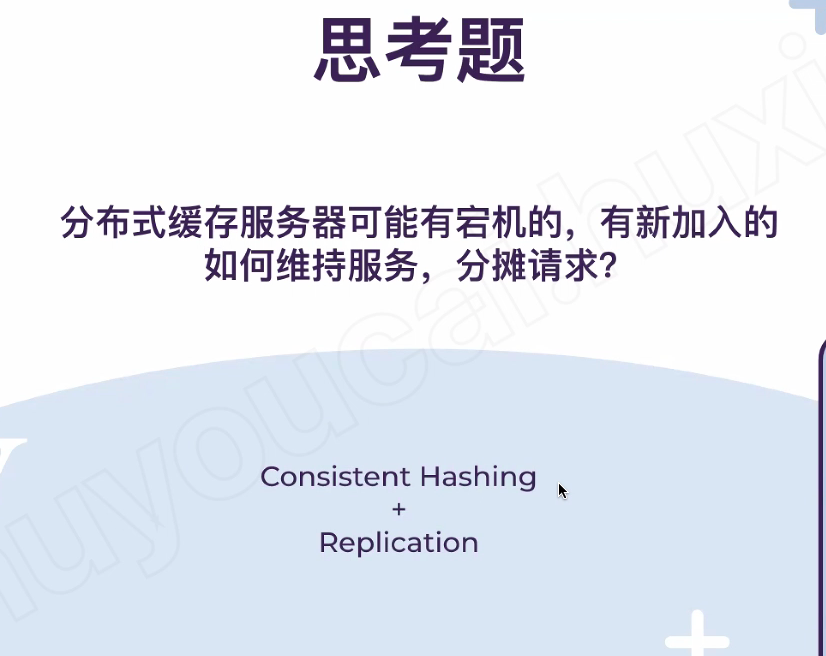{width="10.083333333333334in" height="8.020833333333334in"}

{width="10.083333333333334in" height="8.583333333333334in"}

Gossip --- forward the hash range information to all the nodes

Or store in the configuration service

