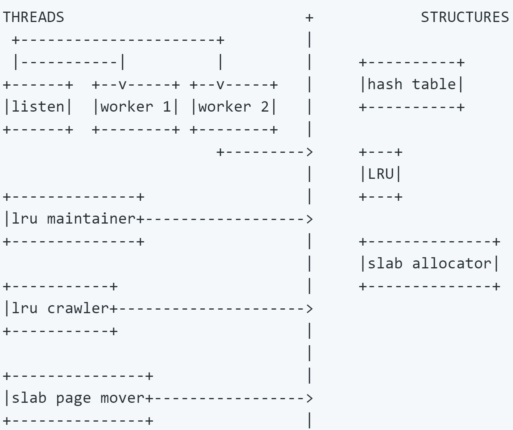
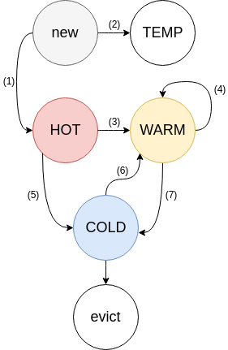

# 1. 什么是 Memcached?

Created: 2020-12-30 18:18:59 -0600

Modified: 2020-12-30 18:23:36 -0600

---

1. 什么是 Memcached?

Memcached 是一个高性能分布式缓存系统，它诞生于2003年，其的设计初衷是为愈加复杂的网站降低数据库载荷

。

虽然在诞生初期，它是一款革命性的软件，帮助了很多公司包括 [Facebook](https://www.facebook.com/notes/facebook-engineering/scaling-memcached-at-facebook/39391378919/) 创造出了各种各样的服务，从今天（2020）的视角上看，Redis 已经在绝大多数领域里替代和超越了 Memcached，在设计新服务时选用 Redis 往往更优。在下一篇中我们会深入了解 Redis。

既然如此，学习 Memcached 的意义为何呢？

- Memcached 是一款功能单一的软件，为我们在系统设计面试中设计 Cache 提出了可以借鉴的思路。
- 学习 Memcached 可以帮助我们学习 Cache 最基础的知识，对比分析 Redis 时能够加深理解。

2. 核心功能

分布式缓存。当我们有一些数据需要反复被调取时，与其总是访问数据库，我们暂时把它存在内存中，直接返回。

API 层面上提供简单的 GET 和 SET API 读写一组键值对 (Key-value Pair)。

function get_foo(foo_id)
foo = memcached_get("foo:" . foo_id)
return foo if defined foo

foo = fetch_foo_from_database(foo_id)
memcached_set("foo:" . foo_id, foo)
return foo
end

取自 memcached.org

值得注意的是每个 Key 只存在在 Memcached 集群的一台 Memcached 机器上，而不会同步写到每一台上，从而使整个 Memcached 集群可以存储更多数据。

3. 内存分配

3.1 分配机制

Memcached 默认将内存分为 1MB 大小的 page。每个 page 会被分配到特定的 slab class，然后被进一步根据 slab class (以下简称 class) 规定的大小，分成 chunks。

$ ./memcached -vv
slab class 1: chunk size 80 perslab 13107
slab class 2: chunk size 104 perslab 10082
slab class 3: chunk size 136 perslab 7710
slab class 4: chunk size 176 perslab 5957
slab class 5: chunk size 224 perslab 4681
slab class 6: chunk size 280 perslab 3744
slab class 7: chunk size 352 perslab 2978
slab class 8: chunk size 440 perslab 2383
slab class 9: chunk size 552 perslab 1899
slab class 10: chunk size 696 perslab 1506
[...etc...]

取自 dormando. (2017). Github Memcached User Internals

从上面的例子上可以看出序号较小的 class 会有更小的 chunk size，意味着这个 class 是用来存较小的数据的。比如 chunk size 为 80 bytes 的 class，存储数据量小于 80 bytes 的数据 (key + value + misc data)，多余下来的会被浪费。

我们可以把每一个 class 理解成独立的缓存，拥有自己独立的 LRU (Least Recently Used) 数据结构。

3.2 设计赏析

C 的 malloc/free 会造成内存碎片化。Memcached 这样可预测的内存分配形式浪费了一些内存，但是保证服务的长期稳定运行。

4. 内存回收

4.1 回收机制概要

下面我们介绍 Memcached 新版 (2018) 的内存回收机制，还是很巧妙的。其内存回收机制有三个重要的优化，Segmented LRU，LRU Crawler 和 Slab Rebalance。

值得注意的是，Memcached 采用的 LRU 机制远非严格意义上的绝对的 LRU，最显而易见的一点就是不同 class 之间不会区分访问先后顺序。这里所说的 LRU 指的是我们下面规定的这个特殊的类 LRU 机制。

{width="5.0in" height="4.1875in"}

取自 <https://github.com/memcached/memcached/wiki/Extstore>

4.2 回收内存的目标

- 防止常被访问的 Key 被踢出
- 降低延迟 - 减少 LRU Lock 的使用
- 合理协调各 class 的内存

4.3 Segmented LRU (分段式LRU)

4.3.1 数据状态

我们对于单个数据会维护两个状态。

- Fetched 当数据被访问时，设置为1。
- Active 当数据被访问第二次时设置为1。被往前提 (Bump) 或移动时设置为0。

4.3.2 子LRU的规则

{width="2.9166666666666665in" height="4.489583333333333in"}

取自 dormando. (2018). Replacing the cache replacement algorithm in memcached

LRU 被分成四个子 LRU。

- HOT
- 新的数据从这里进来
- 数据在这里排成队列，一旦到了队尾，如果 Active，放入 WARM；如果不是，放入 COLD
- 数据即使被访问了，顺序也始终不变
- 此 LRU 占用内存的大小主要会被限制在全部内存的一定百分比
- 队尾数据的年龄会相对 COLD 队尾数据的年龄被限制
- WARM
- 只有当数据被访问至少两次时，才会被放到 WARM
- 如果队尾数据是 Active，放到队头；如果不是，放入 COLD
- 此 LRU 占用内存的大小主要会被限制在全部内存的一定百分比 (与 HOT 相同)
- 队尾数据的年龄会相对 COLD 队尾数据的年龄被限制 (与 HOT 相同)
- COLD
- 内存满之后，COLD 的队尾数据会被踢出
- 当 COLD 队列里的数据变得 Active，该数据会被异步放入 WARM。
- 这个异步放入 WARM 的操作可能不及时，甚至在过载情况下变得在部分时候随机发生。
- TEMP
- 默认不使用
- 用于超短 TTL 数据
- 数据即使被访问了，顺序也始终不变，也不会移到其他地方

4.3.3 机制实现

以上四个子 LRU 规则的维护是由称为 LRU Maintainer 的后台线程实现的。

- 遍历所有的子 LRU，看一下队尾
- 保证每个子 LRU 在大小范围以及队尾在年龄范围内，如果不满足，移动一些数据。
- 回收过期数据内存
- 异步将 COLD 队列里的 Active 数据放入 WARM
- 如果特定 class 已经没有 COLD 数据可以踢了，那么普通的 worker 线程会 block SET 指令，将数据踢出 HOT 和 WARM，而不是依赖后台线程处理。

4.3.4 设计赏析

回顾一下我们最初的设计目标 - 降低延迟，这个机制很巧妙地做到了。
- LRU 维护不会在取数据时发生，也就不会有 LRU lock
- LRU 维护绝大多数情况下是异步发生的
- 多个子 LRU 各自维护自己的 LRU lock，使得一个子 LRU lock 时，别的依旧可以写
- 每个数据的状态仅 2 bit

相比于单 LRU lock 的设计，延迟降低了一个级别。

4.4 LRU Crawler

回顾一下前面内存分配的章节的知识，每个 class 都是自己独立的缓存，每个都拥有自己的 Segmented LRU。那么问题来了，如何保证 class 之间的内存分配是合理的呢？要准确了解内存情况就得先处理掉内存中的过期数据。

LRU Crawler 就是解决这个问题的后台进程。

4.4.1 Crawler规则

- 从每个 class 的每个子 LRU 的队尾同步开始向队头方向寻找，回收过期数据。这里同步的意思是排好队齐步走，这样较短的 class 会很快完成，不至于要一直等到较长的 class 完成后被处理。
- Crawler 边走边维护一个 TTL 直方图，并根据直方图决定多久以后再重新扫描该LRU。如果一个 class 有很多马上就要过期的数据，那么 Crawler 就会在短时间内重新扫描，反之，则可以等等。

4.4.2 设计赏析

这里的设计目标是尽快地回收最大量的内存。

上述的规则会自然地反复快速地回收序号较大的 class 来回收尽可能多的内存，也会根据使用特征来在不同 class 之间平衡数据回收的频率。

4.5 Slab Rebalance

这是一个可选的功能。

随着信息结构的变化，信息的大小会有起伏，使得某一些 class 的大小不再合适。Slab Automove 和 Slab Reassign 功能使得一个 class 的内存可以重新分配到别的class里。

- Slab Automove 会根据每个 class 里一定时间内内存被提出的次数来找到需要更多内存的class
- Slab Automove 会根据每个 class 里空余的内存来找到可以减少内存的 class
- Slab Reassign 实现将一个 page 从 class A 移交到 class B 的交接工作，使用一个后台进程将这个 page 内所有的数据全部提出并且完成移交。

5. 参考资料

- [dormando](https://twitter.com/dormando). (2018). [Replacing the cache replacement algorithm in memcached](https://memcached.org/blog/modern-lru/)
- dormando. (2018). [About Memcached](https://memcached.org/about)
- dormando. (2016). [A Story of Caching](https://github.com/memcached/memcached/wiki/TutorialCachingStory)
- dormando. (2017). [User Internals](https://github.com/memcached/memcached/wiki/UserInternals)
- dormando. (2017). [New LRU](https://github.com/memcached/memcached/blob/master/doc/new_lru.txt)
- dormando. (2019). [External sotrage](https://github.com/memcached/memcached/wiki/Extstore)
- dormando. (2016). [Answer to "Possible issue with slab rebalance"](https://github.com/memcached/memcached/issues/151)

