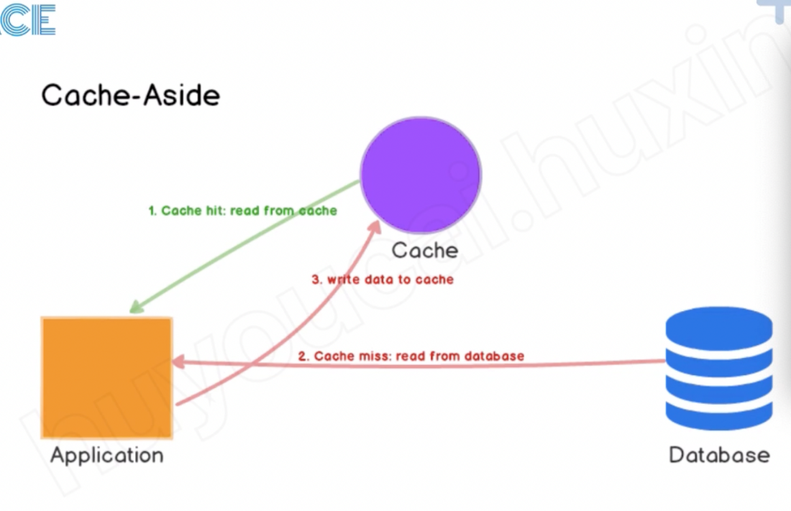
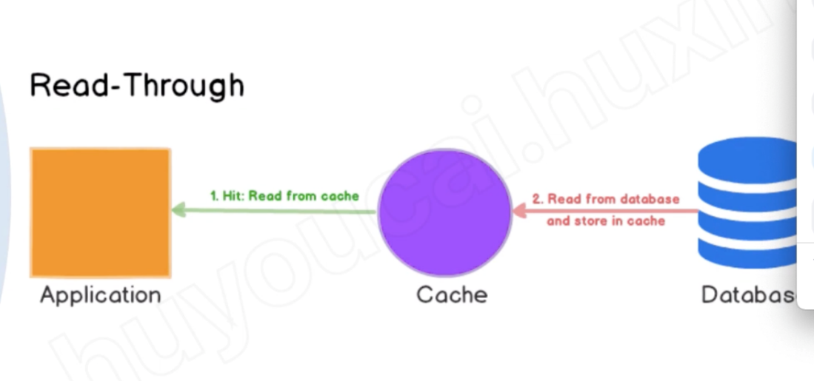
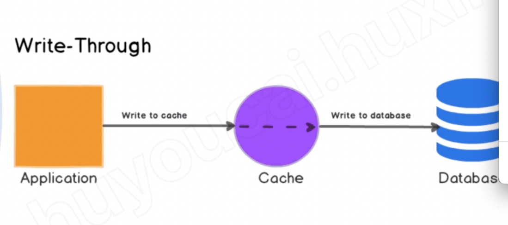

# ACE cache

Created: 2021-04-26 10:26:59 -0600

Modified: 2022-02-18 13:04:40 -0600

---

Amazon Training

**Read strategy**

{width="5.0in" height="3.2291666666666665in"}

Cache don't need to talk to database

{width="5.0in" height="2.34375in"}

Cache will talk to database

Write strategy

{width="5.0in" height="2.21875in"}

Write successfully when write into cache and database ( update cache and database --- consistency between .. )

{width="5.0in" height="2.1041666666666665in"}

Write will return successful when data write into cache, cache will flush into databse when cache is full

{width="5.0in" height="2.5520833333333335in"}
1.  Lazing loading -- similar to Cache aside

the advantage

<https://indeed.zoom.us/rec/play/H3XLrrAdLHlr4anw0gvt7RENPqJ2EY4ilBNubGISmNL8ouFNLKxGYrFXybXYVgrLHBPW1P1scxpy8usZ.EsVVOADAIn8Uzso3?continueMode=true>

00:56

avoid some un-necessary data in the cache

Cache can be repopulated at anytime immediate

Disadvantage:

The cache miss could be expensive. If there is no data in the cache, you need read the data from db and update the data to the cache as well

{width="5.0in" height="2.7395833333333335in"}

{width="5.0in" height="2.7083333333333335in"}
1.  Client don't need to deal with the write to cache
2.  Need to wait longer for writing
3.  Unnecessary data in the cache: if you've never read the data from cache then the data will still in the cache
4.  Delay: you have to wait lamdba write the data to the cache

Update database

Update cache

{width="5.0in" height="2.4583333333333335in"}

<https://indeed.zoom.us/rec/play/H3XLrrAdLHlr4anw0gvt7RENPqJ2EY4ilBNubGISmNL8ouFNLKxGYrFXybXYVgrLHBPW1P1scxpy8usZ.EsVVOADAIn8Uzso3?continueMode=true>

![2. Who can see your viewing activity? Caching Strategies - Lazy Load Only caches data that is read ummary Cache populates when reads occur Immediate benefit Latency from cache miss is expensive Data can get stale Often uses String * Write-Through Caches data that may never be read Cache populates when updates occur Delayed benefit Write latency better tolerated vs. read latency Data is never stale Often uses Hash * You can combine these strategies! * Commonly used but not limited to this data type ](../../media/Memeory-Cache-ACE-cache-image9.png){width="5.0in" height="2.65625in"}

{width="5.0in" height="3.0208333333333335in"}

Or write through pattern

Client don't need to deal with the updating the cache

{width="5.166666666666667in" height="0.5416666666666666in"}

{width="5.0in" height="2.8854166666666665in"}

Cache - aside / write around need a TTL

{width="5.0in" height="2.5208333333333335in"}

RDB -- snapshot

