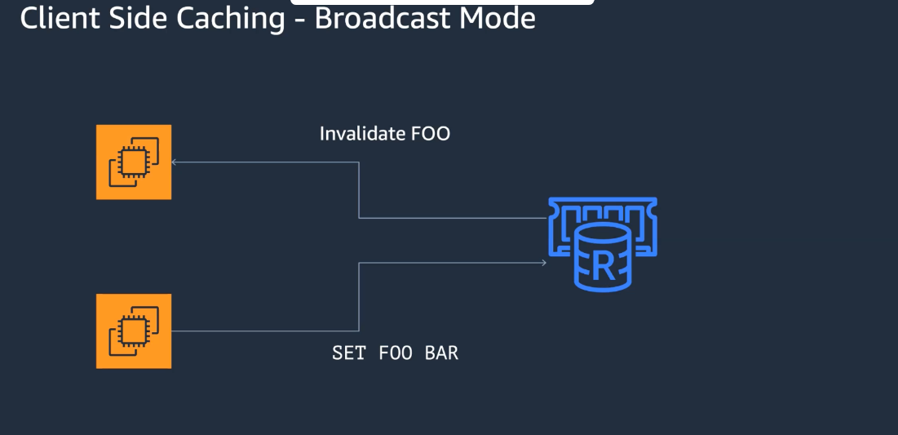

# Broadcast 

Created: 2022-02-18 18:05:13 -0600

Modified: 2022-02-18 18:14:55 -0600

---

This the primary source of truth --- database

and then this single source of truth will broadcast the changes or

Then you just have a single value a register and pop sub telling you those registers are updated and update the in memory copy.

{width="5.0in" height="2.4270833333333335in"}

![Best Practices - Evic Ions Keys can be automatically removed when memory is full Policy Name allkeys-lru volatile-Iru* allkeys-lfu volatile-lfu* volatile-ttl* volatile-random* allkeys-random no-eviction Description Evicts the least recently used (LRU) regardless of TTL set Evicts the least recently used (LRU) from those that have a TTL set Evict any key using approximated least frequently used (LFU) Evict using approximated LFU among the keys with a TTL set Evicts the keys with shortest TTL set Randomly evicts keys with a TTL set Randomly evicts keys regardless of TTL set Doesn't evict keys at all. This blocks future writes until memory frees up. * Volatile policies only evicts keys with TTLs ](../../media/Memeory-Cache-Broadcast-image2.png){width="5.0in" height="2.4895833333333335in"}

