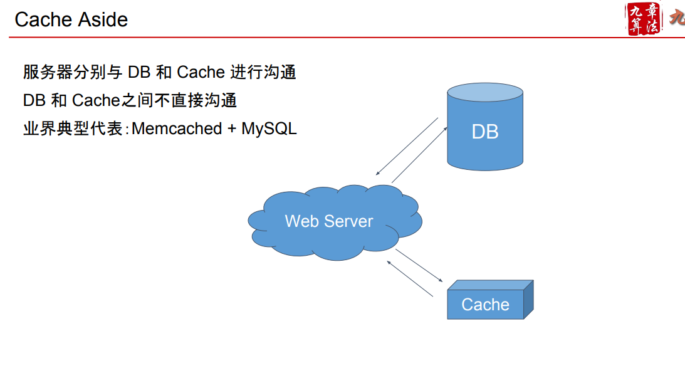
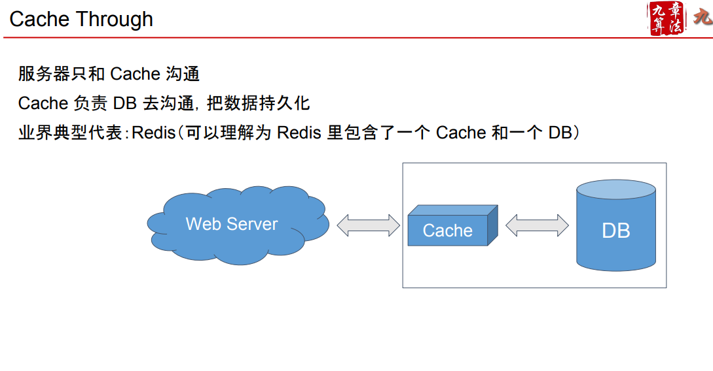

# Cache

Created: 2017-05-06 00:18:11 -0600

Modified: 2021-02-09 18:40:28 -0600

---

{width="5.0in" height="3.2847222222222223in"}

{width="5.0in" height="4.215277777777778in"}

{width="5.0in" height="2.4027777777777777in"}

{width="5.0in" height="2.826388888888889in"}

{width="5.0in" height="2.6041666666666665in"}

what`s access pattern

**Write through cache :** everything if you want to write to the DB need write to the cache first and it is considered succeed if both write succeed.

This is really useful for applications which read the information quickly and since the same data gets written in the DB, we will have complete data consistency between cache and storage. However, write latency will be higher in this case as there are writes to 2 separate systems.

**Write around cache :** This is a caching system where write directly goes to the DB. While this ensures lower write load to the cache and faster writes,

but it will lead to a higher read latency if the a cache miss happen and we need read the data from database

**Write back cache :** just write to the cache and the write is confirmed as soon as the write to the cache completes. The cache will refresh or syncs to the DB when the cache is full. This would lead to a really quick write latency and high write throughput.

But, since the data is in the memory and not persistent. if the cache layer is died, we will lose the data

We can improve by introducing having more than one replica so that we don't lose data if just one of the replica dies.

Cache police

Normal:

before hit the database, application will check the cache quickly if the case miss, application will read from databases and update the cache

Delete or update the database

if want to delete or update the data in the database , we want to delete or update the data in the cache first, if update cost is high, just need delete the data from the cache, then delete the data from database.

80-20

we have a 80-20 rule, 20% of the tweet or photo will generate 80% read traffic which mean we can cache those popular item in the cache.

recently

base on the calculation

we can cache all tweets from all users in last 3 days

100 G is easy to fit to one cache service, we should replicate it on to multiple service to distribute the read traffic

**Which cache eviction policy would best fit our needs?**When the cache is .full, and we want to replace a link with a newer/hotter URL, how would we choose? Least Recently Used (LRU) .

Under this policy, we discard the least recently used URL first. We can use a[Linked Hash Map](https://docs.oracle.com/javase/7/docs/api/java/util/LinkedHashMap.html)or a similar data structure to store our URLs and Hashes, which will also keep track of which URLs are accessed recently.

To further increase the efficiency, we can replicate our caching servers to distribute load between them.

~~facebook cache~~

~~There is one 'leader' region and several 'slave' regions. Each region has a complete copy of the databases. There is an ongoing async replication between leader to slave(s). In each region, there are a group of machines which are 'followers',~~

~~followers will respond for the read request and cache miss will forward to leader~~

~~and the leader get the result from the their cache or query the DB~~

~~Write requests are forwarded to the leader of that region. If the current region is a slave region, the request is forwarded to the leader of that shard in the master region.~~

~~The leader sends cache-refill/invalidation messages to its followers, and to the slave leader, if the leader belongs to the master region.~~

