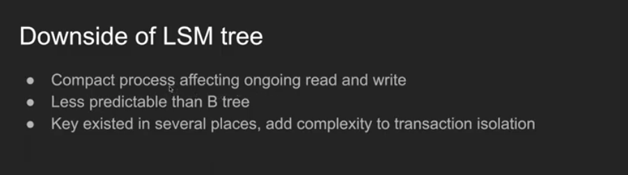
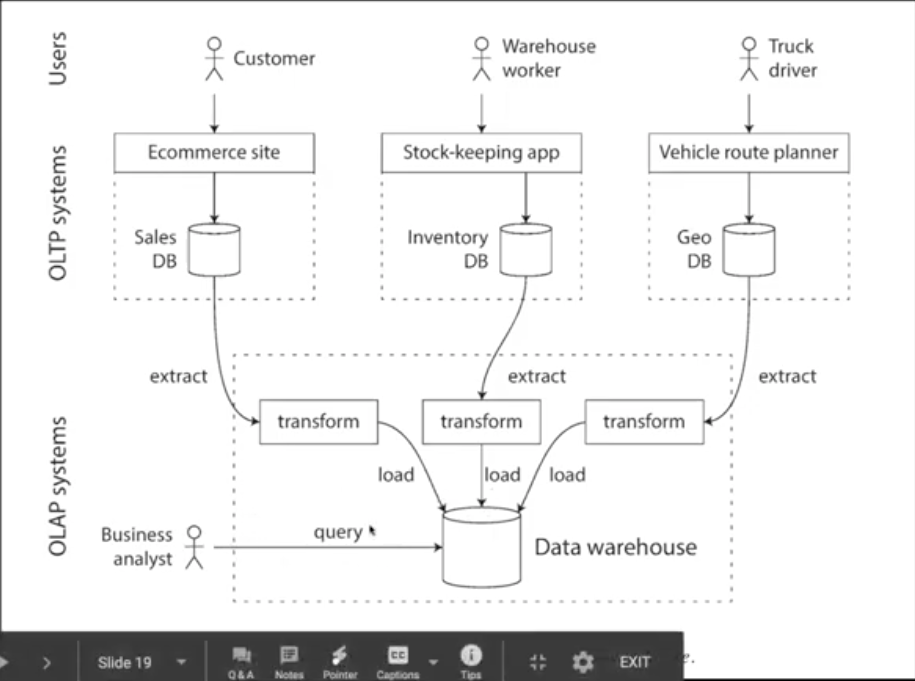

# Chapter 4 Data retrieval 

Created: 2020-12-31 16:36:46 -0600

Modified: 2021-02-11 01:21:07 -0600

---

[Chapter 4: Data retrieval](https://www.youtube.com/watch?v=hVm-fNxVFVI)

{width="10.083333333333334in" height="6.34375in"}

[Version 1: Simplest database]{.mark}

Update, just update the latest recode to tail

Problem 1. search, need to scan the whole database

Improve 1. index key value is the offset of the disk -- speed up the read but slow down the write, need write twice one for record, another one for index

Access pattern is for read heavy ( for interview, need ask the access pattern, how many read, how many write, the ratio for read and write

What kind of read request will be : search id, search location ...

What kind of write, append new value or update the old value .. )

[Version 2: in memory index (key + offset) + log structure file on disk : length + value]{.mark}

Append the data to disk , all the write is sequential

{width="10.083333333333334in" height="6.395833333333333in"}

Like you tuber counter: key is url and value is count, we just append the count to disk and a background job (compaction and merge process) will merge the delete the old value

Problem :

![Further improvements: • File format CSV is not the best format for a log. It's faster and simpler to use a binary format that first encodes the length of a string in bytes, followed by the raw string (without need for escaping) Deleting records o If you want to delete a key and its åssociated value, you have to append a special deletion record to the data file (sometimes called a tombstone). Crash recovery o If the database is restarted, the in-memory hash maps are lost. Partially written records The database may crash at appending a record to the log. Bitcask files include checksums, allowing such corrupted parts of the log to be detected and ignored. Concurrency control As writes are appended to the log in a strictly sequential order, a common implementation choice is to have only one writer thread. Data file segments are append-only and otherwise immutable, so they can be read concurrently by multiple threads. ](../../media/Memeory-Cache-Chapter-4-Data-retrieval-image3.png){width="10.083333333333334in" height="6.333333333333333in"}

A comma-separated values (**CSV**)

Concurrency: one thread for writing and multiple thread for reading

Write is immutable, append only

[Version 3 in memory sparse index + SSTable]{.mark}

[即可: in memory: the sequence of key value pairs and key is sorted,]{.mark}

[Sparse index: each SStable segment or each level : first element and offset , last element and offset]{.mark}

{width="10.083333333333334in" height="6.270833333333333in"}

1.  SSTable

We call this format Sorted String Table , or SSTable for short. We also require that each key

only appears once within each merged segment file (the compaction process already ensures that).

Merging segments is simple and efficient

In order to find a particular key in the file, you no longer need to keep an index of all the

keys in memory.

Ji ke: all SSTable is sorted and each table size is 2M ,level 0 is flush from memory and from leve1 to level n no duplicate key

Level 0 contain the most recently value

2.  If we have too many key or key is larger (URL ,URL should be reversed ), we don't need put all the keys to memory, for example

~~aa -- offset 1~~

~~ad-- offset 3~~

[~~we know ac should be between 1 and 3 since aa ac and ad are sorted in the disk (SStable)~~]{.mark}

[Each entry of the sparse in memory index points to the start record and each block]{.mark}

3.  LSM tree -- log structure merge tree ( different of the data write to in - memory balance tree (memtable, and write ahead log )first,

[You can insert key in any order and read them back in sorted order]{.mark}

For the most recent writes in memtable, we can keep a sperate log on disk which every write is immediately appended. The log is not in sorted order

if bigger then [threshold]{.mark} then write to disk (segment, there should be many segments in the disk, most recently segment, second most recently segment ... ), for old data compress to a large file (compaction)

Size ~~tire~~ compaction ( more than one year --> compress into one file .. 3 month - 6 month --> compress into one file

LSM tree is good for writing

![LSM tree When a "lite collie.' ln. add it 10 an in-Inclnor balailced tree data a red-I'lack [his in-memo tree is sometirnes called a memta/'lc When the memtable 'ets bi 'Zer than some threshold---t icall a lew 'ab it out to disk as SSI-able file. This can be done emcientl • because the tree alread Inaintains the ke -value airs sorted b I he new SSTable file the recent se of the While the SSTable I bein•-r to disk. writes can continue to a new memtable In order to sene a read re uest. first to find the kev in the ill the recent 'Inent. then in the next-older se 'Inent. etc I-rom time to time. run a mer in ' and In the to file's !iscard or deleted Bloom filter for not existing keys Size tier or level compaction ](../../media/Memeory-Cache-Chapter-4-Data-retrieval-image5.png){width="10.083333333333334in" height="5.40625in"}

Merge several ssTable segment into one new segment

Ji ke: on the disk stable segment have multiple level, each level is sorted and

level 0 is most recently data, then go to the next- most receltly level

each level can use binary search to find the target data

B tree

{width="10.083333333333334in" height="5.354166666666667in"}

Is good for reading

Half written record:

1.  Write ahead log
2.  Copy on write:

{width="10.083333333333334in" height="1.2291666666666667in"}

{width="10.083333333333334in" height="0.9583333333333334in"}

B+ Tree, all value will store in the leaf node

{width="10.083333333333334in" height="3.9895833333333335in"}

If user always read the new value, LSM tree is better than B tree

{width="10.083333333333334in" height="2.875in"}

Less predictable than B tree : because the background process

Index

local secondary index

Only in the single node

update or write the index fast since the index is in the partial partition

but you need search all the partition

if you want to search "las cruces", you need search all the partition's local secondary index

for read, you need fanout all the partition

global secondary index

update is slow compared with local, global index maybe also stored in the different partition (partition the global index)

read is fast

B tree

only reference index (in money) -- point to the physical page

cluster index key, primary key, the index and value are stored together ( in the memory, all the modification are in the memory )'

Clustered index, all filed and value stored in the memory

covering index, some of the filed stored in the memory base on the frequency, others point to the disk

Tire also can be used to index -- fuzzy search index

Fuzzy search (seach : FOO) F*O -->search the tire

![Main read pattern Main write pattern Primarily used by What data represents Dataset size Transaction processing systems (OLTP) Small number of records per query. fetched by key Random-access. low-latency writes from user input End user/customer, via web application Latest state of data (current point in time) Gigabytes to terabytes Analytic systems (OLAP) Aggregate over large number of records Bulk import (ETL) or event stream Internal analyst, for decision support History of events that happened over time Terabytes to petabytes ](../../media/Memeory-Cache-Chapter-4-Data-retrieval-image11.png){width="10.083333333333334in" height="7.65625in"}

{width="10.083333333333334in" height="7.520833333333333in"}

analytic database or start schema, snowflake schema, data cube

![dim_product table product_sk sku description dim_store table brand Aquatec h Dealicious promotion_sk NULL NULL category Fresh fruit Pet supplies Bakery customer_sk NULL NULL store_sk state 0K4012 KA9511 A81234 fact sales table date_key product_sk 140102 140102 140102 140102 dim date table Bananas Fish food Croissant store_sk q uantity WA CA net_price 14.99 city Seattle San Francisco Palo Alto discount_price dim customer table custome_sk name date_key 140101 140102 140103 year month day wee kday thu is_holiday 2014 2014 2014 jan jan 1979-03-29 1961-09-02 1991-12-13 dim_promotion table promoti on_sk name New Year sale Aquarium deal ad_type Direct mail Coffee & cake bundle In-store Sign Alice Bob Cecil coupon_type NULL Leaflet NULL Figure 3-9. Example of a star schema for use in a data warehouse. ](../../media/Memeory-Cache-Chapter-4-Data-retrieval-image13.png){width="10.083333333333334in" height="12.583333333333334in"}

![fact_sales table date_key product_sk 140102 140102 140102 140102 140103 140103 140103 140103 69 69 69 74 31 31 31 31 store_sk 4 5 5 3 2 3 3 8 J*omoticmsk NULL 19 NULL 23 NULL NULL 21 NULL customer_sk NULL NULL 191 202 NULL NULL 123 233 quantity 3 5 3 net_price 13.99 14.99 14.99 099 2.49 14.99 49.99 099 discount_price 13.99 9.99 14.99 089 2.49 9.99 39.99 0.99 Columnar storage layout: date_key file contents: 140102, 140102. 140102.140102, 140103, 140103. 140103, 140103 product_sk file contents: 69.69.69.74.31.31.31,31 store_sk file contents: promotion _ sk file contents: NULL 19, NULL. 23, NULL. NULL 21, NULL customer _ sk file contents: NULL. 191.202. NULL NULL. 123.233 quantity file contents: file contents: 13.99.14.99. 14.99, 0.99.2.49, 14.99.49.99.0.99 discount_price file contents: 13.99, 9.99, 14.99.089, 2.49, 9.99.39.99, 0.99 Figure 3-10, Storing relational data by column , rather than by row. ](../../media/Memeory-Cache-Chapter-4-Data-retrieval-image14.png){width="10.083333333333334in" height="7.65625in"}

Each column is a file

![Examples: WHERE product_sk IN (30, 68, 69) WHERE product_sk = 31 AND store sk = 3 Column values: product_sk: Bitmap for each possible value: product_sk = 30: product_sk 31: product_sk = 68: product_sk = 74: o o o o o o o o o o o olo o o o o o o o o o o o o o o o o o o o o o o o o o o o o o o o o o o o o o o o o o o o o o o o o o o o o o o o o o o o o o o o Run-length encoding: product_sk = 29. product_sk = 30. product_sk = 31: product_sk = 68: product_sk = 69: product_sk = 74: 9.1 10,2 5.4.3.3 15,1 0.4.12,2 4.1 (9 zeros, 1 one, rest zeros) (10 zeros. 2 ones. rest zeros) (5 zeros, 4 ones, 3 zeros, 3 ones, rest zeros) (15 zeros. 1 one. rest zeros) (O zeros, 4 ones, 1 2 zeros, 2 ones) (4 zeros, 1 one, rest zeros) ](../../media/Memeory-Cache-Chapter-4-Data-retrieval-image15.png){width="10.083333333333334in" height="6.145833333333333in"}

Immutable

Dimension: entity

Fact : Transaction

Dimension: entity

