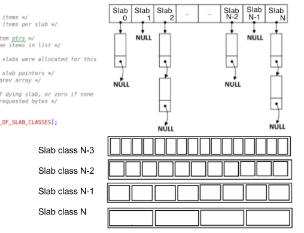

# Design Cache

Created: 2017-07-26 23:34:28 -0600

Modified: 2018-01-28 12:04:41 -0600

---

What is the amount of data that we need to cache?

Do we need to remove some entries to make space for the new entry? what should be the eviction strategy?

[LRU Cache](onenote:..数据结构.one#LRU%20Cache&section-id={2492593A-3DB6-1E4B-8A2B-184565C68495}&page-id={F3C6A411-8F08-C843-986B-1A46294BF32E}&end&base-path=https://d.docs.live.net/77339d157d673f41/Documents/9%20chapter)

[LFU](onenote:..数据结构.one#LFU&section-id={2492593A-3DB6-1E4B-8A2B-184565C68495}&page-id={E10FD87C-F243-6B46-894A-C58B06AE3242}&end&base-path=https://d.docs.live.net/77339d157d673f41/Documents/9%20chapter)

Detail:

LRU: we can maintain a linked list to do it try track the order of using or accessing

So whenever, a get operation happens, we would need to move that object from a certain position in the list to the front of the list.

How would you break down cache write and read into multiple instructions?

Read path : Read a value corresponding to a key. This requires :

- Operation 1 : A read from the HashMap and then,
- Operation 2 : An update in the doubly LinkedList

Write path : Insert a new key-value entry to the LRU cache. This requires :

- If the cache is full, then
- Operation 3: Figure out the least recently used item from the linkedList
- Operation 4: Remove it from the hashMap
- Operation 5: Remove the entry from the linkedList.
- Operation 6: Insert the new item in the hashMap
- Operation 7: Insert the new item in the linkedList.

**How would you prioritize above operations to keep latency to a minimum for our system?**

That requires some form of locking when a write is in progress. We can choose to have writes as granular as possible to help with performance.

Read path is going to be highly frequent. As latency is our design goal, Operation 1 needs to be really fast and should require minimum locks. Operation 2 can happen asynchronously. that means we can return the value to client after op 1 complete then do the op 2 asynchronously

Similarly, all of the write path can happen asynchronously and the client's latency need not be affected by anything other than Operation 1.

Hashmap deals with Operation 1, 4 and 6 with Operation 4 and 6 being write operations. One simple, but not so efficient way of handling read/write would be to acquire a higher level Read lock for Operation 1 and Write lock for Operation 4 and 6.

How would you implement HashMap?

One common way could be hashing with linked list (colliding values linked together in a linkedList) :

Let's say our hashmap size is N and we wish to add (k,v) to it

Let H = size N array of pointers with every element initialized to NULL

For a given key k, generate g = hash(k) % N newEntry = LinkedList Node with value = v newEntry.next = H[g]

H[g] = newEntry

from: <http://key-value-stories.blogspot.com/2015/02/memcached-internals-design.html>

- Power-of-two sized
- Bucket index is determined ashash(key) % hash table size
- Collision resolution via separate chaining or linkedlist
- New entries are inserted in front of the collision chains
- Expansion via allocation of the whole-new table of doubled size and iteratively moving entries from the old table to the new, in background.

each mutex is responsible forhash table size / bucket mutex array sizebuckets.

**Entry allocation** （if the eviction police is LRU, we can remove the tail

entry)

As mentioned above, to minimize fragmentation, Memcached doesn't support arbitrarily sized entry allocations. It predefines several dozens of size classes, called "slab classes", from around 100 bytes, to the value (~ entry, too) size limit, which defaults to 1 MB but could be configured up to 128 MB, with a reasonable step, which defaults to 1.25.

{width="5.0in" height="3.8229166666666665in"}

**The process of the entry insertion**

- Compute hash code of the key
- Acquire corresponding bucket lock
- Try to find the entry with the searched key in the table; if it is present, updates the entry correspondingly.
- Otherwise compute the total entry size (key+ value+ overhead).
- Determine the slab size class (slabclass) for our entry size
- Walk through 5 (hard-coded constant) last entries in the LRU chain for this size class, searching for expired entries. If an expired entry is taken, it is from hash table and LRU list

<!-- -->
- The newly allocated one is unlinked from the slabclass free entry list and inserted in front of the LRU chain

<!-- -->
- Entry contents are written and it becomes the head of the needed hash table bucket chain.

Like memory allocation operations, all operation with per-size-class LRU lists are guarded by a singlepthread_mutex(cache_lock).

**Strong sides of Memcached, compared to Redis**

- It is multithreaded, and scales up to 5 concurrent threads

The key to understanding and optimizing concurrency problems lies in breaking the problem down into as granular parts as possible.

As is the case with most concurrent systems, writes compete with reads and other writes, which requires some form of locking when a write is in progress. We can choose to have writes as granular as possible to help with performance. Instead of having a lock on a hashmap level if we can have it for every single row, a read for row i and a write for row j would not affect each other if i != j. Note that we would try to keep N as high as possible here to increase granularity.

Part 2

QPS， how many machines

![Q: What is the number of machines required to cache? A: A cache has to be inherently of low latency. Which means all cache data has to reside in main memory. A production level caching machine would be 72G or 144G of RAM. Assuming beefier cache machines, we have 72G of main memory for 1 machine. Min. number of machine required 30 TB / 72G which is close to 420 machines. Do know that this is the absolute minimum. Its possible we might need more machines because the QPS per machine is higherthan we want it to be. ](../../media/Memeory-Cache-Design-Cache-image2.png){width="5.0in" height="1.0104166666666667in"}

{width="5.0in" height="1.0in"}

4 is 4 core

1 second = 1000 million second

1 us = 1000 million second

{width="5.0in" height="3.65625in"}

{width="5.0in" height="3.6458333333333335in"}

If the least recently entry is not expired, a single memory allocation mutex (slabs_lock) is also acquired, in addition to locks acquired during getqueries.

