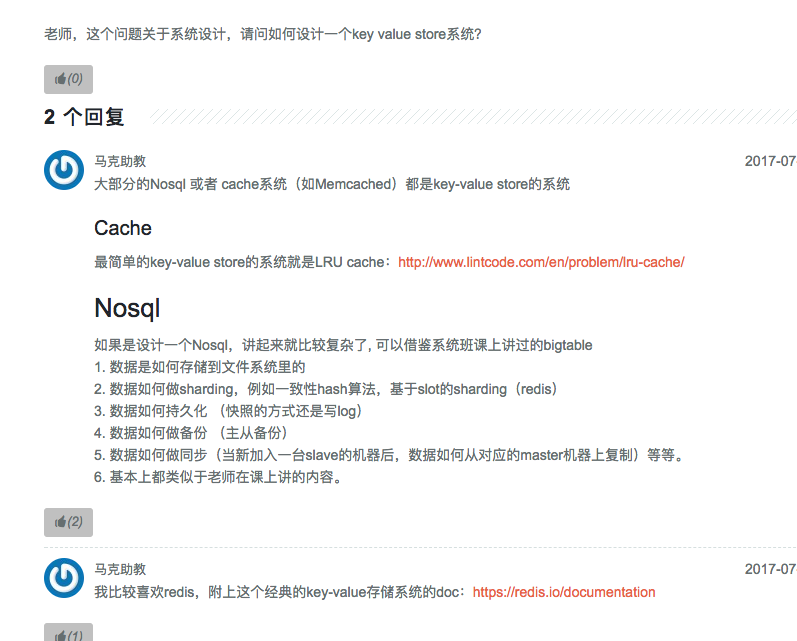

# Key Value storage 

Created: 2017-09-23 16:19:58 -0600

Modified: 2017-09-23 16:21:28 -0600

---

{width="5.0in" height="4.020833333333333in"}

![Memcached 代 码 问题 、 L by 学 3 0 1 年 ， 2 月 前 关 于 第 二 课 第 十 二 页 slide 的 示 例 代 码 ， setUser function 中 e.delete(key) atabase.set user 老 师 在 堂 上 说 过 这 两 句 顺 序 不 能 变 ， 台 则 会 有 inconsistencytö]#, 但 具 体 原 因 没 有 听 得 太 清 楚 ， 能 否 重 复 一 下 ？ 交 挨 了 顺 序 的 话 ， 先 改 变 database ， 如 果 这 个 时 候 断 电 了 ， 那 下 一 次 访 问 仍 然 先 访 问 以 前 的 cache ， 内 容 就 不 一 致 了 3 个 回 复 s 同 学 东 邪 黄 药 用 楼 上 正 解 。 2016 ． 07 ． 21 2016 ． 07 ． 24 ](../../media/Memeory-Cache-Key-Value-storage-image2.png){width="5.0in" height="3.1875in"}

