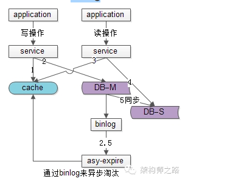

# Summary 

Created: 2018-01-28 10:45:00 -0600

Modified: 2020-01-08 11:49:00 -0600

---

3 **different type of cache access pattern :**

**Write through cache :** everything if you want to write to the DB need write to the cache first and it is considered succeed if both write succeed.

This is really useful for applications which read the information quickly and since the same data gets written in the DB, we will have complete data consistency between cache and storage. However, write latency will be higher in this case as there are writes to 2 separate systems.

{width="3.0in" height="6.5in"}

{width="5.0in" height="4.447916666666667in"}

**Write around cache** (cache aside) : This is a caching system where write directly goes to the DB.

(if the value also in the cache, we need invalid the cache value first)

Or set a ttl

While this ensures lower write load to the cache and faster writes,

but it will lead to a higher read latency if the a cache miss happen and we need read the data from database

{width="4.395833333333333in" height="6.5in"}

9

{width="5.0in" height="5.302083333333333in"}

**Write back cache :** just write to the cache and the write is confirmed as soon as the write to the cache completes.（this is different from the write through cache)

The cache will refresh or syncs to the DB when the cache is full. This would lead to a really quick write latency and high write throughput.

But, since the data is in the memory and not persistent. if the cache layer is died, we will lose the data

We can improve by introducing having more than one replica so that we don't lose data if just one of the replica dies.

{width="5.0in" height="5.895833333333333in"}

**how to decide which item put to the cache?**

80-20

we have a 80-20 rule, 20% of the tweet or photo will generate 80% read traffic which mean we can cache those popular item in the cache.

**Cache and database Consistency**

Normal:

before hit the database, application will check the cache quickly if the case miss, application will read from databases and update the cache

Delete or update the database

if want to delete or update the data in the database , we want to delete or update the data in the cache first, if update cost is high, just need delete the data from the cache, then delete the data from database.

1.  delete the cache data
2.  delete or update database

the problem will be happened when between 1 and 2, there is a other read request and a cache miss happen, database will update the cache with the stale data

the solution is we send the asyc message or write to log of database and another function will check the log and delete the data in the cache again

{width="3.9375in" height="3.1354166666666665in"}

{width="4.9375in" height="2.2916666666666665in"}

**Facebook use lease**

When a client experiences a cache-miss, Memcache gives it a lease (a 64-bit token bound to the requested key). This lease is verified by Memcache when client tries to set the value. If Memcache receives a delete request for the key, the lease is invalidated and the value can not be set.

**thundering herd**

thundering herd, if a huge read request are coming at the same time , a there a no data in the cache, those huge read request will hit the database directly.

To mitigate thundering herds, Memcache returns a token only once every 10 seconds per key. If a read request comes within 10 seconds of a token issue, the client is notified to retry after a short time, by which the updated value is expected to be set in the cache.

In situations where returning stale data is not much problem, the client does not have to wait and stale data (at most 10 second old) is returned.

**if client**

**Which cache eviction policy ?**When the cache is .full, and we want to replace a link with a newer/hotter URL, how would we choose? Least Recently Used (LRU) .

Under this policy, we discard the least recently used URL first. We can use a[Linked Hash Map](https://docs.oracle.com/javase/7/docs/api/java/util/LinkedHashMap.html)or a similar data structure to store our URLs and Hashes, which will also keep track of which URLs are accessed recently.

**distribution cache or Facebook cache**

There is one 'leader' region and several 'slave' regions. Each region has a complete copy of the databases. There is an ongoing async replication between leader to slave(s). In each region, there are a group of machines which are 'followers',

client will connect to the followers and followers will respond for the read request and cache miss will forward to leader and the leader get the result from the their cache or query the DB

Write requests are forwarded to the leader of that region. If the current region is a slave region, the request is forwarded to the leader of that shard in the master region.

The leader sends cache-refill/invalidation messages to its followers, and to the slave leader, if the leader belongs to the master region.

**it is high Read Availability**

if the follower that the client is talking to, dies, the client can talk to some other follower in the same region. If all followers are down, you can talk directly to the leader in the region.

**Design a memcaced**

**Master and Slave database consistency**

The presence of a marker indicates that data in the replica or slaver cluster is stale and the query is redirected to the master region.

When a webserver updates a key*k*, it sets a remote marker*rk*in the slaver region, performs the write to the master database having key*k*and deletes*k*in the local cluster. When it tries to read*k*next time, it will experience a cache miss, will check if*rk*exists and will redirect its query to the master cluster. Had*rk*not been set, the query would have gone to the local cluster itself. Here latency is introduced to make sure most updated data is read.

