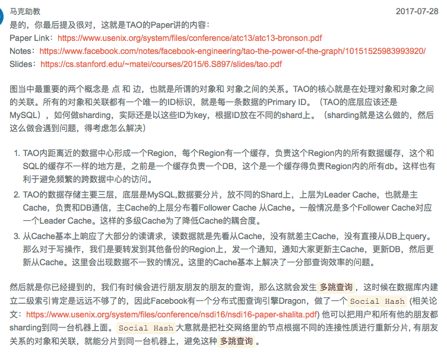
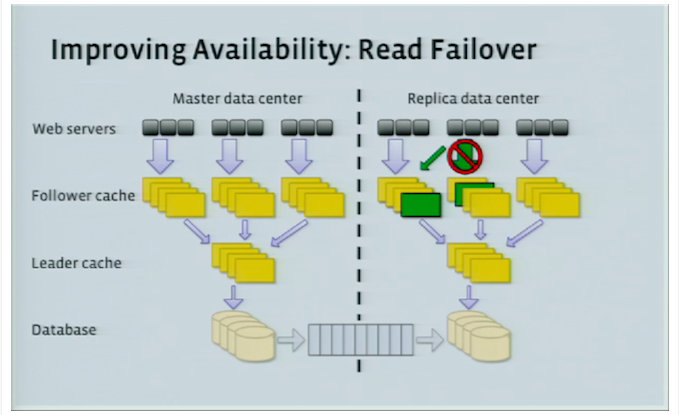

# TAO paper （ https://www.jiuzhang.com/qa/4867/）

Created: 2017-09-16 11:36:42 -0600

Modified: 2017-10-21 09:33:06 -0600

---

![请 教 各 位 老 师 同 学 ， 如 何 shard--- 个 超 大 的 graph? 精 华 byS* 0 2 (D 1 月 ， 2 周 前 Ta ： 系 统 设 计 ， 認 论 、 L Ta: 东 邪 黄 药 师 这 是 Faceb k 的 一 个 面 试 题 ， 自 己 没 有 思 路 ， 所 以 请 教 一 下 各 位 的 意 见 。 一 个 超 大 的 Graph 存 ü%fnendship relationship, 现 在 需 要 将 这 个 大 graph 放 到 多 台 machine 上 ， 并 且 保 证 que （ 面 试 官 没 有 具 体 说 que 啥 ， 但 是 应 该 是 查 询 朋 友 的 朋 友 " .) 的 performanæ- 我 的 想 法 是 ， 需 要 有 个 sharding key, 可 以 r ion 和 户 名 的 首 字 母 ， 但 是 ， 因 为 所 有 的 人 最 终 都 是 相 互 关 朕 的 ， 强 制 shard±lJ 不 同 的 machine 之 后 ， 想 要 跨 machine 搜 索 非 常 困 难 ． 自 己 看 了 Fa book 自 己 的 TAO 但 是 没 搞 懂 shard 是 怎 么 做 的 ， 请 教 一 个 大 家 ， 谢 谢 了 ！ ](../../media/Memeory-Facebook-Cache-TAO-paper-（-https---www.jiuzhang.com-qa-4867-）-image1.png){width="10.083333333333334in" height="3.8125in"}

{width="10.083333333333334in" height="8.052083333333334in"}

**TAO**

TAO is a write-through cache backed by MySQL.

TAO objects have a type along with a 64-bit (8 bytes) globally unique id. Associations have a type , and a creation timestamp.

Two objects can have only one association of the same type. As an example, users can be Objects and their friendship can be represented as an association. TAO also provides the option to add inverse-assocs, when adding an assoc.

As per the paper:

*TAO enforces a per-type upper bound (typically 6,000) on the actual limit used for an association query.*

This is also probably why the maximum number of friends you can have on FB is 5000.

**Architecture**

There are two important factors in the TAO architecture design:

1.  On FB is read heavy

**Choice of Backing Store**

The underlying DB is MySQL

**Sharding / Data Distribution**

Objects and Associations are in different tables. Data is divided into logical shards. Each shard is served by a database.

*Each object id contains an embedded shard id that identifies its hosting shard.*

The above setup means that your shard id is pre-decided. An assoc is stored in the shard belonging to itsid1.

**Consistency Semantics**

TAO also requires "read-what-you-wrote" consistency semantics for writers, and eventual consistency otherwise.

**Leader-Follower Architecture**

TAO is setup with multiple regions, and user requests hit the regions closest to them. The diagram below illustrates the caching architecture.

![Master Region for Shard Clients Followers Leader Cache Slave Region for Shard Followers Leader Cache c Replication Master DB Slave DB Figure 2: Multi-region TAO configuration. The master region sends read misses, writes, and embedded con- slstency messages to the master database (A). Consis- tency messages are delivered to the slave leader (B) as the replication stream updates the slave database. Slave leader sends writes to the master leader (C) and read misses to the replica DB (D). The choice of master and slave is made separately for each shard. ](../../media/Memeory-Facebook-Cache-TAO-paper-（-https---www.jiuzhang.com-qa-4867-）-image3.png){width="10.083333333333334in" height="9.645833333333334in"}

(it is write through cache )

There is one 'leader' region and several 'slave' regions. Each region has a complete copy of the databases. There is an ongoing async replication between leader to slave(s). In each region, there are a group of machines which are 'followers', where each individual group of followers, caches and completely serves read requests for the entire domain of the data. Clients are sticky to a specific group of followers.

In each region, there is a group of leaders, where there is one leader for each shard. Read requests are served by the followers, cache misses are forwarded to the leaders, which in turn return the result from either their cache, or query the DB.

Write requests are forwarded to the leader of that region. If the current region is a slave region, the request is forwarded to the leader of that shard in the master region.

The leader sends cache-refill/invalidation messages to its followers, and to the slave leader, if the leader belongs to the master region. These messages are idempotent.

The way this is setup, the reads can never be stale in the master leader region.

When the leader fails, the reads go directly to the DB. The writes to the failed leader go through a random member in the leader tier.

**Read Availability**

There are multiple places to read, which increases read-availability. If the follower that the client is talking to, dies, the client can talk to some other follower in the same region. If all followers are down, you can talk directly to the leader in the region. Following whose failure, the client contacts the DB in the current region or other followers / leaders in other regions.

{width="10.083333333333334in" height="6.197916666666667in"}

