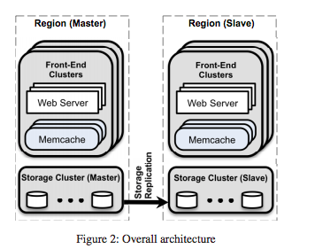
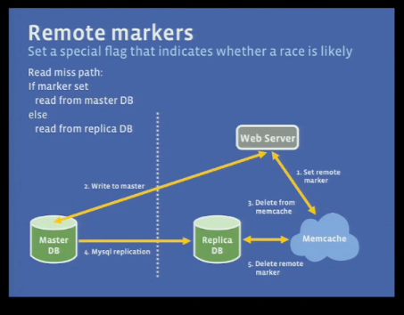

# distributed Cache

Created: 2017-10-01 15:52:16 -0600

Modified: 2018-01-28 10:41:54 -0600

---

Memcache is used as a write -aside cache where data updates result in deletion of keys in cache. This means if a client requests data from Memcache and data is not available, the client would fetch the data from the database and would populate the cache for further requests.

Get requests are done over UDP(any packet drop or error is considered a cache miss). Set and delete requests are done over TCP as they need to be reliable.

Memcache clients use a sliding window mechanism to control the rate of requests issued to memcached servers to avoid incast congestion.

{width="3.701388888888889in" height="2.9166666666666665in"}

(there is no communication between master region and slave region)

**Lease**

When a client experiences a cache-miss, Memcache gives it a lease (a 64-bit token bound to the requested key). This lease is verified by Memcache when client tries to set the value. If Memcache receives a delete request for the key, the lease is invalidated and the value can not be set.

To mitigate thundering herds, Memcache returns a token only once every 10 seconds per key. If a read request comes within 10 seconds of a token issue, the client is notified to retry after a short time, by which the updated value is expected to be set in the cache. In situations where returning stale data is not much problem, the client does not have to wait and stale data (at most 10 second old) is returned.

**Memcache Pools**

Since different workloads can have different access patterns and requirements, Memcache clusters are partitioned into pools. A small pool can be provisioned for keys for which cache miss is not expensive; Data is replicated within a pool when request rate is quite high and data can easily fit into one or two memcached servers.

In case a few Memcache servers fail, a small set of machines, called**gutters**, take over.

When a memcached client receives no response to its get request, the client assumes the server has failed and issues the request again to a special Gutter pool. If this second request misses, the client will insert the appropriate key-value pair into the Gutter machine after querying the database. Entries in Gutter expire quickly to obviate

**Regions**

one Storage cluster(houses backing store) and multiple frontend clusters(houses web server and memcache) are combined into a region; mcsqueal, are deployed on each database which parse the queries, extract and group delete statements and broadcast them to all the front end cluster in the region. The batched delete operations are sent to**mcrouter**instances in each frontend cluster, which then unpack the individual deletes and route them to the concerned Memcache server.

{width="4.097222222222222in" height="2.1666666666666665in"}

{width="4.430555555555555in" height="2.4722222222222223in"}

As an optimisation, a web server which modifies its data also sends invalidations to its own cluster to ensure read-after-write semantics for a single user request.

This approach is less effective than mcsqueal: too many packet , configuration is not easy

Regional pools

Keys that are not very frequently accessed are placed in a common memcached server that is shared across multiple frontend clusters. This is called regional pool and it reduces number of replicas for these key value pairs.

**Cold clusterWarmup ( add new cluster)**

When a new cluster is brought online, it takes time to get populated and initially the cache hit rate is very low. So a technique called**Cold Cluster Warmup**is employed where a new cold cluster is populated with data from a warm cluster instead of the database cluster. This way the cold cluster comes to full capacity within few hours. But additional care is needed to account for race conditions.

One example could be: a client in cold cluster makes an update and before this update reaches the warm cluster, another client retrieves the stale value from the warm cluster before the warm cluster has received the invalidation , that item will be indefinitely inconsistent in the cold cluster.

To avoid this, Memcache rejects add operations for 2 seconds (called*holdoff*time)once a delete operation is taken place. So if a value is updated in a cold cluster and a subsequent request is made within 2 seconds, the add operation would be rejected indicating that the data has been updated. 2 seconds is chosen as most updates seems to propagate within this time.

**Across Region consistency**

Clusters comprising a storage cluster and several front end clusters are deployed in different regions. Only one of the regions contains the master database and rest act as replicas. This adds the challenge of synchronisation

The presence of a marker indicates that data in the replica is stale and the query is redirected to the master region. When a webserver updates a key*k*, it sets a remote marker*rk*in the region, performs the write to the master database having key*k*and deletes*k*in the local cluster. When it tries to read*k*next time, it will experience a cache miss, will check if*rk*exists and will redirect its query to the master cluster. Had*rk*not been set, the query would have gone to the local cluster itself. Here latency is introduced to make sure most updated data is read.

{width="4.722222222222222in" height="3.6875in"}

**Single Server Improvements**

Facebook introduced many improvements for Memcache servers running as single instances as well. This includes extending Memcache to support automatic expansion of the hash table without the look-up time drifting to O(n), making the server multi-threaded using a global lock and giving each thread its own UDP port to reduce contention.

Memcache uses an**Adaptive Slab Allocator**which organizes memory into slab classes --- pre-allocated, uniformly sized chunks of memory. Items are stored in smallest possible slab class which can fit the data. Slab sizes start at 64 bytes and reach up to 1 Mb. Each slab class maintains a*free-list*of available chunks and requests more memory in 1MB in case the*free-list*is empty. If no more free memory can be allocated, eviction takes place in Least Recently Used (LR) fashion. The allocator periodically rebalances slab assignments to keep up with the workload. Memory is freed in less used slabs and given to more heavily used slabs.

