# Building Conclave: a decentralized, real time, collaborative text editor | Hacker Noon

Created: 2020-12-24 16:39:01 -0600

Modified: 2021-01-18 19:20:53 -0600

---

Clipped from : <https://hackernoon.com/building-conclave-a-decentralized-real-time-collaborative-text-editor-a6ab438fe79f>

{width="5.0in" height="2.25in"}

{width="0.5104166666666666in" height="0.5104166666666666in"}

**[@SunnyB](https://hackernoon.com/u/SunnyB)Sun-Li Beatteay**

**Using WebRTC and Conflict-free Replicated Data Types (CRDTs)**

[Try Conclave here](https://conclave-app.herokuapp.com/)

[Read our in-depth Case Study here](https://conclave-team.github.io/conclave-site/)

If you are savvy on the latest tech news, you might have heard of GitHub's release of TeleType. Teletype is a plugin that was built by a remote three person team and allows for collaborative editing in the Atom code editor.

Teletype accomplishes this by utilizing WebRTC and Conflict-free Replicated Data Types. It is a really cool piece of software and you should definitely check it out.

However, this is not the story of how Teletype was built.

This is the account of a different remote three person team who built a different open-source collaborative editor using the exact same technology in the same time period.

This article is about [Conclave](https://github.com/conclave-team/conclave).

Conclave is a decentralized, real time, collaborative editor for the browser. This article is going to discuss the many challenges we faced as well as the solutions we found. By the end of this piece, we hope that many of you will want to create a collaborative editor yourself. It is a very fun project and we highly recommend it to any developers interested.

Even if you are not interested in creating your own editor, you will still learn a lot from this article. Creating and scaling a real time application has many lessons that apply to other realms of software engineering.

If you are interested in either:

- distributed systems
- advanced data structures
- maintaining consistency without a central data store

Keep reading.

**Meet The Team**

Before we get started, I want to give a big shout out to the ragtag team of developers who created Conclave.

{width="5.0in" height="2.84375in"}

What a handsome bunch.

There is [Elise Olivares](http://elisejane.github.io/) from San Francisco, CA, [Nitin Savant](http://www.nitinsavant.com/) in Minneapolis, MN, and [Sun-Li Beatteay](http://sunli.co/) based in Brooklyn, NY. It was a pleasure getting to build this project together.

Now, onto the tech.

**Why a collaborative editor?**

A sensible question to ask is: Why even build a collaborative editor in the first place?

Having used Google Docs quite a bit as a team, we had always been intrigued by how it worked under-the-hood. Ironically, Googling how Google Docs works is fruitless. They are quite secretive about their proprietary software.

In the end we decided that, if Google would not tell us, the next best way to learn was to build it ourselves.

**Interesting Software Engineering Challenges**

Besides being a creative way to learn how Google Docs works, creating a real time, collaborative text editor poses some interesting software engineering challenges:

1.  Maintaining consistency across all users while merging conflicting operations.
2.  Reducing latency as much as possible to achieve a real time effect.
3.  Scaling a real time application.

Let us go over each of these challenges in detail.

**Challenge 1: Maintaining Consistency / Merging Conflicting Operations**

The most important part of a collaborative editor is [guaranteeing consistency across all users.]{.mark} After all, if the document did not stay consistent, it would be useless.

But how is this achieved?

To answer that, it is important to understand exactly what a text editor is and how it works.

**What is a text editor?**

For our project, we defined a text editor as a space where you can **insert** or **delete** text characters. Each character has a value and a numerical index that determines its position in the document.

For example, with the text "HAT", the first character has a value "H" and a position of 0, "A" has position 1, and "T" has position 2.

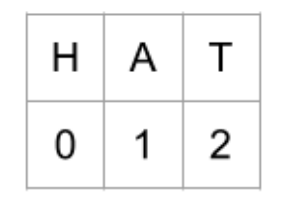{width="2.9375in" height="2.09375in"}

A character can be inserted or deleted based on its positional index. To insert a "C" at the beginning of the text, the operation is insert("C", 0). This insertion causes all the other letters to shift their position to the right by 1.

To delete the "H" would require the operation delete(1).

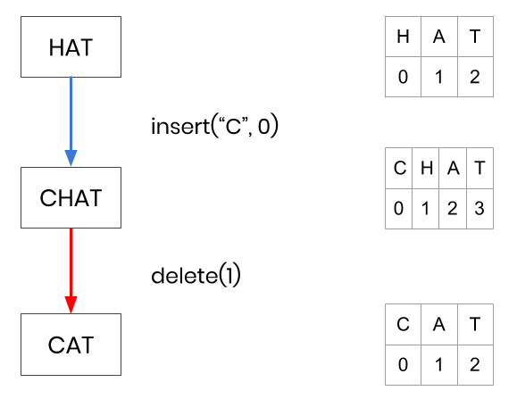{width="5.0in" height="3.8541666666666665in"}

One user editing a document is simple, but what if we want multiple users simultaneously editing the same document?

**Multiple concurrent users**

[First, we will need to provide each user with a local copy of the document and allow them to make edits]{.mark}. Remember, we are aiming for "real-time". We want users to be able to apply their edits immediately as if they were using a simple text editor.

Next, we need a way for users to inform other users of edits they made. We will introduce a **Central Relay Server** to facilitate this communication.

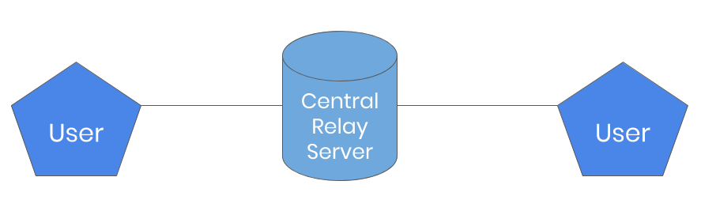{width="5.0in" height="1.5in"}

**Two users connected through a central relay server.**

The problem with this situation comes when users attempt to make concurrent edits.

**Commutativity**

As an example, say there are two users who both start with the word "HAT". One user inserts a "C" while the other deletes the "H" and both of their edits are sent to the other person to be incorporated.

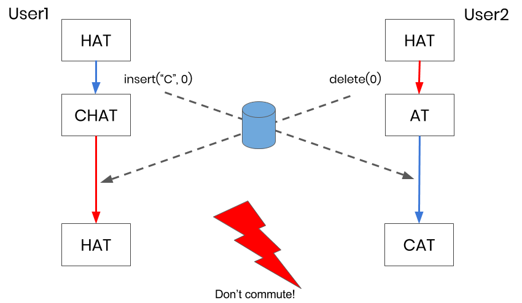{width="5.0in" height="2.8958333333333335in"}

Oh no! One user has a "HAT" and the other user has a "CAT". Their documents did not converge to the same state.

The reason for this divergence is because the insert and delete operations did not **commute.**

Commutativity occurs when different operations produce the same result no matter the order in which they are applied. Addition and multiplication are all commutative operations.

**Idempotency**

Let us try another example where the users simultaneously decide they want to delete the "H" from "HAT" to get "AT".

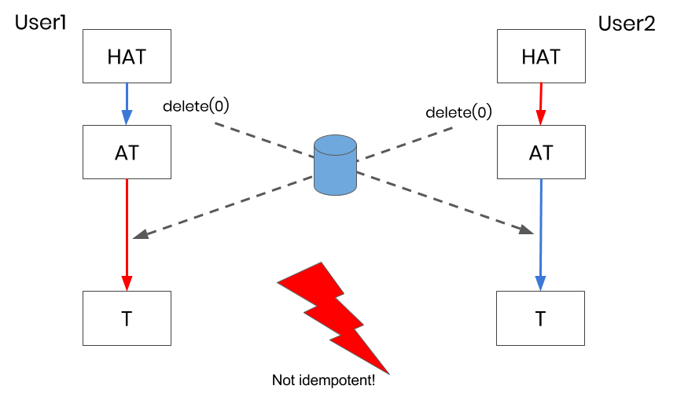{width="5.0in" height="2.8958333333333335in"}

The documents **did converge** but we have another problem! Both users ended up with "T" instead of "AT". Neither of them wanted this result. This occurred because the delete operations are not **idempotent.**

Idempotency is when repeated operations produce the same result. For example, multiplying by 1 is an idempotent operation. No matter how many times you multiply a number by 1, the result is the same.

**Consistency Requirements**

Looking at the previous two example, we can see that a collaborative text editor must have the follow properties to remain consistent across all users:

- **Commutativity**: Concurrent insert and delete operations converge to the same result regardless of the order in which they are applied.
- **Idempotency**: Repeated delete operations produce the same result.

With the problem identified, how do we go about solving it? For our team, this required plenty of researching before we came upon two possible solutions.

**Operational Transformation (OT)**

If you are familiar with distributed systems, you may have thought "[Operational Transformation can solve this problem]{.mark}." That was the first solution we found as well.

To keep this article as brief as possible, we will not go into what OT is. To give you an idea of why we decided against OT, read this quote from a Google engineer:

"Unfortunately, implementing OT sucks. There's a million algorithms with different tradeoffs, mostly trapped in academic papers. The algorithms are really hard and time consuming to implement correctly. [...] Wave took 2 years to write and if we rewrote it today, it would take almost as long to write a second time."

Joseph Gentle (Google Wave/ShareJS Engineer)

If you are interested to learn more about OT, you can read the [Operational Transformation](https://conclave-team.github.io/conclave-site/#operational-transformation-ot) section of our case study.

**Conflict-Free Replicated Data Type (CRDT)**

The other solution we found was the **Conflict-Free Replicated Data Type (CRDT).** CRDTs were first created by researchers [who were trying to simplify OT.]{.mark} While OT relies on a complex algorithm to maintain consistency, CRDTs utilize a more advanced data structure.

CRDTs operate by converting each character in the document into a unique object with specific properties.

- [**siteId**: an id to identify which user created it.]{.mark}
- **value**: which letter the object represents.
- **position**: [a list of integers that represent the position of the character in the document. This position is relative to the characters around it.]{.mark}

{width="5.0in" height="1.8020833333333333in"}

Conversion of letter into character object

Since each character is unique and can be identified by these properties, [we can prevent any character from being inserted or deleted more than once]{.mark}. This enables commutativity and idempotency.

[The downside to this approach is the large amount of metadata.]{.mark} This increases the memory consumption of our app. However, since the overall complexity of CRDTs is significantly less than OT, we were content with this tradeoff.

**How To Create A Relative Position**

Unless you are already experienced with CRDTs, you are probably wondering "what is this 'relative position' property he mentioned and how is it created?" Allow us to elaborate.

Relative positions are the key concept that differentiates a CRDT from OT. [The positions of characters in a CRDT never change even if the characters around them are removed]{.mark}. Furthermore, the relative position can always be used to determine the location of the character in the document.

The problem now is: How do we create these relative positions?

We can do this by imagining the characters and their positions like nodes in a tree. When we type a letter, it is given a position that is greater than the character before it but less than the character after.

If we write the word "CAT", each letter might get a position as in the diagram below.

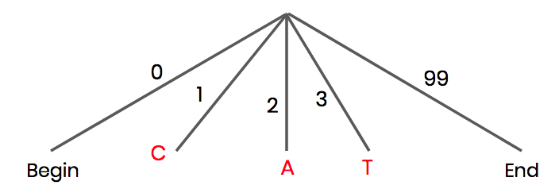{width="5.0in" height="1.6875in"}

Example positions

However, what if we want to insert a character between two adjacent positions? If we want to turn "CAT" into "CHAT", there is no integer between 2 and 3. For this, we need to move down to the next level of the tree and pick a position on the that level.

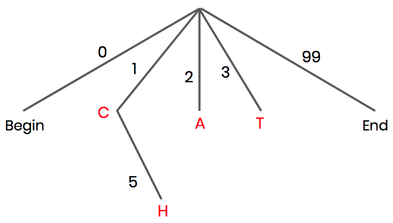{width="5.0in" height="2.8333333333333335in"}

Inserting characters between adjacent positions.

This creates a fractional index. "C" has a position of 1, "A" has a position of 2 and "H" has a position of 1.5. In code, we represent this fraction as an array of integers.

{width="5.0in" height="2.6145833333333335in"}

Fractional positions as arrays of integers.

**CRDT Commutativity and Idempotency**

If we go back to our previous example, we can see how CRDTs maintain commutativity and idempotency. The fractional indexes of the characters are included for reference.

{width="5.0in" height="2.4895833333333335in"}

CRDT Commutativity

Using relative positions allows us to be more specific about which letter we are deleting and where it is located. Due to this specificity, commutativity is not an issue.

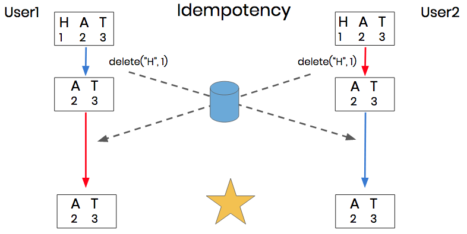{width="5.0in" height="2.5104166666666665in"}

CRDT Idempotency

Additionally, since each character is unique, we cannot delete it more than once from the CRDT.

To read more about how to implement a CRDT in code, check out the [Coding the CRDT](https://conclave-team.github.io/conclave-site/#coding-the-crdt) section of our case study.

**Challenges 2 and 3: Reducing Latency and Scaling a Real-Time Application**

Now that we have gone over how to merge conflicts and keep a consistent document, [it is time to tackle the two remaining problems: **latency** and **scaling**.]{.mark}

Our current system architecture relies on the client-server model of communication. Each user is connected to a central server via a WebSocket connection. The central server acts as a relay by forwarding operations from each user to all the other users in the network.

{width="5.0in" height="1.5in"}

**Multiple users connected through a central relay server.**

Are there improvements that can be made to this model? In order to find improvements, we must first define the limitations.

**Limitations of a Central Relay Server**

[The first limitation is an unnecessarily high latency between users. All operations are routed through the server. Even if users are sitting right next to each other, they must still communicate through the server.]{.mark}

It takes around 200--300ms for two users in California to communicate with each other through a server in New York. [This latency directly i]{.mark}mpacts how "real-time" our application feels. If they could send messages directly to each other, it would only take a few milliseconds.

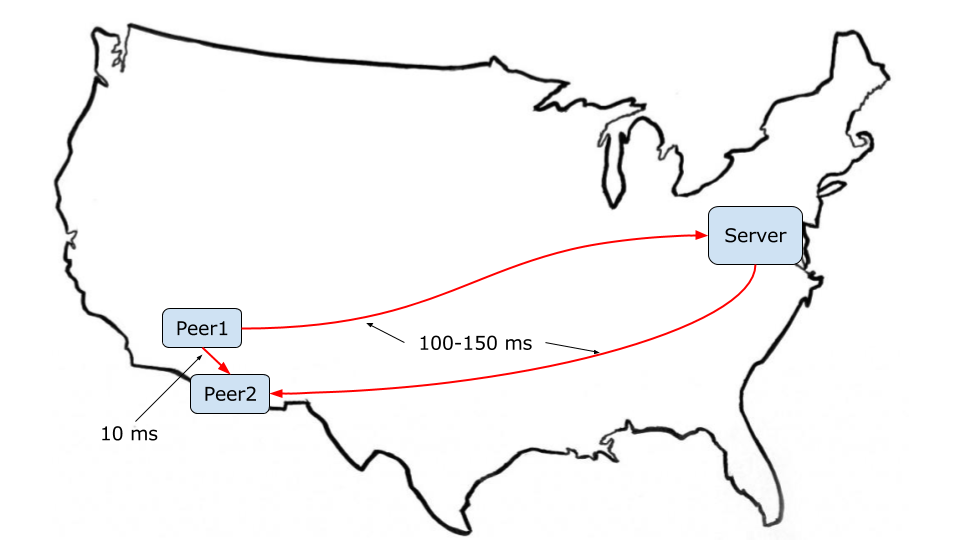{width="5.0in" height="2.8125in"}

Latency across the United States.

[The second limitation is that a central server can be costly to scale.]{.mark} As the number of users increases, the amount of work the server must do increases accordingly. To support this, the server would require additional resources, which costs money.

For a well-funded startup, this would not be an issue. As a team creating an open source project, we wanted to minimize the financial cost as much as possible.

[Finally, reliance on a central server creates a single point-of-failure.]{.mark} If the server were to go down, all users will immediately lose their ability to collaborate with each other.

**Peer-to-Peer Architecture**

We can remove these limitations by switching to a peer-to-peer architecture. Rather than having one server and many clients, each user can act as both the client and server.

Whenever a user makes a change, or receives an operation from another user, they can relay that operation to all the the users they are connected to. This would allow messages to be passed directly between users from one end of the network to the other.

In distributed systems, this is known as the [Gossip Protocol](https://en.wikipedia.org/wiki/Gossip_protocol).

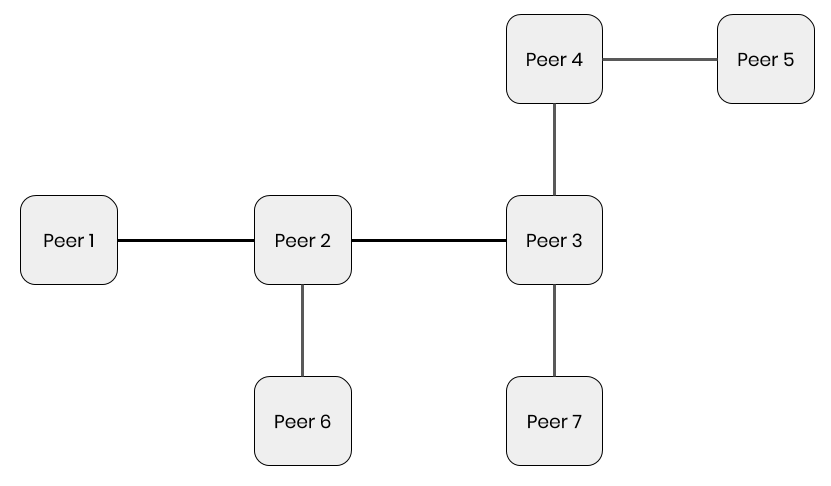{width="5.0in" height="2.9166666666666665in"}

P2P architecture

**How to create a P2P system?**

[To allow users to send and receive messages directly between each other, we used a technology called **WebRTC**.]{.mark} WebRTC stands for Web Real Time Communication and is a protocol that was designed for communication over peer-to-peer connections.

While WebRTC enables our users to connect directly, a small server is required to [initiate those peer-to-peer connections in a process called "signaling".]{.mark}

It is important to mention that while WebRTC relies on this signaling server, no document content is ever sent through it. It [is simply used to initiate the connection. Once a connection is established, the signaling server is no longer necessary.]{.mark}

{width="5.0in" height="2.7916666666666665in"}

Establishing WebRTC connections between users.

For the sake of brevity, we will not delve too deep into how WebRTC works. For Conclave, we use a library called [PeerJS](http://peerjs.com/) to handle most of the grunt work for us.

To read more about creating a P2P system, WebRTC, and how secure WebRTC is, check out the [P2P section](https://conclave-team.github.io/conclave-site/#how-will-users-send-messages-directly-to-each-other) of our case study.

**Causality**

One concept we have not covered yet is how to maintain **causality**. Causality is the relationship between cause and effect. To maintain causality is to guarantee an effect when there is a cause.

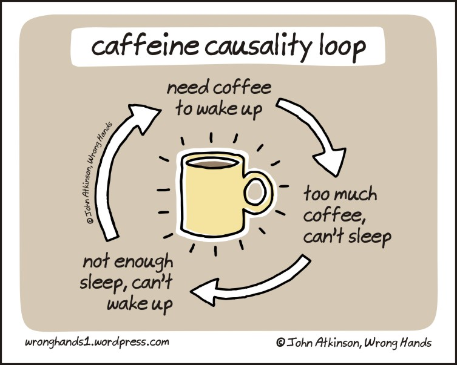{width="5.0in" height="4.0in"}

In the context of a collaborative text editor, [to guarantee causality means that all operations will be received in the order they were made.]{.mark}

While maintaining causality in a server-client model is hard enough, [it becomes even more difficult with a P2P system using WebRTC. The reason for that is because WebRTC uses the **UDP** transport protocol.]{.mark}

UDP helps reduce latency because it allows users to send messages quickly without a response from the receiver. [The tradeoff is that it does not guarantee in-order packet delivery.]{.mark}

This presents a potential issue. What if a user receives a message to delete a particular character before it has inserted that character?

In the diagram below, there are three peers collaborating on a document. Two of the peers are next to each other while the third is far away. Peer1 types an "A" and sends the operation out to both peers. Since Peer2 is nearby, it quickly receives the operation but decides it does not like it and promptly deletes it.

{width="5.0in" height="2.8125in"}

**Peer1 inserts a character and Peer2 immediately deletes it.**

Now both the insert and delete operations are on their way to Peer 3. Due to the unpredictability of the Internet, the delete operation races past the insert operation.

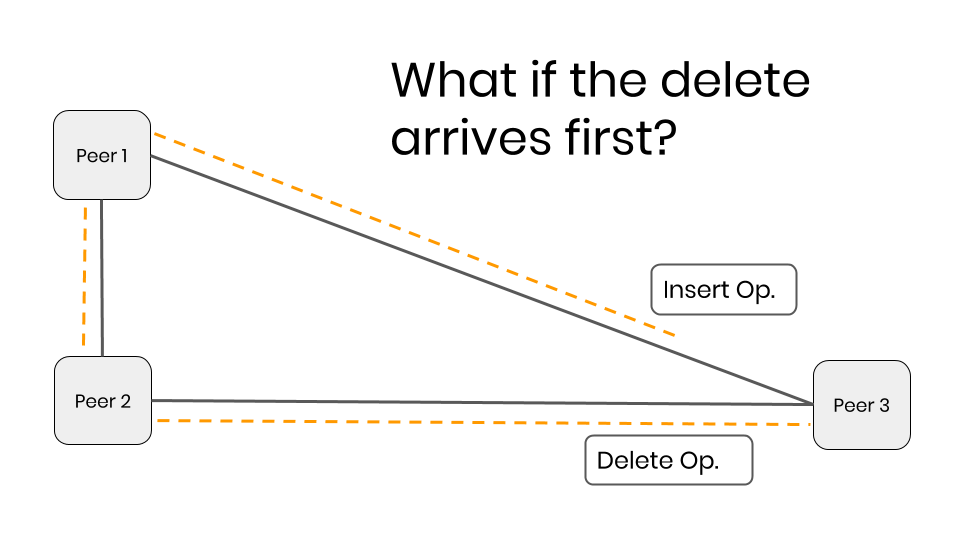{width="5.0in" height="2.8125in"}

**The delete operation arrives at Peer3 before the insert operation.**

What happens if the delete operation arrives at Peer3 before the insert operation? We would not want to apply the delete first because there would be nothing to delete and the operation would be lost. Later, when the insert is applied, Peer3's document would look different from the others. Causality would be lost.

We need to find a way to delay the delete operation until after we have applied the insert.

**Version Vector**

[To solve this problem, we implemented what is called a **Version Vector**.]{.mark} It sounds fancy but it is simply a strategy that tracks which operations we have received from each user.

[Whenever an operation is sent out, in addition to the character object and the type of operation (insert/delete), we include the character's **Site ID** and **Site Counter** value. The Site ID indicates who originally sent the operation and the Counter indicates which operation number it is from that particular user.]{.mark}

[When a peer receives a delete operation, it is immediately placed in a **Deletion Buffer**. If it were an insert, we could apply it immediately. However, with deletes, we have to make sure the character has been inserted first.]{.mark}

After every operation from another user is received, the deletion buffer is "processed" [to check if the corresponding character has been inserted. If it has, the deletion operation can be executed.]{.mark}

In this example, the character that is supposed to be deleted has a Site ID of 1 and Counter of 24. To check if the character has been inserted, Peer3 consults its version vector. Since Peer3 has only seen 23 operations from Peer1, the delete operation will remain in the buffer.

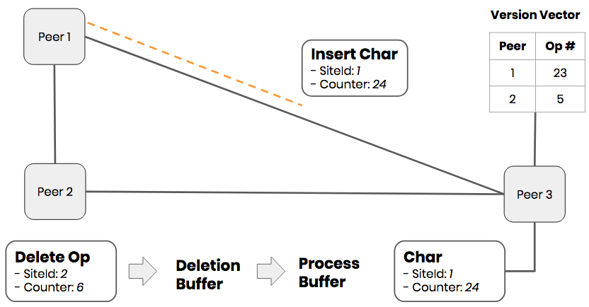{width="5.0in" height="2.6041666666666665in"}

**The first time the buffer is processed, the delete operation is not ready to be applied by Peer3.**

[After some more time, the insert operation finally arrives at Peer3, and its version vector is updated to reflect that it is seen 24 operations from Peer1.]{.mark}

Since we have received a new operation, we again process the deletion buffer. This time, when the deletion operation's character is compared to the version vector, we see that the complement insert has been made. The delete operation can be removed from the buffer and applied.

{width="10.083333333333334in" height="5.90625in"}

**This time the delete operation can be applied by Peer3.**

**Final System Architecture**

With a Version Vector in place, the collaborative text editor is fully functional. The final system architecture for the application we made is shown below.

{width="10.083333333333334in" height="5.708333333333333in"}

**Final System Architecture**

An example user flow may look something like this:

1.  A user inserts a letter to their text editor
2.  That change is added to their CRDT and converted into a character object.
3.  That local insertion is broadcasted out to the rest of the users using a Messenger class --- which is essentially a wrapper for WebRTC.
4.  That same Messenger class is also responsible for receiving operations from other users. Those received operations are verified against the Version Vector and CRDT before being incorporated into the editor.

A Controller class is used to communicate between all the different components and make sure everything runs smoothly.

To read about further improvements made to Conclave, extra features that were developed, and the future plans we have, check out the [Optimizations](https://conclave-team.github.io/conclave-site/#optimizations) section of our case study.

**Conclusion**

We hope you enjoyed reading about our journey as much as we enjoyed the journey itself! Conclave is still in alpha stage and we are continually working on it. If you gleaned any interesting insights from our project or have any questions, please let us know in the comments below.

If you are interested in contributing to Conclave or want to read our code, you can checkout the [GitHub Repo](https://github.com/Super-NES/conclave).

Finally, if you enjoy using the Conclave editor and want to incorporate it into your own project, there is an embeddable version called [Conclavity](https://github.com/sunny-b/conclavity). Check it out!

{width="1.0416666666666667in" height="1.0416666666666667in"}

{width="1.0416666666666667in" height="1.0416666666666667in"}

{width="1.0416666666666667in" height="1.0416666666666667in"}

{width="1.0416666666666667in" height="1.0416666666666667in"}

{width="0.8541666666666666in" height="1.0416666666666667in"}

{width="0.8541666666666666in" height="1.0416666666666667in"}

{width="0.8541666666666666in" height="1.0416666666666667in"}

{width="0.8541666666666666in" height="1.0416666666666667in"}

{width="1.0416666666666667in" height="1.0416666666666667in"}

{width="1.0416666666666667in" height="1.0416666666666667in"}

{width="1.0416666666666667in" height="1.0416666666666667in"}

{width="1.0416666666666667in" height="1.0416666666666667in"}

{width="1.0416666666666667in" height="1.0416666666666667in"}

{width="1.0416666666666667in" height="1.0416666666666667in"}

{width="1.0416666666666667in" height="1.0416666666666667in"}

{width="1.0416666666666667in" height="1.0416666666666667in"}

[Join Hacker Noon](https://app.hackernoon.com/signup)

Create your free account to unlock your custom reading experience.

