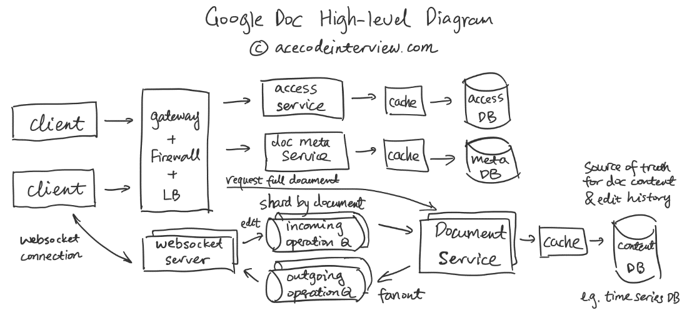
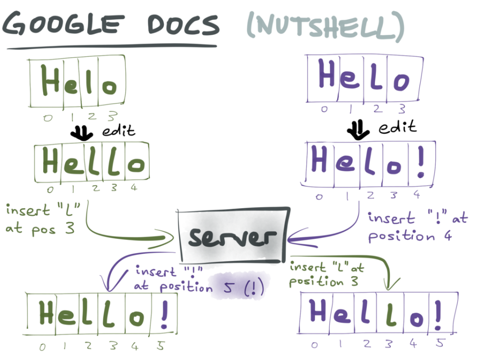
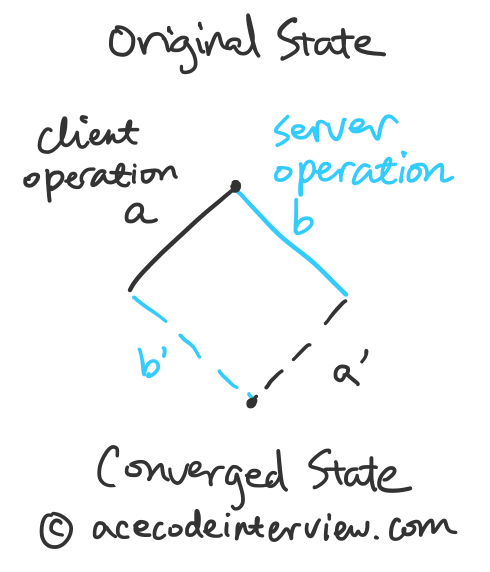
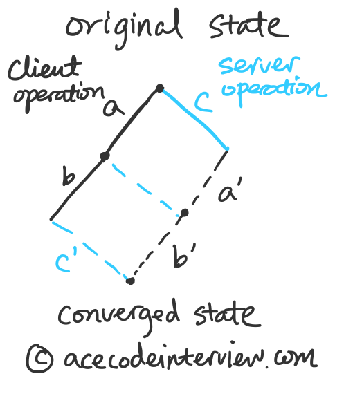

# Google Doc 系统设计题解

---

Google Doc 系统设计题解

1. 理解需求

1.1 商业目的

允许多人同时在线协作编辑文档。

1.2 功能性需求

- 文档为无格式的纯文本
- 多人同时在线浏览文档
- 多人同时在线编辑文档
- 文档在多人之间实时同步
- 查看修改历史，恢复历史版本

1.3 非功能性需求

- 时效性 (Time-sensitive) - 对文档的更新实时反映在所有文档的读者端
- 扩展性 (Scalability) - 支持海量文档以及单个文档较多人访问
- 正确性 (Correctness) - 多人同时修改后系统产生唯一的文档状态
- 可用性 (Availability) - 服务稳定

1.4 不需要支持的功能

- 文档权限控制
- 添加评论
- 添加并显示图片
- 更改文本格式

2. 资源估算

2.1 假设

- 100M DAU daily activity user
- 100M 文档
- 每个文档平均 5 名协作者
- 每个用户每天进行 100 次改动

2.2 估算

- 存储 - 100M * 100KB（平均文件大小） = 10 TB
- 连接数 - 100M * 10%（假设 10% 的客户端与服务器有长链接）= 10M
- RPS (Request per second) - 100M * 5 * 100 / (24 * 3600) = 579k

3. High-level Diagram

4. 核心子服务设计

4.1 协作编辑方案

协作文本编辑的难点在于多人在网络环境下协作。每个人在本地可能都基于原有文件进行了修改，这些修改会被分发到其他的协作者那里，并与他们本地的文档进行冲突解决 (Conflict Resolution)。

4.1.1 锁

最简单粗暴的解决方法是使用锁在第一个人开始修改是对其他人锁死，直到修改完成。这是所谓的悲观并发控制 (pessimistic concurrency control)，虽然从源头上避免了冲突 (Conflict) 的发生，但在协作文本编辑的场景下会牺牲太多的用户体验，跟我们使用 Google Doc 的体验严重不符，所以并不可行。下面我们就来看看乐观并发控制的解决方案。

4.1.2 类似于 Git 的协作

另一个比较直接的想法是类似于代码控制的方式协作。每个人以某版本的文档为基础，添加自己的修改。修改的内容由用户在某一时刻主动向中央服务器提交，如果有冲突，那么用户需要在本地解决冲突后提交。这显然也与我们使用 Google Doc 的体验不符。我们可以发现以下几点不同之处：

- Google Doc 不需要用户主动提交自己的修改，而是实时分发并实时接受别人的修改。
- Google Doc 发生冲突时不需要用户解决冲突，而是自动由系统按一定规则处理。

其中实时性是导致这个方案不适用于文档协作的主要原因。我们把这个方案归类到异步文档协作方案。下面我们来看看同步文档协作方案。

4.1.3 Operational Transformation (OT) 算法

OT 是一种在此场景下可行的同步策略，是 Event passing 类同步中最流行的一种。它同样使用中心服务器来保持唯一的文档状态，所有的客户端分别实时与服务器之间传递最新的修改。服务器根据当前的文档状态将修改操作 (Operation) 通过一定的变化 (Transformation) 之后下发到各个客户端。OT 的名称就由此而来。

为什么需要对修改操作做一定的变化呢？我们可以通过下面插图中的例子体会到。下面是时间线：

- 原始状态为 "Helo"
- 用户A在本地进行操作 - insert("l", pos=3)
- 用户B在本地进行操作 - insert("!", pos=4)
- 服务器接收到用户A的操作
- 服务器接收到用户B的操作
- 服务器对原始状态施加操作 - insert("l", pos=3) 以及 insert("!", pos=5)
- 服务器端状态更新为 "Hello!"
- 服务器向用户A发送更新操作 - insert("!", pos=5) 并对用户B发送 - insert("l", pos=3)
- 用户A，B接受更新操作，完成与服务器端同步本地状态

Martin-Kleppmann. (2015). Conflict Resolution for Eventual Consistency‌‌

从这个例子可以看到，第六步和第九步中插入操作的位置由B用户原始操作中的位置4变成了位置5。如果不变，那么服务器状态以及用户A的文本状态与用户B的文本状态就会不一致，导致冲突解决失败。出现以下分化的状态：

- 服务器版本 Hell!o
- 用户A版本 Hell!o
- 用户B版本 Hello!

同学们可以试试这个[可以互动的 OT 小工具](https://operational-transformation.github.io/index.html)，它可以帮你可视化服务器端和客户端的交流。

[Visualization of OT with a central server](https://operational-transformation.github.io/index.html)

[An interactive visualization of the Operational Transformation integration algorithm with a central server](https://operational-transformation.github.io/index.html)

现在我们知道了 OT 解决的问题，也知道了为什么需要做变换 (Transform)。基于以上这个简单的例子，我们可以扩展到更相对复杂的情况。

- 多人协作
- 多种操作（插入，删除，更替）
- 多次操作批量更新 (Batch Update)

OT 的具体算法细节因为过于复杂，不在系统设计的考察范围内，有兴趣的同学可以阅读[这篇论文](http://lively-kernel.org/repository/webwerkstatt/projects/Collaboration/paper/Jupiter.pdf)。在下面的章节里，我们会继续深挖如何在分布式系统中实现 OT。

4.1.4 其他方案

除了 OT 以外，还有以下几种可行的方案也可以用来实现实时同步的文档协作。

- [Differential Syncing](https://neil.fraser.name/writing/sync/) - 与服务器同步本地文档和服务器版本的 Diff，而不同步两个版本之间的每次改动操作。缺点在于算法层面上就不支持客户端上连续发送 Diff，而是需要等待服务回应再进行下次发送。
- [CRDT](https://www.youtube.com/watch?v=jIR0Ngov7vo&ab_channel=StarConKW) - 支持无中心服务器的实时文本协作，但算法复杂性高。

4.1.5 总结

总结一下以上提到的所有方案。

- 对文件加锁 - 不可行，不支持多客户端同时编辑
- 基于 Git - 不可行，不支持多客户端实时同步
- Operational Transform (Event Passing) - 可行，需要中央服务器
- Differential Syncing - 可行，需要中央服务器，前次同步完成后才能发送新的信息
- CRDT - 可行，且不需要中央服务器

4.2 OT 与文件同步服务

4.2.1 多客户端同步

在前面的章节里讲了两人同时编辑的文档的情况，现在我们推而广之，考虑多人的情况。

因为我们有一个单一服务器维护了唯一的文档编辑历史，多客户端的同步问题就可以简化为每个客户端与服务器的同步问题。

服务器端接收来自所有客户端的信息，所以客户端的文本状态会与服务端的状态产生短时间的不一致。

- 客户端会定期将内容更新到服务器，它会发送 [1) 本地发生的操作和 2) 上次同步后的版本号（也就是此次操作基于的版本号]{.mark}）。
- 服务器端因为保留着文档修改历史，所以它能够检测从历史中找到这个版本号，就算出服务器端的操作b。
- 基于客户端发来的操作a和服务器端的操作b ，计算并执行服务器端需要进行的操作a'以及向客户端发送客户端需要进行的操作b'。
- 服务器端随后会向所有连接到该文档的客户端广播最新的版本号以及操作a'，接收到指令的服务器会根据最新的操作更新本地的状态，并在下次向服务器发送操作时基于这个新的状态。

4.2.2 版本控制

现在我们考虑上图的情况。客户端向服务器发送了两个操作，一是基于原始状态的操作a，二是基于原始状态和操作a的操作b，服务器端需要根据以上信息以及本地的操作c计算出 a',b',c'。这看起来并不困难，但由于a,b操作是先后到达服务器端的，操作b实际上是要求服务器端去基于一个不存在的版本号做计算，服务器端因此需要去保存所有客户端发送来的操作请求，用来计算某版本号叠加上某个操作产生的状态。在这个例子里，我们需要直到操作a以及操作a基于的版本号，才能计算出操作b所基于的文件状态。

考虑到这个情况下所需要存储的大量额外数据，[一个简单的做法是只允许基于服务器已知的版本号的操作。这样做也意味着，客户端将无法连续向服务器端发送请求]{.mark} ，而是要将本地的更新操作累计合并起来，等待服务器端返回新的版本号后再一并发送请求。

两个方案各自的好处如下：

- 只允许基于服务器已知版本的操作
- 无需在服务器端存储大量过去的更新请求，只需存储文件的历史版本号及它们之间发生的操作，更加容易 Scale
- 服务器请求经过合并 (Batch)，RPS 大大减少
- 允许基于任意中间状态的操作
- 更新能够第一时间到达服务器端，延迟更低

权衡利弊，这里我会优先考虑前者。

4.2.3. 数据流

为了实现 Google Doc 的规模，我们就需要引入队列 (Queue) 来确保客户端和服务器端的沟通是有序的。理由如下：

- 公平 - 对于每个文档，先发送到服务器端的请求会先被处理

- 唯一状态 - 对于每个文档，会通过被唯一的服务器处理，避免两台服务器同时修改文本状态数据库

- 削峰 - 由于修改请求需要被 fanout 到所有协作者，RPS 可能会在某个瞬间非常大，利用队列可以解决暂时的子系统间处理能力不匹配问题

从数据流角度上，每个操作请求发生后发生：

- 该操作通过 Websocket 送到 Websocket Server 端
- Websocket Server 会根据该操作的文档 ID 将该操作分发到对应的 Incoming Queue
- Incoming Queue 根据文档 ID 将操作分发到对应的 Content Server

- Content Server 根据该操作以及缓存/数据库中的文件修改历史计算出经变化的两种操作（一是对于原操作的发起者，二是对其他协作者）

- Content Server 更新缓存/数据库中的文本状态
- Content Server 将上述的两种操作 Fanout 到该文档对应的 Outgoing Queue
- Websocket Server 将 Outgoing Queue 的操作请求有序地发送到客户端

4.3 获取完整文件

有了服务器端的文件版本号和对应的修改操作之后，我们可以很容易地基于所有对该文件的修改计算出文件的当前状态，用来支持新的用户访问该文件。对于常有新用户访问的文件，我们也可以将文件的当前状态放入缓存，避免反复读取整个修改记录。

5. 数据结构与存储

5.1 Document Content DB

Cache & Time Series DB

文件内容数据库用来存储文件版本号以及相关操作。

Timestamp | Document ID (Sharding key) | Post Operation Version | Operation | Author

5.2 Access DB

Cache & DB

访问权限数据库用来存储允许访问文件的用户。

Document ID | User Group ID | Permission Type

6. 接口设计

客户端与服务器间发送操作 (Websocket via STOMP)

SEND
destination: /operations
{
"document_id": 123,
"user_id": 456,
"version_id": 1,
"operations": [{
"operation_type": "insert",
"pos": 3,
"char": "a"
}]
}

客户端请求完整文件 (Restful API)

GET /api/v1/documents/{doc_id}

7. 扩展性，容错性，延迟要求

- 随着文档数量变多，Websocket Server, Queue, Document Service, DB/Cache 都可以横向扩展
- 系统瓶颈可能出现在单一文档有过多人同时打开，这时候需要考虑使用 Load Balancer，减少负载高的服务器的文档数量

- [文档的正确性要求很高，我们通过单一文件使用单一服务器修改来保证事务 (Transaction)]{.mark}

- 文件同步的延迟需要尽量维持在比较低的程度（秒级），但在与可用性和可扩展性进行权衡时，后两者会重要，因此引入了1）队列以及 2）只允许基于服务器已知版本的操作。

8. 监控和警报

- Queue Health
- Document Server Load Balance
- 缓存命中率
- 数据库使用比例
- Websocket Server 负载

9. 参考资料

- David A. Nichols, Pavel Curtis, Michael Dixon, and John Lamping. (1995). [High Latency, Low-Bandwidth Windowing in the Jupiter Collaboration System](http://lively-kernel.org/repository/webwerkstatt/projects/Collaboration/paper/Jupiter.pdf)*.*
- Neil Fraser. (2009). [Writing: Differential Synchronization](https://neil.fraser.name/writing/sync/)
- Martin-Kleppmann. (2018). [CRDTs and the Quest for Distributed Consistency](https://www.infoq.com/presentations/crdt-distributed-consistency/)
- Martin-Kleppmann. (2015). [Conflict Resolution for Eventual Consistency](https://gotocon.com/berlin-2016/presentations/show_talk.jsp?oid=7910)
- [M](https://medium.com/@mehulgala77)ehul Gal[a](https://medium.com/@mehulgala77). (2019). [The enigma of Collaborative Editing](https://medium.com/@mehulgala77/concurrent-collaborative-editing-d10192e55d2e)
- Narendra L. (2019). [Google Docs System design | Part 1](https://www.youtube.com/watch?v=2auwirNBvGg&ab_channel=TechDummiesNarendraL)
- [Srijan Agarwal](https://medium.com/@srijancse). (2017). [Building a real-time collaborative editor using Operational Transformation](https://medium.com/@srijancse/how-real-time-collaborative-editing-work-operational-transformation-ac4902d75682)
- [Srijan Agarwal](https://medium.com/@srijancse). (2017). [Operational Transformation, the real time collaborative editing algorithm](https://www.srijanagarwal.me/2017/05/operational-transformation/)
- [Srijan Agarwal](https://medium.com/@srijancse). (2017). [Analysing different Operational Transformation algorithms for collaborative editing](https://www.srijanagarwal.me/2017/06/analysing-ot/)
- Rudi Chen. (2018). [How to make a real-time collaborative text editor in 5 easy steps](https://www.youtube.com/watch?v=jIR0Ngov7vo&ab_channel=StarConKW)
- Andrew Herron. (2020). [Building real-time collaboration applications: OT vs CRDT](https://www.tiny.cloud/blog/real-time-collaboration-ot-vs-crdt/)
- [Russell Sullivan](https://www.serverless.com/author/russellsullivan/). [CRDTs explained - supercharge your serverless with CRDTs at the Edge](https://www.serverless.com/blog/crdt-explained-supercharge-serverless-at-edge)
- [share/sharedb: Realtime database backend based on Operational Transformation (OT)](https://github.com/share/sharedb)

更多 [高频题题解](https://acecodeinterview.com/tag/answer/)

- [爱思系统设计直播课](https://acecodeinterview.com/system-design-class/)
  18 Dec 2020

- [Instagram 系统设计题解](https://acecodeinterview.com/instagram/)
  4 Dec 2020

[看全部的15篇文章 →](https://acecodeinterview.com/tag/answer/)

[高频题题解](https://acecodeinterview.com/autocomplete/)

[Google Autocomplete 系统设计题解](https://acecodeinterview.com/autocomplete/)

[Autocomplete 又被称作 Typeahead，指用户在搜索框中打字的同时，搜索框进行补全，并给出多个用户可能想搜索的关键词。这个功能使得用户在搜索体验更加顺畅。 Autocomplete 主要考察两条数据流，一是如何收集高频搜索关键词，二是如何实时补全用户打了一半的关键词前缀。](https://acecodeinterview.com/autocomplete/)

- 罗辑

[罗辑](https://acecodeinterview.com/author/logic/)2 DEC 2020

[高频题题解](https://acecodeinterview.com/realtime_monitoring_service/)

[实时监控系统题解](https://acecodeinterview.com/realtime_monitoring_service/)

[实时监控系统是每一个网络服务的刚需，每个后端工程师都多多少少接触和使用过。 这道题主要考察 Streaming Service 的应用，监控系统作为一个 Streaming Service 的经典实例，牵涉到 Streaming Service 上游的 Publisher 和下游的 Consumer 如何合理配置，来实现监控系统所涉及到的种种功能。](https://acecodeinterview.com/realtime_monitoring_service/)

- 罗辑

[罗辑](https://acecodeinterview.com/author/logic/)12 NOV 2020

[爱思系统设计](https://acecodeinterview.com/) © 2020 [主页](https://acecodeinterview.com/) [成为会员](https://acecodeinterview.com/signup) [微信公众号](https://acecodeinterview.com/about/) [RSS](https://acecodeinterview.com/rss/)

