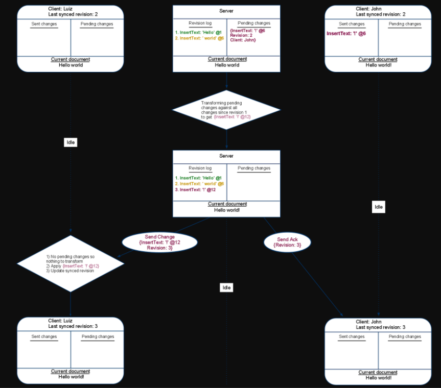

# Google Drive Blog

Created: 2020-12-25 17:47:00 -0600

Modified: 2021-01-18 18:23:58 -0600

---

{width="1.3645833333333333in" height="1.25in"}

[Google Drive Blog](https://drive.googleblog.com/)

The latest news and updates from the Google Drive team.

[What's different about the new Google Docs: Making collaboration fast](https://drive.googleblog.com/2010/09/whats-different-about-new-google-docs.html)

Thursday, September 23, 2010

*This is the final post in a three part series about the collaboration technology in Google Docs. On [Tuesday](http://googledocs.blogspot.com/2010/09/whats-different-about-new-google-docs.html), we explained some of the technical challenges behind real time collaboration. [Yesterday](http://googledocs.blogspot.com/2010/09/whats-different-about-new-google-docs_22.html), we showed how operational transformation can be used merge editors' changes.*

Imagine that you're doing a jigsaw puzzle with a bunch of friends and that everyone is working in the same corner of the puzzle. It's possible to solve a puzzle like this, but it's hard to keep out of each other's way and to make sure that when multiple pieces are added at once, that they all fit together perfectly. Making a document collaborative is a little like that: one challenge is coming up with a method to let multiple people edit in the same area without conflicting edits. A second problem is to ensure that when many changes happen at the same time, each change is merged properly with each other changes. In Google Docs, the first problem is handled by operational transformation and the second problem is handled by the collaboration protocol, which is the subject of this post.

To open a Google document, you need code running in two places: your browser and our servers. We call the code that's running in your browser a client. In the document editor, the client processes all your edits, sends them to the server, and processes other editors' changes when it receives them from the server.

[To collaborate in Google Docs, each client keeps track of four pieces of information:]{.mark}

1.  The number of the most recent revision sent from the server to the client.
2.  Any changes that have been made locally and not yet sent to the server.
3.  Any changes that have been made locally, sent to the server, but not yet acknowledged by the server.
4.  The current state of the document as seen by that particular editor.

[The server remembers three things:]{.mark}

1.  The list of all changes that it has received but not yet processed.
2.  The complete history of all processed changes (called the revision log)./li>
3.  The current state of the document as of the last processed change./li>

By carefully making use of this information, it's possible to design the client-server communication such that all editors are capable of rapidly processing each other's changes in real time. Let's walk through a straightforward example of how client-server communication is handled in a document.

In the diagrams below, the two outer columns represent the editors: Luiz and John. The middle column is the server. The oval shapes represent changes inputted by the editors and sent between the clients and the server. The diamonds represent transformations.

Let's say Luiz starts by typing the word Hello at the beginning of the document.

![Client: Luiz Last synced revision: O Sent changes Pending changes Revision bg Pencfig chmges Sent ent docum InsertText: •Hello' @1 Client. Luiz Last synced revisim: O Sent changes Pending changes InsertText: 'Hello' @1 Current docunænt (InsertText: @I Revision: O Client: Current docurrent Client: John synced O Pen dng changes rrent docume «ernpty> Idle Hello Client: Luiz Last synced revisim: O Send Change {InsertText: Hello'@1 Revision: O} Revision Sent changes InsertText: 'Heuo• Pending changes Current &xument Hello ](../../media/Memeory-Google-Doc-Google-Drive-Blog-image2.png){width="10.083333333333334in" height="6.229166666666667in"}

Luiz's client added the edit to his list of pending changes. He then sent the change to the server and [moved the change into his list of sent changes.]{.mark}

Luiz continues to type, adding the word world to his document. At the same time, John types an ! in his empty version of the document (remember he has not yet received Luiz's first change).

{width="10.5in" height="4.458333333333333in"}

Luiz's {InsertText ' world' @6} [change was placed in the pending list and wasn't sent to the server because we never send more than one pending change at a time.]{.mark} Until Luiz recieves an [acknowledgement]{.mark} of his first change, his client will keep all new changes in the pending list. Also notice that the server stored Luiz's first change in its revision log. [Next, the server will send John a message containing Luiz's first change and it will send Luiz a message acknowledging that it has processed that first change.]{.mark}

![Client: Luiz Last synced revision: O Server Pending changes Client: John Last synced revision: O Sent changes Pendng changes Revision log 1. InsertText: 'Hello' Sent chmges Pending changes InsertText: @1 InsertText: 'Hello' InsertText: ' world Current documemt Hello world Idle Client: Luiz Last synced revision: 1 urrent document Hello Send Ack {Revision: 1} Idle Send Change {InsertText: 'Hello' Revision: 1} Current document Idle 1) Transforming pendng changes against incoming changes to get (InsertText: 2) Appv {InsertText 3) LJpdde synced revision Client: John Last synced rm.•ision: 1 Sent changes Pendng changes InsertText: ' world Sent chmges Pending changes InsertText: @6 Current document Hello world Current document Hello! ](../../media/Memeory-Google-Doc-Google-Drive-Blog-image4.png){width="10.083333333333334in" height="5.479166666666667in"}

[John received]{.mark} Luiz's edit from the server and used [operational transformation](http://googledocs.blogspot.com/2010/09/whats-different-about-new-google-docs_22.html) (OT) to transform it against his pending {InsertText '!' @1} change. [The result of the transformation was to shift the location of John's pending change by 5 to make room at the beginning of the document for Luiz's Hello. Notice that both Luiz and John updated their last synced revision numbers to 1 when they received the messages from the server]{.mark}. Lastly, when Luiz received the acknowledgement of his first change, [he removed that first change from the list of sent changes.]{.mark}

Next, both Luiz and John are going to send their unsent changes to the server.

[The server got Luiz's change before John's so it processed that change first. An]{.mark} acknowledgement of the change was sent to Luiz. The change itself was sent to John, where his client transformed it against his still pending {InsertText '!' @1} change.

What comes next is important. The server received John's pending change, a change that John believes should be Revision 2. But the server has already committed a Revision 2 to the revision log. [The server will use OT to transform John's change so that it can be stored as Revision 3.]{.mark}

{width="10.083333333333334in" height="8.885416666666666in"}

[The first thing the server did, was to transform John's sent change against all the changes that have been committed since the last time John synced with the server. In this case, it transformed John's change against]{.mark} Luiz's {InsertText ' world' @6}. The result shifted the index of John's change over by 6. [This shift is identical to the transformation John's client made when it first received Luiz's]{.mark} {InsertText 'Hello' @1}.

The example above ends with Luiz and John receiving John's change and the acknowledgement of that change respectively. At this point the server and both editors are looking at the same document --- Hello world!.

The main advantages of this collaboration protocol are:

1.  Collaboration is fast. At all times, every editor can optimistically apply their own changes locally without waiting for the server to acknowledge those changes. This means that the speed or reliability of your network connection doesn't influence how fast you can type.
2.  Collaboration is accurate. There is always enough information for each client to merge collaborators' changes in the same deterministic way.
3.  Collaboration is efficient. The information that is sent over the network is always the bare minimum needed to describe what changed.
4.  Collaboration complexity is constant. The server does not need to know anything about the state of each client. Therefore, the complexity of processing changes does not increase as you add more editors.
5.  Collaboration is distributed. [Only the server needs to be aware of the document's history and only the clients need to be aware of uncommitted changes]{.mark}. This division spreads the workload required to support real time collaboration between all the parties involved.

When we switched to the new document editor, we moved from a very simple collaboration algorithm based on comparing versions to a much more sophisticated algorithm powered by operational transformation and the protocol described above. The results are dramatic: there are no more collaboration conflicts and editors can see each other's changes as they happen, character-by-character.

Well that's all folks: we hope by reading this series you learned a bit more about what's under the hood in Google Docs, and the kinds of things you need to think about to make a fast collaboration experience. You can try collaboration yourself, without signing in, by visiting the [Google Docs demo.](http://docs.google.com/demo)

Posted by: John Day-Richter, Software Engineer

{width="0.5833333333333334in" height="0.5833333333333334in"}

{width="0.5833333333333334in" height="0.5833333333333334in"}

{width="0.5833333333333334in" height="0.5833333333333334in"}

Labels: [documents](https://drive.googleblog.com/search/label/documents) , [Google Apps Blog](https://drive.googleblog.com/search/label/Google%20Apps%20Blog) , [Google Drive Blog](https://drive.googleblog.com/search/label/Google%20Drive%20Blog)

[](https://drive.googleblog.com/) [](https://drive.googleblog.com/2010/09/import-your-files-many-different-ways.html) [](https://drive.googleblog.com/2010/09/whats-different-about-new-google-docs_22.html)

{width="2.0in" height="0.8333333333333334in"}

- [Google](https://www.google.com/)

<!-- -->
- [Privacy](https://www.google.com/policies/privacy/)
- [Terms](https://www.google.com/policies/terms/)

[XIn: client and service both can applied the OT algorithm]{.mark}

