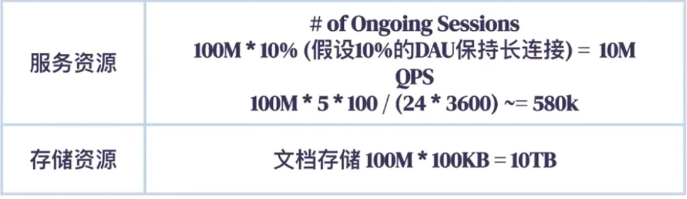
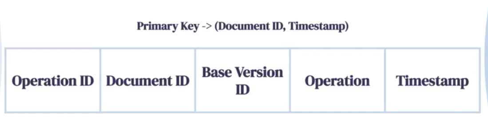
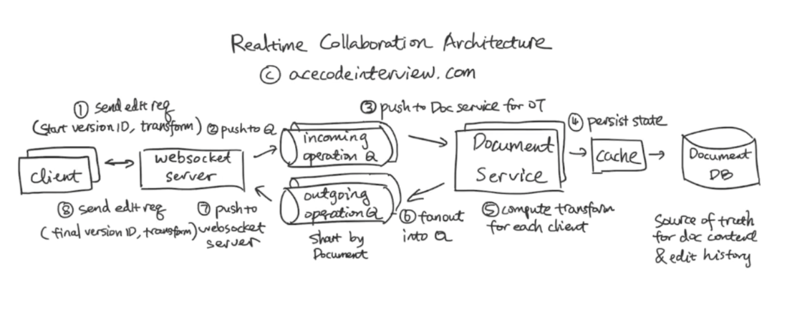
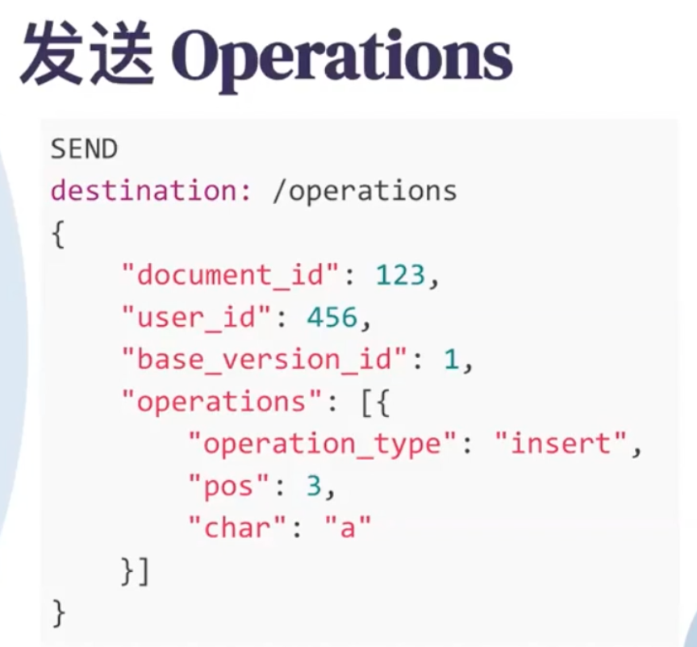

# Summary

---

[Feature]{.mark}

the document is plain text

Multiple user can view/edit the same document at the same time

Real-time synchronization of documents between multiple people

Non function features

Low latency: the new change can be sent to other user very quickly

Scalability

Consistency: other user will about to see your changes at certain series, and you also able to see others changes at certain series

High availability

Estimated:

Daily active user 100M

Each document average has 5 user

each user will have 100 changes per day

QPS = 100M * 5 *100 /86400 = 1200*5*100 = 600k

Peek QPS

Storage:

[High level architecture]{.mark}

The most important part of a collaborative editor is guaranteeing consistency across all users.

We can user a algorithm is called operational transformation

For this edit, you can **insert** or **delete** text characters. Each character has a value and a numerical index that determines its position in the document.

[To collaborate in Google Docs, each client keeps track of 3 pieces of information:]{.mark}

1.  [Current version of the doc]{.mark}: The number of the most recent revision sent from the server to the client

2.  Any changes that have been made locally and not yet sent to the server.

3.  Any changes that have been made locally, sent to the server, but not yet acknowledged by the server.

4.  ~~The current state of the document as seen by that particular editor.~~

[The server remembers three things:]{.mark}

5.  The list of all changes that it has [received but not yet processed.]{.mark}
6.  The complete history of all processed changes (called the revision log)

[Operation table :]{.mark}

7.  Document table
8.  
9.  The current state of the document as of the last processed change. ( document id 可以有version number)

First, we will need to provide each user with a local copy of the document and allow them to make edits. We want users to be able to apply their edits immediately

~~Second, we need a way for users to inform other users of edits they made.~~

1.  User A type "hello" at the beginning of the document operation

A will send the -- {insert operation, "Hello", @ 1, client: A, the [current version in client side]{.mark}} to service

(the service base on the client current version can easy understand the change)

2.  And user A continue insert "word @6" change was placed in the pending list and wasn't sent to the server because [we never send more than one pending change at a time.]{.mark} Until A receives an acknowledgement of his first change

If client A has multiple pending changes on the client side, it can merge the changes on the client side and send to service

3.  Service will store A's first change in the reversion log or DB and forward the change to another users and send a acknowledging to user A

4.  A will send his second change to service {insert operation "word" @6 }

5.  If userB want to { insert ! @ 1}, if changes is still in the pending list on the client side, at this time, B receive A's first change, it will user OT to transform B's change first : shift B's change by 5 to make room at the beginning of the document for A's change

6.  then B will send his first change to service

7.  Notice that both A and B updated their last synced revision numbers to 1 when they received the messages from the server

8.  The server got A's second change before B's change , so it processed that change first. An acknowledgement of the change was sent to A. The change itself was sent to B, where his client transformed it against his still pending {InsertText '!' @1} change.

9.  Then service will transform B's change against all the changes that have been committed ~~since the last time John synced with the server. In this case, it transformed John's change against~~

Only the server needs to be aware or remember of the document's history and only the clients need to be aware of uncommitted changes

1.  Client edit the doc
2.  Push the change to Q
3.  The change push to Doc service
4.  Service insert the change to DB
5.  Service compute the transform
6.  Fanout into queue
7.  Push to web socket
8.  Send back to client

9.  Reason need a fanout queue: like buffer between different client and service and in order to smooth intermittent heavy loads.

~~---------------------------------------------------------------~~

[Another operation is using CRDT]{.mark}(conflict free replicated type) , if we use CRDT, we can get rid of the "Document service" and use p2p system

CRDTs operate by converting each character in the document into a unique object with specific properties.

- **siteId**: an id to identify which user created it.
- Version number: increments the side id whenever inserting or deleting a character
- **value**: which letter the object represents.
- **position**: a list of integers that represent the position of the character in the document. This position is relative to the characters around it.

For the side id , when a user receives a delete operation from another user, it looks for a globally unique character to delete. And if it has already deleted that character, then there's nothing more it can delete

For position id, CRDT use **fractional indices,** Using fractional indices, instead of inserting "H" at position 1, we insert "H" at a position between 0 and 1 (e.g. 0.5). We represent fractional indices in code as a list of integers (or **position identifiers**). For example, O.5 is represented as [0, 5]

For version number ,

[When a peer receives a delete operation, it is immediately placed in a **Deletion Buffer**. If it were an insert, we could apply it immediately. However, with deletes, we have to make sure the character has been inserted first.]{.mark}

After every operation from another user is received, the deletion buffer is "processed" [to check if the corresponding character has been inserted. If it has, the deletion operation can be executed.]{.mark}

P2p

1.  Initial the connection, While WebRTC enables our users to talk directly to one another, a small server is required to initiate those peer-to-peer connections in a process, the client establishes a WebSocket connection with the server. [Using that connection, the app "registers" with the signaling server,]{.mark} essentially letting it know where it's located. The server responds by assigning a random, unique **Peer ID** to the client. The application then uses the assigned Peer ID to create a **Sharing Link** to display to each user.

2.  when a user clicks another user's sharing link, it's essentially asking the signaling server to broker a connection between them

3.  each peer maintain a list of all the other users in the network, now if a user they are connected to leaves the network[, they can pick someone from their network list and connect to them, allowing collaboration to continue]{.mark}

[When a new user attempts to join the document (or network), they send a connection request first.]{.mark}

[Whoever receives the request will evaluate it to see if they have reached their maximum number of connections. If the answer is yes, they will forward the request to another user in the network. If they haven't, they will accept the connection and connect back.]{.mark}

API

