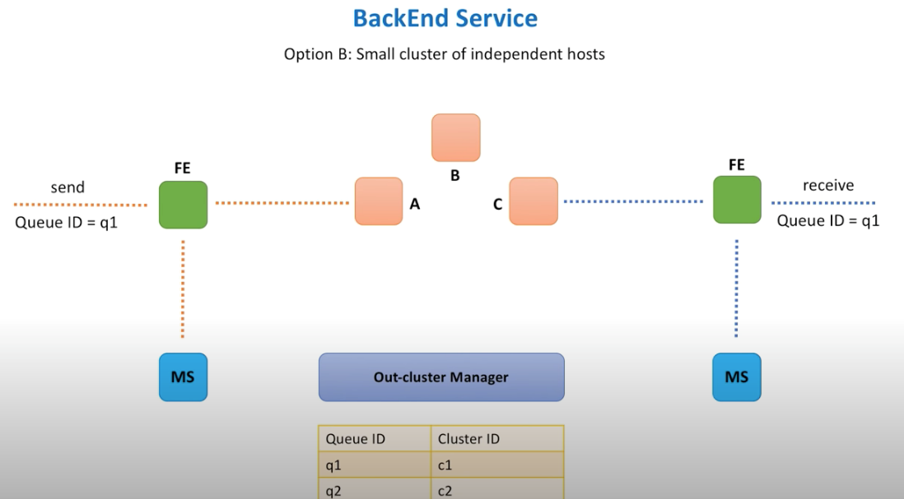

### Why Use a Queue?
- **Queues decouple producers and consumers**, allowing asynchronous communication.
- They help handle spikes in traffic (load leveling), preventing backend overload and reducing the need for over-provisioning.

### Synchronous vs. Asynchronous
- Synchronous calls are simple but make failure handling, retries, and scaling difficult.
- Asynchronous queues buffer requests, allowing consumers to process at their own pace.

### Core Requirements
- **Functional:** Send/receive messages, create/delete queues, avoid duplicates, support ordering, etc.
- **Non-functional:** Scalability, high availability, durability, performance, cost-effectiveness.

### High-Level Architecture
- **Load Balancer & VIPs:** Distribute requests, avoid single points of failure, and support scaling.
- **FrontEnd Service:** Stateless, handles validation, authentication, SSL termination, encryption, caching, rate limiting, deduplication, and usage tracking.
- **Metadata Service:** Stores queue metadata, often with caching and sharding for scalability.
- **Backend Service:** Stores and processes messages, using memory and disk for durability.

### Data Management & Replication
- **Replication:** Ensures durability; can be synchronous (safer, slower) or asynchronous (faster, riskier).
- **Leader-Follower or Clustered Backends:** Assign queues to leaders or clusters for storage and replication.
- **Partitioning:** Large queues can be split across multiple leaders or clusters.

### Message Deletion
- Options include delayed deletion (like Kafka) or marking as invisible until explicitly deleted (like SQS).

### Delivery Guarantees
- **At most once:** Messages may be lost, never redelivered.
- **At least once:** Messages never lost, may be redelivered.
- **Exactly once:** Each message delivered only once (hardest to guarantee).

### Push vs. Pull
- **Pull:** Consumers poll for messages (simpler to implement).
- **Push:** Consumers are notified when messages arrive (harder to implement).

### Ordering
- Strict FIFO is hard to guarantee at scale; many systems relax ordering for performance.

### Security & Monitoring
- Use encryption in transit and at rest.
- Monitor all components and provide metrics and alerts for both operators and customers.

### Scalability & Availability
- All components are horizontally scalable and deployed across multiple data centers for high availability and fault tolerance.

---

**In summary:**  
A distributed message queue enables scalable, reliable, and decoupled communication between services. The design must balance performance, durability, availability, and cost, using techniques like replication, sharding, and careful component separation. Security and monitoring are also essential for robust operation.

---

[System Design Interview - Distributed Message Queue](https://www.youtube.com/watch?v=iJLL-KPqBpM&t=2s&ab_channel=SystemDesignInterview)

The reason we need queue

Let's say there are two web-services called

producer and consumer, and they need to communicate with each other. One option is to setup a synchronous communication when producer makes a call to a consumer and waits for a response.

This approach has its own pros and cons.

Synchronous communication is easier and faster to implement. At the same time synchronous communication makes it harder to deal with consumer service failures. We need to think when and how to properly retry failed requests, how not to overwhelm

consumer service with too many requests and how to deal with a slow consumer service host.

another cons is it hard to handle the spiky traffic. [Queue (load leveling)](onenote:#Queue%20(load%20leveling)%20&section-id={B282D2E1-F22F-6140-945F-2EC2AF8AACCA}&page-id={E1A4E0C2-3C0E-9D41-8BB1-52A346896E59}&end&base-path=https://d.docs.live.net/77339d157d673f41/Documents/System%20Design/Message%20or%20Queue.one)

consider the situation that you have very high volume of traffic coming to you site VS other time you have near 0 or very low amount compared to what you see at the high end.

what's that mean to you web service or data cue you need handle the spikes as they coming. so need provide service or resource to meet the maximum potential scaling or traffic you need. This will become really expensive and you entire solution need premium price point just due to the spikes.

But by using queue in the middle. we call load leveling. so basic the data flow is coming to you system or inserting into the queue and later on inserting into the database. the load leveling part of that is we cannot dictate the frequency of message adding to the queue. but we can dictate rate of the message are dequeen and insert into database

we take very spiky traffic then we load level it. we can average that out over time to meet kind of middle bar of your traffic.

Another option is to introduce a new component that helps to setup asynchronous communication. Producer sends data to that component and

exactly one consumer gets this data a short time after. Such component is called a queue.

In case of a queue, message is received by

one and only one consumer.

~~And as it often happens with interview questions,~~

~~the statement is ambiguous.~~

~~What are the functional requirements? What non-functional requirements have a priority~~

~~over others? What is a scale we need to deal with?~~

Starting with functional requirements.

~~Time limit allows us to only focus on several~~

~~core APIs, like send message and receive message.~~

~~As for non-functional requirements, we want~~

~~our system to be scalable and handle load increase, highly available and tolerate hardware~~

~~and network failures, highly performant, so that both send and receive operations are~~

~~fast, and durable, so that data is persisted once submitted to the queue.~~

~~Among functional requirements, we can be asked~~

~~to support create and delete queue APIs, or delete message API. There may be specific requirements for the producer (for example system needs to avoid duplicate submissions), or security requirements, or an ask to implement a specific ordering guarantee.~~

~~As for non-functional requirements, the interviewer~~

~~may define specific service level agreement numbers (so called SLA, for example minimum~~

~~throughput our system needs to support), or requirements around cost-effectiveness (for~~

~~example system needs to minimize hardware cost or operational support cost).~~

Now let's start drafting the architecture.

Let's start with components that are common

for many distributed systems. First, we need a virtual IP. VIP refers to the symbolic hostname (for example myWebService.domain.com) that resolves to a load balancer system.

So next, we have a load balancer. A load balancer is a device that routs client requests across a number of servers.

Next, we have a FrontEnd web service. A component responsible for initial request

processing, like validation, authentication, etc.

Queue metadata information like its name,creation date and time, owner and any other

configuration settings will be stored in a database.

~~And best practices dictate that databases should be hidden behind some facade,~~ a ~~dedicated~~ web service responsible for handling calls to a database.

And we need a place to store queue messages--(backend)

So, lets introduce a backend web service, that will be responsible for message persistence

and processing.

Load balancing is a big topic.

~~Internals of how load balancers work may not matter, but in order to make sure non-functional requirements to the system we build are fully~~

~~met, we need to explain how load balancers will help us achieve high throughput and availability.~~

When domain name is hit, request is transferred

to one of the VIPs registered in DNS for our domain name.

VIP is resolved to a load balancer device, which has a knowledge of (connnect to )FrontEnd hosts.

~~By looking at this architecture, several questions~~

~~have probably popped in your head? First, load balancer seems like a single point~~

~~of failure. What happens if load balancer device goes down? Second, load balancers have limits with regards to number of requests they can process and number of bytes they can transfer. What happens when our distributed message queue service becomes so popular that load balancer limits are reached?~~

To address high availability concerns, load balancers utilize a concept of primary and

secondary nodes. The primary node accepts connections and serves requests while the secondary node monitors the primary. If, for any reason, the primary node is unable

to accept connections, the secondary node will takes over.

As for scalability concerns, a concept of multiple VIPs (sometimes referred as VIP

partitioning) can be utilized. In DNS we assign multiple A records ~~(**A Records**are the most basic type of**DNS record**and are used to point a domain or subdomain to an IP address)~~ to the same DNS name for the service. As a result, requests willed partitioned across

several load balancers. And by spreading load balancers across several

data centers, we improve both availability and performance.

Let's move on to the next component, which is a [FrontEnd web service.]{.mark}

FrontEnd is a lightweight web service, consisting of stateless machines located across several data centers.

FrontEnd service is responsible for: request validation, authentication and authorization,

SSL termination, server-side data encryption, caching, rate limiting (also known as throttling), request dispatching, request deduplication,usage data collection.

Let's discuss some basics of these features. Request validation helps to ensure that all

the required parameters are present in the request and values of these parameters honor (meet) constraints.

For example, in our case we want to make sure queue name comes with every send message request. And message size does not exceed a specified threshold.

During authentication check we verify that message sender is a registered customer of

our distributed queue service.

And during authorization check we verify that sender is allowed to publish messages to the queue it claims.

TLS is a protocol that aims to provide privacy and data integrity. TLS termination refers to the process of decrypting request and passing on an unencrypted request to the backend service. And we want to do TLS termination on FrontEnd hosts because TLS on the load balancer is expensive. Termination is usually handled by not a FrontEnd service itself, but a [separate HTTP proxy]{.mark} that runs as a process on the same host.

Next is the server-side encryption. Because we want to store messages securely

on backend hosts, messages are encrypted as soon as FrontEnd receives them. Messages are stored in encrypted form and FrontEnd decrypts them only when they are sent back to a consumer.

Cache stores copies of source data. In FrontEnd cache we will store metadata information

about the most actively used queues. As well as user identity information to save

on calls to authentication and authorization services.

Rate limiting or throttling is the process of limiting the number of requests you can

submit to a given operation in a given amouny of time. Throttling protects the web service from being overwhelmed with requests. Leaky bucket algorithm is one of the most famous.

FrontEnd service makes remote calls to at least two other web services: Metadata service

and backend service. FrontEnd service creates HTTP clients for both services and makes sure that calls to these services are properly isolated. It means that when one service let's say Metadata service experiences a slowdown, requests to backend service are not impacted.

There are common patterns like [bulkhead](onenote:Resiliency.one#Bulkhead%20patterns&section-id={2ECF0CFD-FDF8-7B44-97D2-C9A046610949}&page-id={F8F94B4D-1FD1-AD4C-B3F7-4A16DF026BAB}&end&base-path=https://d.docs.live.net/77339d157d673f41/Documents/System%20Design) and [circuit breaker](onenote:Resiliency.one#CircuitBreaker%20Design%20pattern&section-id={2ECF0CFD-FDF8-7B44-97D2-C9A046610949}&page-id={37DA44CF-F9D0-1F43-8AC4-3B4C06808B76}&end&base-path=https://d.docs.live.net/77339d157d673f41/Documents/System%20Design) that helps to implement resources isolation and make service more resilient in cases when remote calls start to fail.

Next, we have request deduplication. It may occur when a response from a successful

send message request failed to reach a client. Lesser an issue for 'at least once' delivery

semantics, a bigger issue for 'exactly once' and 'at most once' delivery semantics,

when we need to guarantee that message was never processed more than one time.

Caching is usually used to store previously seen request ids to avoid deduplication.

Last but not least is a usage data collection. When we gather real-time information that

can be used for audit.

Moving on to the next component, which is [Metadata service]{.mark}.

Metadata service stores information about queues. Every time queue is created, we store information about it in the database.

Conceptually, Metadata service is a caching layer between the FrontEnd and a persistent

storage. It handles many reads and a relatively small

number of writes.

As we read every time message arrives and write only when new queue is created.

~~Even though strongly consistent storage is preferred to avoid potential concurrent updates, it is not strictly required.~~

~~Lets take a look at different approaches of organizing cache clusters.~~

~~The first option is when cache is relatively small and we can store the whole data set~~

~~on every cluster node. FrontEnd host calls a randomly chosen Metadata service host, because all the cache cluster nodes contain the same information.~~

~~Second approach is to partition data into small chunks, called shards. Because data set is too big and cannot be placed into a memory of a single host. So, we store each such chunk of data on a separate node in a cluster. FrontEnd then knows which shard stores the~~

~~data and calls the shard directly.~~

~~And the third option is similar to the second one. We also partition data into shards, but FrontEnd does not know on what shard data is stored. So, FrontEnd calls a random Metadata service host and host itself knows where to forward the request to.~~

~~In option one, we can introduce a load balancer between FrontEnd and Metadata service. As all Metadata service hosts are equal and FrontEnd does not care which Metadata host~~

~~handles the request.~~

~~In option two and three, Metadata hosts represent a consistent hashing ring.~~

We need to figure out where and how messages are stored, right?

Is database an option?

Yes, it is. But not the best one and let me explain why. We are building a distributed message queue, a system that should be able to handle a very high throughput.

And this means that all this throughput will be offloaded to the database.

Who thought about memory? And you are correct by the way. As well as those who said file system. As we may need to store messages for daysor even weeks, we need a more durable storage, like a local disk. At the same time newly arrived messages may

live in memory for a short period of time or until memory on the backend host is fully

utilized.

Next question we should ask ourselves: how

do we replicate data?

We will send copies of messages to some other hosts, so that data can survive host hardware or software failures.

And finally, let's think about how FrontEnd hosts select backend hosts for both storing

messages and retrieving them. We can leverage Metadata service, right?

Message comes to the FrontEnd, FrontEnd consults

Metadata service what backend host to send data to. Message is sent to a selected backend host and data is replicated. And when receive message call comes, FrontEnd

talks to Metadata service to identify a backend host that stores the data.

We will consider two options of how backend

hosts relate to each other. In the first option, each backend instance is considered a leader for a particular set of queues. And by leader we mean that all requests for

a particular queue (like send message and receive message requests) go to this leader

instance.

Let's look at the example.

Send message request comes to a FrontEnd instance. Message comes to a queue with ID equal to q1. FrontEnd service calls Metadata service to identify a leader backend instance for this queue. In this particular example, instance B is a leader for q1. Message is sent to the leader and the leader is fully responsible for data replication. When receive message request comes to a FrontEnd instance, it also makes a request to the Metadata

service to identify the leader for the queue. Message is then retrieved from the leader

instance and leader is responsible for cleaning up the original message and all the replicas.

We need a component that will help us with leader election and management. Let's call it In-cluster manager(zookeeper) . And as already mentioned, in-cluster manager is responsible for maintaining a mapping between queues, leaders and followers. In-cluster manager is a very sophisticated component. It has to be reliable, scalable and performant. Creating such a component from scratch is not an easy task.

Let's see if we can avoid leader election in the first place. Can you think of an option when all instances are equal?

In the second option, we have a set of small clusters, each cluster consists of 3-4 machines

distributed across several data centers.

When send message request comes, similar to the previous design option, we also need to

call Metadata service to identify which cluster is responsible for storing messages for the

q1 queue. After that we just make a call to a randomly selected instance in the cluster. And instance is responsible for data replication across all nodes in the cluster.

When receive message request comes and we identified which cluster stores messages for

the q1 queue, we once again call a randomly selected host and retrieve the message. Selected host is responsible for the message cleanup.

As you may see, we no longer need a component for leader election, but we still need something that will help us to manage queue to cluster assignments. Let's call this component an Out-cluster manager. And this component will be responsible for maintaining a mapping between queues and clusters.

~~Is out-cluster manager a simpler component than in-cluster manager? It turns out that not really.~~

~~While in-cluster manager manages queue assignment within the cluster, out-cluster manager manages queue assignment across clusters. In-cluster manager needs to know about each and every instance in the cluster.~~

~~Out-cluster manager may not know about each particular instance, but it needs to know about each cluster.~~

~~In-cluster manager listens to heartbeats from instances. Out-cluster manager monitors health of each independent cluster.~~

~~And while in-cluster manager deals with host failures and needs to adjust to the fact that~~

~~instances may die and new instances may be added to the cluster, out-cluster manager~~

~~is responsible for tracking each cluster utilization and deal with overheated clusters.~~

~~Meaning that new queues may no longer be assigned to clusters that reached their capacity limits.~~

And what about really big queues?

When a single queue gets so many messages that a single leader (in design option A)

or a single cluster (in design option B) cannot handle such a big load?

In-cluster manager splits queue into parts (partitions) and each partition gets a leader

server. Out-cluster manager may split queue across several clusters.

So that messages for the same queue are equally distributed between several clusters.

~~Queue creation and deletion.~~

~~Queue can be auto-created, for example when the first message for the queue hits FrontEnd service, or we can define API for queue creation.~~

~~.~~

~~Delete queue operation is a bit controversial, as it may cause a lot of harm and must be executed with caution. For this reason, you may find examples of well-known distributed queues that do not expose deleteQueue API via public REST endpoint.~~

~~Instead, this operation may be exposed through a command line utility, so that only experienced admin users may call it.~~

As for a message deletion, there are several options at our disposal. One option is not to delete a message right after it was consumed. In this case consumers have to be responsible for what they already consumed. And it is not as easy as it sounds.

As we need to maintain some kind of an order for messages in the queue and keep track of

the offset, which is the position of a message within a queue.

Messages can then be deleted several days later, by a job. This idea is used by Apache Kafka.

The second option, is to do something similar to what Amazon SQS is doing. Messages are also not deleted immediately, but marked as invisible, so that other consumers may not get already retrieved message. Consumer that retrieved the message, needs to then call delete message API to delete the message from a backend host.

And if the message was not explicitly deleted by a consumer, message becomes visible and

may be delivered and processed twice.

We know that messages need to be replicated to achieve high durability. ~~Otherwise, if we only have one copy of data, it may be lost due to unexpected hardware failure~~.

Messages can be replicated synchronously or asynchronously.

Synchronously means that when backend host receives new message, it waits until data

is replicated to other hosts. And only if replication is fully completed, successful response is returned to a producer.

Asynchronous replication means that response is returned back to a producer as soon as

message is stored on a single backend host. Message is later replicated to other hosts.

Both options have pros and cons. Synchronous replication provides higher durability,

but with a cost of higher latency for send message operation.

Asynchronous replication is more performant, but does not guarantee that message will survive backend host failure.

There are three main message delivery guarantees. At most once, when messages may be lost but are never redelivered. At least once, when messages are never lost but may be redelivered. And exactly once, when each message is delivered once and only once.

And you probably have a question already, why do we need three?

Will anyone ever want other than exactly once

delivery? Great question, and the simple answer is that it is hard to achieve exactly once delivery in practice. In a distributed message queue system there are many potential points of failure. Producer may fail to deliver or deliver multiple times, data replication may fail, consumers may fail to retrieve or process the message. All this adds complexity and leads to the fact that most distributed queue solutions today support at-least-once delivery, as it provides a good balance between durability, availability and performance.

Push vs pull

With a pull model, consumer constantly sends retrieve message requests and when new message is available in the queue, it is sent back to a consumer.

With a push model, consumer is not constantly bombarding FrontEnd service with receive calls. Instead, consumer is notified as soon as new message arrives to the queue.

And as always, there are pros and cons. Here I will not enumerate all of them, will

simply state that from a distributed message queue perspective pull is easier to implement

than a push. But from a consumer perspective, we need to do more work if we pull.

Many of us think of FIFO acronym when we hear about queues. FIFO stands for first-in, first-out, meaning that the oldest message in a queue is always processed first. But in distributed systems, it is hard to maintain a strict order. Message A may be produced prior to message B, but it is hard to guarantee that message A will be stored and consumed prior to message B.

For these reasons many distributed queue solutions out there either does not guarantee a strict order. Or have limitations around throughput, as queue cannot be fast while it's doing many additional validations and coordination to guarantee a strict order.

With regards to security, we need to make sure that messages are securely transferred

to and from a queue. Encryption using SSL over HTTPS helps to protect messages in transit.

And we also may encrypt messages while storing them on backend hosts. We discussed this when talked about FrontEnd service responsibilities.

Monitoring is critical for every system.

With regards to distributed message queue, we need to monitor components (or microservices) that we built: fronted, metadata and backend

services. As well as provide visibility into customer's experience.

In other words, we need to monitor health of our distributed queue system and give customers ability to track state of their queues. Each service we built has to emit metrics

and write log data. As operators of these services we need to create dashboards for each microservice and setup alerts. And customers of our queue have to be able to create dashboards and set up alerts as well.

For this purpose, integration with monitoring system is required.

Do not forget to mention monitoring aspect to the interviewer. Many times this topic is omitted by candidates, but it is very important.

Let's take one final look at the architecture we built.

And evaluate whether non-functional requirements are fulfilled.

Is our system scalable? Yes. As every component is scalable. When load increases, we just add more load balancers, more FrontEnd hosts, more Metadata service cache shards, more backend clusters and hosts.

Is our system highly available? Yes. As there is no a single point of failure, each component is deployed across several data centers. Individual hosts may die, network partitions

may happen, but with this redundancy in place our system will continue to operate.

Is our system highly performant? It's actually very well depends on the implementation,

hardware and network setup. Each individual microservice needs to be fast.And we need to run our software in high-performance data centers.

Is our system durable? Sure. We replicate data while storing and ensure messages are not lost during the transfer from a producer and to a consumer.

