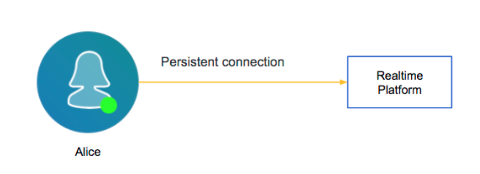
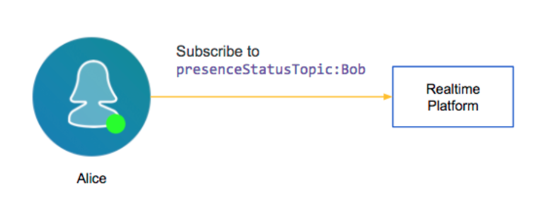
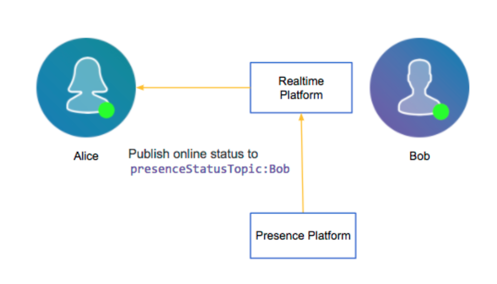
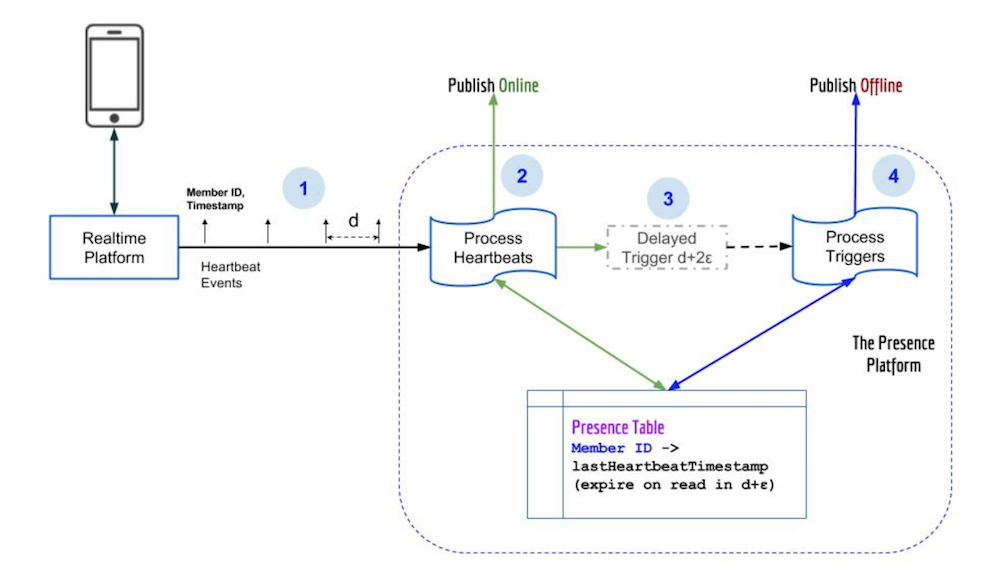

# Now You See Me, Now You Don’t: LinkedIn’s Real-Time Presence Platform | LinkedIn Engineering

---

Clipped from : <https://engineering.linkedin.com/blog/2018/01/now-you-see-me--now-you-dont--linkedins-real-time-presence-platf>

*Co-authors: [Akhilesh Gupta](https://www.linkedin.com/in/guptaakhilesh/) and [Meng Lay](https://www.linkedin.com/in/menglay/)*

~~Have you ever wondered how those green online indicators (or "presence indicators") that are so pervasive in every instant messaging application and social network actually work? How does one display them in real time for roughly 500 million members on a social network like LinkedIn?~~

~~In this post, we'll provide a technical walk-through of how we used the [Play Framework](https://www.playframework.com/) and the [Akka Actor Model](https://akka.io/) to build the massive infrastructure that keeps track of the [online status](https://blog.linkedin.com/2017/august/16/introducing-active-status-on-linkedin-messaging) of millions of members at any given moment. We'll describe how it distributes thousands of changes per second in the online status of these members to millions of other connected members in real time. You will also learn how to apply these techniques to your own applications.~~

~~Let's start with the first problem we needed to solve.~~

**Problem 1: How do we know when a member is connected to LinkedIn?**

We needed to provide a way to access a member's current online status, and if the member is offline, to provide their last active timestamp. Moreover, we needed a way to distribute changes in a member's presence status to a potentially huge number of the member's connections who could be currently viewing the member's presence status anywhere on LinkedIn.

To solve this problem, we leveraged LinkedIn's [Real-time delivery platform](https://vimeo.com/239675704) that we built last year for Instant Messaging on LinkedIn. The tech talk linked [here](https://vimeo.com/239675704) describes the platform in detail, but at a high level, it is a publish/subscribe system that allows data to be streamed from the server to mobile or web clients over a persistent connection as events happen.

When member "Alice" opens LinkedIn on her mobile device or a browser, a persistent connection is established with the Real-time Platform. The existence of this connection is a clear indication that Alice is currently online.

[Secondly, Alice may be interested in viewing whether Bob is currently online. For that, the Real-time Platform allows Alice to subscribe to a topic for Bob's presence status.]{.mark}

[When Bob opens his app, we need our Presence Platform to know that Bob has come online and to publish an online event on the topic for Bob's presence status. The Real-time Platform then sends the event published on that topic to all of its subscribers, including Alice. Thus, Alice would see Bob's presence indicator turn green.]{.mark}

As you can see above, [our Presence Platform needs to be able to detect the existence of the persistent connection to determine when a member comes online.]{.mark} Subsequently, it needs to publish events to the presence status topic for that member on the Real-time Platform. That would allow the Real-time Platform to distribute that event to the member's connections. However, there is another big problem we need to solve.

**Problem 2: Jittery connections**

Members on mobile devices are often on [lossy networks and regularly get disconnected and reconnected haphazardly.]{.mark} They could simply be on a bad network or experiencing temporary network interruption, such as passing through a tunnel or a parking garage.

If we ignored this problem, their presence status would constantly bounce between online and offline. Apart from it being a bad UI experience for the viewer, it would also result in a massive amount of avoidable traffic through our backend systems to distribute all these fluctuations in presence status to the connections of that member.

At this point, let's dive into the architecture of LinkedIn's Presence Platform to look at how we solved this problem using periodic heartbeats for currently connected members.

As we discussed before, [when a member opens their LinkedIn application, it results in a persistent connection being established with the Real-time Platform]{.mark}. [The Real-time Platform, in turn, starts emitting periodic heartbeats with the member's ID with a fixed duration of d seconds between successive heartbeats]{.mark}. This duration acts as the guard against fluctuations in a member's presence status. [As long as a heartbeat is received every d seconds, our Presence Platform will deem the member to be online.]{.mark} Thus, if a member runs into a bad network condition, drops their connection and then reconnects within d seconds, we will continue to deem them as online, as long as the next heartbeat is emitted for their connection. This handles jitter gracefully and prevents unnecessary fluctuations. Next, let's look at the internals of our Presence Platform to understand how each of these heartbeats are processed.

The first part of the Presence Platform is the process heartbeats step.

- [For each received heartbeat corresponding to a member ID, it checks whether we have an unexpired entry for that member ID in our distributed K/V store for Presence]{.mark}. Any distributed K/V store that can support both a high read and write volume can be used for this purpose.
- If there is no entry or if previous entries have expired,
  - We conclude that the member just came online.
  - We publish an online event on the presence status topic for that member on the Real-time Platform to distribute that event to the member's connections.
  - We add an entry to the store with an [expiry duration which is slightly larger than d seconds (d + ε) to keep the record alive till at least the next heartbeat.]{.mark}
- If an unexpired entry exists, the member is already online and we simply update the lastHeartbeatTimestamp for that member ID to the latest value.

As you can see, processing heartbeats and detecting when a member goes online is straightforward with the above setup. This is where we hit our next problem: how do we detect when a member goes offline?

**Problem 3: Detecting the absence of a heartbeat**

To determine that a member went offline, we need to detect the absence of a heartbeat. For this, [we built what we called a delayed trigger for each member that is currently online]{.mark}. We'll talk about the technology we used to build this in the next section, but for now, assume that for each online member, [we are able to start a timer that will fire later to allow us to check whether the heartbeat stored for that member has expired or not. Since heartbeats expire in d + ε seconds, we need the timer to fire a little after that or in d + 2ε seconds.]{.mark}

Thus, during the process heartbeat step, [we create this delayed trigger if it doesn't yet exist for the member. If it already exists, we simply reset it to fire in another d + 2ε seconds. When the delayed trigger for an online member fires, we check whether the member's heartbeat has expired in our K/V store. If it has, we publish an offline event on the presence status topic for that member on the Real-time Platform to distribute the fact that the member has gone offline to the member's connections.]{.mark}

You might be wondering how this scales out horizontally. Note that it doesn't matter which node running the Presence Service receives a member's heartbeat. The common state is kept only in the distributed K/V store, which will allow any node to do the exact same processing for a given member. However, [to prevent duplication of the delayed triggers for a member on multiple nodes, we do a best-effort sticky routing of a given member's heartbeats to a given node.]{.mark} This is done using the [d2 load balancer](https://github.com/linkedin/rest.li/wiki/Dynamic-Discovery#d2-load-balancer) at LinkedIn, which supports a load balancer strategy that can hash the member ID in the heartbeat request to route it to the same node.

**Delayed triggers using Akka Actors**

On LinkedIn, thousands of members go online or offline per second. There are millions of members that are online at any given moment. Since we create a delayed trigger for each online member, we needed a truly lightweight solution.

[Akka](https://akka.io/) is a toolkit for building highly concurrent, distributed, and resilient message-driven applications, and it works well with the [Play Framework](https://www.playframework.com/) that we use at LinkedIn. [Actors](https://doc.akka.io/docs/akka/current/general/actors.html) are objects which encapsulate state and the behavior defining what they should do when they receive certain messages. Each Actor has a mailbox and they communicate exclusively by exchanging messages. An Actor is assigned a lightweight thread when available, which reads the message from the mailbox and alters the state of the Actor based on the behavior defined for that message.

Since Actors are so lightweight, there can be millions of Actors in the system, each with their own state and behavior. A relatively small number of threads proportional to the number of cores on the system can serve the Actors to execute their behavior when they receive these messages. As each Actor receives a message, a thread is assigned to execute its behavior for that message and then, it is free to be assigned to the next Actor.

We can basically create one Actor per online member to act as the delayed trigger for that member and treat a heartbeat like a message in its mailbox.

- When a Heartbeat message is received for a member, we create an Actor for the member if it doesn't already exist and [start an [Akka Scheduler](https://doc.akka.io/docs/akka/2.5.5/java/scheduler.html) within the Actor to send a Publish Offline message to itself after d + 2ε seconds.]{.mark}
- When the scheduler fires, the [Actor handles the Publish Offline message by publishing an offline event]{.mark} if the member's entry has expired in the K/V store, as described before.

Interestingly, the number of live Actors in the Presence Platform corresponds to the number of online members at that moment, and the duration for which these Actors are live corresponds to the duration for which LinkedIn members are online.

Since Actors reside in memory, we need to be careful to allow a graceful shutdown of live Actors on a node during deployment. We introduce a delay of d + 2ε seconds between marking a node for deployment and restarting the process to allow all the delayed triggers on that node to be drained.

A note on the value of d, the duration between consecutive heartbeats: If it's too low, we would have to process a lot more heartbeats and, in general, we would have increased the load on our system. If it's too high, it would take too much time to detect when a member goes offline. As with most other things in life, it needs to be a balance.

**Putting it all together**

Let's briefly go back to Alice and Bob to put this all together.

1.  [When Alice is interested in Bob's presence status, she queries the Presence Platform through its GET API to get Bob's current presence status (offline) and his last heartbeat timestamp. At the same time, she subscribes to changes in Bob's presence status through the Real-time Platform.]{.mark}
2.  When Bob comes online, the Presence Platform detects that and publishes an online event to Bob's presence status topic on the Real-time Platform.
3.  The Real-time Platform sends the change in Bob's status to Alice and Alice can now see Bob as online. This process is really fast and it takes less than 200ms at p99.

This platform is built for massive scale. Each node in the Presence Platform can handle approximately 1.8K QPS of incoming requests (process heartbeat requests, GET API requests, etc.) and the platform itself is horizontally scalable as described above. Using all the above technology, we are now able to display real-time presence status for a member's connections across LinkedIn messaging, feed, notifications, etc. on both mobile and web for hundreds of millions of LinkedIn members across the globe.

This has made our LinkedIn experience come alive and we can visually interact with our friends and colleagues on things that matter to us the most. We have seen increased engagement across the site and received positive feedback from LinkedIn members since we launched this feature. We hope that this technical deep-dive inspires you to try these techniques in your own projects. Feel free to reach out to us to discuss your own ideas at [@agupta03](https://twitter.com/agupta03) and [Meng Lay](https://www.linkedin.com/in/menglay).

**Acknowledgements**

It took an entire team of engineers, managers, designers, data scientists, and product managers to take this project from idea to release. We'd like thank the following people for their invaluable contributions to the project: [Jake Dejno](https://www.linkedin.com/in/dejno/), [Jia Ding](https://www.linkedin.com/in/jiading/), [Jingwei Huang](https://www.linkedin.com/in/jingwei-huang-b6731841/), [Sean Johnson](https://www.linkedin.com/in/seantherockjohnson/), [Adam Leon](https://www.linkedin.com/in/adam-leon-8847239/), [Henry Majoros](https://www.linkedin.com/in/hmajoros/), [Haowen Ning](https://www.linkedin.com/in/haowen-ning-16393719/), [Viet Nguyen](https://www.linkedin.com/in/viet-nguyen-562a304/), [Félix Pageau](https://www.linkedin.com/in/f%C3%A9lix-pageau/), [Amit Ruparel](https://www.linkedin.com/in/amitruparel/), [Sammy Shreibati](https://www.linkedin.com/in/sammyshreibati/), [James Sorenson](https://www.linkedin.com/in/james-eric-sorenson/), [Chris Szeto](https://www.linkedin.com/in/szetopia/), [Taj Welsh](https://www.linkedin.com/in/tajwelsh/), and [Max Wolffe](https://www.linkedin.com/in/maxwolffe/).

