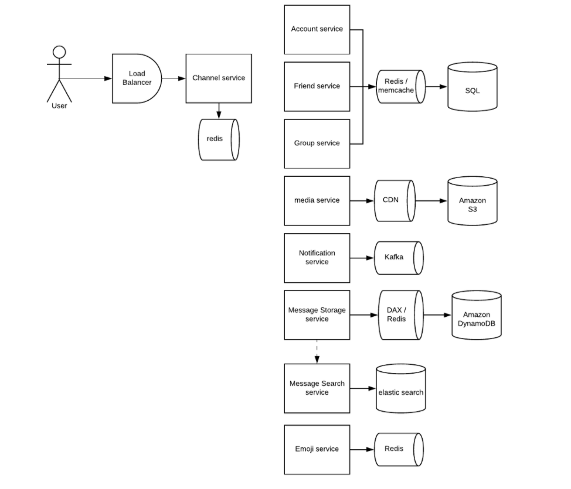

# Design Slack 

---

for QPS, if we have 1000 message/s we need more than 2 machine

if more than 1000 qps, you need multiple partition

one my sql services can handle 500 G

cache will reduce 10-100 times

![Channel Table(Redis): key User id: Scott Message Storage Table(DynamoDB): value Safety: { unread_msg: 10; Last_msg_preview: happy_hour_at_l Timestamp: 21324 David: { unread_msg: O; Last_msg_preview. what's up? Timestamp: 341234; Uncle: { unread_msg: O; Last_msg_preview. dinner time? Timestamp: 1234; // expired PartitionKey containerld Sort key timestamp - msg_id Msg id uuid Sender id message System design is fun. Creation timestamp 413412 In group container id is group ID In direct message, container id is sorted {useridl, userid2) ](../../media/Message-Slack-Design-Slack-image2.png)

we need a channel table for one-on-one chat or group chat

channel id, ....

we need another table map the channel id ->user id

many to many

shard by user id

the message table the partition key can be channel id

we store who is oneline one the channel service or notification service

channel table is temp table just stored in the messory

