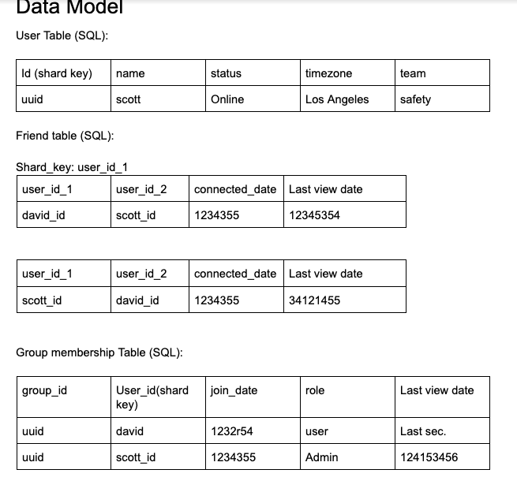

# Design Slack

Created: 2021-01-13 00:56:52 -0600

Modified: 2021-01-13 01:37:28 -0600

---

Design Slack

- Domain / Group / Individual
- Support direct msg / group msg
- Support link preview
- Support multimedia msg
- Msg Notification
- Highlight unread msg

10 mins: Business (Use Cases)/common sense

10 mins: Constraints

10 mins: Architecture

10 mins: API Design

10 mins: DB choice

10 mins: Data model

High-level architecture and APIs

{width="5.9375in" height="3.3541666666666665in"}

**Needs to go over the flow when high-level architecture is ready**

**Transaction: User -> LB -> Application servers(channel, mss, group, multimedia process, object storage) -> Notification.**

**LB: auth/token verification**

**[channel: maintain channel msg ownership]{.underline}**

**Group: people, group relationship**

**Message storage service: storage msg**

**Notification service:**

**Multimedia service -> upload image, trigger image processing. S3 for multimedia storage.**

Message Server

Application Server

Storage

Use Case

MVP (discuss with the interviewer)

- Direct Message
- Channel: Group Chat
- Multimedia msg
- Link preview

Goal:

- High available
- High reliable
- Consistent
- High performance: real-time

Bonus

- Group Membership
- Msg Notification
- Highlight unread msg

Non-Goals

- Authentication/Authorization
- Mobile/Web Client Side s

Constraints

- One domain
- (Ask Interviewer) DAU: 10M
- MVP:
  - Peak Direct Message: 5(peek) * 10M * 100( every user send 100 message per day ) / 86400 = 50K Msg/s ( [if you have 1k -10k QPS more than 2 machine]{.mark}

- One msg: 100 bytes
- Throughput: 500K * 100 / 1000 = 100MB/s
- Storage: 100MB * 86400 = 10TB ( 1 machine 500 GB)
- Group chat #: 1000 members in a group.

Scale:

- QPS
- Data

Note:

- > 1000 QPS: need multiple partitions

Architecture & Database

**Account service**: manage user account info.

[**Friends service**: manage user friendship info. May not need in slack]{.underline}

**Group service**: manage group membership info

**Media service:** process multi-media / link info.

**Message Storage Service:** store message.

**Notification Service:** notify the users

**Channel service:** master service serve all requests from the user

**Message search service**: manage messaging search index and lookup.

{width="6.152777777777778in" height="5.958333333333333in"}

API

GetChannels(user_id):

- store last viewed channel
- Store visible channels: recent direct message/membership of the group
- Show unread msg / last msg preview: denormalized data

SendMessage(Sender_id, receiver_id, message_type, message, media_id (url))

- message_type is one of [direct message, group message]
- **create_timestamp, update_timestamp, expired_time, STATE** will be appended by channel service.
- STATE could be one of [received, sent, viewed,notification_sent, deleted], the multimedia message may need to be processed, therefore need some time between received and sent

updateMessage(message_id, message) / deleteMessage

uploadFile(user_id, permission_group, file_descriptor, some_metadata)

LookupEntity(user_id) -- trie

joinGroup(user_id, group_id)

getDirectMessages(user_id, friend_id)

getGroupMessages(user_id, group_id)

CRUD for group info

getGroupNotice / getGroupMembers / getGroupDetail / GetGroupSharedFiles / update...

CRUD for user info

getUserInfo / updateUserInfo

Internal API:

Media service:

processMedia(media_id)

- Replicate media
- Post-processing: Generate preview / thumbnail
- Distributed to CDN

Notification Service:

notifyUser(user_id, sender_id, message_id, msg_preview);

- Either use database or Kafka
- Exactly once is difficult, requiring [two-phase commits](https://en.wikipedia.org/wiki/X/Open_XA).

Data Model

User Table (SQL):

| Id (shard key) | name  | status | timezone    | team   |
|----------------|-------|--------|-------------|--------|
| uuid           | scott | Online | Los Angeles | safety |

Friend table (SQL):

Shard_key: user_id_1

| user_id_1 | user_id_2 | connected_date | [Last view date]{.mark} |
|-----------|-----------|----------------|-------------------------|
| david_id  | scott_id  | 1234355        | 12345354                |

| user_id_1 | user_id_2 | connected_date | [Last view date]{.mark} |
|-----------|-----------|----------------|-------------------------|
| scott_id  | david_id  | 1234355        | 34121455                |

Group membership Table (SQL):

| group_id | User_id(shard key) | join_date | role  | Last view date |
|----------|--------------------|-----------|-------|----------------|
| uuid     | david              | 1232r54   | user  | Last sec.      |
| uuid     | scott_id           | 1234355   | Admin | 124153456      |

Channel Table(Redis):

<table>
<colgroup>
<col style="width: 27%" />
<col style="width: 72%" />
</colgroup>
<thead>
<tr>
<th>key</th>
<th>value</th>
</tr>
</thead>
<tbody>
<tr>
<td>User_id: Scott</td>
<td>
Safety: {

unread_msg: 10;

Last_msg_preview: happy_hour_at_10:..

Timestamp: 21324

}
</td>
</tr>
<tr>
<td></td>
<td>
David: {

unread_msg: 0;

Last_msg_preview: what’s up?

Timestamp: 341234;

}
</td>
</tr>
<tr>
<td></td>
<td>
Uncle: {

unread_msg: 0;

Last_msg_preview: dinner time?

Timestamp: 1234; // expired

}
</td>
</tr>
</tbody>
</table>

Message Storage Table(DynamoDB):

<table style="width:100%;">
<colgroup>
<col style="width: 17%" />
<col style="width: 20%" />
<col style="width: 9%" />
<col style="width: 12%" />
<col style="width: 20%" />
<col style="width: 19%" />
</colgroup>
<thead>
<tr>
<th>PartitionKey</th>
<th>Sort key</th>
<th>Msg id</th>
<th>Sender id</th>
<th>message</th>
<th>Creation timestamp</th>
</tr>
</thead>
<tbody>
<tr>
<td>containerId</td>
<td>

timestamp - msg_id
</td>
<td>uuid</td>
<td>scott</td>
<td>System design is fun.</td>
<td>413412</td>
</tr>
</tbody>
</table>

In group container id is group ID

In direct message, container id is sorted {userid1, userid2}

Emoji table(redis):

| key        | value            |
|------------|------------------|
| message_id | Scott: smile     |
|           | David: thumbs up |

Also list group tables etc if you have some time left.

Bottleneck & scale

Infinite scale: sharding, periodically cleanup

Throttle needed for sane user behavior.

Q & A

From Scott(Ruisheng) Shi to Everyone: (5:37 PM)

<https://drive.google.com/drive/u/1/folders/1g1brDv31OO4wzKwpbHu4LSW9ad6Is4AY>

From Henry Wu to Everyone: (5:43 PM)

Is this the hackernews: <https://news.ycombinator.com/> ?
Oracle Go!

From Me to Everyone: (5:54 PM)

Constraints需要考虑每个机器的network bandwidth吗？

From Henry Wu to Everyone: (5:58 PM)

Will friends service use graph database?

From Han Yin to Everyone: (5:59 PM)

Android: Firebase Cloud Messaging (FCM)

From Henry Wu to Everyone: (6:00 PM)

DynamoDB vs Cassandra?

From Warren Lu to Everyone: (6:03 PM)

Why emoji service separate from message storage system?

From Yuheng Li to Everyone: (6:05 PM)

这里说的emoji update 是指的给msg点赞和counter吗？
叫 reaction 就没歧义了

From Feng to Everyone: (6:07 PM)

Emoji本身是存在哪里的？

From Henry Wu to Everyone: (6:08 PM)

emoji是每个消息被点赞的意思吗
protobuf vs thrift?

From Henry Wu to Everyone: (6:23 PM)

how about use ACK?

From 李一凡 to Everyone: (6:26 PM)

Difference between kafka and message queue?

From hao fu to Everyone: (6:27 PM)

能讲下two-phase commitment 怎么做的? high level 就行

From Warren Lu to Everyone: (6:27 PM)

2PC一般只有在payments system才用感觉

From Feng to Everyone: (6:28 PM)

message state都是通过channel service来update的嘛？这样会不会形成service间的circle dependency
比如notification会call channel来update state

From Warren Lu to Everyone: (6:32 PM)

这个QPS应该很大吧？

From Yuheng Li to Everyone: (6:36 PM)

slack有没有1v1好友这个概念?

From Feng to Everyone: (6:38 PM)

能具体解释一下group里面last view message是怎么实现的吗？

From Henry Wu to Everyone: (6:38 PM)

每一个talk session应该都有个last view吗?

From Feng to Everyone: (6:40 PM)

懂了谢谢

From Warren Lu to Everyone: (6:40 PM)

Last view date是在什么时候更新的呢
heartbeat?

From Karen to Everyone: (6:40 PM)

对于每个登录的client, 都需要maintain 一个 long live 的connection吗？

From Me to Everyone: (6:41 PM)

Last view timestamp更新频繁需不需要单独拿出来

From yang yang to Everyone: (6:42 PM)

每个group上有多少条未读消息是在什么时候更新？

From Warren Lu to Everyone: (6:42 PM)

如果你持续在这个channel很长时间，那么last view date就不对啊

From Karen to Everyone: (6:44 PM)

Last view date可以只在client端做吗？

From Warren Lu to Everyone: (6:45 PM)

Channel table message的expire是怎么实现的

From Xianfeng & Brenda Zhao to Everyone: (6:51 PM)

how about message search - would global message id be used?

From Me to Everyone: (6:52 PM)

这些table里的timestamp是哪个node生成的？比如user b看到user a的msg1消息回复msg2，会不会出现 group chat里msg2在msg1之前？

From yang yang to Everyone: (6:53 PM)

Group里面每次有人发一条消息所有member的channel table都被更新一下嘛？

From Long Tian to Everyone: (6:56 PM)

Can we treat 'direct message' as a single/double-member group message, so we don't need to differentiate whether this is 'direct messages' from 'group messages' at the public APIs and the backend? Basically we attach message to a group, that group can be have <=2 members (direct) or > 2 members (group)?

From Me to Everyone: (6:59 PM)

channel table里面是存全量的user还是只是online的user？

From Greta Shi to Everyone: (7:00 PM)

可不可以把group id当成一个tag
user的tag

From Me to Everyone: (7:02 PM)

group_membership是用MySQL存的，如果把SQL 按照group_id shard了，那么sql 数据库自带的second index功能就不能用了吧？

From Henry Wu to Everyone: (7:06 PM)

会不会QPS太大用websocket?
OK

