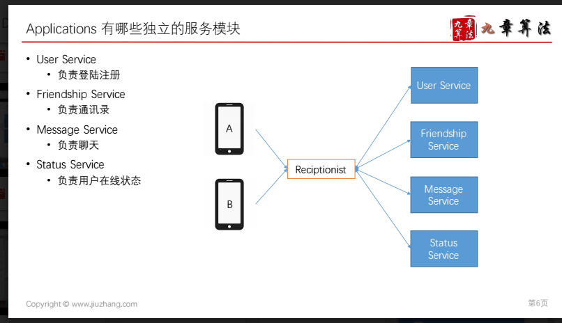
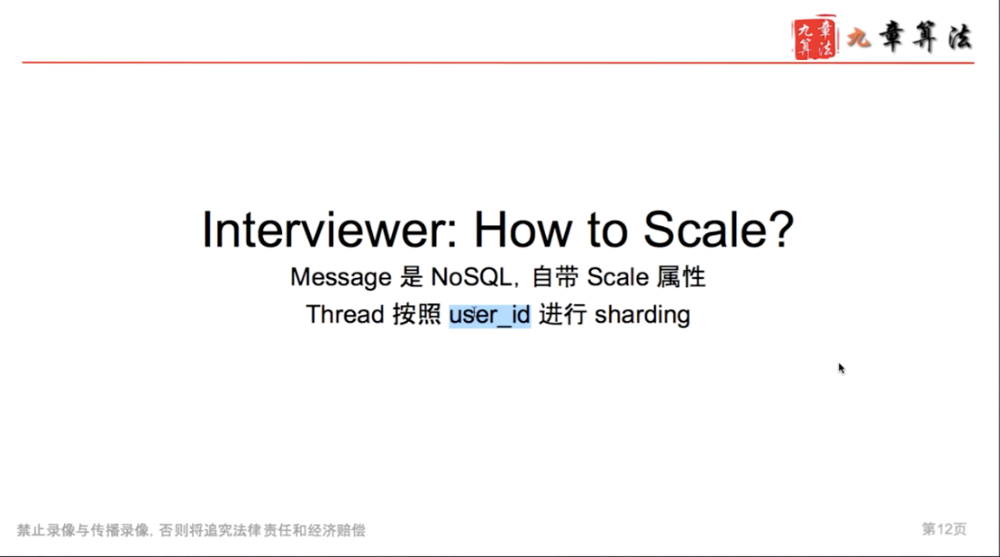
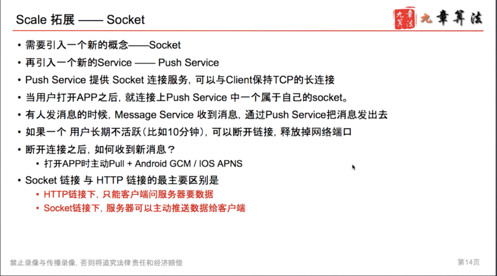
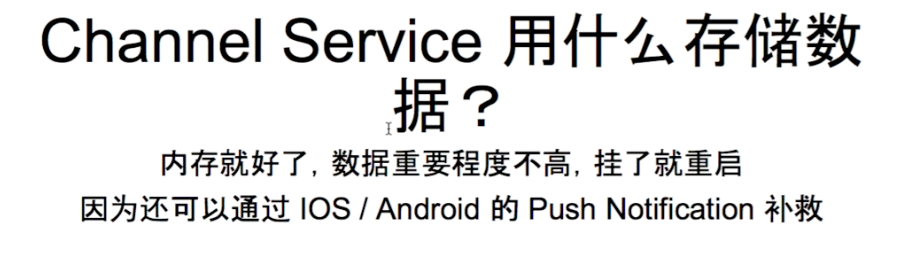
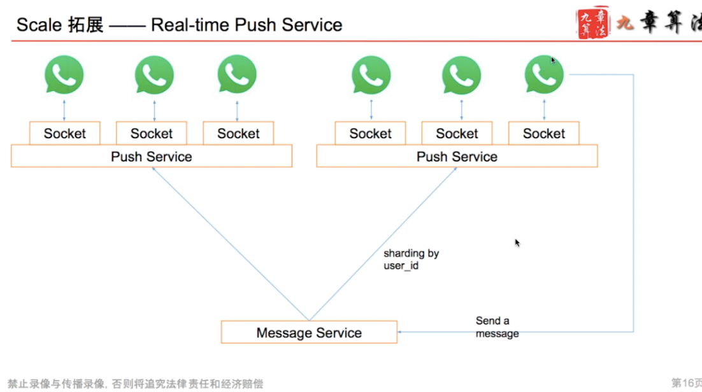

# Chat System

---

改进

![Scale 拓 展 · 解 决 群 聊 章 籌 法 · 增 加 一 个 Channel Service( 频 道 服 务 ） · 为 每 个 聊 天 的 Thread 增 加 一 个 Channel 信 息 · 对 于 较 大 群 ， 在 线 用 户 先 需 要 订 阅 到 对 应 的 Channel 上 · 用 户 上 线 时 ， Web Server (message service) 找 到 用 户 所 属 的 频 道 （ 群 ), 并 通 知 Channel Service 完 成 订 阅 · Channe 僦 知 道 哪 些 频 道 里 有 哪 些 用 户 还 活 着 · 用 户 如 果 断 线 了 ， Push Service 会 知 道 用 户 掉 线 了 ， 通 知 Channel Service 从 所 属 的 频 道 里 移 除 · Message Service 收 到 用 户 发 的 信 息 之 后 · 找 到 对 应 的 channel · 把 发 消 息 的 请 求 发 送 给 Channel Service · 原 来 发 500 条 消 息 变 成 发 1 条 消 息 · Channel Service 找 到 当 前 在 线 的 用 户 · 然 后 发 给 Push Service 把 消 息 Push 出 去 禁 止 录 像 与 传 播 录 像 ． 否 则 将 追 法 律 责 任 和 经 济 赔 偿 第 20 页 ](../../media/Message-What's-up-Chat-System-image7.png)

conversation table

web server 不知道 那个连上了

user subscribe the channel service

pull the message

heart beat, server return a my friends status

