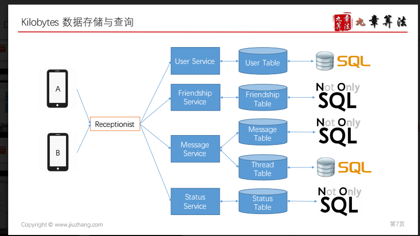

# Service

Created: 2017-10-09 11:05:34 -0600

Modified: 2020-11-27 16:36:53 -0600

---

{width="10.083333333333334in" height="5.708333333333333in"}

4. High Level Design

At a high level, we will need a servers in the central piece for the communications between users.

another user, client login to the system through the user service.

system will find out which message is unread for that user

When a user wants to send a message to they will connect to the chat server and send the message to the server; the server then passes that message to the other user and also stores it in the database.

Detail

For Thread table and Message table : [Schema and API](onenote:#Schema%20and%20API%20&section-id={F131001E-7D02-5341-98A7-A7C97F3A6A16}&page-id={CA559458-4FD3-9C4A-81D0-ADD6EF1EFBE2}&end&base-path=https://d.docs.live.net/77339d157d673f41/Documents/9%20chapter/System%20Design%20and%20OO%20Design/Message.one)

Push model: Users can keep a connection open with the server and can depend upon the server to notify them whenever there are new messages.

If we go with our second approach, where all the active users keep a connection open with the server, then as soon as the server receives a message it can immediately pass the message to the intended user.

This way, the server does not need to keep track of pending messages, and we will have minimum latency, as the messages are delivery instantly on the opened connection.

**How will clients maintain an open connection with the server?**[We can use HTTP Long Polling. In long polling, clients can request information from the server with the expectation that the server may not respond immediately. If the server has no new data for the client when the poll is received, instead of sending an empty response, the server holds the request open and waits for response information to become available. Once it does have new information, the server immediately sends the response to the client, completing the open request]{.mark}. Upon receipt of the server response, the client can immediately issue another server request for future updates. This gives a lot of improvements in latencies, throughputs, and performance. The long polling request can timeout or can receive a disconnect from the server, in that case, the client has to open a new request.

**How can server keep track of all opened connection to efficiently redirect messages to the users?**The server can maintain a hash table, where "key" would be theUserIDand "value" would be the connection object. So whenever the server receives a message for a user, it looks up that user in the hash table to find the connection object and sends the message on the open request.

**What will happen when the server receives a message for a user who has gone offline?**If the receiver has disconnected, the server can notify the sender about the delivery failure. If it is a temporary disconnect, e.g., the receiver's long-poll request just timed out, then we should expect a reconnect from the user. In that case, we can ask the sender to retry sending the message. This retry could be embedded in the client's logic so that users don't have to retype the message. The server can also store the message for a while and retry sending it once the receiver reconnects.

How many chat servers we need? Let's plan for 500 million connections at any time. Assuming a modern server can handle**50K**concurrent connections at any time, we would need 10K such servers.

after log off and log in again

Users can ask the server if there are any new messages for them.

(disadvantage

If we go with our first approach, then the server needs to keep track of messages that are still waiting to be delivered, and as soon as the receiving user connects to the server to ask for any new message, the server can return all the pending messages. To minimize latency for the user, they have to check the server quite frequently, and most of the time they will be getting an empty response if there are no pending message. This will waste a lot of resources and does not look like an efficient solution.)

- 

